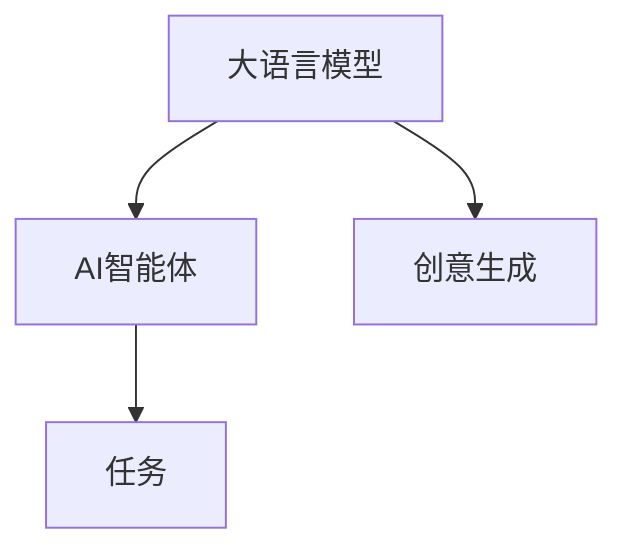
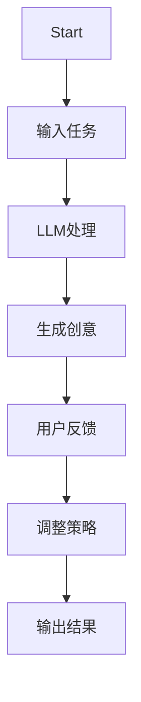
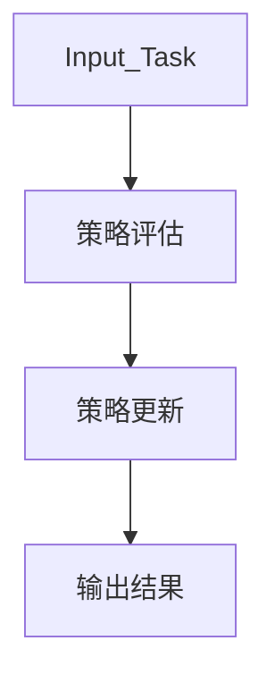
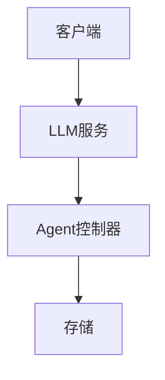
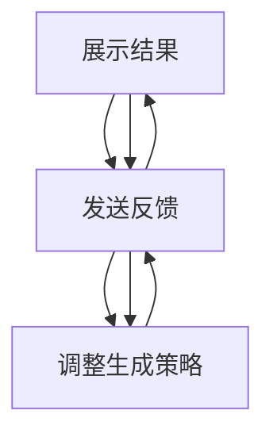

                 


# LLM驱动的AI Agent创意生成系统

> 关键词：LLM, AI Agent, 创意生成, 系统设计, 技术实现

> 摘要：本文探讨了如何利用大语言模型（LLM）驱动AI Agent进行创意生成的系统设计与实现。通过分析背景、核心概念、算法原理、系统架构及项目实战，系统性地展示了如何构建高效的创意生成系统，并给出了实际案例与代码实现。

---

## 第一部分: LLM驱动的AI Agent创意生成系统背景与基础

### 第1章: 问题背景与描述

#### 1.1 当前AI创意生成的挑战
在AI技术迅速发展的今天，创意生成已成为一个热门领域。然而，现有的创意生成系统存在以下挑战：
- **创意多样性不足**：传统生成模型难以覆盖多领域、多风格的创意。
- **用户需求难以精准捕捉**：现有系统难以理解用户的深层需求。
- **动态适应性弱**：创意生成系统难以根据实时反馈调整输出。

#### 1.2 LLM在创意生成中的优势
大语言模型（LLM）凭借其强大的文本生成能力，为AI创意生成带来了新的可能性：
- **多领域适应性**：LLM可以处理多种语言和领域，适合生成各种类型的创意内容。
- **上下文理解**：通过上下文建模，LLM能够生成连贯且符合逻辑的创意。
- **动态调整能力**：基于用户反馈，LLM可以实时调整生成策略。

#### 1.3 AI Agent在创意生成中的角色
AI Agent作为创意生成的核心驱动者，主要负责以下任务：
- **需求解析**：理解用户的创意需求。
- **内容生成**：利用LLM生成创意内容。
- **反馈优化**：根据用户反馈调整生成策略。

### 第2章: 核心概念与联系

#### 2.1 LLM与AI Agent的核心概念
- **LLM定义**：大语言模型是基于大量数据训练的深度学习模型，能够生成与训练数据相似的文本。
- **AI Agent定义**：AI Agent是智能体，能够在特定环境下自主决策并执行任务。

#### 2.2 核心概念对比表
| 属性 | LLM | AI Agent |
|------|------|----------|
| 输入 | 文本 | 动作与反馈 |
| 输出 | 文本 | 动作 |
| 核心能力 | 生成与理解 | 执行与决策 |

#### 2.3 实体关系图


## 第3章: 算法原理与实现

### 3.1 LLM驱动的AI Agent算法流程

#### 3.1.1 算法流程图


#### 3.1.2 Python代码实现
```python
import torch
import torch.nn as nn

class LLM(nn.Module):
    def __init__(self, input_dim, hidden_dim, output_dim):
        super(LLM, self).__init__()
        self.embedding = nn.Embedding(input_dim, hidden_dim)
        self.lstm = nn.LSTM(hidden_dim, hidden_dim)
        self.fc = nn.Linear(hidden_dim, output_dim)

    def forward(self, x):
        embeds = self.embedding(x)
        lstm_out, _ = self.lstm(embeds.view(-1, 1, embeds.size(1)))
        out = self.fc(lstm_out.view(-1, embeds.size(1), -1))
        return out

model = LLM(...)
```

#### 3.1.3 数学模型与公式
生成创意的概率公式：
$$ P(Creativity | Input) = \prod_{i=1}^{n} P(word_i | word_{i-1}, ..., word_1) $$

### 3.2 AI Agent的策略优化

#### 3.2.1 策略优化流程


#### 3.2.2 策略优化算法
$$ \theta = \theta - \eta \nabla_{\theta} J(\theta) $$

## 第4章: 系统分析与架构设计

### 4.1 项目背景与系统功能设计

#### 4.1.1 项目背景
本项目旨在构建一个基于LLM的创意生成系统，服务于多个领域。

#### 4.1.2 系统功能设计
- **需求解析模块**：解析用户输入的任务需求。
- **创意生成模块**：利用LLM生成创意内容。
- **反馈优化模块**：根据用户反馈调整生成策略。

### 4.2 系统架构设计

#### 4.2.1 系统架构图


#### 4.2.2 接口设计
- **输入接口**：接收用户任务请求。
- **输出接口**：返回生成的创意内容。

### 4.3 交互流程图


## 第5章: 项目实战

### 5.1 环境安装

#### 5.1.1 安装Python与相关库
```bash
python -m pip install torch transformers
```

#### 5.1.2 安装LLM框架
```bash
pip install huggingface-transformers
```

### 5.2 系统核心实现

#### 5.2.1 核心代码实现
```python
from transformers import GPT2LMHeadModel, GPT2Tokenizer

tokenizer = GPT2Tokenizer.from_pretrained('gpt2')
model = GPT2LMHeadModel.from_pretrained('gpt2')

def generate_creativity(prompt):
    inputs = tokenizer(prompt, return_tensors='pt')
    outputs = model.generate(**inputs, max_length=50)
    return tokenizer.decode(outputs[0], skip_special_tokens=True)
```

#### 5.2.2 代码解读
- **tokenizer**：用于将输入文本转换为模型可理解的格式。
- **model**：大语言模型，负责生成创意内容。

### 5.3 案例分析

#### 5.3.1 案例1：文本生成
**输入**：生成一篇科幻小说的开头。
**输出**：模型生成相应文本。

#### 5.3.2 案例2：代码生成
**输入**：生成一个计算器的Python代码。
**输出**：生成的代码。

### 5.4 项目小结
通过以上实战，我们验证了LLM驱动的AI Agent创意生成系统的可行性与有效性。

## 第6章: 总结与展望

### 6.1 总结
本文系统性地探讨了LLM驱动的AI Agent创意生成系统的实现，涵盖了背景、核心概念、算法原理、系统架构及项目实战。

### 6.2 展望
未来，随着AI技术的发展，创意生成系统将更加智能化与个性化。

---

### 最佳实践 tips
- 在使用LLM时，确保数据安全与隐私保护。
- 定期更新模型以保持生成创意的时效性。
- 根据具体需求调整系统参数以优化性能。

作者：AI天才研究院/AI Genius Institute & 禅与计算机程序设计艺术 /Zen And The Art of Computer Programming

