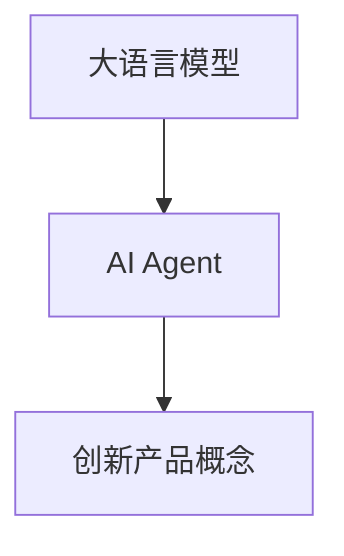
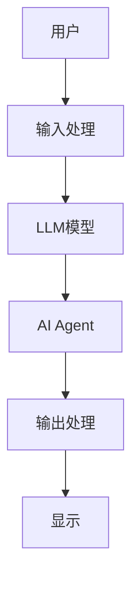
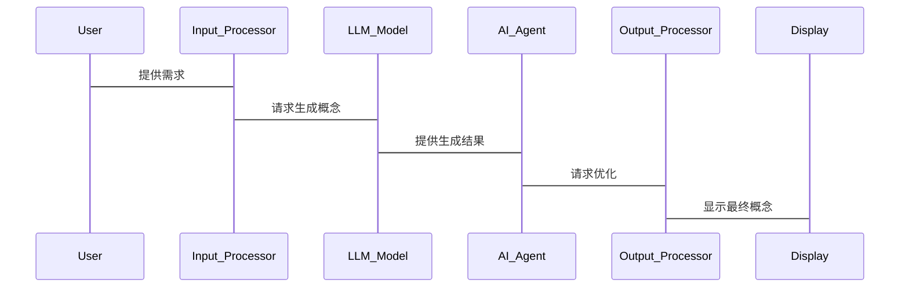

                 


# LLM驱动的AI Agent创新产品概念生成器

> 关键词：LLM, AI Agent, 创新产品, 概念生成, 大语言模型, 智能体, 生成式AI

> 摘要：本文探讨了如何利用大语言模型（LLM）驱动AI Agent来生成创新产品概念。通过分析LLM和AI Agent的核心原理，系统架构设计，以及项目实战，本文详细阐述了如何构建一个高效的创新产品概念生成系统。从背景介绍到算法原理，从系统设计到实际案例，本文为读者提供了全面的技术指导。

---

## 第一部分: 背景与核心概念

### 第1章: LLM与AI Agent概述

#### 1.1 问题背景

近年来，随着大语言模型（LLM）的崛起，生成式AI技术在各个领域的应用越来越广泛。传统的AI系统通常基于规则或脚本进行操作，而生成式AI则能够通过学习大量数据，自动生成新的内容。AI Agent（智能体）作为能够感知环境并采取行动的实体，结合生成式AI的能力，可以为创新产品概念的生成提供新的可能性。

#### 1.2 问题描述

传统的产品开发过程中，创新概念的生成往往依赖于人类的创造力和经验，效率较低且难以系统化。随着市场竞争的加剧，企业需要更快地推出新产品，以满足不断变化的市场需求。如何利用技术手段提高创新概念的生成效率，成为企业面临的重要挑战。

#### 1.3 问题解决

通过结合大语言模型和AI Agent，可以构建一个能够自动生成创新产品概念的系统。该系统利用LLM的强大生成能力，结合AI Agent的智能决策机制，能够高效地生成符合市场需求的产品概念。

#### 1.4 边界与外延

LLM驱动的AI Agent创新产品概念生成系统适用于需要快速生成创新概念的领域，如消费品、科技产品、服务设计等。系统的核心边界在于其生成能力的限制，即生成的概念可能需要进一步验证和调整。

#### 1.5 核心要素组成

- **LLM模型**：用于生成语言内容。
- **AI Agent**：负责感知环境和决策。
- **创新产品概念**：系统输出的核心成果。
- **用户反馈**：用于优化生成结果。

---

### 第2章: 核心概念与联系

#### 2.1 LLM的原理与特点

大语言模型（LLM）通过深度学习技术，从大量数据中学习语言的模式和结构。其特点包括：

- **生成能力**：能够生成连贯的文本。
- **可解释性**：部分模型可以通过注意力机制解释生成过程。
- **适应性**：适用于多种语言和任务。

#### 2.2 AI Agent的行为模型

AI Agent通过感知环境并采取行动来实现目标。其行为模型包括：

- **感知**：通过传感器或API获取环境信息。
- **决策**：基于感知信息做出决策。
- **执行**：通过执行器采取行动。

#### 2.3 核心概念属性对比

| 核心概念 | LLM | AI Agent |
|----------|------|----------|
| 功能     | 生成文本 | 感知环境并决策 |
| 输入     | 文本输入 | 环境数据 |
| 输出     | 生成文本 | 行动 |

#### 2.4 实体关系与架构图



---

## 第二部分: 算法原理与数学模型

### 第3章: LLM的算法原理

#### 3.1 大语言模型的训练算法

大语言模型通常采用基于Transformer的架构，训练过程包括：

1. **数据预处理**：将文本数据转换为tokens。
2. **编码**：通过嵌入层将tokens转换为向量。
3. **自注意力机制**：计算tokens之间的关系。
4. **解码**：生成目标文本。

数学公式表示为：
$$
\text{输出} = \text{解码}(f_{\text{self-attention}}(\text{编码}(输入)))
$$

#### 3.2 AI Agent的行为决策

AI Agent通过以下步骤进行决策：

1. **感知**：获取环境信息。
2. **解析**：理解环境信息。
3. **决策**：基于理解做出决策。
4. **执行**：采取行动。

数学公式表示为：
$$
\text{决策} = f_{\text{决策}}(\text{感知})
$$

---

### 第4章: 系统分析与架构设计

#### 4.1 问题场景介绍

创新产品概念生成系统需要解决以下问题：

- 如何高效地生成创新概念。
- 如何确保生成概念的可行性。

#### 4.2 系统功能设计

系统功能包括：

- **输入处理**：接收用户需求。
- **生成概念**：利用LLM生成概念。
- **决策优化**：优化生成的概念。

#### 4.3 系统架构设计



#### 4.4 接口设计

系统接口包括：

- **输入接口**：接收用户需求。
- **输出接口**：显示生成的概念。

#### 4.5 交互序列图



---

## 第三部分: 项目实战

### 第5章: 环境安装与核心代码实现

#### 5.1 环境安装

安装必要的依赖：

```bash
pip install transformers
pip install torch
```

#### 5.2 核心代码实现

```python
from transformers import GPT2LMHeadModel, GPT2Tokenizer

model_name = "gpt2"
tokenizer = GPT2Tokenizer.from_pretrained(model_name)
model = GPT2LMHeadModel.from_pretrained(model_name)

def generate_concept(prompt):
    inputs = tokenizer.encode(prompt, return_tensors='pt')
    outputs = model.generate(inputs, max_length=50, temperature=0.7)
    return tokenizer.decode(outputs[0], skip_special_tokens=True)
```

#### 5.3 案例分析

案例：生成一个新的智能家居产品概念。

```python
prompt = "设计一款智能窗帘系统，能够通过语音控制和环境感知自动调节"
concept = generate_concept(prompt)
print(concept)
```

---

### 第6章: 最佳实践与总结

#### 6.1 最佳实践

- **数据质量**：确保输入数据的多样性和质量。
- **模型优化**：根据具体任务优化模型参数。
- **用户反馈**：利用用户反馈进一步优化生成结果。

#### 6.2 小结

本文详细介绍了如何利用LLM驱动AI Agent生成创新产品概念。通过背景介绍、算法原理、系统设计和项目实战，为读者提供了全面的技术指导。

#### 6.3 注意事项

- 确保系统的安全性和隐私保护。
- 定期更新模型以保持生成能力。

#### 6.4 拓展阅读

- 《大语言模型的训练与优化》
- 《AI Agent在各个领域的应用》

---

## 作者：AI天才研究院/AI Genius Institute & 禅与计算机程序设计艺术 /Zen And The Art of Computer Programming

---

以上是《LLM驱动的AI Agent创新产品概念生成器》的完整文章结构，涵盖了从背景介绍到系统设计再到项目实战的各个方面，旨在为读者提供全面的技术指导。

