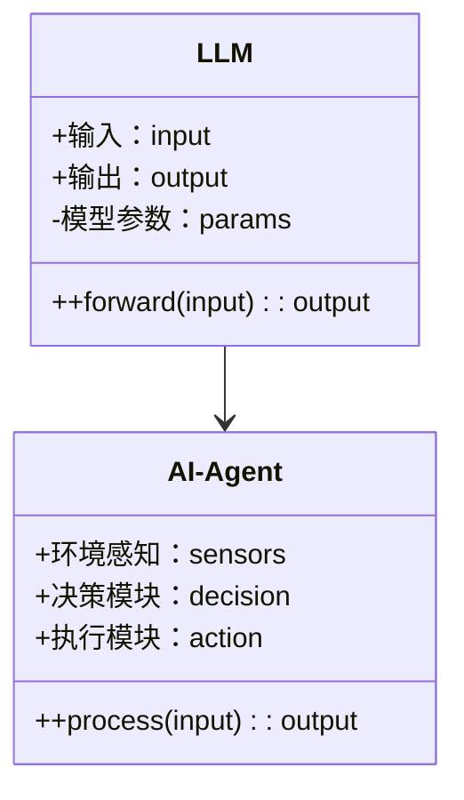
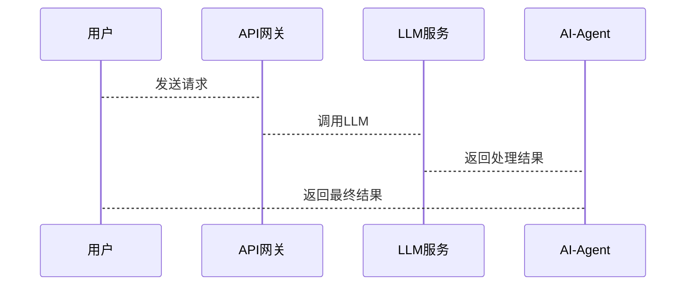

                 


# LLM驱动的AI Agent创新产品设计

> 关键词：大语言模型（LLM）、AI Agent、人工智能（AI）、机器学习、智能代理

> 摘要：本文深入探讨了如何利用大语言模型（LLM）驱动AI Agent的创新设计。文章从背景、核心概念、算法原理、系统架构到项目实战，全面解析了LLM与AI Agent的结合与应用。通过详细的技术分析和实际案例，展示了如何构建高效、智能的AI Agent系统。

---

## 第一部分: LLM驱动的AI Agent背景与基础

### 第1章: LLM与AI Agent概述

#### 1.1 LLM驱动的AI Agent的概念与背景

##### 1.1.1 大语言模型（LLM）的定义与特点
大语言模型（LLM，Large Language Model）是指基于大规模数据训练的深度学习模型，能够理解和生成人类语言。其特点包括：
- **大规模训练**：通常使用海量文本数据进行训练。
- **多任务能力**：能够处理多种语言理解和生成任务。
- **上下文理解**：通过上下文理解语义，支持多轮对话。
- **可扩展性**：可以根据需求进行微调或参数调整。

##### 1.1.2 AI Agent的基本概念与功能
AI Agent（人工智能代理）是指能够感知环境、执行任务并做出决策的智能实体。其主要功能包括：
- **感知环境**：通过传感器或API获取外部信息。
- **推理与决策**：基于感知信息进行分析和决策。
- **执行任务**：通过执行动作或调用服务完成目标。
- **学习与优化**：通过反馈机制不断优化自身性能。

##### 1.1.3 LLM驱动的AI Agent的结合与创新
LLM与AI Agent的结合，使得AI Agent具备了更强的自然语言处理能力和上下文理解能力。这种结合的创新点在于：
- **智能对话能力**：通过LLM实现更自然的用户交互。
- **动态决策能力**：结合LLM的理解能力，提升决策的准确性。
- **跨领域应用**：适用于客服、教育、医疗等多个领域。

#### 1.2 LLM与AI Agent的演进历程

##### 1.2.1 从传统AI到LLM驱动的演进
传统AI主要依赖规则引擎和知识库，而现代AI Agent通过LLM实现了更灵活和智能的决策能力。

##### 1.2.2 AI Agent技术的历史与发展
AI Agent的概念起源于20世纪80年代，经历了从基于规则的简单代理到现代的智能代理的演进。

##### 1.2.3 LLM在AI Agent中的应用趋势
随着LLM技术的成熟，AI Agent的应用场景不断扩大，从简单的信息查询扩展到复杂的任务执行。

#### 1.3 LLM驱动的AI Agent的核心价值

##### 1.3.1 提升AI Agent的智能性与交互性
通过LLM，AI Agent能够更自然地与用户交互，理解上下文并提供更智能的服务。

##### 1.3.2 降低开发门槛与提高效率
LLM的通用性使得AI Agent的开发变得更加简单，减少了对专业编程知识的依赖。

##### 1.3.3 开启AI Agent的新应用场景
LLM驱动的AI Agent在教育、医疗、金融等领域展现了广阔的应用前景。

#### 1.4 本章小结
本章介绍了LLM和AI Agent的基本概念、结合方式以及应用价值，为后续内容奠定了基础。

---

## 第二部分: LLM驱动的AI Agent核心概念与联系

### 第2章: LLM驱动的AI Agent核心概念

#### 2.1 LLM驱动的AI Agent核心原理

##### 2.1.1 大语言模型的输入输出机制
LLM通过输入文本生成输出文本，支持多种任务如翻译、问答、对话等。

##### 2.1.2 AI Agent的任务分解与执行流程
AI Agent将任务分解为多个子任务，通过LLM处理每个子任务并执行。

##### 2.1.3 LLM与AI Agent的协同工作模式
通过协同工作，AI Agent利用LLM的自然语言处理能力，提升任务执行的智能性。

#### 2.2 LLM与AI Agent的关系分析

##### 2.2.1 LLM作为AI Agent的核心驱动力
LLM为AI Agent提供了强大的语言理解和生成能力。

##### 2.2.2 AI Agent作为LLM的扩展与应用载体
AI Agent将LLM的能力应用于具体场景，实现了实际价值。

##### 2.2.3 二者的协同优化与创新
通过协同优化，LLM和AI Agent的性能和应用范围不断提升。

#### 2.3 LLM驱动的AI Agent核心要素对比

##### 2.3.1 LLM与传统AI模型的对比分析
| 特性 | LLM | 传统AI模型 |
|------|------|------------|
| 数据量 | 大 | 小         |
| 任务多样性 | 高 | 较低       |
| 自适应性 | 强 | 较弱       |

##### 2.3.2 AI Agent与传统智能系统的对比分析
| 特性 | AI Agent | 传统智能系统 |
|------|-----------|--------------|
| 智能性 | 高 | 低          |
| 交互性 | 强 | 较弱        |
| 灵活性 | 高 | 低          |

##### 2.3.3 LLM驱动的AI Agent的独特优势
LLM驱动的AI Agent结合了LLM的语言能力和AI Agent的智能性，具备更强的适应性和创新性。

#### 2.4 本章小结
本章分析了LLM与AI Agent的核心概念及其关系，为后续的算法和系统设计提供了理论基础。

---

## 第三部分: LLM驱动的AI Agent算法原理与数学模型

### 第3章: LLM驱动的AI Agent算法原理

#### 3.1 大语言模型的基本算法原理

##### 3.1.1 基于Transformer的模型结构
Transformer模型由编码器和解码器组成，通过自注意力机制处理序列数据。

##### 3.1.2 注意力机制的数学公式
自注意力机制的计算公式如下：
$$
\text{Attention}(Q, K, V) = \text{softmax}\left(\frac{QK^T}{\sqrt{d_k}}\right)V
$$

##### 3.1.3 梯度下降与参数优化方法
常用的优化方法包括随机梯度下降（SGD）和Adam优化器。

#### 3.2 AI Agent的决策算法

##### 3.2.1 基于LLM的多轮对话机制
多轮对话通过维护上下文状态，实现更自然的交互。

##### 3.2.2 基于强化学习的决策优化
强化学习通过奖励机制优化AI Agent的决策过程。

##### 3.2.3 状态空间与动作空间的建模
状态空间表示环境状态，动作空间表示AI Agent可能执行的动作。

#### 3.3 LLM驱动的AI Agent联合算法

##### 3.3.1 LLM与AI Agent的协同优化
通过协同优化，提升整体系统的性能和效率。

##### 3.3.2 基于LLM的动态决策过程
动态决策过程通过实时调整策略，适应环境的变化。

##### 3.3.3 算法的收敛性与稳定性分析
分析算法在不同场景下的收敛性和稳定性。

#### 3.4 算法实现的数学模型与公式

##### 3.4.1 LLM的损失函数公式
$$
\text{Loss} = -\sum_{i=1}^{n} \log P(x_i)
$$

##### 3.4.2 AI Agent的决策模型公式
$$
\pi(a|s) = \text{softmax}(Q(s,a))
$$

##### 3.4.3 协同优化的数学表达
$$
\theta = \arg \min \text{Loss}
$$

#### 3.5 本章小结
本章详细介绍了LLM和AI Agent的算法原理及数学模型，为后续的系统设计奠定了基础。

---

## 第四部分: LLM驱动的AI Agent系统架构设计

### 第4章: LLM驱动的AI Agent系统架构

#### 4.1 系统功能设计

##### 4.1.1 领域模型（mermaid类图）


##### 4.1.2 系统架构设计（mermaid架构图）


##### 4.1.3 系统接口设计
- **输入接口**：接受用户输入和环境信息。
- **输出接口**：返回处理结果和反馈信息。
- **API接口**：提供给外部系统的调用接口。

##### 4.1.4 系统交互设计（mermaid序列图）


#### 4.2 本章小结
本章通过类图、架构图和交互图，详细展示了LLM驱动的AI Agent系统的架构设计。

---

## 第五部分: LLM驱动的AI Agent项目实战

### 第5章: LLM驱动的AI Agent项目实战

#### 5.1 环境安装与配置

##### 5.1.1 安装依赖
```bash
pip install transformers torch
```

##### 5.1.2 配置环境变量
设置路径和参数。

#### 5.2 系统核心实现

##### 5.2.1 LLM接口实现
```python
class LLMInterface:
    def forward(self, input):
        # 调用LLM进行处理
        pass
```

##### 5.2.2 AI-Agent实现
```python
class AI-Agent:
    def process(self, input):
        # 调用LLM接口
        return llm.forward(input)
```

##### 5.2.3 交互界面实现
```python
def main():
    while True:
        input = input("请输入：")
        print(agent.process(input))
```

#### 5.3 代码应用解读与分析

##### 5.3.1 LLM接口的实现细节
详细解读LLM接口的实现和调用方式。

##### 5.3.2 AI-Agent的实现细节
分析AI-Agent的处理流程和关键步骤。

#### 5.4 实际案例分析

##### 5.4.1 案例背景
介绍案例的背景和目标。

##### 5.4.2 案例实现
详细展示案例的实现过程和代码。

##### 5.4.3 案例分析
总结案例的实现效果和优化建议。

#### 5.5 本章小结
本章通过实际案例，展示了LLM驱动的AI Agent的实现过程和应用价值。

---

## 第六部分: 总结与展望

### 第6章: 总结与展望

#### 6.1 本章总结
总结全文的核心内容和主要结论。

#### 6.2 未来展望
展望LLM驱动的AI Agent技术的发展方向和潜在应用。

---

## 附录

### 附录A: 进一步阅读的资源

- 推荐书籍：
  - 《深度学习》
  - 《自然语言处理入门》

- 推荐工具：
  - Hugging Face
  - TensorFlow

### 附录B: 工具与库

- Python库：
  - transformers
  - torch

---

## 作者

作者：AI天才研究院/AI Genius Institute & 禅与计算机程序设计艺术 /Zen And The Art of Computer Programming

---

本文通过详细的技术分析和实际案例，展示了如何利用LLM驱动AI Agent的创新设计。从背景、核心概念、算法原理到系统架构和项目实战，为读者提供了全面的指导和深入的见解。

