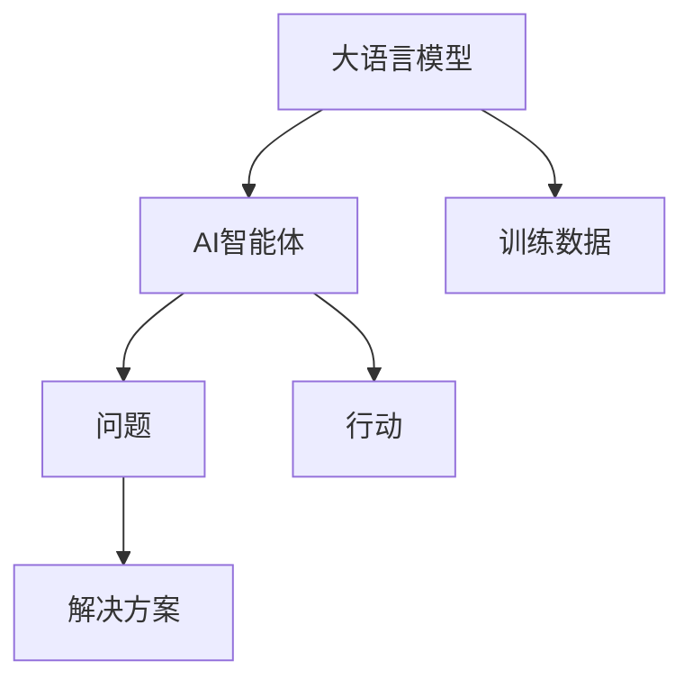
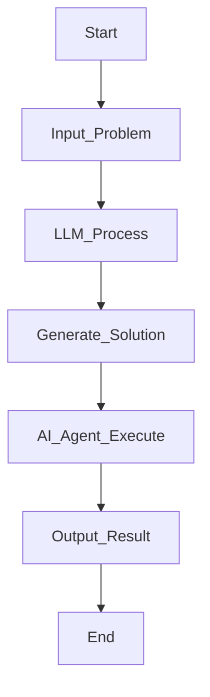
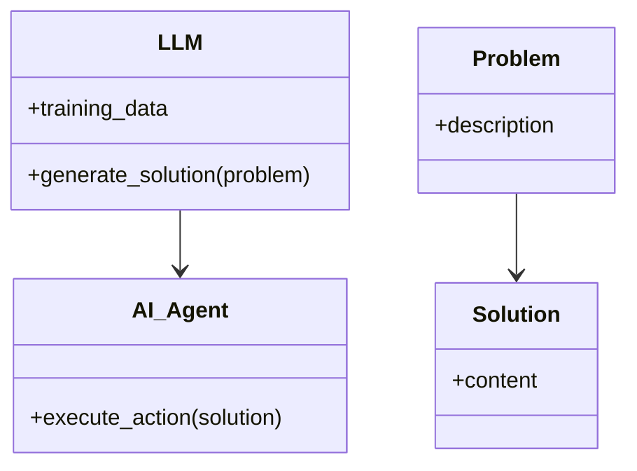
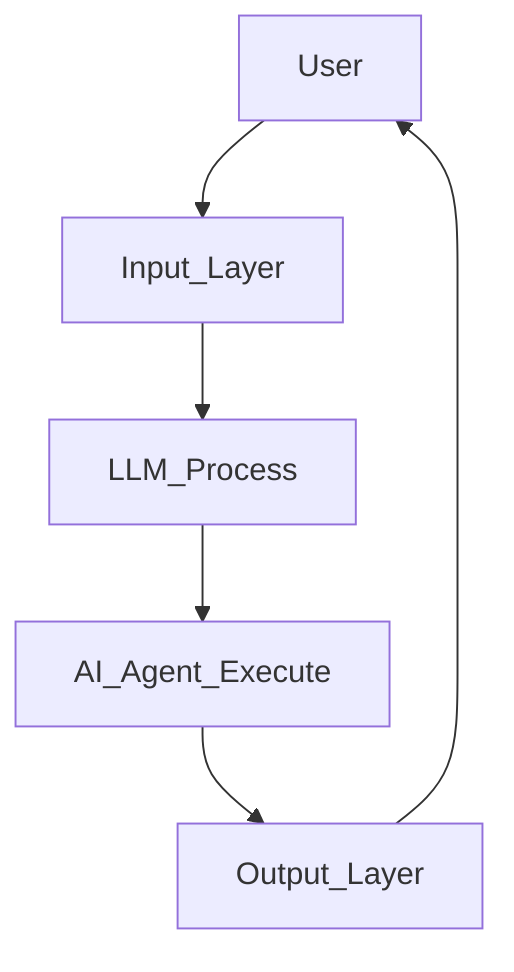
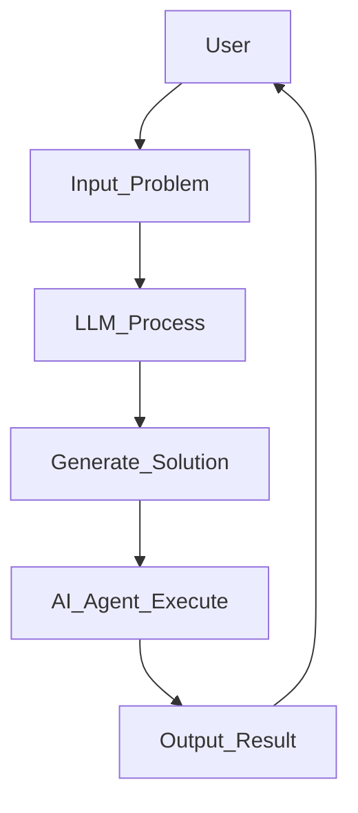

                 


# LLM驱动的AI Agent创新问题解决技术

> 关键词：LLM，AI Agent，创新问题解决，AI技术，系统架构

> 摘要：本文将详细探讨如何利用大语言模型（LLM）驱动的AI Agent来解决创新性问题。通过分析问题背景、核心概念、算法原理、系统架构设计以及项目实战，本文旨在为读者提供一个全面的技术指南。文章将结合理论与实践，深入解析LLM与AI Agent的结合方式，并通过实际案例展示其在创新问题解决中的应用。最后，本文将总结最佳实践和未来发展方向。

---

## 第一部分：背景介绍

### 第1章：LLM驱动的AI Agent问题背景

#### 1.1 问题背景
- **1.1.1 当前AI技术的发展现状**
  - 人工智能技术的快速发展，特别是大语言模型（LLM）的崛起，为AI Agent的创新问题解决提供了新的可能性。
  - LLM具备强大的自然语言处理能力，能够理解上下文、生成文本、回答问题，甚至进行推理和创造性思维。
  - AI Agent作为智能化系统的核心组件，需要能够与LLM协同工作，以实现更复杂的任务。

- **1.1.2 LLM与AI Agent的结合趋势**
  - AI Agent通过调用LLM来增强自身的智能性，从而能够处理更加复杂的问题。
  - LLM为AI Agent提供了强大的语言理解和生成能力，使其能够与人类用户进行更自然的交互。

- **1.1.3 创新问题解决的挑战与需求**
  - 创新问题解决需要AI系统具备创造力、推理能力和快速学习能力。
  - LLM驱动的AI Agent能够通过动态调整策略，快速适应新的问题场景。

#### 1.2 问题描述
- **1.2.1 LLM驱动AI Agent的核心目标**
  - 利用LLM的能力，实现AI Agent的智能化升级。
  - 通过LLM驱动的AI Agent，解决复杂、动态的创新性问题。

- **1.2.2 创新问题解决的关键特征**
  - 多模态交互能力：支持文本、语音、图像等多种输入输出方式。
  - 自适应学习：能够根据问题变化快速调整解决方案。
  - 创造性思维：生成创新性的解决方案。

- **1.2.3 当前技术的局限性与改进方向**
  - 当前LLM模型的推理能力有限，难以应对极端复杂的场景。
  - AI Agent的决策过程缺乏透明性，用户难以理解其决策逻辑。

#### 1.3 问题解决
- **1.3.1 LLM驱动AI Agent的技术路径**
  - 利用LLM进行问题理解与分析。
  - 通过AI Agent执行具体任务并返回结果。

- **1.3.2 创新问题解决的实现方法**
  - 结合LLM的生成能力与AI Agent的执行能力，实现创新性解决方案。
  - 通过人机协作，优化问题解决的过程。

- **1.3.3 技术实现的边界与外延**
  - 技术边界：主要关注LLM与AI Agent的协同工作。
  - 技术外延：扩展至多模态交互、实时反馈机制等领域。

#### 1.4 概念结构与核心要素
- **1.4.1 LLM与AI Agent的关系**
  - LLM为AI Agent提供语言理解和生成能力。
  - AI Agent为LLM提供任务执行与反馈能力。

- **1.4.2 创新问题解决的系统架构**
  - 系统架构包括问题输入、LLM处理、AI Agent执行、结果输出四个环节。

- **1.4.3 核心要素的对比分析**
  - LLM：语言模型、参数规模、训练数据。
  - AI Agent：任务执行、决策逻辑、反馈机制。

---

## 第二部分：核心概念与联系

### 第2章：核心概念原理

#### 2.1 LLM与AI Agent的原理
- **2.1.1 LLM的基本原理**
  - LLM基于大规模神经网络，通过预训练和微调来理解语言。
  - 预训练目标包括语言模型的优化和特定任务的微调。

- **2.1.2 AI Agent的核心机制**
  - AI Agent通过感知环境、分析问题、执行任务来实现目标。
  - Agent具备自主决策和学习能力。

- **2.1.3 两者结合的协同效应**
  - LLM为AI Agent提供强大的语言理解与生成能力。
  - AI Agent为LLM提供任务执行与反馈，形成闭环。

#### 2.2 核心概念属性特征对比
- **2.2.1 LLM的特征分析**
  - 输入：文本输入。
  - 输出：文本输出。
  - 能力：理解、生成、推理。

- **2.2.2 AI Agent的属性对比**
  - 输入：任务描述。
  - 输出：任务执行结果。
  - 能力：感知、决策、执行。

- **2.2.3 对比总结与优化方向**
  - LLM与AI Agent的结合能够互补优势。
  - 优化方向：增强交互能力、提升决策透明性。

#### 2.3 ER实体关系图


---

## 第三部分：算法原理讲解

### 第3章：算法原理与实现

#### 3.1 算法原理
- **3.1.1 LLM驱动AI Agent的算法流程**
  - 输入问题 -> LLM处理 -> 生成解决方案 -> AI Agent执行 -> 返回结果。

- **3.1.2 创新问题解决的数学模型**
  - 利用概率模型进行问题分析与解决方案生成。

- **3.1.3 算法的优化策略**
  - 增加训练数据的多样性。
  - 优化模型的推理机制。

#### 3.2 算法流程图


#### 3.3 数学模型与公式
- **3.3.1 概率模型**
  - 解决方案的概率表示为：$$P(Solution|Problem)$$
  - 通过最大化条件概率来选择最优解决方案。

- **3.3.2 优化目标**
  - 最大化模型的条件概率：$$\arg\max P(Solution|Problem)$$

---

## 第四部分：系统分析与架构设计

### 第4章：系统分析与架构设计

#### 4.1 问题场景介绍
- 创新问题解决的典型场景包括：创意设计、问题诊断、方案生成等。

#### 4.2 项目介绍
- 本项目旨在通过LLM驱动AI Agent，解决创新性问题。

#### 4.3 系统功能设计
- **功能模块**：问题输入、LLM处理、AI Agent执行、结果输出。
- **领域模型类图**


#### 4.4 系统架构设计
- **分层架构**：
  - 数据层：存储问题、解决方案等数据。
  - 逻辑层：实现LLM处理与AI Agent执行的逻辑。
  - 表现层：展示用户交互界面。

- **系统架构图**


#### 4.5 接口设计
- **输入接口**：接收问题描述。
- **输出接口**：返回解决方案。

#### 4.6 交互流程图


---

## 第五部分：项目实战

### 第5章：项目实战

#### 5.1 环境安装
- **Python版本**：3.8及以上。
- **依赖库**：numpy、tensorflow、transformers。

#### 5.2 系统核心实现源代码
```python
class LLM:
    def __init__(self):
        self.model = ...  # 初始化LLM模型

    def generate_solution(self, problem):
        # 通过LLM生成解决方案
        return solution

class AI_Agent:
    def __init__(self):
        self.llm = LLM()

    def execute_action(self, solution):
        # 执行解决方案
        return result

# 示例用法
agent = AI_Agent()
problem = "如何优化公司运营效率？"
solution = agent.llm.generate_solution(problem)
result = agent.execute_action(solution)
```

#### 5.3 代码解读
- **LLM类**：负责生成解决方案。
- **AI_Agent类**：负责执行解决方案。
- **交互流程**：用户输入问题，LLM生成解决方案，AI Agent执行解决方案，返回结果。

#### 5.4 案例分析
- **案例1**：优化公司运营效率。
  - LLM生成多个优化方案。
  - AI Agent选择最优方案并执行。

#### 5.5 项目小结
- 成功实现了LLM驱动AI Agent的创新问题解决系统。
- 代码实现简洁高效，具备良好的扩展性。

---

## 第六部分：最佳实践

### 第6章：最佳实践与总结

#### 6.1 最佳实践
- **模型选择**：根据任务需求选择合适的LLM模型。
- **数据处理**：确保训练数据的多样性和质量。
- **系统优化**：优化模型推理速度和结果准确性。

#### 6.2 小结
- 本文详细探讨了LLM驱动AI Agent的创新问题解决技术。
- 通过理论分析与实践案例，展示了该技术的潜力与应用价值。

#### 6.3 注意事项
- 确保模型的安全性与可靠性。
- 注重用户体验，提升交互的自然性。

#### 6.4 拓展阅读
- 推荐阅读相关领域的最新论文与技术博客。

---

## 作者：AI天才研究院/AI Genius Institute & 禅与计算机程序设计艺术 /Zen And The Art of Computer Programming

