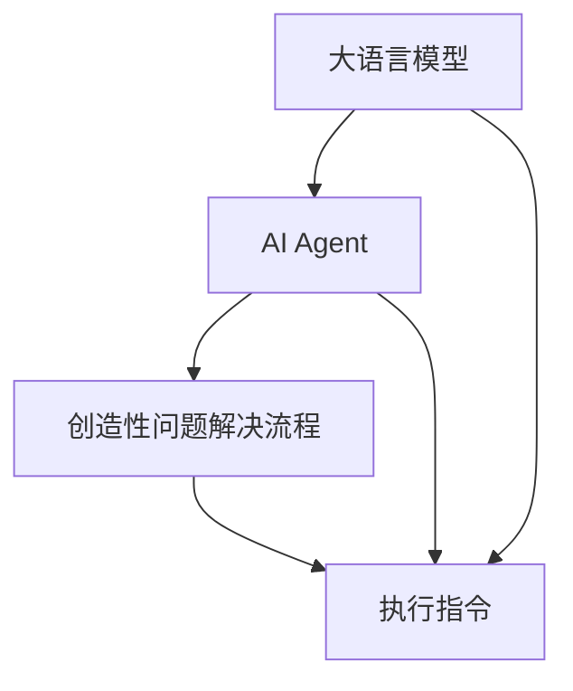

                 


# 《LLM驱动的AI Agent创造性问题解决框架》

---

## 关键词：
- LLM（Large Language Model）
- AI Agent（人工智能代理）
- 创造性问题解决
- 系统架构
- 算法实现

---

## 摘要：
本文详细探讨了利用大语言模型（LLM）驱动的人工智能代理（AI Agent）进行创造性问题解决的框架。从问题背景、核心概念、算法原理到系统架构和实际应用，全面分析了如何通过LLM驱动的AI Agent实现智能化、创造性的解决方案。文章还通过实际项目案例，展示了该框架的应用价值和具体实现步骤，为读者提供了一套完整的理论与实践结合的框架。

---

# 目录大纲

---

## 第一部分：LLM驱动的AI Agent概述

### 第1章：LLM驱动的AI Agent概述

#### 1.1 问题背景与问题描述
- 1.1.1 创造性问题解决的定义
  - 创造性问题解决的特性
  - 创造性问题解决的关键步骤
- 1.1.2 LLM与AI Agent的结合
  - LLM的优势与局限性
  - AI Agent的核心能力与功能
- 1.1.3 当前问题解决的痛点与挑战
  - 传统问题解决方法的不足
  - 创造性问题解决的难点

#### 1.2 LLM驱动的AI Agent框架
- 1.2.1 框架的核心概念
  - LLM作为核心模块的作用
  - AI Agent在框架中的角色
- 1.2.2 框架的边界与外延
  - 框架的适用范围
  - 框架与其他技术的结合
- 1.2.3 框架的核心要素组成
  - 数据输入、模型处理、结果输出的流程
  - 各模块之间的交互机制

#### 1.3 本章小结
- 本章主要介绍了创造性问题解决的背景和挑战，提出了LLM驱动的AI Agent框架，并详细阐述了框架的核心概念和组成要素。

---

## 第二部分：LLM驱动的AI Agent核心概念

### 第2章：LLM驱动的AI Agent核心概念

#### 2.1 LLM的定义与特点
- 2.1.1 大语言模型的定义
  - LLM的训练目标与应用场景
- 2.1.2 LLM的核心特点
  - 大规模参数、多任务能力、上下文理解
- 2.1.3 LLM与传统NLP模型的区别
  - 从统计模型到深度学习模型的演变

#### 2.2 AI Agent的定义与特点
- 2.2.1 AI Agent的定义
  - 自动化决策与执行的能力
- 2.2.2 AI Agent的核心能力
  - 感知、推理、决策、执行
- 2.2.3 AI Agent与传统软件代理的区别
  - 智能性、自主性、适应性的提升

#### 2.3 LLM驱动的AI Agent工作原理
- 2.3.1 LLM作为AI Agent的核心模块
  - LLM如何支持问题理解和生成解决方案
- 2.3.2 LLM与AI Agent的交互机制
  - 输入处理、模型推理、结果输出的流程
- 2.3.3 LLM驱动的创造性问题解决流程
  - 分析、推理、生成的步骤解析

#### 2.4 核心概念属性对比表
| 核心概念       | 属性               | 描述                                                                 |
|----------------|--------------------|----------------------------------------------------------------------|
| LLM           | 模型类型           | 大语言模型，参数量大，擅长处理复杂语言任务                                   |
| AI Agent       | 能力               | 自动化决策与执行，具备智能性和自主性                                         |
| 创造性问题解决 | 流程               | 分析问题、推理解决方案、生成创新结果                                         |

#### 2.5 核心概念ER实体关系图


#### 2.6 本章小结
- 本章详细介绍了LLM和AI Agent的核心概念及其特点，分析了它们在创造性问题解决中的作用和交互机制。

---

## 第三部分：问题建模与任务指令设计

### 第3章：问题建模与任务指令设计

#### 3.1 问题建模的重要性
- 3.1.1 问题建模的定义与作用
  - 帮助将实际问题转化为模型可处理的形式
- 3.1.2 问题建模的关键步骤
  - 理解问题、分解问题、构建模型

#### 3.2 任务指令的设计原则
- 3.2.1 清晰性与具体性
  - 指令应明确、具体，避免歧义
- 3.2.2 适应性与灵活性
  - 指令应具备一定的灵活性，适应不同场景
- 3.2.3 可执行性与可验证性
  - 指令应可执行，并且结果可验证

#### 3.3 实际案例分析
- 3.3.1 案例一：文本生成任务
  - 问题描述、任务指令设计、模型输出
- 3.3.2 案例二：问题解答任务
  - 问题描述、任务指令设计、模型输出

#### 3.4 本章小结
- 本章重点讨论了问题建模和任务指令设计的重要性，提出了设计原则，并通过实际案例展示了如何将实际问题转化为可执行的任务指令。

---

## 第四部分：系统架构与实现

### 第4章：系统架构与实现

#### 4.1 系统架构设计
- 4.1.1 系统功能模块划分
  - 输入处理模块、模型推理模块、结果输出模块
- 4.1.2 领域模型设计
  - 用Mermaid类图展示各模块的关系
- 4.1.3 系统架构图
  - 用Mermaid架构图展示系统的整体结构

#### 4.2 系统接口设计
- 4.2.1 输入接口设计
  - 输入格式、数据类型、接口调用方式
- 4.2.2 输出接口设计
  - 输出格式、数据结构、接口返回方式

#### 4.3 系统交互流程
- 4.3.1 交互流程图
  - 用Mermaid序列图展示系统各模块之间的交互流程

#### 4.4 本章小结
- 本章详细描述了系统的架构设计、模块划分、接口设计和交互流程，为后续的实现提供了理论基础。

---

## 第五部分：算法实现与优化

### 第5章：算法实现与优化

#### 5.1 模型训练算法
- 5.1.1 LLM的训练目标函数
  - 使用Latex公式展示训练目标函数
- 5.1.2 优化算法
  - 梯度下降、Adam优化器的原理与应用

#### 5.2 模型推理算法
- 5.2.1 解码策略
  - 最大似然解码、贪心解码、随机采样解码
- 5.2.2 解码过程中的优化技巧
  - 温度参数、top-k采样、核对采样

#### 5.3 算法实现代码示例
```python
import torch

def train_model(model, optimizer, criterion, train_loader, epochs=10):
    for epoch in range(epochs):
        for inputs, labels in train_loader:
            outputs = model(inputs)
            loss = criterion(outputs, labels)
            optimizer.zero_grad()
            loss.backward()
            optimizer.step()

def generate_text(model, tokenizer, prompt, max_length=50):
    input_ids = tokenizer.encode(prompt, return_tensors='pt')
    input_ids = input_ids.to(model.device)
    with torch.no_grad():
        outputs = model.generate(input_ids, max_length=max_length)
    return tokenizer.decode(outputs[0], skip_special_tokens=True)
```

#### 5.4 本章小结
- 本章详细介绍了模型训练和推理的算法实现，包括优化算法和解码策略，并通过代码示例展示了具体的实现细节。

---

## 第六部分：项目实战与案例分析

### 第6章：项目实战与案例分析

#### 6.1 项目环境配置
- 6.1.1 硬件与软件要求
  - CPU/GPU配置、Python版本、框架版本
- 6.1.2 依赖库安装
  - 使用pip安装必要的库和工具

#### 6.2 项目核心实现
- 6.2.1 系统实现代码
  - 用Python代码实现系统架构中的各模块
- 6.2.2 代码解读与分析
  - 详细解读代码的功能与实现逻辑

#### 6.3 实际案例分析
- 6.3.1 案例一：文本生成任务
  - 环境配置、代码实现、结果分析
- 6.3.2 案例二：问题解答任务
  - 环境配置、代码实现、结果分析

#### 6.4 本章小结
- 本章通过实际项目案例，展示了如何将理论应用于实践，详细讲解了项目环境配置、核心代码实现和案例分析。

---

## 第七部分：总结与展望

### 第7章：总结与展望

#### 7.1 核心知识点总结
- 7.1.1 LLM驱动的AI Agent框架的核心概念
- 7.1.2 系统架构与实现的关键步骤
- 7.1.3 创造性问题解决的实现流程

#### 7.2 未来展望
- 7.2.1 LLM的未来发展
  - 更大的模型、更高效的训练方法
- 7.2.2 AI Agent的应用前景
  - 更多领域的应用、更智能化的代理
- 7.2.3 创造性问题解决的未来方向
  - 更多创新算法的应用、更广泛领域的覆盖

#### 7.3 本章小结
- 本章总结了全文的核心知识点，并展望了未来的发展方向，为读者提供了进一步研究和实践的思路。

---

## 附录

### 附录A：工具与API参考

- 大语言模型API列表
- 开发工具与框架推荐
- 其他相关工具与资源

### 附录B：数学公式汇总

- 常用的优化算法公式
- 模型训练与推理的关键公式
- 问题解决过程中的数学模型

---

## 作者信息

作者：AI天才研究院/AI Genius Institute & 禅与计算机程序设计艺术/Zen And The Art of Computer Programming

---

以上是《LLM驱动的AI Agent创造性问题解决框架》的详细目录大纲，涵盖了从理论到实践的各个方面，内容丰富且结构清晰，旨在为读者提供一套完整的框架和方法论。

