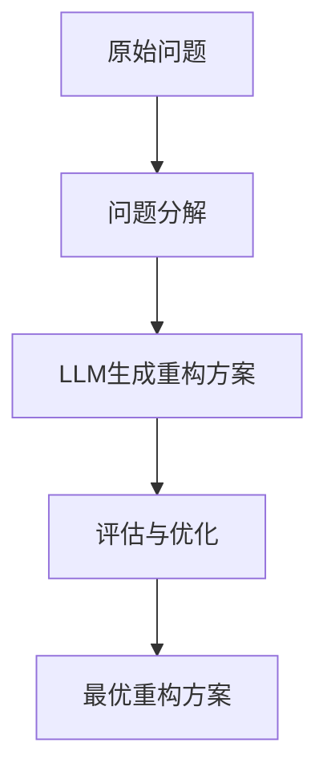

                 


# 创造性问题重构的算法原理

---

## 算法原理概述

创造性问题重构的实现依赖于LLM和AI Agent的协同工作。LLM作为语言模型，能够理解和生成自然语言文本，而AI Agent则负责问题的分解、重构和解决。以下是创造性问题重构算法的基本原理和流程：

1. **问题输入**：AI Agent接收原始问题，并将其分解为多个子问题。
2. **问题重构**：通过LLM生成多种可能的重构方案。
3. **评估与优化**：AI Agent评估每个方案的可行性，并选择最优解。
4. **输出结果**：将最终的重构问题输出，供下一步解决。

### 算法流程图



---

## 数学模型与公式

创造性问题重构算法的核心在于优化问题表达。假设我们有一个初始问题 \( Q \)，我们希望找到一个最优的问题表达 \( Q' \)。以下是数学模型的简要描述：

1. **问题表示**：将问题 \( Q \) 表示为向量 \( \mathbf{q} \)。
2. **重构函数**：通过LLM生成多个可能的重构向量 \( \mathbf{r}_1, \mathbf{r}_2, \dots, \mathbf{r}_n \)。
3. **评估函数**：评估每个重构向量 \( \mathbf{r}_i \) 的质量，计算其相似度 \( s_i \)。
4. **选择最优解**：选择相似度最高的重构向量 \( \mathbf{r}^* \)。

数学公式如下：

$$
\mathbf{r}^* = \arg\max_{i} s_i
$$

其中，\( s_i \) 是第 \( i \) 个重构方案的相似度分数。

---

## 实际案例分析

假设我们有一个原始问题：“如何提高公司的销售效率？”

1. **问题分解**：AI Agent将问题分解为“提高销售效率的方法”、“销售团队的培训”、“客户关系管理”等子问题。
2. **重构方案生成**：LLM生成多个重构方案，例如：
   - “如何优化销售流程以提高效率？”
   - “如何通过客户关系管理提升销售效率？”
   - “如何通过培训提升销售团队的效率？”
3. **评估与优化**：AI Agent评估每个方案的可行性，选择“如何优化销售流程以提高效率？”作为最优解。
4. **输出结果**：最终的重构问题为“如何优化销售流程以提高效率？”

---

## 算法实现细节

以下是创造性问题重构算法的部分伪代码：

```python
def creative_problem_reconstruction(original_question):
    # 步骤1：问题分解
    sub_questions = decompose_question(original_question)
    
    # 步骤2：生成重构方案
    reconstruction_schemes = generate_schemes(sub_questions)
    
    # 步骤3：评估与优化
    best_scheme = select_best(reconstruction_schemes)
    
    # 步骤4：输出结果
    return best_scheme
```

其中，`decompose_question` 是问题分解函数，`generate_schemes` 是基于LLM生成重构方案的函数，`select_best` 是评估并选择最优方案的函数。

---

## 总结

创造性问题重构算法通过LLM和AI Agent的协同工作，将原始问题分解、重构并优化，最终输出最优的问题表达。该算法的核心在于问题分解和重构方案的生成与优化，数学模型为相似度评估和选择最优解提供了理论基础。在实际应用中，该算法能够有效提高问题解决的效率和质量。

