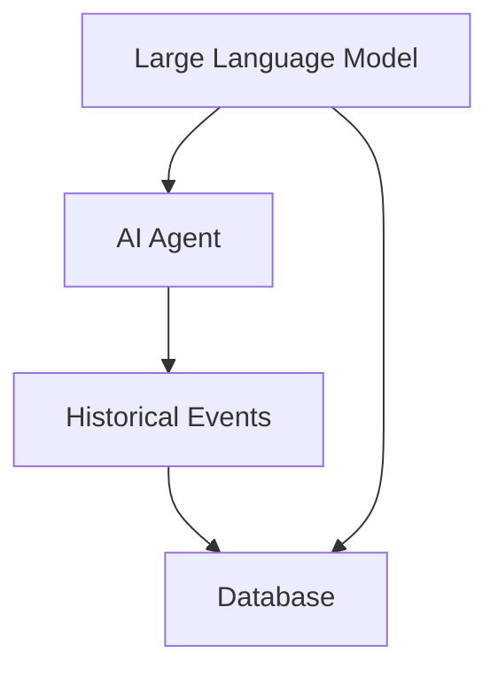

                 


# LLM驱动的AI Agent历史事件重构与分析

## 关键词：
- LLM (Large Language Model)
- AI Agent
- 历史事件重构
- 人工智能
- 自然语言处理

## 摘要：
本文探讨了如何利用大语言模型（LLM）驱动的AI代理（AI Agent）进行历史事件的重构与分析。通过详细分析LLM和AI Agent的核心原理、算法实现、系统架构，以及结合实际项目的案例分析，本文旨在为读者提供从理论到实践的全面指导，帮助理解并掌握LLM驱动的AI Agent在历史事件重构中的应用。

---

## 正文：

## 第一部分：背景介绍

### 第1章：LLM驱动的AI Agent概述

#### 1.1 问题背景
- **1.1.1 历史事件重构的挑战**  
  历史事件重构是一项复杂任务，涉及海量文本数据的处理、语义理解、时间线构建以及事件间的关联分析。传统方法依赖于人工整理和分析，效率低下且容易出错。

- **1.1.2 LLM在历史分析中的作用**  
  大语言模型（LLM）通过自然语言处理技术，能够从大量历史文本中提取信息，识别实体、事件和关系，为历史事件的重构提供强大的技术支持。

- **1.1.3 AI Agent的优势与潜力**  
  AI Agent作为智能体，能够自主执行任务，结合LLM的强大语言处理能力，可以实现历史事件的自动重构与分析，显著提高效率和准确性。

#### 1.2 问题描述
- **1.2.1 历史事件重构的核心问题**  
  如何从非结构化的历史文本中提取结构化的事件信息，并构建清晰的时间线和事件间的关系网络。

- **1.2.2 AI Agent在历史分析中的应用场景**  
  AI Agent可以用于自动提取历史事件、识别关键人物、分析事件间的因果关系，以及生成结构化的事件报告。

- **1.2.3 当前技术的局限性与改进方向**  
  当前LLM模型在处理复杂历史文本时，仍存在语义理解不足、事件关联性分析不够精准等问题，未来需要进一步优化模型和算法。

#### 1.3 问题解决与边界
- **1.3.1 LLM驱动AI Agent的解决方案**  
  利用LLM的强大语言处理能力，结合AI Agent的自主执行能力，实现历史事件的自动化重构与分析。

- **1.3.2 技术边界与适用范围**  
  该方案适用于处理结构化和非结构化的历史文本数据，能够处理中等规模的历史事件数据集，但对于非常大规模的数据仍需进一步优化。

- **1.3.3 外延与未来发展方向**  
  未来可以将该技术扩展到更多领域，如实时新闻事件分析、法律文书处理等。

#### 1.4 核心概念结构
- **1.4.1 LLM与AI Agent的关系**  
  LLM为AI Agent提供语言理解和生成能力，AI Agent则为LLM提供任务执行和目标导向的环境。

- **1.4.2 历史事件重构的流程**  
  数据预处理 → 事件提取 → 时间线构建 → 事件关联分析 → 结果输出。

- **1.4.3 系统的核心要素与组成**  
  数据源、LLM模型、AI Agent、事件数据库、用户界面。

---

## 第二部分：核心概念与联系

### 第2章：LLM与AI Agent的核心原理

#### 2.1 核心概念原理
- **2.1.1 LLM的基本原理**  
  LLM通过深度学习技术，训练大规模的文本数据，学习语言的结构和语义，能够生成与理解人类语言。

- **2.1.2 AI Agent的工作机制**  
  AI Agent通过感知环境、理解任务目标、执行任务并反馈结果，实现自主智能操作。

- **2.1.3 两者结合的协同效应**  
  LLM为AI Agent提供强大的语言处理能力，AI Agent为LLM提供任务执行的环境，两者结合实现智能化的历史事件分析。

#### 2.2 核心概念属性对比
| 属性       | LLM                          | AI Agent                     |
|------------|------------------------------|-----------------------------|
| 核心功能    | 语言生成与理解               | 任务执行与目标导向         |
| 输入        | 文本数据                     | 环境感知与用户指令           |
| 输出        | 文本生成与语义理解           | 行动结果与反馈               |
| 依赖        | 大规模文本数据训练           | 多模态数据与任务目标         |

#### 2.3 实体关系图


---

## 第三部分：算法原理讲解

### 第3章：LLM与AI Agent的算法实现

#### 3.1 LLM算法原理
- **3.1.1 Transformer模型结构**  
  Transformer模型由编码器和解码器组成，通过自注意力机制（Self-Attention）处理序列数据，实现高效的语义理解。

- **3.1.2 自注意力机制公式**  
  $$\text{Attention}(Q, K, V) = \text{softmax}\left(\frac{QK^T}{\sqrt{d_k}}\right)V$$

- **3.1.3 模型训练过程**  
  - 输入历史文本数据，调整模型参数，最小化预测误差。
  - 使用交叉熵损失函数优化模型。

#### 3.2 AI Agent算法原理
- **3.2.1 多智能体协作机制**  
  AI Agent通过与其他智能体协作，共同完成复杂任务，提升整体性能。

- **3.2.2 基于强化学习的决策过程**  
  使用Q-learning算法，通过状态-动作-奖励机制，优化AI Agent的决策策略。

- **3.2.3 实例分析：事件提取**  
  - 输入：一段历史文本。
  - 输出：提取的事件列表。

#### 3.3 算法实现代码示例
```python
import torch
import torch.nn as nn

class LLM(nn.Module):
    def __init__(self, vocab_size, embedding_dim, hidden_dim):
        super(LLM, self).__init__()
        self.embedding = nn.Embedding(vocab_size, embedding_dim)
        self.transformer = nn.Transformer(hidden_dim, hidden_dim)
        self.fc = nn.Linear(hidden_dim, vocab_size)
        
    def forward(self, x):
        embedded = self.embedding(x)
        output = self.transformer(embedded, embedded)
        output = self.fc(output)
        return output

class AI_Agent:
    def __init__(self, model, tokenizer):
        self.model = model
        self.tokenizer = tokenizer
        self.events = []
        
    def analyze_event(self, text):
        # Tokenize and encode the input text
        inputs = self.tokenizer(text, return_tensors='pt')
        with torch.no_grad():
            outputs = self.model(**inputs)
        # Decode the outputs
        predicted_tokens = outputs.argmax(-1).tolist()[0]
        decoded = self.tokenizer.decode(predicted_tokens)
        # Extract events from decoded text
        self.extract_events(decoded)
        
    def extract_events(self, text):
        # Simple event extraction logic (can be improved)
        events = []
        for sentence in text.split('.'):
            if 'event' in sentence:
                events.append(sentence)
        self.events.append(events)
```

---

## 第四部分：系统分析与架构设计

### 第4章：系统架构与设计

#### 4.1 系统功能设计
- **4.1.1 领域模型**  
  ```mermaid
  classDiagram
      class HistoricalEvent {
          id: int
          text: str
          timestamp: str
          related_events: list
      }
      class LLM {
          generate(text: str) -> str
          understand(text: str) -> dict
      }
      class AI_Agent {
          analyze(text: str) -> list
          extract_events(text: str) -> list
      }
      HistoricalEvent <|-- Database
      LLM --> AI_Agent
      AI_Agent --> Database
  ```

- **4.1.2 系统架构图**  
  ```mermaid
  graph TD
      Client --> AIA[AI Agent]
      AIA --> LLM
      LLM --> Database
      Database --> Client
  ```

- **4.1.3 接口设计**  
  - 输入接口：接受历史文本数据。
  - 输出接口：生成结构化的历史事件报告。

- **4.1.4 交互流程图**  
  ```mermaid
  sequenceDiagram
      Client -> AIA: 提供历史文本
      AIA -> LLM: 请求事件分析
      LLM -> AIA: 返回分析结果
      AIA -> Database: 存储事件
      Client -> AIA: 获取事件报告
  ```

---

## 第五部分：项目实战

### 第5章：项目实现与案例分析

#### 5.1 环境安装
```bash
pip install transformers torch
```

#### 5.2 系统核心实现
```python
from transformers import AutoTokenizer, AutoModelForCausalLM
import torch

class EventAnalyzer:
    def __init__(self, model_name='gpt2'):
        self.tokenizer = AutoTokenizer.from_pretrained(model_name)
        self.model = AutoModelForCausalLM.from_pretrained(model_name)
        
    def analyze(self, text):
        inputs = self.tokenizer(text, return_tensors='pt')
        with torch.no_grad():
            outputs = self.model(**inputs)
            generated = outputs.last_hidden_state
        return generated
```

#### 5.3 代码应用解读
- **代码解读：LLM模型加载与初始化**  
  使用预训练的GPT-2模型，加载模型权重和分词器，初始化AI Agent。

- **代码解读：事件分析过程**  
  输入历史文本，通过模型生成隐藏层表示，提取事件信息。

#### 5.4 案例分析
- **案例背景**  
  分析19世纪英国工业革命的历史文本。

- **案例分析**  
  使用AI Agent提取关键事件，构建时间线，分析事件间的因果关系。

---

## 第六部分：最佳实践与总结

### 第6章：最佳实践与总结

#### 6.1 最佳实践
- **选择合适的LLM模型**  
  根据具体任务需求选择合适的模型，如GPT-3、GPT-4等。

- **优化AI Agent的决策机制**  
  使用强化学习优化AI Agent的决策策略，提高任务执行效率。

- **数据预处理与清洗**  
  对历史文本进行清洗和标注，提升模型的输入质量。

#### 6.2 小结
- LLM驱动的AI Agent为历史事件的重构与分析提供了强大的技术支持。
- 通过优化算法、改进系统架构，可以进一步提升分析的准确性和效率。

#### 6.3 注意事项
- 数据隐私与安全问题需特别注意，避免敏感信息泄露。
- 模型训练和推理过程中需考虑计算资源的限制。

#### 6.4 拓展阅读
- 《Large Language Models: A Survey》
- 《Introduction to Reinforcement Learning》

---

## 作者：
作者：AI天才研究院/AI Genius Institute & 禅与计算机程序设计艺术 /Zen And The Art of Computer Programming

