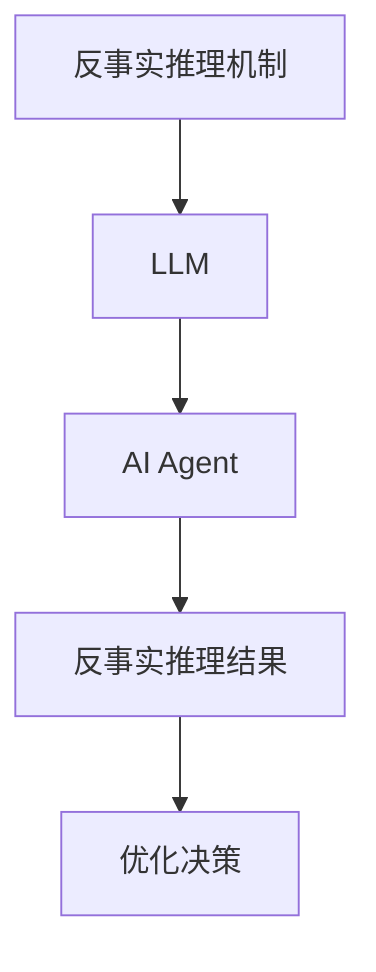
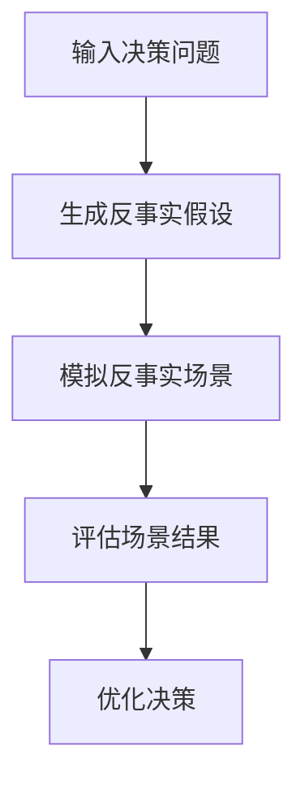
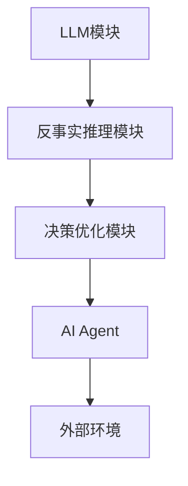
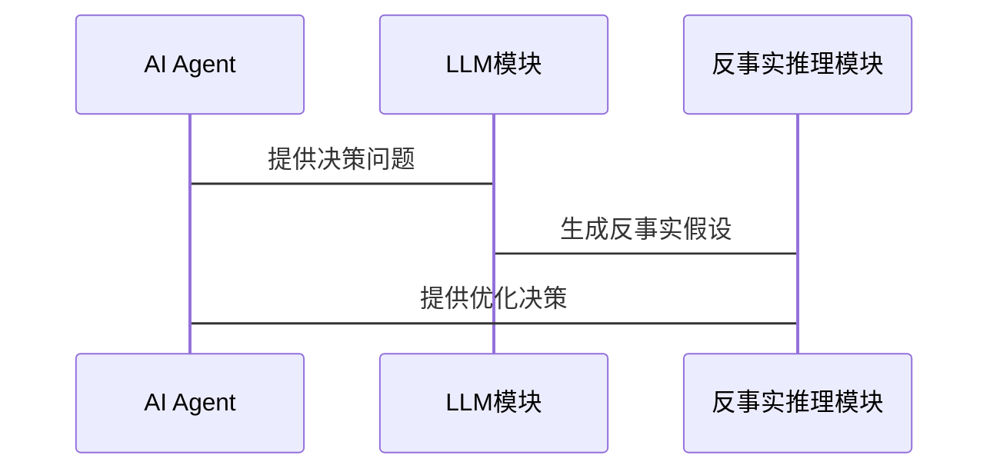

                 


---

# LLM驱动的AI Agent反事实推理机制

> **关键词**：LLM, AI Agent, 反事实推理, 因果推理, 逻辑推理  
> **摘要**：本文系统地探讨了LLM驱动的AI Agent反事实推理机制的核心概念、算法原理、系统架构及实际应用。通过分析反事实推理的背景、原理及其实现方式，本文为AI Agent的设计与优化提供了新的思路和方法。

---

## 第一部分：背景介绍

### 第1章：反事实推理机制的背景与问题背景

#### 1.1 问题背景
- **1.1.1 当前AI Agent的发展现状**
  AI Agent（智能体）近年来取得了显著进展，特别是在自然语言处理和决策优化领域。然而，现有的AI Agent在复杂场景下的决策能力仍有局限性，尤其是在需要考虑多种可能结果和反事实情况时。

- **1.1.2 反事实推理在AI Agent中的重要性**
  反事实推理是指智能体在决策过程中，不仅考虑当前的事实情况，还要考虑“如果”采取某些行动，结果会如何。这种能力对于AI Agent在复杂环境中的决策至关重要。

- **1.1.3 LLM与反事实推理的结合**
  大语言模型（LLM）凭借其强大的语言理解和生成能力，为反事实推理提供了新的可能性。通过LLM，AI Agent可以更自然地模拟人类的反事实推理过程。

#### 1.2 问题描述
- **1.2.1 反事实推理的定义与特点**
  反事实推理是一种基于假设的推理方式，旨在探索“如果”采取某种行动，结果会如何。它与事实推理不同，后者仅基于当前的事实进行推理。

- **1.2.2 LLM驱动AI Agent的挑战**
  尽管LLM在语言处理方面表现出色，但在反事实推理中仍面临挑战，例如如何建模反事实情况、如何评估反事实结果的合理性等。

- **1.2.3 反事实推理在AI Agent中的应用场景**
  在金融、医疗、法律等领域，AI Agent需要考虑多种可能的决策结果，并选择最优策略。反事实推理机制可以帮助AI Agent更好地应对这些复杂场景。

#### 1.3 问题解决
- **1.3.1 反事实推理的核心目标**
  反事实推理的核心目标是通过模拟多种可能的决策结果，帮助智能体选择最优行动方案。

- **1.3.2 LLM在反事实推理中的作用**
  LLM通过生成多种可能的反事实场景，为AI Agent提供丰富的决策参考。

- **1.3.3 反事实推理机制的设计思路**
  设计反事实推理机制需要结合LLM的能力，构建合理的反事实场景生成和评估框架。

#### 1.4 边界与外延
- **1.4.1 反事实推理的边界条件**
  反事实推理需要基于合理的假设和约束条件，不能完全脱离现实。

- **1.4.2 LLM驱动AI Agent的局限性**
  LLM的局限性可能影响反事实推理的效果，例如模型的偏差、训练数据的质量等。

- **1.4.3 反事实推理与其他推理机制的对比**
  反事实推理与事实推理、归纳推理等其他推理机制有明显区别，但可以相互补充。

#### 1.5 核心要素与概念结构
- **1.5.1 反事实推理的核心要素**
  包括反事实假设、结果评估、决策优化等。

- **1.5.2 LLM与AI Agent的关系**
  LLM作为AI Agent的核心组件，为反事实推理提供语言理解和生成能力。

- **1.5.3 反事实推理机制的逻辑框架**
  包括反事实假设生成、结果模拟、结果评估和决策优化四个步骤。

---

## 第二部分：核心概念与联系

### 第2章：反事实推理机制的核心概念

#### 2.1 反事实推理的原理
- **2.1.1 反事实推理的基本原理**
  反事实推理基于假设生成反事实场景，并评估这些场景的结果，以优化决策。

- **2.1.2 LLM在反事实推理中的作用**
  LLM通过生成多种反事实场景，帮助AI Agent探索更多可能的决策结果。

- **2.1.3 反事实推理的数学模型**
  反事实推理可以通过概率模型或逻辑模型进行建模，例如马尔可夫链或逻辑规则。

#### 2.2 核心概念的属性特征对比
- **2.2.1 反事实推理与事实推理的对比**
  | 属性 | 事实推理 | 反事实推理 |
  |------|----------|------------|
  | 数据基础 | 当前事实 | 假设事实    |
  | 推理目标 | 描述现状 | 探索可能结果 |

- **2.2.2 LLM与传统推理算法的对比**
  | 属性 | LLM驱动 | 传统算法 |
  |------|----------|----------|
  | 数据依赖 | 高 | 低       |
  | 可解释性 | 低 | 高       |
  | 灵活性 | 高 | 低       |

- **2.2.3 反事实推理机制的优缺点**
  - 优点：灵活性高、能够探索多种可能结果。
  - 缺点：依赖假设，结果可能不准确。

#### 2.3 实体关系图（ER图）


---

## 第三部分：算法原理

### 第3章：反事实推理算法的实现

#### 3.1 算法原理
- 反事实推理算法的核心步骤包括：
  1. 生成反事实假设。
  2. 模拟反事实场景。
  3. 评估场景结果。
  4. 优化决策。

#### 3.2 算法实现步骤


#### 3.3 算法实现代码
```python
def generate_counterfactual(hypothesis, context):
    # 生成反事实假设
    pass

def simulate_scenario(hypothesis, context):
    # 模拟反事实场景
    pass

def evaluate_result(scenario_results):
    # 评估场景结果
    pass

def optimize_decision(evaluated_results):
    # 优化决策
    pass
```

#### 3.4 数学模型与公式
- 反事实推理可以通过概率模型表示：
  $$ P(result | hypothesis) = \frac{P(hypothesis | result) \cdot P(result)}{P(hypothesis)} $$

---

## 第四部分：系统分析与架构设计

### 第4章：系统架构设计

#### 4.1 问题场景介绍
- AI Agent需要在复杂环境中做出最优决策，例如金融投资、医疗诊断等。

#### 4.2 系统功能设计
- **领域模型**：定义AI Agent的操作领域和功能模块。
- **系统架构**：包括LLM模块、反事实推理模块和决策优化模块。

#### 4.3 系统架构图


#### 4.4 系统接口设计
- 输入接口：接收决策问题和上下文信息。
- 输出接口：输出优化后的决策方案。

#### 4.5 系统交互流程


---

## 第五部分：项目实战

### 第5章：项目实现与案例分析

#### 5.1 项目环境安装
- 安装Python、LLM库（如Hugging Face Transformers）等。

#### 5.2 核心代码实现
```python
from transformers import pipeline

def generate_counterfactual(hypothesis, context):
    # 使用LLM生成反事实假设
    model = pipeline('text-generation', model='gpt2')
    return model(hypothesis + context)[0]['generated_text']
```

#### 5.3 代码解读与分析
- 上述代码展示了如何利用LLM生成反事实假设，结合上下文信息生成合理的反事实场景。

#### 5.4 案例分析
- 案例：医疗诊断中的反事实推理。
  - **输入**：患者症状和病史。
  - **输出**：生成多种反事实诊断假设，并评估每种假设的可能结果。

#### 5.5 项目小结
- 反事实推理机制通过LLM的强大能力，为AI Agent提供了更灵活的决策支持。

---

## 第六部分：最佳实践与总结

### 第6章：最佳实践与注意事项

#### 6.1 最佳实践
- 确保LLM模型的训练数据质量。
- 合理设置反事实假设的生成策略。
- 定期评估和优化反事实推理机制。

#### 6.2 小结
- 本文系统地探讨了LLM驱动的AI Agent反事实推理机制，为AI Agent的设计与优化提供了新的思路。

#### 6.3 注意事项
- 反事实推理依赖于假设，结果可能不准确。
- 需要结合具体场景调整模型参数。

#### 6.4 拓展阅读
- 推荐阅读相关领域的最新论文和文献。

---

## 作者：AI天才研究院/AI Genius Institute & 禅与计算机程序设计艺术 /Zen And The Art of Computer Programming

---

通过以上目录结构，您可以逐步撰写完整的文章内容。每个部分都需要详细展开，确保文章内容丰富、逻辑清晰、技术深入。

