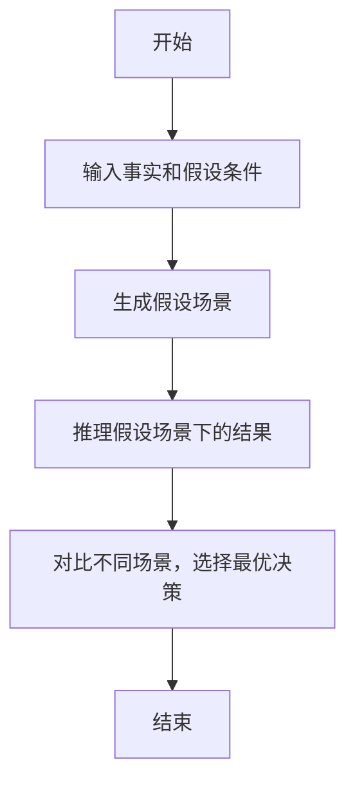
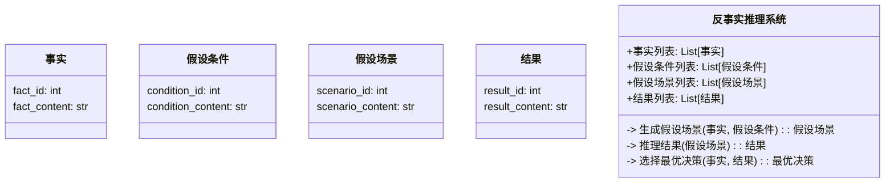
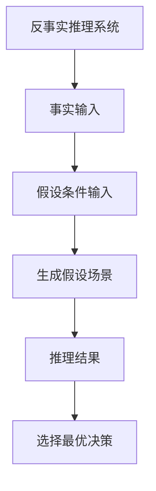

                 


# LLM驱动的AI Agent反事实推理能力

## 关键词：LLM, AI Agent, 反事实推理, 逻辑推理, 决策优化

## 摘要：  
本文探讨了LLM（大语言模型）驱动的AI Agent在反事实推理方面的应用与能力。通过分析反事实推理的定义、原理、算法实现以及系统架构，展示了如何利用LLM提升AI Agent的决策优化能力。文章结合实际案例，详细讲解了反事实推理在复杂场景中的应用，为AI Agent的设计与优化提供了理论支持与实践指导。

---

# 第一部分：背景介绍

## 第1章：反事实推理的基本概念

### 1.1 反事实推理的定义与特点

#### 1.1.1 反事实推理的基本概念  
反事实推理是一种基于假设与事实相反的场景进行推理的能力。它允许AI Agent在不确定或模糊的情况下，探索“如果采取某种行动，结果会如何”的可能性，从而做出更优的决策。

#### 1.1.2 反事实推理的核心特点  
- **假设性**：基于假设的场景进行推理。  
- **不确定性**：反事实推理的结果并非绝对正确，而是基于模型的预测。  
- **实用性**：在复杂场景中提供多种可能性，帮助决策者优化选择。

#### 1.1.3 反事实推理的重要性和应用领域  
反事实推理在金融、医疗、法律等领域具有重要应用，特别是在需要风险评估和决策优化的场景中。

### 1.2 反事实推理与LLM的关系

#### 1.2.1 LLM在反事实推理中的作用  
- LLM提供了强大的语言理解和生成能力，能够帮助AI Agent构建反事实场景的上下文。  
- 通过LLM的上下文推理能力，AI Agent可以更准确地生成反事实推理的结果。

#### 1.2.2 反事实推理如何增强AI Agent的能力  
- 提供更全面的决策选项。  
- 帮助AI Agent在复杂场景中进行风险评估和优化决策。

#### 1.2.3 LLM驱动的反事实推理的优势  
- 高效性：LLM能够快速生成多种反事实场景。  
- 精准性：基于大规模预训练数据，生成更接近人类思维的反事实推理结果。

### 1.3 反事实推理的边界与外延

#### 1.3.1 反事实推理的边界条件  
- 反事实推理仅基于模型的假设，结果可能与实际情况不符。  
- 反事实推理需要明确的边界条件，否则可能导致错误的推理结果。

#### 1.3.2 反事实推理的外延与扩展  
- 反事实推理可以与其他推理方式结合，如归纳推理和演绎推理。  
- 在不同领域中的应用扩展，如医疗诊断、金融风险评估等。

#### 1.3.3 反事实推理与其他推理方式的区别与联系  
- **区别**：反事实推理基于假设，而其他推理方式基于事实。  
- **联系**：反事实推理可以作为其他推理方式的补充，帮助探索更多可能性。

---

## 第2章：LLM驱动的AI Agent反事实推理能力的核心概念与联系

### 2.1 反事实推理的原理与机制

#### 2.1.1 反事实推理的逻辑框架  
反事实推理的逻辑框架包括以下步骤：  
1. 确定当前事实。  
2. 建立与事实相反的假设。  
3. 推理假设场景下的结果。  
4. 对比不同场景，选择最优决策。

#### 2.1.2 反事实推理的数学模型  
反事实推理的数学模型可以通过概率论和逻辑推理来表示。例如，使用条件概率来表示假设场景下的结果概率。

#### 2.1.3 反事实推理的实现步骤  
1. 输入事实和假设条件。  
2. 生成假设场景。  
3. 推理假设场景下的结果。  
4. 对比不同场景，选择最优决策。

### 2.2 反事实推理的核心要素

#### 2.2.1 反事实推理的输入要素  
- 当前事实：实际发生的情况。  
- 假设条件：与事实相反的假设。  
- 推理规则：用于生成假设场景结果的规则。

#### 2.2.2 反事实推理的输出要素  
- 假设场景的结果。  
- 对比不同场景的优劣分析。

#### 2.2.3 反事实推理的实现机制  
- 通过LLM生成假设场景的上下文。  
- 使用逻辑推理算法对比不同场景的结果。

---

## 第3章：反事实推理的算法原理讲解

### 3.1 反事实推理算法的实现步骤

#### 3.1.1 算法逻辑框架  
1. 输入事实和假设条件。  
2. 生成假设场景。  
3. 推理假设场景下的结果。  
4. 对比不同场景，选择最优决策。

#### 3.1.2 算法数学模型  
$$ P(\text{结果} | \text{假设场景}) $$  
其中，$P$ 表示概率，$\text{结果}$ 是假设场景下的结果。

#### 3.1.3 算法实现步骤  
- 使用LLM生成假设场景的描述。  
- 使用逻辑推理算法推理假设场景下的结果。  
- 对比不同场景，选择最优决策。

### 3.2 反事实推理算法的详细实现

#### 3.2.1 算法流程图  
以下是一个反事实推理算法的流程图：  


#### 3.2.2 算法Python代码实现  
以下是一个简单的反事实推理算法的Python代码示例：  
```python
def反事实推理(事实, 假设条件):
    假设场景 = 生成假设场景(事实, 假设条件)
    结果 = 推理假设场景下的结果(假设场景)
    return 选择最优决策(事实, 结果)
```

---

## 第4章：反事实推理系统的分析与架构设计方案

### 4.1 系统功能设计

#### 4.1.1 领域模型设计  
以下是一个反事实推理系统的领域模型类图：  


#### 4.1.2 系统架构设计  
以下是一个反事实推理系统的架构图：  


#### 4.1.3 接口设计  
- 输入接口：事实和假设条件。  
- 输出接口：最优决策。

#### 4.1.4 交互流程  
1. 输入事实和假设条件。  
2. 生成假设场景。  
3. 推理假设场景下的结果。  
4. 对比不同场景，选择最优决策。

---

## 第5章：反事实推理项目实战

### 5.1 环境配置

#### 5.1.1 系统环境要求  
- Python 3.8 或更高版本。  
- 安装必要的库，如 `transformers`、`mermaid` 等。

#### 5.1.2 安装依赖项  
```bash
pip install transformers mermaid
```

### 5.2 核心代码实现

#### 5.2.1 反事实推理算法实现  
```python
from transformers import AutoTokenizer, AutoModelForCausalLM

def generate_scenario(fact, condition):
    # 使用LLM生成假设场景
    tokenizer = AutoTokenizer.from_pretrained("gpt2")
    model = AutoModelForCausalLM.from_pretrained("gpt2")
    prompt = f"Given the fact: {fact}, generate a scenario assuming {condition}."
    inputs = tokenizer.encode(prompt, return_tensors="pt")
    outputs = model.generate(inputs, max_length=100)
    scenario = tokenizer.decode(outputs[0], skip_special_tokens=True)
    return scenario

def infer_result(scenario):
    # 使用逻辑推理算法推理结果
    # 示例：简单的条件判断
    if "positive" in scenario.lower():
        return "positive"
    else:
        return "negative"

def choose_optimal_decision(fact, result):
    # 示例：根据结果选择最优决策
    if result == "positive":
        return "proceed"
    else:
        return "abort"
```

#### 5.2.2 项目代码实现  
```python
def main():
    fact = "It is raining today."
    condition = "if it were sunny tomorrow."
    scenario = generate_scenario(fact, condition)
    print(f"生成的假设场景：{scenario}")
    result = infer_result(scenario)
    print(f"推理结果：{result}")
    decision = choose_optimal_decision(fact, result)
    print(f"最优决策：{decision}")

if __name__ == "__main__":
    main()
```

### 5.3 项目案例分析

#### 5.3.1 案例介绍  
假设场景：判断明天是否适合举办户外活动。  
事实：今天下雨。  
假设条件：如果明天是晴天，是否适合举办户外活动？

#### 5.3.2 案例分析  
1. 生成假设场景：明天是晴天。  
2. 推理结果：适合举办户外活动。  
3. 对比不同场景，选择最优决策：明天是晴天，适合举办活动。

---

## 第6章：反事实推理的最佳实践、小结与注意事项

### 6.1 最佳实践

#### 6.1.1 确定反事实推理的边界条件  
明确反事实推理的边界条件，避免推理结果与实际情况不符。

#### 6.1.2 选择合适的LLM模型  
根据具体场景选择合适的LLM模型，确保生成的假设场景准确。

#### 6.1.3 结合其他推理方式  
将反事实推理与其他推理方式结合，提升决策的全面性和准确性。

### 6.2 小结

本文详细探讨了LLM驱动的AI Agent反事实推理能力，从背景介绍、核心概念、算法实现到系统架构和项目实战，全面分析了反事实推理的应用与优化。

### 6.3 注意事项

- 反事实推理的结果基于假设，可能与实际情况不符，需谨慎使用。  
- 确保反事实推理的边界条件明确，避免推理错误。  
- 定期更新和优化反事实推理模型，提升推理结果的准确性。

### 6.4 拓展阅读

- 推荐阅读《Large Language Models in AI》了解LLM的基本原理。  
- 推荐阅读《Counterfactual Reasoning in AI》深入理解反事实推理的应用。

---

## 作者：AI天才研究院 & 禅与计算机程序设计艺术

---

以上是关于《LLM驱动的AI Agent反事实推理能力》的完整目录和内容概览。通过详细分析和实践案例，本文为读者提供了全面的反事实推理能力的理论支持与实践指导。

