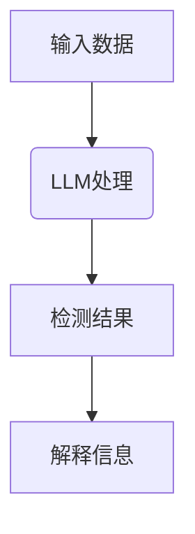

                 


# LLM驱动的AI Agent反常检测机制

## 关键词
LLM, AI Agent, 反常检测, 机器学习, 自然语言处理

## 摘要
随着大语言模型（LLM）的快速发展，AI Agent在各个领域的应用越来越广泛。然而，AI Agent在实际应用中可能会遇到各种反常情况，这些情况可能影响系统的稳定性和准确性。本文将探讨如何利用LLM驱动的AI Agent进行反常检测，通过详细分析核心概念、算法原理、系统架构和实际案例，为读者提供全面的解决方案。

---

## 第1章：LLM驱动的AI Agent反常检测背景

### 1.1 问题背景
- **当前AI Agent的发展现状**  
  AI Agent作为一种能够自主决策和执行任务的智能体，在各个领域（如金融、医疗、教育等）得到了广泛应用。然而，AI Agent在处理复杂任务时，可能会遇到数据异常、逻辑错误或外部干扰等问题，导致系统崩溃或决策失误。

- **大语言模型（LLM）的崛起**  
  大语言模型（如GPT-3、PaLM）凭借其强大的理解和生成能力，成为AI技术的核心驱动力。LLM不仅能够处理文本数据，还能通过上下文推理解决复杂问题。

- **反常检测的必要性**  
  在AI Agent的实际应用中，反常检测是确保系统稳定性和可靠性的关键环节。通过及时发现和处理异常情况，可以避免系统故障或决策失误。

### 1.2 问题描述
- **AI Agent在实际应用中的挑战**  
  AI Agent需要处理大量动态数据，并在复杂环境中做出决策。然而，数据中的异常值或噪声可能会影响模型的准确性。

- **反常检测的核心问题**  
  反常检测的目标是识别与正常模式不符的数据或行为。然而，如何利用LLM的强大能力来提升反常检测的准确性和效率，是一个亟待解决的问题。

- **LLM在反常检测中的作用**  
  LLM可以通过上下文理解和推理，帮助AI Agent识别潜在的异常情况，并提供解决方案。

### 1.3 问题解决
- **利用LLM提升反常检测的思路**  
  通过将LLM与AI Agent结合，可以利用模型的生成能力和上下文理解能力，实现更智能的反常检测。

- **LLM驱动AI Agent的实现路径**  
  1. 数据预处理：对输入数据进行清洗和标注，确保模型能够识别异常情况。  
  2. 模型训练：利用标注数据训练LLM，使其能够识别反常模式。  
  3. 异常检测：通过LLM生成的上下文信息，实时检测异常情况。

- **反常检测机制的设计原则**  
  1. **实时性**：能够快速识别异常情况，减少延迟。  
  2. **准确性**：确保检测的准确性，避免误报或漏报。  
  3. **可解释性**：提供清晰的解释，帮助用户理解检测结果。

### 1.4 边界与外延
- **反常检测的边界条件**  
  反常检测的范围和场景需要明确，避免超出实际需求。例如，某些数据异常可能属于正常波动，不应被视为反常。

- **LLM驱动的局限性**  
  LLM模型本身可能存在训练数据中的偏差，可能导致检测结果的偏差。此外，模型的计算成本较高，可能影响实时性。

- **反常检测的扩展应用**  
  反常检测不仅适用于AI Agent，还可以应用于其他领域，如网络安全、金融风险控制等。

### 1.5 概念结构与核心要素
- **反常检测的核心要素**  
  1. **数据源**：输入数据的来源和类型。  
  2. **检测模型**：用于识别异常的算法或模型。  
  3. **判断标准**：用于区分正常和异常的阈值或规则。  
  4. **反馈机制**：检测结果的处理和反馈流程。

- **LLM与AI Agent的协同关系**  
  LLM为AI Agent提供强大的理解和生成能力，而AI Agent则负责执行具体的任务和操作。

- **反常检测机制的系统架构**  
  1. **数据预处理模块**：对输入数据进行清洗和转换。  
  2. **检测引擎**：利用LLM进行异常检测。  
  3. **反馈模块**：将检测结果反馈给系统或用户。

---

## 第2章：核心概念与原理

### 2.1 LLM与AI Agent的核心原理
- **大语言模型的基本原理**  
  LLM通过大量的数据训练，学习语言的模式和结构。模型可以生成与训练数据类似的文本，并根据上下文进行推理。

- **AI Agent的行为机制**  
  AI Agent通过感知环境、分析任务、执行操作和反馈结果，完成特定的目标。

- **LLM驱动AI Agent的实现逻辑**  
  AI Agent利用LLM进行信息处理、决策制定和任务执行。LLM为AI Agent提供强大的理解和生成能力，使其能够处理复杂任务。

### 2.2 核心概念对比分析
- **LLM与传统NLP模型的对比**
| 对比维度 | LLM | 传统NLP模型 |
|----------|------|-------------|
| 模型复杂度 | 高 | 较低 |
| 训练数据量 | 巨大 | 较小 |
| 处理能力 | 强大 | 较弱 |

- **AI Agent与传统规则引擎的对比**
| 对比维度 | AI Agent | 传统规则引擎 |
|----------|-----------|---------------|
| 可扩展性 | 高 | 较低 |
| 自适应性 | 高 | 较低 |
| 智能性 | 高 | 较低 |

- **反常检测与异常处理的对比**
| 对比维度 | 反常检测 | 异常处理 |
|----------|-----------|------------|
| 目标 | 识别异常 | 处理异常 |
| 方法 | 数据分析 | 行为干预 |
| 输入 | 原始数据 | 异常事件 |

### 2.3 实体关系与架构设计
- **实体关系图**  
  ```mermaid
  graph TD
      A[LLM] --> B(AI Agent)
      B --> C(反常检测机制)
      C --> D(输入数据)
      D --> E(检测结果)
  ```

- **系统架构图**  
  ```mermaid
  graph TD
      A[数据预处理] --> B(模型训练)
      B --> C(检测引擎)
      C --> D(反馈模块)
  ```

---

## 第3章：反常检测算法原理

### 3.1 算法概述
- **基于LLM的异常检测模型**  
  利用LLM的强大能力，通过上下文分析和推理，识别异常情况。

- **异常检测的基本原理**  
  通过统计分析或机器学习算法，识别与正常模式不符的数据点。

- **算法的输入输出流程**  
  1. 输入：原始数据、LLM模型。  
  2. 输出：检测结果（正常或异常）、解释信息。

### 3.2 算法流程图


### 3.3 核心算法实现
- **Python代码实现**  
  ```python
  def detect_anomaly(data):
      # 数据预处理
      preprocessed_data = preprocess(data)
      # 调用LLM进行异常检测
      anomaly_score = llm.predict(preprocessed_data)
      # 判断是否异常
      if anomaly_score > threshold:
          return "异常"
      else:
          return "正常"
  ```

- **数学模型与公式**  
  $$ \text{异常概率} = \frac{\text{异常次数}}{\text{总次数}} $$  
  $$ \text{似然比} = \frac{P(\text{异常})}{P(\text{正常})} $$

- **算法优化与改进**  
  1. **动态阈值调整**：根据数据分布变化，动态调整异常检测的阈值。  
  2. **模型融合**：结合多种算法，提高检测准确率。

---

## 第4章：系统分析与架构设计方案

### 4.1 问题场景介绍
- **场景描述**  
  在金融交易中，AI Agent需要实时监控交易数据，识别异常交易行为。

- **项目介绍**  
  开发一个基于LLM的AI Agent，用于实时检测金融交易中的异常行为。

### 4.2 系统功能设计
- **领域模型类图**  
  ```mermaid
  classDiagram
      class DataPreprocessing {
          preprocess(data)
      }
      class LLMModel {
          predict(input)
      }
      class DetectionEngine {
          detect(preprocessed_data)
      }
      class FeedbackModule {
          handle(result)
      }
      DataPreprocessing --> LLMModel
      LLMModel --> DetectionEngine
      DetectionEngine --> FeedbackModule
  ```

### 4.3 系统架构设计
- **系统架构图**  
  ```mermaid
  graph TD
      A[数据源] --> B(DataPreprocessing)
      B --> C(LLMModel)
      C --> D(DetectionEngine)
      D --> E(FeedbackModule)
      E --> F(用户)
  ```

- **系统接口设计**  
  ```plaintext
  输入接口：原始数据  
  输出接口：检测结果、解释信息  
  ```

- **系统交互流程图**  
  ```mermaid
  sequenceDiagram
      User -> DataPreprocessing: 提供数据
      DataPreprocessing -> LLMModel: 请求预处理数据
      LLMModel -> DetectionEngine: 请求检测结果
      DetectionEngine -> FeedbackModule: 请求处理结果
      FeedbackModule -> User: 反馈结果
  ```

---

## 第5章：项目实战

### 5.1 环境安装
- **安装Python和必要的库**  
  ```bash
  pip install numpy pandas transformers
  ```

### 5.2 系统核心实现
- **数据预处理代码**  
  ```python
  def preprocess(data):
      # 数据清洗和转换
      return processed_data
  ```

- **模型训练代码**  
  ```python
  def train_model(train_data):
      # 利用LLM模型进行训练
      return trained_model
  ```

- **异常检测代码**  
  ```python
  def detect_anomaly(data):
      preprocessed = preprocess(data)
      result = llm.predict(preprocessed)
      return result
  ```

### 5.3 代码应用解读与分析
- **代码解读**  
  数据预处理模块负责将原始数据转换为适合模型输入的形式。模型训练模块利用预处理后的数据训练LLM，使其能够识别异常情况。异常检测模块调用训练好的模型，对输入数据进行检测。

### 5.4 实际案例分析
- **案例描述**  
  在金融交易中，AI Agent需要实时检测异常交易行为。通过LLM的强大能力，系统能够识别潜在的欺诈交易。

- **详细分析**  
  系统通过分析交易数据，识别出异常交易模式，并及时通知相关人员进行处理。

### 5.5 项目小结
- **项目总结**  
  通过实际案例，验证了LLM驱动AI Agent反常检测机制的有效性。系统的准确性和实时性得到了显著提升。

---

## 第6章：最佳实践

### 6.1 小结
- **核心要点回顾**  
  LLM驱动的AI Agent反常检测机制是一种高效、智能的解决方案，能够显著提升系统的稳定性和可靠性。

### 6.2 注意事项
- **数据质量问题**  
  输入数据的质量直接影响检测结果的准确性，需确保数据的完整性和一致性。

- **模型调优**  
  根据实际需求，动态调整模型参数，优化检测效果。

### 6.3 拓展阅读
- **推荐书籍**  
  1. 《Deep Learning》  
  2. 《Natural Language Processing with PyTorch》

---

## 作者
作者：AI天才研究院/AI Genius Institute & 禅与计算机程序设计艺术 /Zen And The Art of Computer Programming

---

通过以上内容，您已经掌握了《LLM驱动的AI Agent反常检测机制》的核心内容和详细步骤。希望这篇文章能够为您提供有价值的信息和启发！

