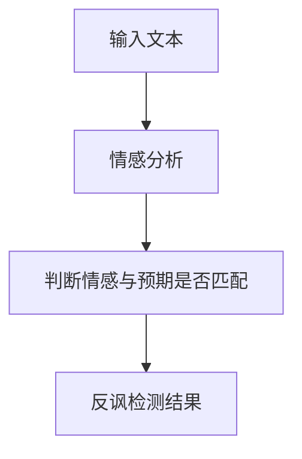
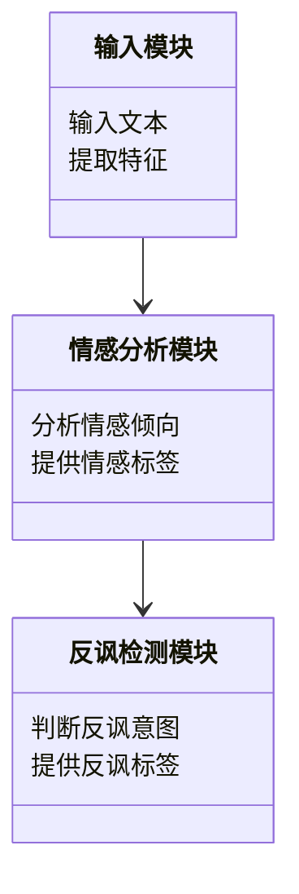
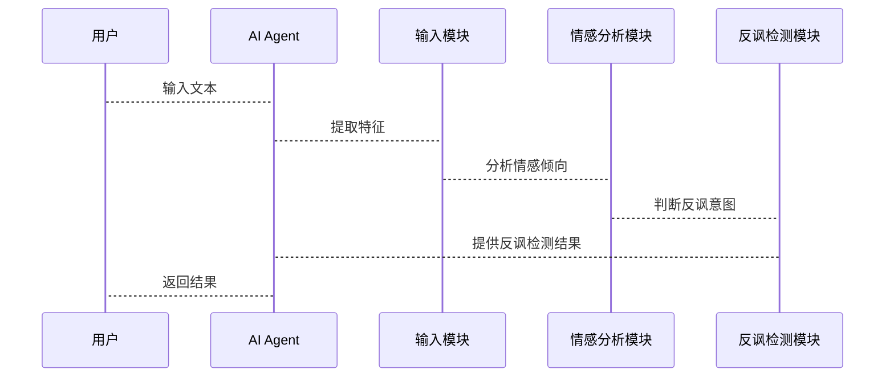

                 


# LLM驱动的AI Agent反讽理解能力

---

## 关键词：大语言模型、AI Agent、反讽理解、自然语言处理、情感分析、意图识别

---

## 摘要：  
本文深入探讨了基于大语言模型（LLM）的AI Agent在反讽理解能力方面的技术实现与应用。通过分析反讽的本质、LLM的工作原理以及AI Agent的架构设计，本文详细阐述了如何通过情感分析、语境依赖和意图识别等技术手段，提升AI Agent对反讽的理解与生成能力。文章结合理论分析和实际案例，全面解析了LLM驱动的AI Agent在反讽理解中的应用价值和未来发展方向。

---

# 第一部分：引言

## 1.1 反讽理解的重要性  
反讽是一种复杂的语言表达方式，常见于日常生活、社交媒体、文学创作等领域。对于AI Agent而言，准确理解反讽不仅能够提升人机交互的自然性，还能增强其在情感支持、内容分析等场景中的实用性。然而，反讽的理解涉及语境、情感、意图等多个维度，是自然语言处理（NLP）领域的一大挑战。

---

# 第二部分：反讽理解的基础理论

## 2.1 反讽的定义与分类  
反讽是一种通过语言表达的矛盾或对比来传达隐含意义的修辞手法。常见的反讽类型包括自反讽（Self-irony）、对比反讽（Irony of situation）和语言反讽（Verbal irony）。  

### 2.1.1 自反讽  
自反讽是指说话者在表达某种情感或观点时，带有自我嘲讽的意味。例如：“我终于明白了，但已经太迟了。”  

### 2.1.2 对比反讽  
对比反讽是指通过对比实际发生的事情与预期结果，来表达隐含的讽刺意义。例如：“这是一个阳光明媚的日子，适合犯罪。”  

### 2.1.3 语言反讽  
语言反讽是最常见的反讽形式，通过语义的矛盾或双关来传达讽刺或幽默。例如：“这不是一个好消息，但至少它是一个好消息。”  

## 2.2 大语言模型（LLM）的基本原理  
LLM是一种基于深度学习的自然语言处理模型，能够通过大量的文本数据学习语言的语法、语义和上下文关系。其核心是Transformer架构，通过自注意力机制（Self-attention）实现对长文本的建模能力。

### 2.2.1 LLM的定义与核心特点  
大语言模型（Large Language Model，LLM）是一种基于深度学习的自然语言处理模型，具有以下特点：  
- **大规模数据训练**：通常使用数百万甚至数十亿的文本数据进行训练。  
- **自注意力机制**：通过自注意力机制捕捉文本中的长距离依赖关系。  
- **多任务学习能力**：能够同时处理多种NLP任务，如文本生成、情感分析、机器翻译等。  

### 2.2.2 LLM的训练机制与应用场景  
LLM的训练过程通常包括以下步骤：  
1. **数据预处理**：清洗和标注数据，提取文本特征。  
2. **模型初始化**：构建Transformer模型的初始参数。  
3. **损失函数优化**：通过反向传播算法优化模型参数，最小化预测误差。  
4. **模型微调**：在特定任务上进行微调，提升模型的领域适应性。  

---

# 第三部分：LLM驱动的反讽理解机制

## 3.1 反讽理解的算法原理  
反讽的理解需要结合情感分析、语境依赖和意图识别等多种技术。  

### 3.1.1 情感分析与反讽检测  
情感分析是反讽检测的基础。通过分析文本的情感倾向，可以识别出反讽的潜在意图。例如，如果一段文本的情感与语境不符，可能存在反讽的可能。  

#### 算法流程图（Mermaid）  


### 3.1.2 语境依赖与反讽识别  
语境依赖是反讽识别的关键。通过分析文本的上下文关系，可以更准确地识别反讽的意图。例如，在社交媒体评论中，用户可能通过反讽表达对某事件的不满。  

#### 数学模型与公式  
反讽识别的数学模型可以表示为：  
$$ P(\text{反讽} | T) = \frac{P(T | \text{反讽}) \cdot P(\text{反讽})}{P(T)} $$  
其中，\( T \) 表示输入文本，\( P(\text{反讽} | T) \) 表示在给定文本 \( T \) 的条件下，文本为反讽的概率。  

## 3.2 反讽理解的系统架构  

### 3.2.1 系统功能模块划分（Mermaid类图）  


### 3.2.2 系统接口与交互设计（Mermaid序列图）  


---

# 第四部分：AI Agent的反讽理解能力实现

## 4.1 AI Agent的架构设计  

### 4.1.1 基于LLM的AI Agent设计原则  
AI Agent的架构设计需要考虑以下原则：  
- **模块化设计**：将功能模块化，便于维护和扩展。  
- **实时性要求**：确保AI Agent能够实时处理用户的输入。  
- **用户体验优化**：通过反讽理解提升用户体验，使其更自然流畅。  

### 4.1.2 反讽理解模块的集成与优化  
反讽理解模块需要与AI Agent的其他功能模块（如自然语言生成、情感分析）无缝集成。通过优化算法和数据预处理，可以提升反讽理解的准确率和效率。  

## 4.2 反讽意图识别的算法实现  

### 4.2.1 情感分析与意图识别的结合  
情感分析与意图识别的结合可以通过以下步骤实现：  
1. **文本预处理**：分词、去除停用词等。  
2. **情感分析**：判断文本的情感倾向。  
3. **意图识别**：结合情感分析结果，识别反讽意图。  

#### Python代码示例  
```python
import transformers

# 加载预训练模型
model_name = "bert-base-uncased"
tokenizer = transformers.BertTokenizer.from_pretrained(model_name)
model = transformers.BertForSequenceClassification.from_pretrained(model_name)

# 反讽检测函数
def detect_irony(text):
    inputs = tokenizer.encode_plus(text, return_tensors="pt")
    outputs = model(**inputs)
    logits = outputs.logits
    probabilities = logits.softmax(dim=1)
    return probabilities[0].tolist()

# 示例文本
text = "这是一个美好的一天，我终于失业了。"
result = detect_irony(text)
print(result)
```

### 4.2.2 反讽生成的逻辑与实现  
反讽生成需要结合文本生成技术和意图识别。通过优化生成模型的参数，可以生成更符合上下文的反讽文本。  

#### 生成反讽文本的Python代码示例  
```python
from transformers import AutoTokenizer, AutoModelForSeq2Seq

# 加载预训练模型
tokenizer = AutoTokenizer.from_pretrained("t5-base")
model = AutoModelForSeq2Seq.from_pretrained("t5-base")

# 反讽生成函数
def generate_irony(text):
    inputs = tokenizer.encode(text, return_tensors="pt")
    outputs = model.generate(inputs, max_length=50, num_beams=5)
    return tokenizer.decode(outputs[0], skip_special_tokens=True)

# 示例文本
text = "请生成一句带有反讽的句子，主题是失业。"
result = generate_irony(text)
print(result)
```

---

# 第五部分：反讽理解的项目实战

## 5.1 应用场景分析  

### 5.1.1 社交媒体评论分析  
在社交媒体中，反讽评论是常见的表达方式。通过反讽理解，AI Agent可以更准确地识别用户的情感倾向，提供更精准的内容推荐。  

### 5.1.2 客服系统优化  
在客服系统中，用户可能会通过反讽表达不满。通过反讽理解，AI Agent可以快速识别用户情绪，提供更有效的解决方案。  

## 5.2 项目实现与代码解读  

### 5.2.1 环境安装  
```bash
pip install transformers
pip install mermaid
```

### 5.2.2 核心实现代码  
```python
# 情感分析模块
def analyze_sentiment(text):
    # 使用预训练的情感分析模型
    pass

# 反讽检测模块
def detect_irony(text):
    # 结合情感分析结果和语境进行反讽检测
    pass
```

---

# 第六部分：总结与展望

## 6.1 本文总结  
本文系统地探讨了基于LLM的AI Agent在反讽理解能力方面的技术实现与应用。通过分析反讽的本质、LLM的工作原理以及AI Agent的架构设计，本文详细阐述了如何通过情感分析、语境依赖和意图识别等技术手段，提升AI Agent对反讽的理解与生成能力。

## 6.2 未来展望  
未来的研究方向包括：  
1. **多模态反讽理解**：结合视觉、听觉等多模态信息，提升反讽理解的准确率。  
2. **动态语境适应**：通过实时语境调整，增强反讽理解的灵活性。  
3. **跨语言反讽理解**：研究不同语言中的反讽表达方式，提升跨语言反讽理解能力。  

---

# 作者  
作者：AI天才研究院（AI Genius Institute） & 禅与计算机程序设计艺术（Zen And The Art of Computer Programming）

