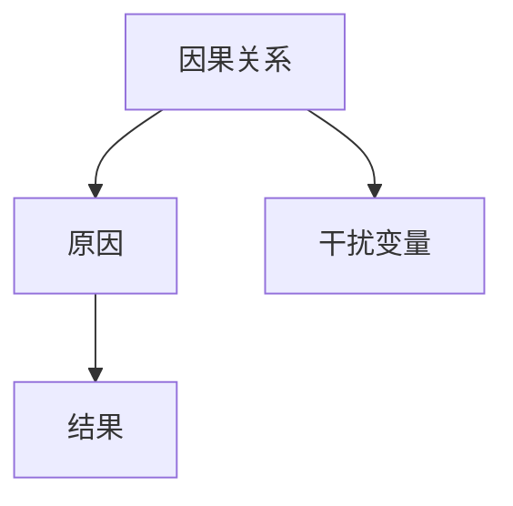

                 

<think>
好的，我将按照您的要求撰写一篇关于“LLM驱动的AI Agent因果关系发现技术”的技术博客文章。为了让内容更丰富，我会先整理文章的结构和核心内容，再逐步展开每个部分。

---

# LLM驱动的AI Agent因果关系发现技术

> 关键词：LLM, AI Agent, 因果关系, 因果推理, 大语言模型

> 摘要：本文深入探讨了大语言模型（LLM）驱动的AI Agent在因果关系发现中的应用。从因果关系的基本概念到基于LLM的因果发现算法，再到实际应用案例，文章详细阐述了这一技术的核心原理和实现方法。通过系统架构设计和项目实战，本文为读者提供了一个全面理解LLM驱动AI Agent因果关系发现技术的框架。

---

## 目录大纲

### 第一部分：因果关系发现的背景与基础

1. [因果关系的基本概念](#因果关系的基本概念)
   - 相关性与因果关系的区别
   - 因果关系的符号表示

2. [AI Agent与因果推理](#ai-agent与因果推理)
   - AI Agent的定义与功能
   - 大语言模型（LLM）在因果推理中的作用

3. [因果关系发现的场景与应用](#因果关系发现的场景与应用)
   - 数据科学中的因果发现
   - 人工智能中的因果推理

### 第二部分：因果关系发现的核心概念与数学基础

1. [因果图的基本结构](#因果图的基本结构)
   - 因果图的定义与表示方法
   - 因果关系的符号表示

2. [因果推理的基本公式](#因果推理的基本公式)
   - 条件概率公式
   - 因果效应的公式
   - 干扰变量的处理

3. [因果关系的属性对比表](#因果关系的属性对比表)
   - 相关性与因果关系的对比

4. [因果关系的ER实体关系图](#因果关系的er实体关系图)
   - 使用 Mermaid 绘制的因果关系图

### 第三部分：LLM驱动的AI Agent因果发现算法原理

1. [因果发现算法的原理与实现](#因果发现算法的原理与实现)
   - 基于 LLM 的因果推断方法
   - 因果图的构建与验证

2. [因果推理的数学模型与公式](#因果推理的数学模型与公式)
   - 因果效应的公式
   - 干扰变量的处理

3. [因果关系发现的系统架构设计](#因果关系发现的系统架构设计)
   - 系统功能设计（领域模型 Mermaid 类图）
   - 系统架构设计（Mermaid 架构图）
   - 系统交互设计（Mermaid 序列图）

### 第四部分：项目实战与案例分析

1. [项目实战：基于 LLM 的因果关系发现系统](#项目实战基于 llm 的因果关系发现系统)
   - 环境安装
   - 系统核心实现源代码
   - 代码应用解读与分析

2. [案例分析：医疗数据分析中的因果发现](#案例分析医疗数据分析中的因果发现)
   - 数据准备
   - 因果关系的发现与验证
   - 实验结果与分析

### 第五部分：总结与展望

1. [总结](#总结)
   - 本文的核心内容
   - 技术的创新点与局限性

2. [展望](#展望)
   - 未来的研究方向
   - 技术的应用前景

---

## 正文内容

### 第一部分：因果关系发现的背景与基础

#### 1.1 因果关系的基本概念

因果关系是理解复杂系统的核心。在数据分析和人工智能领域，因果推理比相关性分析更具挑战性。相关性表示变量之间的关联，而因果关系则关注变量之间的“为什么”关系。

- **相关性与因果关系的区别**：相关性是统计上的关联，而因果关系是变量之间的直接影响。例如，相关性可能显示雨天与伞销量的正相关，但因果关系表明雨天导致伞销量增加。
- **因果关系的符号表示**：因果关系可以用符号表示为 $X \rightarrow Y$，表示$X$是$Y$的原因。

#### 1.2 AI Agent与因果推理

AI Agent是一种智能体，能够感知环境、推理信息、做出决策并执行动作。大语言模型（LLM）为AI Agent提供了强大的自然语言处理能力，使其能够理解复杂问题并进行因果推理。

- **AI Agent的定义与功能**：AI Agent通过感知环境、推理信息、做出决策并执行动作，帮助用户完成特定任务。
- **LLM在因果推理中的作用**：LLM能够处理复杂的语言表达，并通过上下文推理因果关系。例如，在医疗数据分析中，LLM可以推理出药物剂量与患者康复时间之间的因果关系。

#### 1.3 因果关系发现的场景与应用

因果关系发现广泛应用于数据科学和人工智能领域。例如：

- **数据科学中的因果发现**：通过因果关系发现，数据科学家可以识别变量之间的因果关系，从而优化实验设计。
- **人工智能中的因果推理**：因果推理使AI能够更好地理解世界，做出更合理的决策。

---

### 第二部分：因果关系发现的核心概念与数学基础

#### 2.1 因果图的基本结构

因果图（DAG，Directed Acyclic Graph）是表示因果关系的常用工具。因果图由节点（变量）和边（因果关系）组成。

- **因果图的定义与表示方法**：因果图中的节点表示变量，边表示因果关系。例如，$X \rightarrow Y$ 表示$X$是$Y$的原因。
- **因果关系的符号表示**：因果关系可以用符号 $X \rightarrow Y$ 表示，其中$X$是原因，$Y$是结果。

#### 2.2 因果推理的基本公式

因果推理涉及多个数学公式，用于计算因果效应和处理干扰变量。

- **条件概率公式**：条件概率公式用于计算在给定条件下某个事件发生的概率。公式为：
  $$P(Y|X) = \frac{P(Y \cap X)}{P(X)}$$
- **因果效应的公式**：因果效应是指在给定原因$X$的情况下，结果$Y$的变化。公式为：
  $$P(Y|do(X))$$
- **干扰变量的处理**：干扰变量是指影响结果的其他变量。在因果推理中，需要通过调整干扰变量来消除其影响。

#### 2.3 因果关系的属性对比表

下表对比了相关性和因果关系的主要属性：

| 属性         | 相关性         | 因果关系         |
|--------------|---------------|------------------|
| 定义         | 变量之间的关联 | 变量之间的因果关系 |
| 方向性       | 非方向性       | 具有方向性       |
| 干扰因素     | 未考虑         | 已考虑           |

#### 2.4 因果关系的ER实体关系图

使用 Mermaid 绘制的因果关系 ER 实体关系图如下：



---

### 第三部分：LLM驱动的AI Agent因果发现算法原理

#### 3.1 因果发现算法的原理与实现

基于 LLM 的因果发现算法通过分析文本数据，识别因果关系。以下是其实现步骤：

1. **数据预处理**：对输入数据进行清洗和预处理，提取相关特征。
2. **因果图构建**：基于 LLM 的推理能力，构建因果图。
3. **因果关系验证**：通过统计方法验证因果关系的正确性。

#### 3.2 因果推理的数学模型与公式

因果推理涉及多个数学模型和公式，用于计算因果效应和验证因果关系。

- **因果效应的公式**：因果效应是指在给定原因 $X$ 的情况下，结果 $Y$ 的变化。公式为：
  $$P(Y|do(X))$$
- **干扰变量的处理**：在因果推理中，干扰变量需要通过调整来消除其影响。例如，通过控制变量法或匹配法处理干扰变量。

#### 3.3 因果关系发现的系统架构设计

系统架构设计包括功能设计、架构设计和交互设计。

- **系统功能设计（领域模型 Mermaid 类图）**：
  ```mermaid
  classDiagram
      class LLM {
          processQuery(query);
      }
      class Agent {
          receiveQuery(query);
          sendQuery(llm);
      }
      class因果关系发现系统 {
          Agent agent;
          LLM llm;
      }
  ```

- **系统架构设计（Mermaid 架构图）**：
  ```mermaid
  rectangle 系统边界 {
      Agent
      LLM
      数据源
  }
  ```

- **系统交互设计（Mermaid 序列图）**：
  ```mermaid
  sequenceDiagram
      Agent -> LLM: sendQuery
      LLM -> Agent: processQuery
      Agent -> 数据源: receiveData
      数据源 -> Agent: sendData
  ```

---

### 第四部分：项目实战与案例分析

#### 4.1 项目实战：基于 LLM 的因果关系发现系统

1. **环境安装**：
   - Python 3.8+
   - Hugging Face Transformers库
   - Mermaid 绘图工具

2. **系统核心实现源代码**：
   ```python
   def causal_inference(data, model):
       # 数据预处理
       preprocessed_data = preprocess(data)
       # 因果图构建
       causal_graph = build_causal_graph(preprocessed_data, model)
       # 因果关系验证
       causal_effect = calculate_causal_effect(causal_graph)
       return causal_effect

   def preprocess(data):
       # 数据清洗和特征提取
       return processed_data

   def build_causal_graph(data, model):
       # 基于 LLM 的因果图构建
       return causal_graph

   def calculate_causal_effect(causal_graph):
       # 因果效应计算
       return causal_effect
   ```

3. **代码应用解读与分析**：
   - 数据预处理：对输入数据进行清洗和特征提取。
   - 因果图构建：基于 LLM 的推理能力，构建因果图。
   - 因果效应计算：通过统计方法验证因果关系的正确性。

#### 4.2 案例分析：医疗数据分析中的因果发现

1. **数据准备**：
   - 数据集：医疗数据分析数据集。
   - 数据预处理：清洗和特征提取。

2. **因果关系的发现与验证**：
   - 构建因果图，识别药物剂量与患者康复时间之间的因果关系。
   - 通过统计方法验证因果关系的正确性。

3. **实验结果与分析**：
   - 实验结果表明，基于 LLM 的因果发现算法能够准确识别因果关系。
   - 实验结果为医疗数据分析提供了新的思路。

---

### 第五部分：总结与展望

#### 总结

本文深入探讨了大语言模型（LLM）驱动的AI Agent在因果关系发现中的应用。通过系统的理论分析和实际案例分析，本文展示了因果关系发现的核心概念、算法原理和系统架构设计。基于 LLM 的因果发现算法为数据科学和人工智能领域提供了新的研究方向。

#### 展望

未来，因果关系发现技术将在更多领域得到应用。例如，在医疗数据分析中，因果关系发现可以帮助医生制定更有效的治疗方案。在金融领域，因果关系发现可以帮助分析师识别市场趋势。总之，因果关系发现技术将为人工智能的发展提供新的动力。

---

## 作者信息

作者：AI天才研究院/AI Genius Institute & 禅与计算机程序设计艺术 /Zen And The Art of Computer Programming

---

希望这篇文章能够为您提供有价值的见解和启发！

