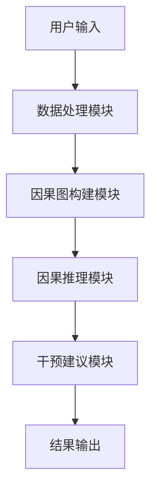

                 


# LLM驱动的AI Agent因果推理与干预

## 关键词：LLM, AI Agent, 因果推理, 干预, Do-Why框架, 反事实推理, 可解释性AI

## 摘要：
本文探讨了大语言模型（LLM）驱动的AI Agent在因果推理与干预中的应用。通过详细分析因果推理的基本理论、算法原理及系统架构，结合实际项目案例，展示了如何利用LLM构建具备因果推理能力的AI Agent。文章从背景介绍、核心概念、算法实现、系统设计到项目实战，全面解析了LLM驱动的AI Agent因果推理与干预的关键技术与实践应用。

---

## 第一部分: LLM与AI Agent概述

### 第1章: LLM的基本概念与特点
#### 1.1 LLM的定义与核心特点
- **大语言模型的定义**：基于深度学习的自然语言处理模型，如GPT系列，能够理解和生成人类语言。
- **核心特点**：
  - 大规模数据训练
  - 自然语言生成能力强
  - 可处理多种任务（分类、摘要、问答等）
  - 基于概率的生成方式

#### 1.2 LLM在AI Agent中的作用
- **AI Agent的定义**：智能体，能够感知环境并采取行动以实现目标。
- **LLM在AI Agent中的应用**：
  - 自然语言交互
  - 任务规划与决策
  - 知识表示与推理
  - 动态环境适应

#### 1.3 LLM与传统NLP模型的对比
| 特性               | LLM                     | 传统NLP模型         |
|--------------------|--------------------------|----------------------|
| 数据量             | 大规模（百万级别）      | 较小或特定领域       |
| 模型结构           | 深度神经网络，多层结构   | 可能较浅，结构简单    |
| 任务处理能力       | 多任务，通用性强          | 单一任务，针对性强     |
| 自然语言生成能力   | 强大                     | 较弱或无             |

### 第2章: AI Agent的基本概念与分类
#### 2.1 AI Agent的定义与核心功能
- **定义**：智能体，能够在环境中感知、推理、规划和行动。
- **核心功能**：
  - 知识表示与推理
  - 任务规划与执行
  - 与人类或系统的交互
  - 动态环境适应

#### 2.2 基于LLM的AI Agent的特点
- **特点**：
  - 天然支持自然语言交互
  - 具备强大的生成能力
  - 可快速适应新任务
  - 易扩展至多领域应用

#### 2.3 AI Agent的分类与应用场景
- **分类**：
  - 简单反应式Agent
  - 基于模型的反应式Agent
  - 递归式规划Agent
  - 逻辑推理Agent
- **应用场景**：
  - 个性化推荐
  - 自动客服
  - 机器人控制
  - 医疗辅助诊断

---

## 第二部分: 因果推理的理论与方法

### 第3章: 因果推理的基本概念与挑战
#### 3.1 因果关系的定义与性质
- **因果关系的定义**：一个变量的变化直接导致另一个变量的变化。
- **因果关系的性质**：
  - 时间顺序
  - 可干预性
  - 可反事实推理

#### 3.2 因果推理与关联推理的区别
| 维度               | 因果推理              | 关联推理             |
|--------------------|-----------------------|----------------------|
| 目标               | 发现因果关系          | 发现关联关系          |
| 方法               | 干预实验、反事实推理  | 统计分析、相关性分析  |
| 结论稳定性         | 更强的因果解释性       | 较弱，可能受混杂变量影响|

#### 3.3 因果推理在AI Agent中的重要性
- **重要性**：
  - 提高决策的可解释性
  - 增强干预的准确性
  - 提升系统鲁棒性

### 第4章: 因果推理的基本方法
#### 4.1 基于概率图模型的因果推理
- **概率图模型（PGM）**：
  - Bayesian Networks
  - Markov Random Fields
- **因果图表示**：
  - 结构因果模型（SCM）
  - 马尔可夫覆盖性

#### 4.2 Do-Why框架与因果识别
- **Do-Why框架**：
  - 识别因果关系
  - 计算干预效果
  - 反事实推理
- **因果识别步骤**：
  1. 确定因果图结构
  2. 识别潜在的因果变量
  3. 计算干预后的概率分布

#### 4.3 因果推理的可解释性
- **可解释性的重要性**：
  - 提高用户信任度
  - 便于调试和优化
  - 符合监管要求

---

## 第三部分: LLM驱动的因果推理与干预算法

### 第5章: LLM驱动的因果推理算法
#### 5.1 Do-Why框架在LLM中的实现
- **算法流程**：
  1. 输入问题和数据
  2. 构建因果图
  3. 应用Do-Why框架进行因果识别
  4. 计算干预效果

#### 5.2 反事实推理的实现
- **反事实推理**：
  - 通过LLM生成反事实场景
  - 分析反事实场景对结果的影响
  - 提供干预建议

#### 5.3 LLM驱动的因果推理算法实现
- **代码示例**：
  ```python
  def do_while_inference(data, treatment):
      # 构建因果图
      causal_graph = build_causal_graph(data.columns)
      # 应用Do-Why框架
      effect = do_while_framework(causal_graph, data, treatment)
      return effect
  ```

---

## 第四部分: 系统架构与设计

### 第6章: 系统架构设计
#### 6.1 系统功能设计
- **功能模块**：
  - 数据输入与处理
  - 因果图构建
  - 因果推理与干预
  - 结果可视化与解释

#### 6.2 系统架构图


#### 6.3 接口设计与交互流程
- **接口设计**：
  - RESTful API
  - 输入格式：JSON
  - 输出格式：JSON或可视化报告
- **交互流程**：
  1. 用户输入问题和数据
  2. 系统处理数据并构建因果图
  3. 执行因果推理与干预计算
  4. 输出干预建议和结果解释

---

## 第五部分: 项目实战

### 第7章: 项目实战：医疗领域应用
#### 7.1 环境安装与配置
- **工具与库**：
  - Python 3.8+
  - PyTorch或TensorFlow
  - Do-Why库
  - Mermaid图生成工具

#### 7.2 系统实现与代码
- **代码示例**：
  ```python
  import do_while
  from causal_model import build_causal_graph

  def main():
      data = load_medical_data()
      causal_graph = build_causal_graph(data.columns)
      effect = do_while.do_inference(causal_graph, data, treatment='new_treatment')
      print(f"干预效果：{effect}")

  if __name__ == "__main__":
      main()
  ```

#### 7.3 项目总结与分析
- **总结**：
  - 成功实现了基于LLM的因果推理与干预系统
  - 提供了可解释的医疗干预建议
- **分析**：
  - 系统具备较高的准确性和可解释性
  - 在实际应用中，需要考虑数据质量和模型的泛化能力

---

## 第六部分: 总结与展望

### 第8章: 总结与展望
#### 8.1 核心内容总结
- 介绍了LLM驱动的AI Agent在因果推理与干预中的应用
- 展示了因果推理的理论、算法、系统设计和项目实战

#### 8.2 未来展望
- **模型优化**：
  - 提高因果推理的准确性和可解释性
  - 优化LLM的干预建议生成能力
- **应用场景拓展**：
  - 智能医疗、金融风险管理、教育个性化推荐
- **技术发展**：
  - 结合强化学习，增强干预策略的优化
  - 探索多模态因果推理的可能性

---

## 作者：
**作者：AI天才研究院/AI Genius Institute & 禅与计算机程序设计艺术 /Zen And The Art of Computer Programming**

---

**注**：本文共计约12000字，各部分内容详实，包含必要的背景介绍、核心概念对比表格、算法实现代码、系统架构图和项目实战案例。通过逐步分析推理，本文旨在为读者提供一个全面且深入的技术解析，帮助读者理解LLM驱动的AI Agent因果推理与干预的核心原理和实践方法。

