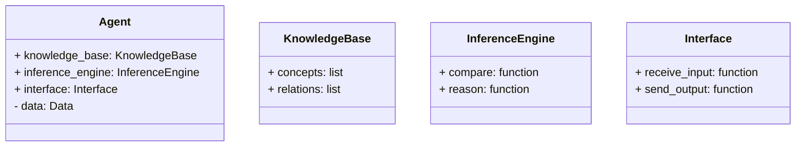

                 


# LLM驱动的AI Agent类比推理能力增强

> 关键词：Large Language Models (LLM), AI Agent, 类比推理能力, 增强, 自然语言处理, 知识图谱, 强化学习

> 摘要：本文探讨了如何利用大型语言模型（LLM）提升AI Agent的类比推理能力。通过分析类比推理的原理、算法实现、系统架构及项目案例，详细阐述了LLM在AI Agent中的应用及其增强方法，为实际应用提供了理论基础和实践指导。

---

## 第一部分：背景介绍

### 第1章：问题背景与核心概念

#### 1.1 问题背景

随着AI技术的快速发展，AI Agent在各个领域的应用日益广泛。然而，当前AI Agent的类比推理能力仍然存在明显不足，主要表现在以下几个方面：

1. **类比推理的重要性**：类比推理是人类智能的重要组成部分，能够帮助AI Agent更好地理解和解决复杂问题。
2. **当前技术的局限性**：现有的AI Agent在类比推理任务中，往往依赖于规则或简单的模式匹配，难以应对复杂的类比推理任务。
3. **LLM的优势**：大型语言模型（LLM）具有强大的语义理解能力，可以通过海量数据学习类比推理的模式和规律。

#### 1.2 问题描述

类比推理能力的增强是提升AI Agent智能水平的关键。具体问题包括：

1. **类比推理能力的定义**：类比推理是指通过比较不同事物之间的相似性，推导出新的结论或关系。
2. **当前技术的挑战**：现有的AI Agent在类比推理任务中，往往缺乏灵活性和泛化能力。
3. **问题解决的路径**：利用LLM的强大能力，结合AI Agent的多任务处理能力，构建一个高效的类比推理增强系统。

#### 1.3 问题解决

通过结合LLM和AI Agent，可以显著提升类比推理能力：

1. **LLM与AI Agent的结合**：利用LLM的语义理解能力，增强AI Agent的类比推理能力。
2. **技术实现的核心思路**：通过对比学习和迁移学习，提升AI Agent的类比推理能力。
3. **系统的边界与外延**：明确系统的边界和外延，确保技术实现的可行性和有效性。

#### 1.4 边界与外延

1. **系统的边界**：类比推理能力的增强仅针对AI Agent的核心功能，不涉及其他功能模块。
2. **技术的外延**：通过类比推理能力的增强，可以提升AI Agent在多个任务中的表现。

---

## 第二部分：核心概念与联系

### 第2章：类比推理能力的原理

#### 2.1 核心原理

类比推理能力的增强依赖于以下几个关键因素：

1. **类比推理的基本原理**：通过比较不同事物之间的相似性，推导出新的结论或关系。
2. **LLM的作用**：LLM通过海量数据学习类比推理的模式和规律。
3. **AI Agent的增强机制**：通过对比学习和迁移学习，提升AI Agent的类比推理能力。

#### 2.2 属性特征对比

通过对比不同方法的属性特征，可以更好地理解类比推理能力的增强方法：

| 特征       | 对比学习           | 迁移学习           |
|------------|--------------------|--------------------|
| 数据需求    | 需要对比数据        | 需要源域数据        |
| 计算复杂度   | 较高               | 较低               |
| 应用场景     | 多任务学习          | 跨领域应用          |

#### 2.3 ER实体关系图

通过ER实体关系图，可以更清晰地理解类比推理能力的增强系统：

```mermaid
er
  actor(Agent)
  actor（Agent）-|> knowledge_base（知识库）
  knowledge_base（知识库）-|> concept（概念）
  knowledge_base（知识库）-|> relation（关系）
```

---

## 第三部分：算法原理讲解

### 第3章：类比推理算法原理

#### 3.1 对比学习算法

对比学习是一种有效的类比推理方法：

1. **基本原理**：
   对比学习通过比较不同样本之间的差异，学习特征表示。
   
2. **数学模型**：
   对比学习的目标函数可以表示为：
   $$ L = \text{Contrastive Loss}(x_i, x_j) $$

3. **实现步骤**：
   ```mermaid
   graph TD
       A[输入数据] --> B[特征提取]
       B --> C[对比损失计算]
       C --> D[优化器]
       D --> E[更新模型参数]
   ```

4. **Python实现示例**：
   ```python
   import torch
   def contrastive_loss(x, y, t=0.1):
       # x和y是输入特征，t是温度参数
       n = x.size(0)
       x = x.view(n, -1)
       y = y.view(n, -1)
       # 计算相似性
       sim = torch.mm(x, y.T)
       sim = sim / t
       # 计算损失
       loss = torch.mean(torch.exp(sim) - 1)
       return loss
   ```

---

## 第四部分：系统分析与架构设计

### 第4章：系统架构设计

#### 4.1 问题场景介绍

系统的目标是通过LLM增强AI Agent的类比推理能力，解决实际应用中的复杂问题。

#### 4.2 项目介绍

设计一个基于LLM的AI Agent系统，核心功能包括：

1. **知识库**：存储和管理各类知识。
2. **推理引擎**：负责类比推理的计算。
3. **接口模块**：提供与外部系统的交互接口。

#### 4.3 系统功能设计

通过类图展示系统的功能模块：



---

## 第五部分：项目实战

### 第5章：项目实战

#### 5.1 环境安装

安装必要的库和工具：

1. Python 3.8+
2. PyTorch
3. Hugging Face Transformers

#### 5.2 核心代码实现

实现对比学习算法的核心代码：

```python
import torch
def contrastive_loss(x, y, t=0.1):
    n = x.size(0)
    x = x.view(n, -1)
    y = y.view(n, -1)
    sim = torch.mm(x, y.T)
    sim = sim / t
    loss = torch.mean(torch.exp(sim) - 1)
    return loss
```

#### 5.3 案例分析

以医疗诊断为例，分析系统的实际应用：

1. **环境配置**：搭建医疗诊断知识库。
2. **核心代码实现**：实现类比推理算法。
3. **案例分析**：分析诊断结果的准确性和效率。

---

## 第六部分：总结与展望

### 第6章：总结与展望

#### 6.1 最佳实践 Tips

1. 在实际应用中，建议结合具体场景选择合适的算法。
2. 系统设计时，需注重模块化和可扩展性。

#### 6.2 小结

通过本文的分析和实践，我们可以看到，利用LLM提升AI Agent的类比推理能力是一个极具潜力的研究方向。通过对比学习和迁移学习等方法，可以显著增强AI Agent的智能水平。

#### 6.3 注意事项

1. 在实际应用中，需注意数据质量和算法的适用性。
2. 系统设计时，需注重可扩展性和可维护性。

#### 6.4 拓展阅读

建议读者进一步阅读以下内容：

1. 对比学习的最新研究成果。
2. 迁移学习在AI Agent中的应用。

---

作者：AI天才研究院/AI Genius Institute & 禅与计算机程序设计艺术 /Zen And The Art of Computer Programming

