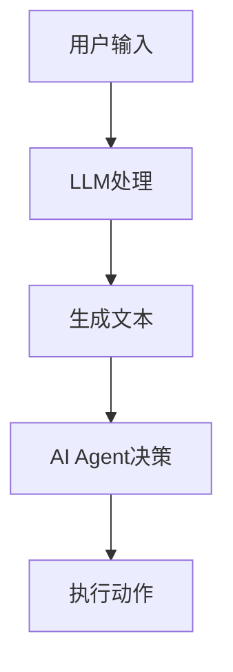
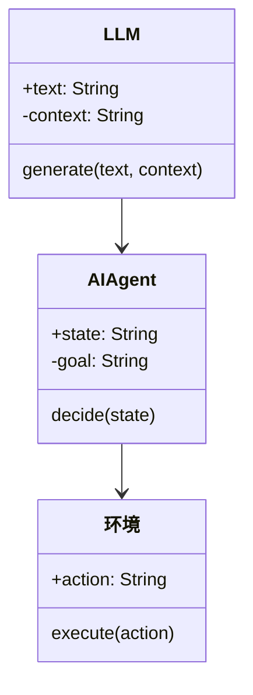

                 


# LLM驱动的AI Agent虚构世界构建器

> 关键词：LLM, AI Agent, 虚构世界构建，语言模型，人工智能，知识图谱

> 摘要：本文详细探讨了如何利用大语言模型（LLM）驱动AI Agent构建虚构世界的方法。通过分析LLM与AI Agent的核心原理，结合算法流程图、系统架构图和交互序列图，详细阐述了从理论到实践的完整实现过程。文章内容涵盖背景介绍、核心概念、算法原理、系统架构设计、项目实战以及最佳实践，为读者提供了一个全面的技术指南。

---

## 第一部分：背景介绍

### 第1章：LLM与AI Agent概述

#### 1.1 LLM的基本概念
- **1.1.1 大语言模型的定义**
  大语言模型（Large Language Model, LLM）是指基于深度学习训练的大型神经网络模型，能够理解和生成人类语言。这些模型通常使用Transformer架构，通过大量的文本数据进行训练，以捕捉语言的规律和上下文信息。

- **1.1.2 LLM的核心特点**
  - 大规模：参数量通常在 billions 级别。
  - 通用性：能够处理多种语言和任务。
  - 智能性：能够理解和生成复杂的语言结构。

- **1.1.3 LLM与传统NLP模型的区别**
  传统NLP模型通常针对特定任务（如机器翻译、问答系统）进行训练，而LLM是通用模型，能够通过微调适应多种任务。

#### 1.2 AI Agent的基本概念
- **1.2.1 AI Agent的定义**
  AI Agent（人工智能代理）是指能够感知环境、自主决策并执行任务的智能体。AI Agent可以是软件程序，也可以是物理机器人，通过与环境交互来实现目标。

- **1.2.2 AI Agent的类型**
  - 简单反射型：基于规则做出反应。
  - 目标驱动型：基于目标进行决策。
  - 学习型：通过机器学习算法不断优化行为。

- **1.2.3 AI Agent的核心功能**
  - 感知环境：通过传感器或数据输入感知环境。
  - 决策制定：基于感知信息做出决策。
  - 行为执行：执行决策动作。

#### 1.3 虚构世界构建的背景与意义
- **1.3.1 虚构世界构建的定义**
  虚构世界构建是指通过AI技术创建一个虚拟的数字世界，这个世界可以包含虚拟人物、虚拟场景、虚拟事件等。

- **1.3.2 虚构世界构建的应用场景**
  - 游戏开发：生成游戏剧情、角色和场景。
  - 虚拟助手：创建虚拟助手的交互场景。
  - 教育：创建虚拟学习环境。

- **1.3.3 虚构世界构建的重要性**
  虚构世界构建能够帮助我们更好地理解和模拟现实世界，为教育、娱乐、培训等领域提供强大的工具。

---

## 第二部分：核心概念与联系

### 第2章：LLM与AI Agent的核心原理

#### 2.1 LLM的核心原理
- **2.1.1 变压器模型的工作原理**
  变压器模型通过自注意力机制（Self-Attention）捕捉输入序列中的全局依赖关系，从而生成高质量的文本。

- **2.1.2 注意力机制的详细解释**
  注意力机制允许模型在生成文本时关注输入序列中的重要部分，从而提高生成结果的相关性。

- **2.1.3 梯度下降与损失函数**
  LLM通过梯度下降优化模型参数，最小化预测输出与真实输出之间的损失函数值。

#### 2.2 AI Agent的核心原理
- **2.2.1 状态空间与动作空间**
  AI Agent通过感知环境状态，选择合适的行为（动作），以最大化目标函数的值。

- **2.2.2 策略网络与价值函数**
  - 策略网络：直接输出动作的概率分布。
  - 价值函数：估计当前状态的价值（奖励的期望）。

- **2.2.3 强化学习与监督学习的结合**
  AI Agent可以通过强化学习（Reinforcement Learning）进行自主决策，同时结合监督学习（Supervised Learning）进行行为优化。

#### 2.3 LLM与AI Agent的结合原理
- **2.3.1 LLM作为知识库的使用**
  LLM可以作为AI Agent的知识库，提供丰富的语言理解和生成能力。

- **2.3.2 AI Agent作为决策者的角色**
  AI Agent利用LLM生成的文本信息，进行决策和推理。

- **2.3.3 两者结合的协同效应**
  LLM为AI Agent提供强大的语言理解能力，而AI Agent则为LLM提供任务导向的应用场景。

### 第3章：核心概念对比与实体关系图

#### 3.1 LLM与AI Agent的属性对比
| 属性         | LLM                             | AI Agent                          |
|--------------|--------------------------------|-----------------------------------|
| 核心功能     | 语言理解和生成                   | 感知环境、决策、执行               |
| 数据需求     | 大规模文本数据                   | 环境数据、任务目标                 |
| 应用场景     | NLP任务、内容生成               | 机器人控制、自动驾驶、智能助手     |

#### 3.2 实体关系图（Mermaid）

```mermaid
graph LR
    LLM[LLM] --> A[AI Agent]
    AI Agent --> S[环境]
    S --> AI Agent
```

---

## 第三部分：算法原理讲解

### 第4章：算法原理

#### 4.1 LLM驱动的AI Agent算法流程图（Mermaid）



#### 4.2 数学模型与公式
- **4.2.1 梯度下降优化**
  $$\text{损失函数} = \frac{1}{N} \sum_{i=1}^{N} (y_i - \hat{y}_i)^2$$

- **4.2.2 注意力机制**
  $$\text{注意力权重} = \frac{\exp(\text{查询} \cdot \text{键})}{\sum \exp(\text{查询} \cdot \text{键})}$$

---

## 第四部分：系统分析与架构设计

### 第5章：系统架构设计

#### 5.1 系统功能设计
- **领域模型（Mermaid类图）**



#### 5.2 系统架构设计（Mermaid架构图）


---

## 第五部分：项目实战

### 第6章：项目实战

#### 6.1 环境安装
- 安装Python和必要的库：
  ```bash
  pip install torch transformers
  ```

#### 6.2 核心代码实现
- LLM与AI Agent的接口代码：
  ```python
  class LLM:
      def __init__(self, model_name):
          self.model = AutoModelForCausalLM.from_pretrained(model_name)
      
      def generate(self, prompt):
          inputs = tokenizer(prompt, return_tensors="pt")
          outputs = self.model.generate(inputs.input_ids, max_length=100)
          return tokenizer.decode(outputs[0])
  
  class AI_Agent:
      def __init__(self, llm):
          self.llm = llm
          self.goal = ""
      
      def decide(self, state):
          prompt = f"在状态{state}下，如何实现目标{self.goal}?"
          return self.llm.generate(prompt)
  ```

#### 6.3 代码解读与分析
- **LLM类**：负责生成文本，使用预训练模型生成输出。
- **AI_Agent类**：负责根据当前状态和目标，调用LLM生成决策。

#### 6.4 实际案例分析
- 创建一个简单的虚构世界构建案例：
  ```python
  llm = LLM("gpt2")
  agent = AI_Agent(llm)
  agent.goal = "探索一个虚拟迷宫"
  print(agent.decide("在起点")))
  ```

---

## 第六部分：最佳实践

### 第7章：总结与展望

#### 7.1 小结
- 本文详细介绍了LLM驱动的AI Agent虚构世界构建的方法，从理论到实践进行了全面探讨。

#### 7.2 注意事项
- 在实际应用中，需要注意模型的训练数据质量和环境的复杂性。

#### 7.3 拓展阅读
- 推荐阅读《生成式AI：大语言模型如何改变世界》和《强化学习实战》。

---

## 作者

作者：AI天才研究院/AI Genius Institute & 禅与计算机程序设计艺术 /Zen And The Art of Computer Programming

