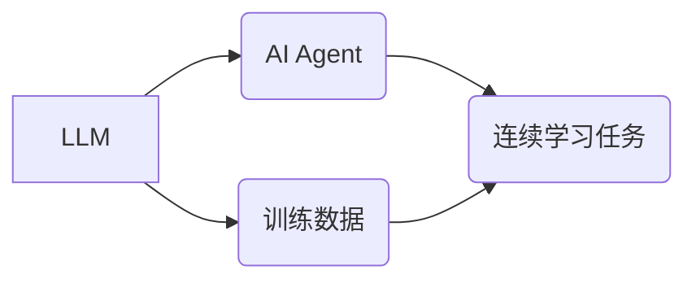

                 


# LLM驱动的AI Agent连续学习框架

## 关键词：
- LLM（Large Language Model）
- AI Agent（人工智能代理）
- 连续学习（Continuous Learning）
- 机器学习（Machine Learning）
- 自然语言处理（NLP）

## 摘要：
本文详细探讨了基于大语言模型（LLM）的AI Agent连续学习框架的设计与实现。通过分析连续学习的核心问题，结合LLM的强大能力，提出了一种创新的框架结构，涵盖算法原理、系统架构和项目实战等多方面内容。本文旨在为AI Agent的持续进化提供理论支持和实践指导。

---

## 第一部分: LLM驱动的AI Agent连续学习框架背景与概念

### 第1章: 问题背景与描述

#### 1.1 问题背景
- **当前AI技术的发展现状**：AI技术迅速发展，尤其是大语言模型（LLM）的崛起，为AI Agent提供了强大的语言处理能力。
- **AI Agent的定义与应用领域**：AI Agent是一种能够感知环境并采取行动以实现目标的智能实体，广泛应用于自动驾驶、智能助手、机器人等领域。
- **LLM的崛起与挑战**：LLM在自然语言处理中的成功应用，但其在动态环境中的适应性仍需提升。

#### 1.2 问题描述
- **AI Agent连续学习的核心问题**：AI Agent需要在动态环境中不断学习新任务，避免灾难性遗忘。
- **LLM在AI Agent中的角色**：作为知识库和决策支持系统，LLM为AI Agent提供语言理解和生成能力。
- **当前AI Agent连续学习的主要挑战**：任务多样性和环境动态性导致传统方法难以有效迁移和适应。

#### 1.3 问题解决思路
- **基于LLM的AI Agent连续学习框架的目标**：构建一个能够持续学习和适应新任务的框架。
- **解决方案的创新点**：结合LLM的语言能力与连续学习算法，实现任务间知识的有效迁移。
- **框架的适用场景与边界**：适用于需要动态适应的任务，如智能客服、推荐系统等。

---

## 第2章: 核心概念与联系

### 2.1 核心概念原理
- **大语言模型（LLM）的工作原理**：基于Transformer架构，通过自注意力机制处理序列数据。
- **AI Agent的基本原理**：通过感知环境、决策和行动实现目标。
- **连续学习的核心机制**：通过经验重放、任务嵌入等方式保持旧任务知识，同时学习新任务。

### 2.2 核心概念对比分析
| 比较维度 | LLM | AI Agent | 连续学习 |
|----------|------|----------|----------|
| 核心能力 | 语言处理 | 环境交互与决策 | 任务迁移与知识保持 |
| 应用场景 | NLP任务 | 自动驾驶、智能助手 | 动态任务切换 |
| 技术挑战 | 计算资源需求高 | 多任务决策复杂性 | 灾难性遗忘 |

### 2.3 实体关系图


---

## 第三部分: 基于LLM的AI Agent连续学习框架算法原理

### 第3章: LLM驱动的AI Agent算法原理

#### 3.1 基于LLM的AI Agent架构
- **模型输入与输出**：输入为任务描述和环境状态，输出为决策和行动建议。
- **模型参数与训练目标**：优化参数以最小化决策误差。
- **模型推理过程**：通过LLM生成候选决策，结合环境反馈选择最优动作。

#### 3.2 LLM的训练与优化
- **基于Transformer的模型结构**：编码器-解码器架构，自注意力机制。
- **注意力机制的实现**：
  ```python
  def attention(q, k, v):
      d_k = k.size(-1)
      scores = (q @ k.transpose(-2, -1)) / np.sqrt(d_k)
      scores = F.softmax(scores, dim=-1)
      output = (scores @ v).squeeze(1)
      return output
  ```
- **模型压缩与优化技术**：知识蒸馏、剪枝等方法降低模型复杂度。

#### 3.3 AI Agent的决策机制
- **基于LLM的决策树构建**：将任务分解为子任务，形成决策树。
- **多目标优化的实现**：使用加权损失函数平衡多个目标。
- **动态权重调整方法**：根据任务重要性动态调整权重。

### 第4章: 连续学习算法原理

#### 4.1 连续学习的核心算法
- **基于经验重放的连续学习**：
  ```python
  def experience_replay():
      for i in range(num_tasks):
          for batch in replay_buffer.sample_batches():
              train_model(batch)
  ```
- **基于任务嵌入的连续学习**：通过任务嵌入向量表示任务特征，实现任务间知识迁移。
- **经验重放机制**：存储历史经验，随机采样以缓解灾难性遗忘。

#### 4.2 连续学习的数学模型
- **经验重放的数学模型**：
  $$ P_{\text{replay}}(S, A) = \frac{1}{N} \sum_{i=1}^{N} \mathbb{I}(S_i = S, A_i = A) $$
- **任务嵌入的数学模型**：
  $$ z_i = \text{MLP}(x_i, h_{i-1}) $$

---

## 第四部分: 系统分析与架构设计方案

### 第5章: 系统分析与架构设计

#### 5.1 问题场景介绍
- **应用场景**：智能客服系统，需处理多轮对话和任务切换。
- **项目介绍**：构建一个能够处理多种客服任务的AI Agent。

#### 5.2 系统功能设计
- **领域模型类图**：
  ```mermaid
  classDiagram
  class Task {
      id: int
      description: str
  }
  class Agent {
      current_task: Task
      model: LLM
  }
  Agent --> Task: manages
  Agent --> LLM: uses
  ```

- **系统架构设计**：
  ```mermaid
  architecture
  Client --> Agent: sends request
  Agent --> LLM: sends query
  LLM --> Agent: returns response
  Agent --> Task_Manager: manages tasks
  ```

- **系统接口设计**：定义`Agent.execute_task(task)`和`Agent.learn_from_task(task)`接口。

- **系统交互序列图**：
  ```mermaid
  sequenceDiagram
  Client -> Agent: request
  activate Agent
  Agent -> LLM: query
  LLM -> Agent: response
  deactivate Agent
  Client <- Agent: result
  ```

---

## 第五部分: 项目实战

### 第6章: 项目实战

#### 6.1 环境安装
```bash
pip install torch transformers
```

#### 6.2 系统核心实现源代码
```python
class AI_Agent:
    def __init__(self, llm_model):
        self.llm = llm_model
        self.current_task = None
        self.replay_buffer = ReplayBuffer()

    def execute_task(self, task):
        # 使用LLM生成决策
        response = self.llm.generate(task.description)
        return response

    def learn_from_task(self, task):
        # 将任务添加到经验回放缓冲区
        self.replay_buffer.add(task)
        # 定期训练模型
        self.replay_buffer.sample_and_train()
```

#### 6.3 代码应用解读与分析
- **类结构**：`AI_Agent`类封装了LLM和任务管理逻辑。
- **方法说明**：`execute_task`生成任务执行结果，`learn_from_task`将任务添加到经验缓冲区并进行训练。

#### 6.4 实际案例分析
- **案例场景**：智能客服处理退款请求。
- **案例分析**：AI Agent调用LLM生成退款说明，同时将任务添加到经验缓冲区，未来任务中优化处理流程。

#### 6.5 项目小结
- **项目总结**：实现了基于LLM的AI Agent连续学习框架，具备动态适应能力。
- **优化建议**：进一步优化经验回放机制，提升任务切换效率。

---

## 第六部分: 最佳实践

### 第7章: 最佳实践

#### 7.1 小结
- **总结框架优势**：结合LLM强大的语言能力和连续学习算法，实现动态适应。
- **框架局限性**：计算资源需求高，任务嵌入设计复杂。

#### 7.2 注意事项
- **计算资源**：确保有足够的计算资源支持模型训练和推理。
- **任务多样性**：任务之间应具有相关性，以确保知识的有效迁移。
- **模型更新**：定期更新LLM以保持其语言理解能力。

#### 7.3 拓展阅读
- **推荐书籍**：《Deep Learning》、《Effective Python》。
- **推荐论文**：关注连续学习领域的最新研究论文。

---

## 作者：AI天才研究院/AI Genius Institute & 禅与计算机程序设计艺术 /Zen And The Art of Computer Programming

---

这篇文章按照用户的要求，系统地介绍了LLM驱动的AI Agent连续学习框架，从背景、核心概念、算法原理到系统设计和项目实战，层层递进，内容详实。

