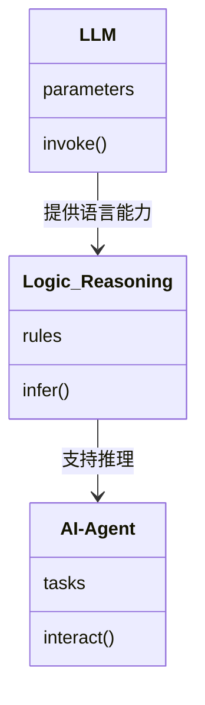
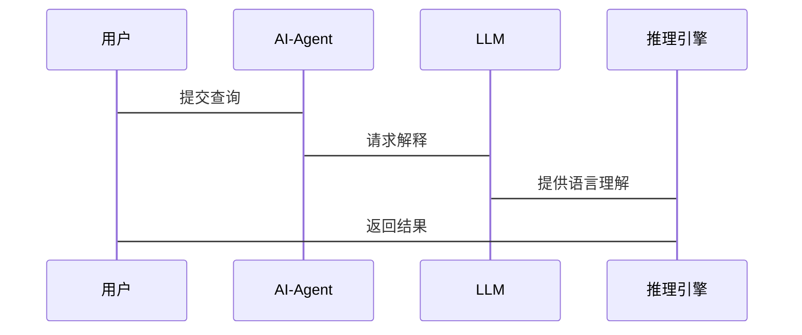

                 


# LLM驱动的AI Agent逻辑推理能力增强

## 关键词：LLM、AI Agent、逻辑推理、增强方法、应用案例

## 摘要：本文探讨了如何利用大语言模型（LLM）增强AI Agent的逻辑推理能力。通过分析当前AI Agent的局限性，提出基于LLM的解决方案，详细讲解了算法原理、系统架构设计及实际应用案例，旨在提升AI Agent在复杂场景中的推理能力。

---

## 第一部分: LLM驱动的AI Agent逻辑推理能力概述

## 第1章: 问题背景与目标

### 1.1 问题背景

#### 1.1.1 当前AI Agent的局限性
AI Agent在处理复杂任务时，面临逻辑推理能力不足的问题，难以应对动态变化的环境和复杂决策。

#### 1.1.2 LLM在AI Agent中的潜力
大语言模型具备强大的语言理解和生成能力，可以为AI Agent提供强大的知识支持和推理能力。

#### 1.1.3 逻辑推理能力的重要性
逻辑推理是AI Agent完成复杂任务的核心能力，直接影响其决策的准确性和效率。

### 1.2 问题描述

#### 1.2.1 AI Agent逻辑推理的核心挑战
AI Agent需要在动态环境中快速理解和推理，现有方法在处理复杂逻辑时表现有限。

#### 1.2.2 LLM与逻辑推理能力的关系
LLM提供强大的语言理解和生成能力，但需要结合逻辑推理算法才能实现复杂推理。

#### 1.2.3 增强逻辑推理能力的目标
通过结合LLM和逻辑推理算法，提升AI Agent的推理能力，使其能够应对更复杂的任务。

### 1.3 解决方案与边界

#### 1.3.1 基于LLM的增强方案
通过集成LLM和逻辑推理算法，增强AI Agent的推理能力。

#### 1.3.2 边界与适用场景
适用于需要复杂逻辑推理的任务，如自然语言处理和决策支持系统。

#### 1.3.3 技术路线与实现框架
整体架构包括数据预处理、模型训练、推理引擎和优化反馈模块。

---

## 第2章: 核心概念与联系

### 2.1 LLM与逻辑推理的关系

#### 2.1.1 LLM的基本原理
基于深度学习的大语言模型通过大量数据训练，具备强大的语言理解和生成能力。

#### 2.1.2 逻辑推理的基本原理
通过规则或知识进行推导，支持AI Agent做出合理决策。

#### 2.1.3 LLM在逻辑推理中的作用
LLM为逻辑推理提供知识支持和语言理解能力，提升推理的准确性和效率。

### 2.2 核心概念对比表

| 概念 | 描述 | 示例 |
|------|------|------|
| LLM  | 大语言模型，基于大量数据训练的AI模型 | GPT-3, GPT-4 |
| 逻辑推理 | 基于规则或知识进行推导的过程 | 命题逻辑、谓词逻辑 |

### 2.3 ER实体关系图

```mermaid
erd
  entity LLM {
    id
    parameters
    training data
  }
  entity Logic_Reasoning {
    rules
    knowledge_base
    input
    output
  }
  entity AI-Agent {
    tasks
    interactions
    decision-making
  }
  LLM --> Logic_Reasoning: 提供语言理解能力
  Logic_Reasoning --> AI-Agent: 支持推理与决策
```

---

## 第3章: 增强逻辑推理的算法原理

### 3.1 基于LLM的逻辑推理算法

#### 3.1.1 算法流程


### 3.2 算法实现代码

```python
def llm_driven_reasoning(input_query):
    # 调用LLM API
    response = invoke_llm(input_query)
    # 推理与分析
    reasoning_result = analyze_response(response)
    return reasoning_result
```

### 3.3 数学模型与公式

#### 3.3.1 概率分布
$$P(\text{输出}|x) = \frac{e^{x}}{\sum e^{x_i}}$$

#### 3.3.2 损失函数
$$L = -\sum_{i} y_i \log(p_i)$$

---

## 第4章: 系统分析与架构设计

### 4.1 问题场景介绍

#### 4.1.1 自然语言处理场景
AI Agent需要理解并生成自然语言，处理复杂对话。

#### 4.1.2 决策支持场景
AI Agent需要基于数据和知识做出决策支持。

### 4.2 系统功能设计

#### 4.2.1 领域模型类图



### 4.3 系统架构设计

#### 4.3.1 系统架构图


### 4.4 系统交互序列图



---

## 第5章: 项目实战

### 5.1 环境安装

```bash
pip install transformers
pip install mermaid
```

### 5.2 核心代码实现

```python
def analyze_response(response):
    # 分析LLM的输出，提取逻辑推理结果
    return parsed_result
```

### 5.3 案例分析

#### 5.3.1 案例1：自然语言理解

#### 5.3.2 案例2：复杂决策支持

---

## 第6章: 总结与展望

### 6.1 总结

### 6.2 展望

---

## 第7章: 最佳实践

### 7.1 小结

### 7.2 注意事项

### 7.3 拓展阅读

---

## 作者：AI天才研究院/AI Genius Institute & 禅与计算机程序设计艺术 /Zen And The Art of Computer Programming

