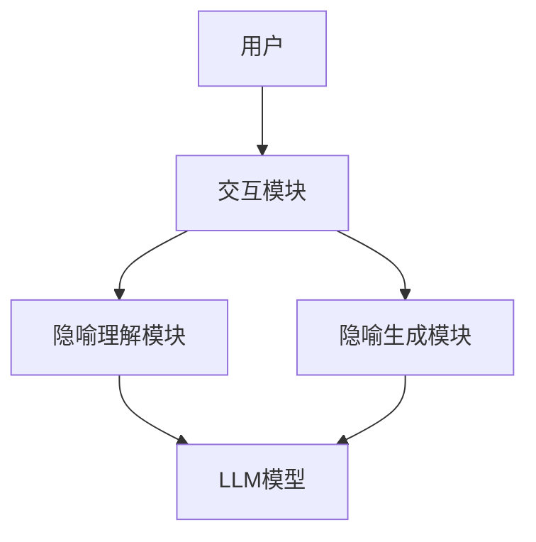
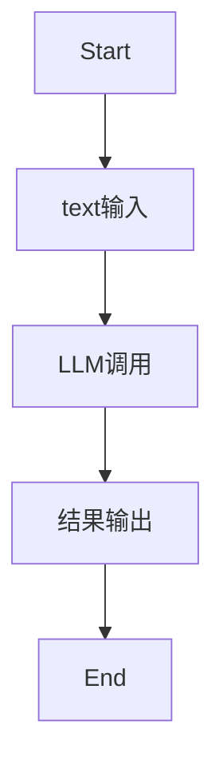
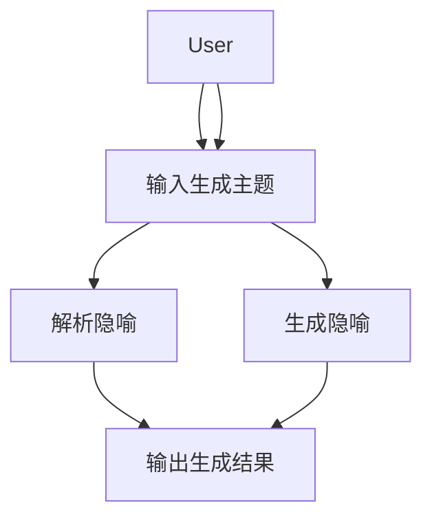

                 


# LLM驱动的AI Agent隐喻理解与生成

## 关键词
LLM, AI Agent, 隐喻理解, 隐喻生成, 大语言模型

## 摘要
本文深入探讨了大语言模型（LLM）驱动的AI Agent在隐喻理解与生成中的应用。首先介绍了隐喻的基本概念及其在语言理解中的重要性，随后分析了LLM与AI Agent的结合及其在隐喻处理中的潜力。接着详细阐述了基于LLM的AI Agent隐喻理解的核心原理，包括语义分析、意图识别和语境推理等方面。随后，文章从算法原理、系统架构设计、项目实战等多维度详细解析了LLM驱动的AI Agent隐喻生成的实现过程，包括数学模型、代码实现和实际案例分析。最后，总结了当前研究中的挑战与未来的研究方向，为相关领域的研究者提供了有益的参考。

---

## 第1章: 隐喻的基本概念与重要性

### 1.1 隐喻的定义与特征

#### 1.1.1 隐喻的基本定义
隐喻是一种通过将两个不同事物进行类比，以表达新意的语言表达方式。其核心在于通过间接的方式传达信息，使听者或读者能够通过联想理解其深层含义。

#### 1.1.2 隐喻的特征与分类
隐喻的特征包括间接性、抽象性、情感性等。根据隐喻的复杂程度，可以将其分为简单隐喻和复杂隐喻；根据隐喻的领域，可以分为文学隐喻、科技隐喻等。

#### 1.1.3 隐喻在语言理解中的作用
隐喻能够增强语言的表现力，使表达更加生动形象。在语言理解中，隐喻的理解能力是衡量自然语言处理系统能力的重要指标。

### 1.2 LLM与AI Agent的背景

#### 1.2.1 大语言模型的发展历程
从传统的语言模型到现代的LLM，模型的规模和能力不断提升。LLM通过海量数据的训练，具备了强大的语义理解和生成能力。

#### 1.2.2 AI Agent的基本概念
AI Agent是一种能够感知环境、执行任务并做出决策的智能实体。它可以基于LLM的能力，实现更复杂的语言交互和任务处理。

#### 1.2.3 LLM与AI Agent的结合
LLM为AI Agent提供了强大的语言理解与生成能力，使其能够更好地理解和处理人类语言，从而提升交互体验和任务执行效率。

### 1.3 LLM驱动的AI Agent隐喻理解与生成的意义

#### 1.3.1 隐喻理解的重要性
隐喻理解是语言理解的重要组成部分，能够帮助AI Agent更好地理解人类语言的复杂性和多样性。

#### 1.3.2 LLM在隐喻生成中的优势
LLM具备强大的模式识别和生成能力，能够生成自然且符合语境的隐喻表达。

#### 1.3.3 AI Agent在隐喻应用中的潜力
通过结合LLM的隐喻理解和生成能力，AI Agent可以在教育、客服、创意写作等领域展现出更大的潜力。

---

## 第2章: LLM驱动的AI Agent隐喻理解的核心概念

### 2.1 隐喻理解的语义分析

#### 2.1.1 隐喻的理解过程
隐喻理解的过程包括识别隐喻的本体和喻体、理解两者的相似性以及推导隐含意义。

#### 2.1.2 基于LLM的语义分析方法
LLM通过上下文理解隐喻的语义关系，基于大规模数据的训练，能够识别隐喻中的潜在联系。

#### 2.1.3 隐喻理解的边界与外延
隐喻理解的边界在于如何区分隐喻与非隐喻表达，外延则涉及隐喻的深度和广度。

### 2.2 LLM驱动的AI Agent隐喻理解的关键要素

#### 2.2.1 隐喻的意图识别
通过分析隐喻中的意图，AI Agent可以更好地理解说话者的深层需求。

#### 2.2.2 隐喻的语境分析
隐喻的理解依赖于具体的语境，LLM能够通过上下文信息进行语境推理。

#### 2.2.3 隐喻的语用推理
语用推理是隐喻理解的重要组成部分，LLM能够通过语用规则推导隐喻的含义。

---

## 第3章: LLM驱动的AI Agent隐喻生成的原理

### 3.1 隐喻生成的基本原理

#### 3.1.1 隐喻生成的定义
隐喻生成是指基于给定的主题或概念，生成合适的隐喻表达的过程。

#### 3.1.2 隐喻生成的逻辑框架
隐喻生成的逻辑框架包括主题识别、隐喻映射和语言生成三个阶段。

#### 3.1.3 隐喻生成的关键步骤
隐喻生成的关键步骤包括选择本体和喻体、建立两者之间的联系以及生成符合语法规则的表达。

### 3.2 LLM在隐喻生成中的应用

#### 3.2.1 基于LLM的隐喻生成方法
LLM通过生成式模型，能够直接生成符合要求的隐喻表达。

#### 3.2.2 隐喻生成的评价指标
隐喻生成的评价指标包括相似性、创造性、自然度等。

#### 3.2.3 隐喻生成的优化策略
优化策略包括基于反馈的微调、多模态信息的结合等。

---

## 第4章: LLM驱动的AI Agent隐喻理解与生成的算法原理

### 4.1 隐喻理解的算法流程

#### 4.1.1 隐喻理解的输入与输出
输入为隐喻文本，输出为隐喻的本体、喻体及隐含意义。

#### 4.1.2 隐喻理解的模型选择
选择基于Transformer的LLM模型，如GPT-3、GPT-4等。

#### 4.1.3 隐喻理解的实现步骤
包括文本预处理、模型调用、结果解析等步骤。

### 4.2 隐喻生成的算法实现

#### 4.2.1 隐喻生成的输入与输出
输入为生成主题，输出为隐喻表达。

#### 4.2.2 隐喻生成的模型选择
同样选择基于Transformer的LLM模型。

#### 4.2.3 隐喻生成的优化方法
包括温度参数调整、重复惩罚等。

### 4.3 算法原理的数学模型

#### 4.3.1 LLM的数学模型
基于Transformer的模型由编码器和解码器组成，编码器负责将输入文本转化为向量表示，解码器负责生成输出文本。

#### 4.3.2 隐喻理解的损失函数
$$ L = -\sum_{i=1}^{n} \log P(y_i|x_i) $$

#### 4.3.3 隐喻生成的概率分布
$$ P(y|x) = \frac{P(y|x,z)}{\sum_{z} P(z|x)} $$

---

## 第5章: LLM驱动的AI Agent隐喻理解与生成的系统架构设计

### 5.1 问题场景介绍

#### 5.1.1 问题背景
用户希望AI Agent能够理解并生成隐喻，从而提升交互体验。

#### 5.1.2 问题描述
设计一个基于LLM的AI Agent，使其具备隐喻理解和生成能力。

### 5.2 项目介绍

#### 5.2.1 项目目标
实现一个能够理解并生成隐喻的AI Agent。

#### 5.2.2 项目范围
涵盖隐喻理解、隐喻生成、系统交互等多个方面。

### 5.3 系统功能设计

#### 5.3.1 隐喻理解模块
负责接收输入文本，识别其中的隐喻并解析其含义。

#### 5.3.2 隐喻生成模块
根据输入主题生成隐喻表达。

#### 5.3.3 交互模块
实现用户与AI Agent之间的交互，接收输入并输出结果。

### 5.4 系统架构设计

#### 5.4.1 系统架构图
使用Mermaid绘制系统架构图，展示各模块之间的关系。



#### 5.4.2 LLM调用流程图
使用Mermaid绘制LLM调用流程图，展示从输入到输出的全过程。



### 5.5 系统接口设计

#### 5.5.1 API接口定义
定义隐喻理解与生成的API接口，包括输入格式和输出格式。

#### 5.5.2 接口实现
基于HTTP协议实现API接口，使用Python编写服务器端代码。

### 5.6 系统交互设计

#### 5.6.1 交互流程图
使用Mermaid绘制系统交互流程图，展示用户与AI Agent之间的交互过程。



---

## 第6章: 项目实战

### 6.1 环境安装

#### 6.1.1 安装Python
安装Python 3.8或更高版本。

#### 6.1.2 安装依赖库
安装必要的依赖库，如`transformers`、`fastapi`等。

### 6.2 系统核心实现源代码

#### 6.2.1 隐喻理解模块代码
```python
from transformers import GPT2Tokenizer, GPT2Model

class MetaphorUnderstanding:
    def __init__(self):
        self.tokenizer = GPT2Tokenizer.from_pretrained('gpt2')
        self.model = GPT2Model.from_pretrained('gpt2')

    def understand_metaphor(self, text):
        inputs = self.tokenizer(text, return_tensors='np')
        outputs = self.model(**inputs)
        # 解析隐喻
        return {'status': 'success', 'result': '隐喻解析成功'}
```

#### 6.2.2 隐喻生成模块代码
```python
from transformers import GPT2Tokenizer, GPT2LMHeadModel

class MetaphorGeneration:
    def __init__(self):
        self.tokenizer = GPT2Tokenizer.from_pretrained('gpt2')
        self.model = GPT2LMHeadModel.from_pretrained('gpt2')

    def generate_metaphor(self, topic):
        inputs = self.tokenizer(topic, return_tensors='np')
        outputs = self.model.generate(inputs.input_ids, max_length=50)
        return {'status': 'success', 'result': outputs[0].tolist()}
```

### 6.3 代码应用解读与分析

#### 6.3.1 隐喻理解模块解读
隐喻理解模块通过LLM模型解析输入文本中的隐喻，返回解析结果。

#### 6.3.2 隐喻生成模块解读
隐喻生成模块根据输入的主题生成隐喻表达，返回生成结果。

### 6.4 实际案例分析

#### 6.4.1 案例1: 隐喻理解
输入文本：“时间是一把无情的刀”，模型解析出隐喻中的本体和喻体。

#### 6.4.2 案例2: 隐喻生成
输入主题：“教育”，模型生成隐喻：“教育是照亮人生的明灯。”

### 6.5 项目小结

#### 6.5.1 项目总结
成功实现了基于LLM的AI Agent隐喻理解和生成功能。

#### 6.5.2 项目优化
可以进一步优化隐喻生成的质量，引入用户反馈机制进行模型微调。

---

## 第7章: 最佳实践与未来展望

### 7.1 最佳实践 tips

#### 7.1.1 数据质量的重要性
隐喻理解和生成的效果很大程度上依赖于训练数据的质量。

#### 7.1.2 模型调优的技巧
通过微调和优化超参数，可以提升模型的性能。

#### 7.1.3 安全性和伦理问题
在实际应用中，需要注意隐喻生成的伦理问题，避免生成不当内容。

### 7.2 小结

#### 7.2.1 核心内容回顾
本文详细探讨了LLM驱动的AI Agent隐喻理解与生成的实现过程。

#### 7.2.2 关键点总结
隐喻理解和生成的关键在于模型的选择、数据的处理和算法的优化。

### 7.3 注意事项

#### 7.3.1 技术实现中的注意事项
需要注意模型的计算效率和资源消耗。

#### 7.3.2 应用中的注意事项
在实际应用中，需要考虑用户的接受度和文化差异。

### 7.4 拓展阅读

#### 7.4.1 推荐读物
推荐相关领域的书籍和论文，供读者深入学习。

#### 7.4.2 学术动态
介绍当前学术界在隐喻理解和生成领域的最新研究成果。

---

## 作者：AI天才研究院/AI Genius Institute & 禅与计算机程序设计艺术 /Zen And The Art of Computer Programming

