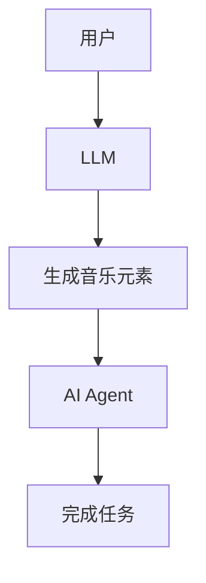
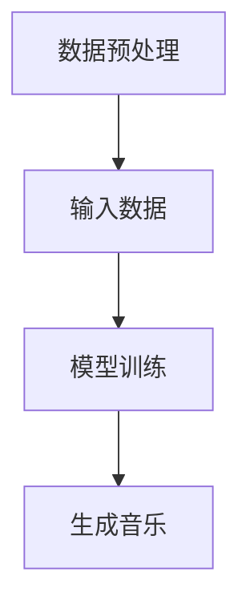
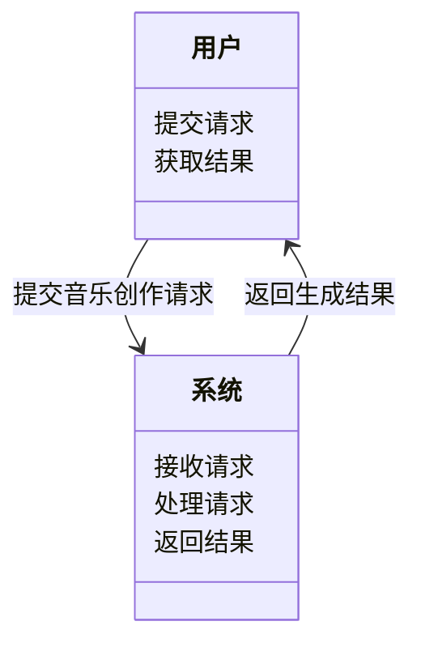
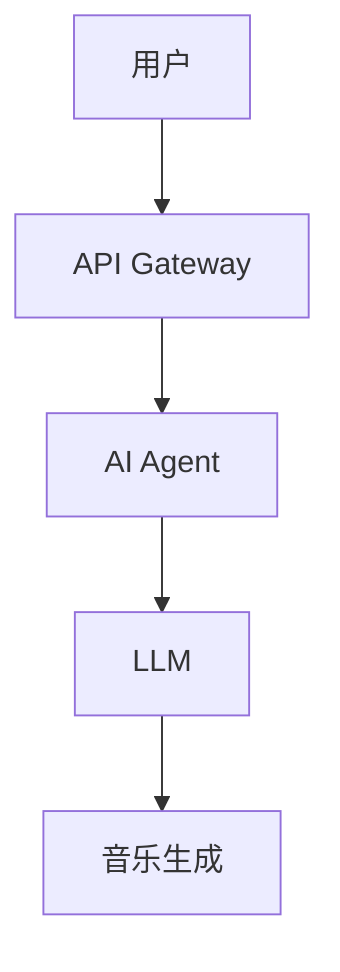
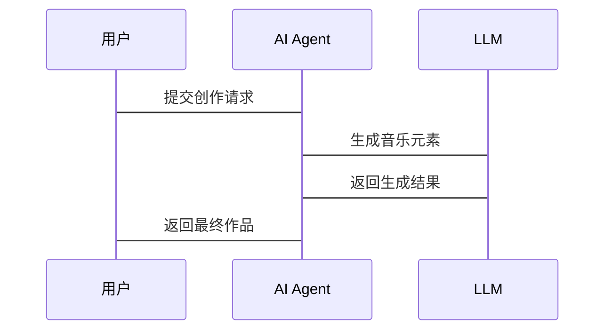

                 


# LLM驱动的AI Agent音乐创作与分析

## 关键词：
- LLM（大语言模型）
- AI Agent（人工智能代理）
- 音乐创作
- 音乐分析
- 生成式AI

## 摘要：
本文探讨了大语言模型（LLM）驱动的人工智能代理（AI Agent）在音乐创作与分析中的应用。通过详细分析LLM与AI Agent的核心原理、算法机制、系统架构，结合实际项目案例，展示如何利用这些技术提升音乐创作与分析的效率和质量。文章内容涵盖背景介绍、核心概念、算法原理、系统架构设计、项目实战及最佳实践，为读者提供全面的技术解析。

---

## 第1章：背景介绍

### 1.1 核心概念术语说明

- **大语言模型（LLM, Large Language Model）**：基于大量数据训练的深度学习模型，能够理解并生成人类语言文本，代表有GPT系列。
- **AI Agent（人工智能代理）**：具备自主决策能力，能够执行特定任务的智能体，通常通过自然语言处理与用户交互。
- **音乐创作与分析**：包括音乐生成、旋律创作、和声编排、曲式分析等功能。

### 1.2 问题背景与描述

音乐创作与分析是人类文化的重要组成部分。传统创作依赖人类音乐家的经验与灵感，而音乐分析则需要专业知识。随着AI技术的发展，利用LLM驱动的AI Agent辅助音乐创作与分析，能够提高创作效率，拓展创作可能性。

### 1.3 LLM驱动AI Agent的优势

- **高效性**：快速生成音乐片段，辅助创作。
- **可扩展性**：支持多种音乐风格与复杂分析任务。
- **智能化**：通过自然语言交互，理解用户需求，提供个性化建议。

### 1.4 问题解决与边界

通过LLM驱动的AI Agent，解决传统音乐创作与分析中的效率低下、资源限制问题。边界包括生成音乐的质量、模型的泛化能力等。

### 1.5 核心概念结构

- **输入**：用户需求（如“创作一首流行歌曲”）
- **处理**：LLM生成音乐元素（旋律、歌词）
- **输出**：AI Agent辅助完成创作或分析任务

---

## 第2章：核心概念与原理

### 2.1 LLM与AI Agent的工作原理

- **LLM**：基于Transformer架构，通过自注意力机制处理序列数据，生成文本或音乐符号。
- **AI Agent**：通过自然语言处理理解用户指令，调用LLM生成音乐内容。

### 2.2 核心概念对比

| 概念 | LLM | AI Agent |
|------|-----|----------|
| 功能 | 生成文本/音乐 | 执行任务 |
| 输入 | 文本/音乐指令 | 用户需求 |
| 输出 | 音乐元素 | 完成任务 |

### 2.3 实体关系图（Mermaid）



---

## 第3章：算法原理

### 3.1 模型训练流程（Mermaid）



### 3.2 模型结构

- **编码器-解码器架构**：编码器理解输入，解码器生成音乐符号。
- **自注意力机制**：捕捉音乐元素间的依赖关系。

### 3.3 数学公式

- **损失函数**：$$L = -\sum_{i=1}^{n} \log p(x_i)$$
- **生成策略**：$$p(x_{i+1}|x_{\leq i}) = \text{softmax}(QK^T/V)$$

---

## 第4章：系统架构设计

### 4.1 项目介绍

开发一个音乐创作与分析系统，结合LLM与AI Agent，提供创作辅助与分析功能。

### 4.2 系统功能设计（Mermaid类图）



### 4.3 系统架构设计（Mermaid架构图）



### 4.4 接口设计与交互（Mermaid序列图）



---

## 第5章：项目实战

### 5.1 环境配置

- **Python**：3.8+
- **框架**：TensorFlow/PyTorch
- **依赖**： transformers库

### 5.2 核心代码实现

```python
from transformers import GPT2LMHeadModel, GPT2Tokenizer

tokenizer = GPT2Tokenizer.from_pretrained('gpt2')
model = GPT2LMHeadModel.from_pretrained('gpt2')

def generate_music_element(prompt):
    inputs = tokenizer.encode(prompt, return_tensors='np')
    outputs = model.generate(inputs, max_length=50, temperature=0.7)
    return tokenizer.decode(outputs[0], skip_special_tokens=True)
```

### 5.3 代码解读

- **模型加载**：加载预训练的音乐生成模型。
- **生成函数**：根据提示生成音乐元素，调整温度参数控制生成多样性。

### 5.4 实际案例分析

- **案例**：生成流行歌曲的副歌部分。
- **提示**：`"写一首流行歌曲的副歌，主题是爱情"`
- **输出**：生成符合要求的音乐片段。

### 5.5 项目小结

通过代码实现，展示了如何利用LLM驱动AI Agent进行音乐创作，强调了模型调优和接口设计的重要性。

---

## 第6章：最佳实践与总结

### 6.1 小结

本文详细探讨了LLM驱动AI Agent在音乐创作与分析中的应用，从理论到实践，为读者提供了全面的技术解析。

### 6.2 注意事项

- 数据质量：确保训练数据的多样性和代表性。
- 模型调优：调整超参数以优化生成效果。
- 交互设计：确保用户友好的界面与交互流程。

### 6.3 拓展阅读

- 深入学习音乐信息检索与生成技术。
- 探索多模态AI在音乐中的应用。

---

## 作者：AI天才研究院 & 禅与计算机程序设计艺术

---

以上内容涵盖了从背景介绍到项目实战的各个方面，结合理论与实践，为读者提供了深入的技术解析。

