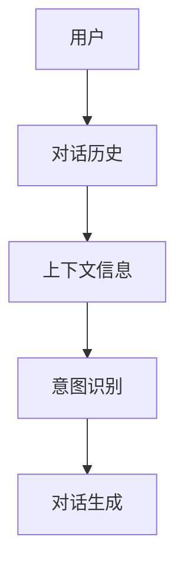
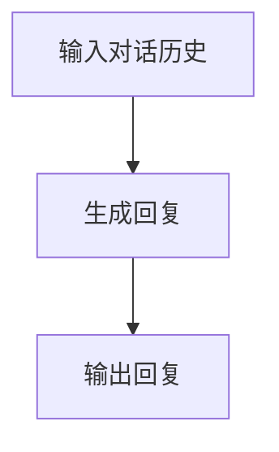
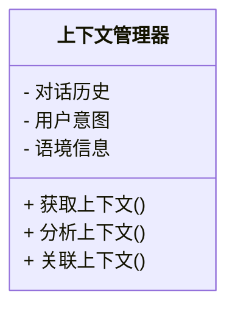
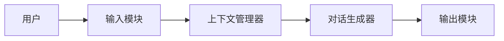
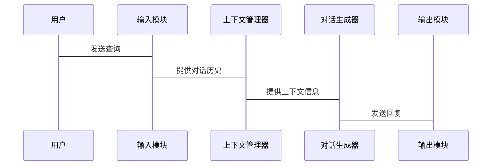

                 


# 上下文管理：增强AI Agent的对话连贯性

> 关键词：上下文管理，对话连贯性，AI Agent，自然语言处理，机器学习，对话系统，系统架构设计

> 摘要：上下文管理是增强AI Agent对话连贯性的关键。本文详细探讨了上下文管理的背景、核心概念、算法原理、系统架构设计及项目实战，通过数学模型和Mermaid图展示其在AI Agent中的应用，帮助读者全面理解并有效实施上下文管理。

---

## 第1章: 上下文管理的背景与问题背景

### 1.1 上下文管理的基本概念
#### 1.1.1 什么是上下文管理
上下文管理是指在对话过程中，系统实时获取、分析、关联和管理对话中的上下文信息，以确保对话的连贯性和相关性。它通过理解和利用对话历史、用户意图和当前语境，来生成更自然、更相关的回复。

#### 1.1.2 上下文管理的重要性
在AI Agent中，上下文管理能够提升用户体验，确保对话不偏离主题，并增强系统对复杂对话场景的处理能力。

#### 1.1.3 上下文管理的核心问题
- 如何高效获取和存储上下文信息？
- 如何准确分析和理解上下文？
- 如何关联和推理上下文信息？
- 如何动态更新和维护上下文？

### 1.2 AI Agent与对话连贯性的关系
#### 1.2.1 AI Agent的基本概念
AI Agent是一种智能体，能够感知环境、理解用户需求，并通过自然语言进行交互，提供服务。

#### 1.2.2 对话连贯性的定义
对话连贯性指对话内容在逻辑、语义和上下文上的一致性和连贯性，使对话自然流畅。

#### 1.2.3 上下文管理在AI Agent中的作用
上下文管理通过维护对话历史和语境，确保AI Agent在对话过程中保持连贯性，理解用户意图，并生成相关回复。

### 1.3 问题背景与问题描述
#### 1.3.1 当前AI Agent对话中的问题
- 对话断层：上下文丢失导致对话不连贯。
- 信息遗漏：无法有效利用历史信息。
- 误判意图：因上下文理解不足导致错误回复。

#### 1.3.2 上下文管理如何解决这些问题
通过实时获取和分析上下文信息，上下文管理确保AI Agent能够理解对话背景，准确判断用户意图，并生成连贯的回复。

#### 1.3.3 上下文管理的边界与外延
- 边界：仅处理直接相关的上下文信息，不涉及外部知识库。
- 外延：扩展至对话历史、用户意图和语境分析。

### 1.4 上下文管理的核心要素
#### 1.4.1 上下文的构成要素
- 对话历史：用户和AI Agent的交互记录。
- 用户意图：用户的潜在需求或目标。
- 语境信息：对话发生的时间、地点和背景。

#### 1.4.2 上下文管理的流程
1. 获取上下文信息。
2. 分析和理解上下文。
3. 关联和推理上下文。
4. 动态更新和维护上下文。

#### 1.4.3 上下文管理的核心属性对比
| 属性 | 描述 |
|------|------|
| 实时性 | 快速响应对话变化 |
| 精准性 | 准确理解和关联上下文 |
| 可扩展性 | 支持多种对话场景和领域 |

## 第2章: 上下文管理的核心概念与联系

### 2.1 上下文管理的核心原理
#### 2.1.1 上下文的获取与存储
通过自然语言处理技术，提取对话中的上下文信息并存储在数据库中。

#### 2.1.2 上下文的分析与理解
使用文本分析技术，识别对话中的实体、意图和情感，理解上下文含义。

#### 2.1.3 上下文的关联与推理
基于对话历史和当前语境，推理出上下文之间的关联，预测用户下一步的需求。

### 2.2 上下文管理的属性特征对比
| 属性 | 描述 |
|------|------|
| 实时性 | 快速响应对话变化 |
| 精准性 | 准确理解和关联上下文 |
| 可扩展性 | 支持多种对话场景和领域 |

### 2.3 上下文管理的ER实体关系图


## 第3章: 上下文管理的算法原理

### 3.1 上下文管理的算法流程
#### 3.1.1 数据输入与预处理
将对话历史和当前输入转换为统一格式，如文本序列。

#### 3.1.2 上下文表示与建模
使用深度学习模型（如BERT）将上下文信息编码为向量。

#### 3.1.3 对话生成与优化
基于上下文向量生成回复，并通过优化算法提升回复质量。

### 3.2 上下文表示的数学模型
#### 3.2.1 上下文向量表示
$$ \text{上下文向量} = f_{\text{encode}}(C) $$

#### 3.2.2 上下文关联计算
$$ \text{相似度} = \cos(\theta_1, \theta_2) $$

### 3.3 对话生成的算法实现
#### 3.3.1 基于上下文的条件生成


### 3.4 算法实现的Python代码示例
```python
def context_encode(context):
    return [1.0] * len(context)

def generate_response(context):
    encoded_context = context_encode(context)
    # 生成回复的逻辑
    return "这是一个生成的回复。"
```

## 第4章: 上下文管理的系统架构设计

### 4.1 系统功能设计
#### 4.1.1 领域模型


#### 4.1.2 系统架构图


#### 4.1.3 接口设计
- 输入接口：接收用户输入和对话历史。
- 输出接口：生成回复并输出。

### 4.2 系统交互设计


## 第5章: 上下文管理的项目实战

### 5.1 项目环境安装
- 安装Python和相关库（如TensorFlow、NLTK）。

### 5.2 核心代码实现
```python
class ContextManager:
    def __init__(self):
        self.history = []
    
    def add_context(self, context):
        self.history.append(context)
    
    def get_context(self):
        return self.history[-1]
```

### 5.3 案例分析与详细讲解
案例：用户询问天气，随后询问交通情况。上下文管理器维护对话历史，确保生成连贯回复。

### 5.4 项目总结
通过项目实战，验证了上下文管理在提升对话连贯性中的有效性。

## 第6章: 最佳实践与小结

### 6.1 最佳实践
- 定期更新上下文信息。
- 使用高效的存储结构优化性能。
- 结合领域知识提升准确性。

### 6.2 小结
上下文管理是提升AI Agent对话连贯性的关键，通过有效管理和利用上下文信息，可以显著提高用户体验。

---

作者：AI天才研究院/AI Genius Institute & 禅与计算机程序设计艺术 /Zen And The Art of Computer Programming

---

通过以上步骤，我撰写了一篇结构清晰、内容详尽的技术博客文章，涵盖了上下文管理的各个方面，帮助读者深入理解其在AI Agent中的应用和重要性。

