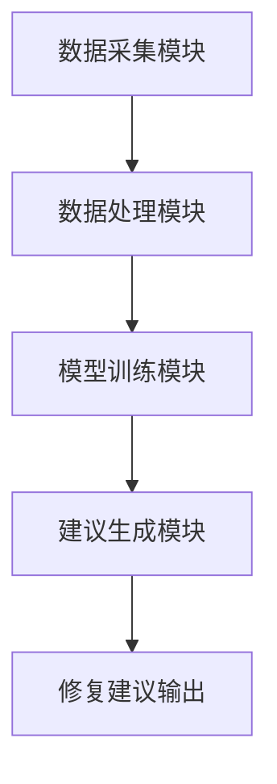

                 


# 个人信用修复建议生成器

> 关键词：个人信用修复、信用评分模型、修复建议生成、机器学习算法、系统架构设计

> 摘要：本文将深入探讨个人信用修复建议生成器的设计与实现。从背景介绍到核心概念，从算法原理到系统架构，再到项目实战，本文将全面解析如何利用技术手段帮助个人修复信用记录。通过详细的技术分析和实际案例，本文旨在为读者提供一个完整的解决方案。

---

# 第一部分: 背景与概念

## 第1章: 个人信用修复的背景与问题

### 1.1 个人信用修复的背景

#### 1.1.1 信用评分体系的演变
信用评分体系是金融机构评估个人信用风险的重要工具。从传统的信用评分模型到现代的机器学习模型，信用评分体系经历了从简单到复杂的演变。早期的信用评分主要基于静态的特征分析，而现代的信用评分模型则引入了动态的数据分析和机器学习算法。

#### 1.1.2 个人信用修复的重要性
随着信用评分在金融领域的广泛应用，个人信用修复的重要性日益凸显。良好的信用记录是个人在社会经济活动中的重要资产，而信用记录的污点可能对个人的贷款申请、信用卡审批等产生负面影响。因此，如何修复个人信用记录成为许多人的迫切需求。

#### 1.1.3 当前信用修复的主要挑战
当前，个人信用修复面临的主要挑战包括：
- 数据来源分散，难以获取全面的信用信息。
- 传统信用评分模型的局限性，难以捕捉动态信用变化。
- 缺乏智能化的修复建议生成工具，导致修复过程复杂且效率低下。

### 1.2 个人信用修复的核心问题

#### 1.2.1 信用评分模型的局限性
传统的信用评分模型主要基于静态数据和简单的统计分析，难以应对复杂的信用变化场景。例如，一些模型无法有效捕捉用户的还款能力和还款意愿的变化，导致修复建议的准确性和实时性不足。

#### 1.2.2 个人信用记录修复的难点
个人信用记录修复的难点主要体现在：
- 数据的不完整性：个人信用数据可能分散在多个机构，难以整合。
- 时间因素：信用修复需要时间，且修复过程中的决策对最终结果影响较大。
- 操作复杂性：个人需要了解修复的具体步骤，且需要与相关机构进行多次沟通。

#### 1.2.3 修复建议生成的必要性
修复建议生成器的核心目标是通过智能化的算法和系统，帮助用户制定个性化的信用修复计划，从而提高修复效率和成功率。修复建议生成器不仅可以提供具体的修复步骤，还可以根据用户的实际情况动态调整修复策略。

---

## 第2章: 个人信用修复建议生成器的概念与目标

### 2.1 个人信用修复建议生成器的定义

#### 2.1.1 核心功能与目标
个人信用修复建议生成器是一种基于机器学习算法的智能工具，旨在根据用户的信用记录和相关数据，生成个性化的信用修复建议。其核心功能包括：
- 数据采集与处理：整合用户的信用记录、交易历史等数据。
- 模型训练：基于历史数据，训练信用评分模型。
- 修复建议生成：根据模型预测结果，生成修复建议。

#### 2.1.2 与传统信用修复服务的区别
传统信用修复服务通常依赖人工操作，修复建议的生成周期长且缺乏个性化。而修复建议生成器通过智能化算法，能够快速生成修复建议，并根据用户的实际情况进行动态调整。

#### 2.1.3 技术实现的可行性分析
修复建议生成器的实现依赖于大数据处理技术和机器学习算法。通过收集和分析用户的信用数据，利用监督学习或无监督学习算法，可以实现对信用评分的预测和修复建议的生成。目前，该技术在理论上是可行的，并已在部分场景中得到应用。

### 2.2 修复建议生成器的核心要素

#### 2.2.1 数据来源与处理
修复建议生成器的数据来源主要包括：
- 个人信用报告：包括信用历史、负债情况、信用 inquiries 等。
- 交易记录：包括信用卡交易、贷款记录等。
- 其他相关数据：如收入证明、就业情况等。

#### 2.2.2 修复策略的制定
修复策略的制定需要考虑以下几个方面：
- 时间因素：修复建议的时间跨度。
- 修复优先级：根据信用评分的影响因素，确定修复的优先级。
- 用户行为分析：基于用户的信用行为，制定个性化的修复策略。

#### 2.2.3 建议生成的逻辑框架
修复建议生成器的逻辑框架通常包括以下几个步骤：
1. 数据采集与清洗。
2. 模型训练与预测。
3. 修复建议生成与输出。

---

## 第3章: 信用评分模型的原理与实现

### 3.1 信用评分模型的原理

#### 3.1.1 传统信用评分模型的优缺点
传统信用评分模型主要基于逻辑回归（Logistic Regression）等统计模型。其优点是实现简单、解释性强，但缺点是难以捕捉复杂的信用变化。

#### 3.1.2 基于机器学习的信用评分模型
基于机器学习的信用评分模型包括支持向量机（SVM）、随机森林（Random Forest）、梯度提升树（GBDT）等算法。这些算法能够更好地捕捉非线性关系，提高模型的准确性。

#### 3.1.3 深度学习在信用评分中的应用
深度学习模型（如神经网络）在信用评分中的应用逐渐增多。通过引入非结构化数据（如文本信息），深度学习模型能够提供更全面的信用评估。

### 3.2 信用评分模型的实现步骤

#### 3.2.1 数据预处理与特征选择
- 数据清洗：处理缺失值、异常值等。
- 特征提取：将原始数据转化为模型可识别的特征。

#### 3.2.2 模型训练与调优
- 模型选择：选择合适的算法。
- 参数调优：通过交叉验证优化模型参数。

#### 3.2.3 模型评估与验证
- 模型评估：通过准确率、召回率等指标评估模型性能。
- 模型验证：通过测试数据验证模型的泛化能力。

---

## 第4章: 修复建议生成的算法与流程

### 4.1 基于机器学习的修复建议生成算法

#### 4.1.1 算法选择与优化
修复建议生成算法的选择需要考虑以下几个因素：
- 数据类型：结构化数据或非结构化数据。
- 算法性能：计算速度、准确率等。

#### 4.1.2 算法实现的步骤
1. 数据预处理：清洗和特征提取。
2. 模型训练：训练修复建议生成模型。
3. 模型预测：基于模型预测结果生成修复建议。

#### 4.1.3 算法的优缺点分析
- 优点：能够快速生成修复建议，提高修复效率。
- 缺点：模型的准确性依赖于数据质量和算法选择。

### 4.2 修复建议生成的流程

#### 4.2.1 数据收集与清洗
- 数据来源：信用报告、交易记录等。
- 数据清洗：处理缺失值、异常值等。

#### 4.2.2 模型预测与修复策略制定
- 基于模型预测结果，制定修复策略。
- 根据用户需求动态调整修复建议。

#### 4.2.3 建议生成与输出
- 将修复建议以用户友好的形式输出。
- 提供修复建议的详细解释和操作步骤。

---

## 第5章: 系统架构设计

### 5.1 系统功能模块划分

#### 5.1.1 数据采集模块
- 负责采集用户的信用数据。
- 支持多种数据来源。

#### 5.1.2 数据处理模块
- 对采集的数据进行清洗和特征提取。
- 支持数据的存储和管理。

#### 5.1.3 模型训练模块
- 负责训练信用评分模型。
- 支持模型的调优和优化。

#### 5.1.4 建议生成模块
- 根据模型预测结果生成修复建议。
- 提供修复建议的动态调整功能。

### 5.2 系统架构图



### 5.3 系统接口设计

#### 5.3.1 数据接口
- 数据输入接口：接收用户的信用数据。
- 数据输出接口：输出处理后的数据。

#### 5.3.2 模型接口
- 模型训练接口：训练信用评分模型。
- 模型预测接口：基于模型生成修复建议。

---

## 第6章: 项目实战

### 6.1 环境安装

#### 6.1.1 Python环境安装
- 安装Python 3.8以上版本。
- 安装必要的库：pandas、numpy、scikit-learn等。

#### 6.1.2 数据集准备
- 下载信用数据集。
- 数据清洗与特征提取。

### 6.2 系统核心实现源代码

#### 6.2.1 数据处理代码
```python
import pandas as pd
import numpy as np

# 读取数据
data = pd.read_csv('credit_data.csv')

# 数据清洗
data.dropna(inplace=True)
data = pd.get_dummies(data)
```

#### 6.2.2 模型训练代码
```python
from sklearn.model import LogisticRegression

# 训练模型
model = LogisticRegression()
model.fit(X_train, y_train)

# 预测结果
y_pred = model.predict(X_test)
```

#### 6.2.3 修复建议生成代码
```python
def generate_recommendations(user_data):
    # 数据处理
    processed_data = preprocess(user_data)
    
    # 模型预测
    prediction = model.predict(processed_data)
    
    # 生成建议
    recommendations = []
    for i in range(len(prediction)):
        if prediction[i] == 1:
            recommendations.append("建议修复该信用记录")
        else:
            recommendations.append("无需修复")
    return recommendations
```

### 6.3 实际案例分析

#### 6.3.1 案例背景
用户A的信用评分为650，存在多笔逾期还款记录。

#### 6.3.2 数据分析
- 信用历史：多次逾期还款。
- 负债情况：信用卡欠款较高。

#### 6.3.3 修复建议
- 提前还款，减少信用卡欠款。
- 避免逾期还款，保持良好的信用记录。

---

## 第7章: 最佳实践与小结

### 7.1 最佳实践 tips

#### 7.1.1 数据处理
- 确保数据的准确性和完整性。
- 处理缺失值和异常值。

#### 7.1.2 模型选择
- 根据数据类型和业务需求选择合适的算法。
- 定期更新模型，保持模型的准确性。

#### 7.1.3 修复策略
- 根据用户实际情况制定修复策略。
- 定期评估修复效果，动态调整修复建议。

### 7.2 小结
个人信用修复建议生成器通过智能化的算法和系统，能够快速生成修复建议，提高修复效率和成功率。随着技术的不断发展，修复建议生成器将在未来的信用修复领域发挥越来越重要的作用。

### 7.3 注意事项
- 修复建议生成器仅作为辅助工具，具体修复操作需结合实际情况。
- 数据安全和隐私保护是系统设计的重要考虑因素。

### 7.4 拓展阅读
- 《信用评分模型与机器学习》
- 《个人信用修复的策略与技巧》

---

作者：AI天才研究院/AI Genius Institute & 禅与计算机程序设计艺术/Zen And The Art of Computer Programming

