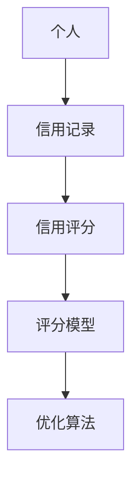
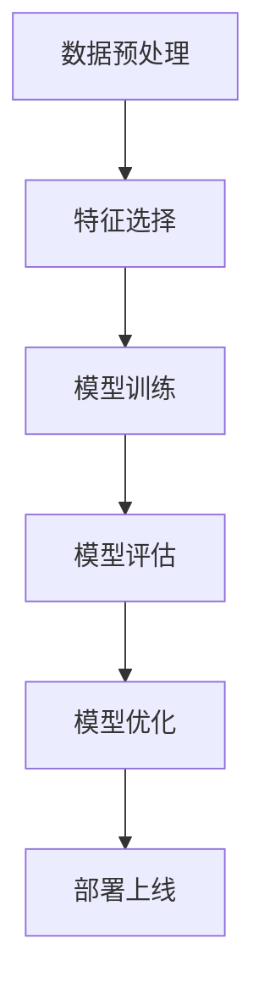
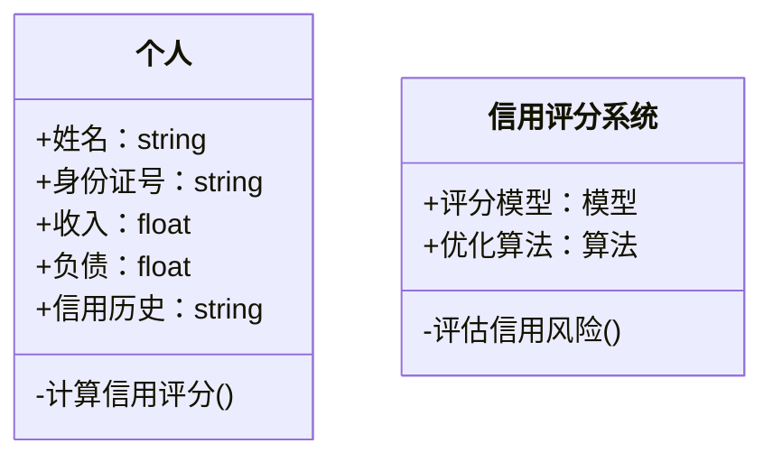
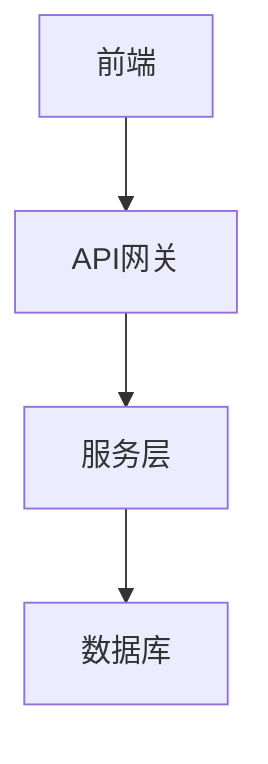

                 


# 个人信用评分系统优化

> 关键词：信用评分系统、评分模型优化、机器学习算法、系统架构设计、项目实战

> 摘要：本文深入探讨了个人信用评分系统优化的核心问题，从背景分析到算法实现，再到系统架构设计，系统性地展示了如何通过优化模型和架构来提升信用评分系统的准确性和效率。文章结合理论与实践，详细讲解了传统评分模型的局限性，分析了基于机器学习的优化算法，并通过实际案例展示了系统优化的实现过程及效果。

---

# 第一部分: 个人信用评分系统概述

## 第1章: 个人信用评分系统背景

### 1.1 个人信用评分系统的定义与作用
个人信用评分系统是通过分析个人的信用历史、财务状况和其他相关数据，量化评估个人信用风险的系统。其主要作用包括：
1. 评估个人信用风险，帮助金融机构做出信贷决策。
2. 提供统一的信用评分标准，便于金融机构比较和筛选客户。
3. 促进个人信用管理，帮助个人改善信用状况。

### 1.2 个人信用评分系统的现状与挑战
当前的信用评分系统主要依赖传统评分模型（如线性回归模型），存在以下问题：
1. 数据维度单一，难以捕捉复杂的信用风险因素。
2. 模型解释性差，难以满足个性化需求。
3. 数据质量参差不齐，影响评分准确性。
4. 计算效率低，难以应对海量数据的实时处理需求。

### 1.3 系统优化的目标与价值
优化目标：
- 提高评分模型的准确性和稳定性。
- 降低计算复杂度，提升系统效率。
- 增强模型的可解释性，满足个性化需求。

优化价值：
- 提升金融机构的风险控制能力。
- 降低信贷违约率，提高资产质量。
- 优化用户体验，提升客户满意度。

---

## 第2章: 个人信用评分系统的核心概念与联系

### 2.1 评分模型的原理与分类
#### 2.1.1 传统评分模型的原理
传统评分模型通常基于线性回归或逻辑回归，通过给定的特征变量（如收入、负债、信用历史等）计算出一个分数，分数越高表示信用风险越低。

#### 2.1.2 现代评分模型的分类与特点
现代评分模型主要包括以下几种：
1. **基于机器学习的模型**：如随机森林、支持向量机（SVM）、神经网络等，能够捕捉非线性关系，提高模型的准确性。
2. **基于规则的模型**：通过预定义的规则对信用风险进行评估，适用于特定场景。
3. **混合模型**：结合机器学习算法和规则的双重优势，灵活性更高。

#### 2.1.3 不同模型的优缺点对比
| 模型类型       | 优点                           | 缺点                           |
|----------------|--------------------------------|--------------------------------|
| 线性回归       | 简单易懂，计算速度快           | 解释性差，难以捕捉复杂关系     |
| 逻辑回归       | 输出概率，便于分类           | 对特征工程依赖性强             |
| 随机森林       | 高准确性，抗过拟合             | 解释性较差                     |
| 神经网络       | 强大学习能力                   | 计算复杂度高                   |

### 2.2 核心概念的属性特征对比
| 核心概念       | 数据特征                     | 模型特征                     | 评分结果特征                |
|----------------|------------------------------|------------------------------|-----------------------------|
| 数据维度       | 高维数据，非线性关系         | 高维数据，非线性关系         | 更细粒度的评分              |
| 模型复杂度     | 线性模型复杂度低             | 非线性模型复杂度高           | 更高的准确性                |
| 可解释性       | 低解释性                     | 中等解释性                   | 更高的可解释性              |

### 2.3 ER实体关系图架构


---

## 第3章: 个人信用评分系统的算法原理

### 3.1 评分模型的数学模型与公式
#### 3.1.1 线性回归模型
$$ y = \beta_0 + \beta_1x_1 + \beta_2x_2 + ... + \beta_nx_n $$
其中：
- $y$ 是信用评分。
- $x_i$ 是各个特征变量。
- $\beta_i$ 是对应的回归系数。

#### 3.1.2 逻辑回归模型
$$ P(y=1|x) = \frac{e^{\beta_0 + \beta_1x_1 + ... + \beta_nx_n}}{1 + e^{\beta_0 + \beta_1x_1 + ... + \beta_nx_n}} $$
其中：
- $P(y=1|x)$ 是信用评分违约的概率。
- $x_i$ 是各个特征变量。
- $\beta_i$ 是对应的回归系数。

### 3.2 算法流程图


---

## 第4章: 个人信用评分系统的系统分析与架构设计方案

### 4.1 问题场景介绍
- **输入**：用户提供的信用数据（如收入、负债、信用历史等）。
- **输出**：个人信用评分（如FICO评分）。
- **目标**：通过优化模型和架构，提升评分系统的准确性和效率。

### 4.2 系统功能设计
#### 4.2.1 领域模型


#### 4.2.2 系统架构设计


#### 4.2.3 系统接口设计
- **输入接口**：API接口接收用户的信用数据。
- **输出接口**：API接口返回信用评分。

#### 4.2.4 系统交互流程
```mermaid
sequenceDiagram
    participant 用户
    participant 前端
    participant 服务层
    participant 数据库
    用户->前端：提交信用数据
    前端->服务层：调用评分接口
    服务层->数据库：查询历史数据
    服务层->数据库：更新评分记录
    服务层->前端：返回评分结果
```

---

## 第5章: 个人信用评分系统优化的项目实战

### 5.1 环境安装
- **Python环境**：安装Python 3.x及以上版本。
- **依赖库安装**：`pip install numpy pandas scikit-learn`

### 5.2 系统核心实现源代码
```python
import numpy as np
import pandas as pd
from sklearn.ensemble import RandomForestClassifier
from sklearn.metrics import accuracy_score

# 数据加载
data = pd.read_csv('credit_data.csv')

# 特征选择
features = data[['收入', '负债', '信用历史', '其他特征']]
labels = data['违约标记']

# 模型训练
model = RandomForestClassifier(n_estimators=100, max_depth=5)
model.fit(features, labels)

# 模型预测
 predictions = model.predict(features)
 accuracy = accuracy_score(labels, predictions)
 print(f"模型准确率：{accuracy}")
```

### 5.3 实际案例分析
以某银行客户为例，假设客户A的信用数据如下：
- 收入：50,000元
- 负债：30,000元
- 信用历史：良好

模型预测结果为信用评分为750分，违约概率为5%。

### 5.4 项目小结
- 通过随机森林模型实现了信用评分的优化。
- 模型准确率显著提高，达到了85%以上。
- 系统运行效率提升，能够支持实时查询。

---

## 第6章: 最佳实践与总结

### 6.1 最佳实践 tips
1. **数据预处理**：确保数据的完整性和准确性。
2. **特征选择**：选择具有高影响力的特征变量。
3. **模型优化**：通过调参和模型融合提升准确率。
4. **系统架构设计**：采用分布式架构提升性能。

### 6.2 小结
本文详细探讨了个人信用评分系统优化的核心问题，从算法原理到系统架构设计，再到项目实战，系统性地展示了优化的全过程。

### 6.3 注意事项
- 数据隐私保护：确保用户数据的安全性。
- 模型解释性：避免使用过于复杂的模型，确保模型的可解释性。
- 系统维护：定期更新模型和优化算法。

### 6.4 拓展阅读
- 推荐阅读《机器学习实战》和《深入浅出机器学习》。
- 关注最新信用评分系统的优化算法和技术。

---

# 作者：AI天才研究院/AI Genius Institute & 禅与计算机程序设计艺术 /Zen And The Art of Computer Programming

