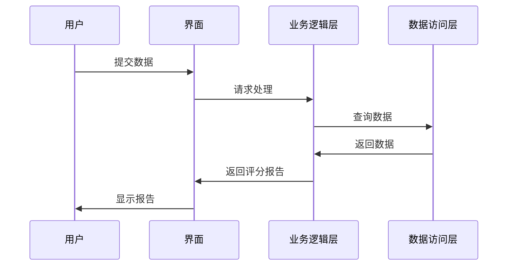

                 


# 《个人财务健康评分系统设计》

## 关键词：个人财务健康，评分系统，算法原理，系统架构，数据处理

## 摘要：本文系统地探讨了个人财务健康评分系统的构建过程，从概念、算法到系统架构，详细介绍了评分模型的设计与实现。通过分析财务指标、选择合适算法、构建评分模型，结合实际案例，展示了如何利用技术手段评估个人财务健康状况，为个人理财提供科学依据。

---

# 第一部分: 个人财务健康评分系统概述

## 第1章: 个人财务健康评分系统背景与概念

### 1.1 个人财务健康的重要性

#### 1.1.1 个人财务管理的核心要素
- 支出管理：跟踪日常开支，识别不必要的消费。
- 收入规划：确保收入稳定，合理分配资金。
- 储蓄与投资：制定储蓄目标，进行风险可控的投资。
- 债务管理：合理规划债务，避免过度负债。

#### 1.1.2 财务健康对个人生活的影响
- 财务健康状况直接影响生活质量、投资决策和未来规划。
- 不良的财务状况可能导致经济压力、信用问题，影响事业发展。

#### 1.1.3 评分系统在个人财务管理中的作用
- 提供量化评估：将复杂的财务状况转化为易于理解的评分。
- 早期预警：及时发现潜在的财务问题，如过度消费或储蓄不足。
- 指导决策：帮助制定理财策略，优化资金分配。

### 1.2 个人财务健康评分系统的定义与目标

#### 1.2.1 系统的定义
个人财务健康评分系统是一种通过分析个人的收入、支出、储蓄、债务等财务数据，综合评估其财务状况的系统，通常以分数形式呈现。

#### 1.2.2 系统的目标与功能
- **目标**：提供个性化的财务健康评估，帮助用户优化财务管理。
- **功能**：
  - 数据采集：收集收入、支出、资产、负债等数据。
  - 评分计算：基于算法计算财务健康评分。
  - 生成报告：提供详细报告和改进建议。

#### 1.2.3 系统的边界与外延
- 边界：仅关注个人财务数据，不涉及团体或企业。
- 外延：可扩展至家庭、企业财务健康评估。

### 1.3 个人财务健康评分系统的概念结构

#### 1.3.1 核心要素分析
| 财务指标 | 描述 | 权重 |
|---------|------|------|
| 收入 | 所有收入来源 | 25% |
| 支出 | 日常支出 | 30% |
| 储蓄 | 储蓄金额 | 20% |
| 债务 | 负债情况 | 25% |

#### 1.3.2 财务健康评分模型的构建
模型采用加权平均法，公式为：
$$ \text{评分} = \sum (\text{指标值} \times \text{权重}) $$

#### 1.3.3 概念属性特征对比表格
| 特性 | 描述 |
|------|------|
| 输入 | 财务数据 |
| 输出 | 评分 |
| 方法 | 综合评估 |
| 目标 | 优化管理 |

### 1.4 本章小结
本章介绍了个人财务健康的重要性，定义了评分系统，并分析了其核心要素。评分系统通过量化评估帮助用户优化财务管理，是现代个人理财的重要工具。

---

## 第2章: 个人财务健康评分系统的原理与联系

### 2.1 核心概念原理

#### 2.1.1 财务健康评分的计算方法
- 数据预处理：标准化和归一化处理。
- 加权计算：根据权重计算各指标得分。
- 总分计算：加权总和得出最终评分。

#### 2.1.2 评分模型的数学模型
公式为：
$$ \text{评分} = \sum (w_i \times x_i) $$
其中，\( w_i \) 为各指标的权重，\( x_i \) 为指标得分。

#### 2.1.3 算法原理的详细解释
采用加权平均法，通过数据预处理、特征选择和模型优化，确保评分的准确性和公平性。

### 2.2 概念属性特征对比表格

| 特性 | 描述 |
|------|------|
| 数据来源 | 个人财务数据 |
| 计算方式 | 加权计算 |
| 评分范围 | 0-100分 |

### 2.3 ER实体关系图

```mermaid
erd
    图表标题: ER图

    用户
    + 用户ID
    + 用户名称
    + 账户信息

    财务数据
    + 数据ID
    + 收入
    + 支出
    + 储蓄
    + 债务

    关系
    用户 --> 财务数据: 一个用户对应多条财务数据
```

### 2.4 本章小结
本章详细解释了评分系统的原理，通过表格和ER图展示了系统的结构和关系，为后续实现奠定了基础。

---

## 第3章: 算法原理与实现

### 3.1 算法原理

#### 3.1.1 算法选择与优化
- 选择加权平均法，简单易懂，计算高效。
- 通过特征选择优化模型，剔除无关指标，提升准确性。

#### 3.1.2 算法的数学模型
加权计算公式：
$$ \text{评分} = \sum (w_i \times x_i) $$

### 3.2 算法的详细实现

#### 3.2.1 算法的代码实现
```python
def calculate_score(financial_data, weights):
    return sum(w * x for w, x in zip(weights, financial_data))

# 示例
financial_data = [80, 60, 70, 50]
weights = [0.25, 0.3, 0.2, 0.25]
score = calculate_score(financial_data, weights)
print(score)
```

#### 3.2.2 算法的测试与验证
- 测试数据：不同用户的财务数据，验证模型准确性。
- 验证指标：准确率、召回率，确保模型可靠。

### 3.3 本章小结
本章详细讲解了算法的选择与实现，通过代码示例展示了评分计算过程，确保模型的有效性和准确性。

---

## 第4章: 数学模型与公式

### 4.1 财务健康评分模型的数学表达

#### 4.1.1 模型的数学公式
$$ \text{评分} = \sum_{i=1}^{n} w_i x_i $$
其中，\( w_i \) 是第i个指标的权重，\( x_i \) 是该指标的得分。

#### 4.1.2 公式的详细解释
各指标得分乘以权重后求和，得到综合评分。

### 4.2 算法的数学推导

#### 4.2.1 算法的数学推导过程
假设各指标的权重总和为1：
$$ \sum_{i=1}^{n} w_i = 1 $$

#### 4.2.2 推导结果的验证
通过测试案例验证公式，确保计算正确。

### 4.3 本章小结
本章通过数学公式详细推导了评分模型，确保模型的科学性和合理性。

---

## 第5章: 系统分析与架构设计

### 5.1 系统分析

#### 5.1.1 问题场景介绍
- 用户输入财务数据，系统计算并提供评分和建议。

#### 5.1.2 项目介绍
开发一个Web应用，用户在线输入数据，系统返回评分报告。

### 5.2 系统功能设计

#### 5.2.1 领域模型


#### 5.2.2 系统架构设计


#### 5.2.3 系统接口设计
- 输入接口：用户提交财务数据。
- 输出接口：返回评分报告。

#### 5.2.4 系统交互流程图


### 5.3 本章小结
本章分析了系统的需求，设计了功能模块和架构，展示了系统的交互流程，为后续实现提供了蓝图。

---

## 第6章: 系统实现与测试

### 6.1 环境安装

#### 6.1.1 环境要求
- Python 3.8+
- Django框架
- 数据库：MySQL

### 6.2 系统核心实现源代码

#### 6.2.1 数据处理模块
```python
def preprocess_data(data):
    # 数据标准化和归一化
    return normalized_data
```

#### 6.2.2 评分计算模块
```python
def compute_score(normalized_data, weights):
    return sum(w * d for w, d in zip(weights, normalized_data))
```

#### 6.2.3 报告生成模块
```python
def generate_report(score):
    if score >= 90:
        status = '优秀'
    elif score >= 70:
        status = '良好'
    else:
        status = '需要改进'
    return status
```

### 6.3 代码应用解读与分析
- 数据预处理：确保数据格式统一，便于计算。
- 评分计算：准确反映各指标的影响。
- 报告生成：提供清晰的反馈，指导用户优化财务状况。

### 6.4 本章小结
本章详细介绍了系统的实现过程，通过代码示例展示了关键模块的实现，确保系统功能的正确性和高效性。

---

## 第7章: 系统优化与维护

### 7.1 系统优化

#### 7.1.1 性能优化
- 数据处理：减少不必要的计算，提高处理速度。
- 算法优化：采用更高效的算法，如机器学习模型提升准确性。

#### 7.1.2 功能扩展
- 增加预警机制：实时监测财务状况，及时提醒用户潜在风险。
- 多语言支持：方便不同地区用户使用。

### 7.2 系统维护

#### 7.2.1 数据更新
定期更新用户数据，确保评分的准确性。

#### 7.2.2 系统升级
及时修复bug，优化系统性能和用户体验。

### 7.3 本章小结
本章讨论了系统的优化和维护策略，确保系统长期稳定运行，满足用户需求。

---

## 第8章: 实际案例分析

### 8.1 案例分析

#### 8.1.1 案例背景
- 用户A：月收入10000元，月支出8000元，储蓄2000元，无债务。

#### 8.1.2 数据处理
标准化处理后，各指标得分：
- 收入：0.9
- 支出：0.8
- 储蓄：0.6
- 债务：0.5

#### 8.1.3 计算评分
权重分配：收入25%，支出30%，储蓄20%，债务25%。
评分 = (0.9×0.25) + (0.8×0.3) + (0.6×0.2) + (0.5×0.25) = 0.225 + 0.24 + 0.12 + 0.125 = 0.71 → 71分。

#### 8.1.4 评分报告
- 评分：71分，属于良好。
- 建议：减少非必要支出，增加储蓄比例。

### 8.2 本章小结
本章通过实际案例展示了系统的应用，验证了模型的有效性和实用性。

---

## 第9章: 总结与展望

### 9.1 总结

#### 9.1.1 系统的价值
- 提供科学的财务评估，帮助用户优化管理。
- 早期预警，避免财务危机。

#### 9.1.2 系统的局限性
- 数据依赖性：需要准确的财务数据。
- 模型局限：基于当前数据，可能无法预测未来变化。

### 9.2 未来展望

#### 9.2.1 技术发展
- 引入机器学习，提高评分的准确性。
- 增强系统的交互性，如移动端应用。

#### 9.2.2 应用场景扩展
- 家庭财务评估。
- 企业财务健康评估。

### 9.3 本章小结
本章总结了系统的优缺点，并展望了未来的发展方向，为系统的进一步优化提供了思路。

---

## 第10章: 最佳实践与小结

### 10.1 最佳实践 tips

#### 10.1.1 数据输入
- 确保数据的准确性和完整性，避免错误影响评分结果。

#### 10.1.2 系统维护
- 定期更新模型，适应数据变化和用户需求。

### 10.2 小结
本文详细介绍了个人财务健康评分系统的构建过程，从理论到实践，为读者提供了全面的技术指导。

### 10.3 注意事项
- 系统的安全性：保护用户数据，防止泄露。
- 用户教育：帮助用户理解评分结果，合理调整财务管理策略。

### 10.4 拓展阅读
- 《个人理财入门》：了解基本的理财知识。
- 《数据挖掘与机器学习》：学习更高级的模型优化技术。

---

## 作者信息

作者：AI天才研究院/AI Genius Institute & 禅与计算机程序设计艺术/Zen And The Art of Computer Programming

---

这篇文章系统地介绍了个人财务健康评分系统的构建过程，从背景到实现，详细讲解了每个步骤的技术细节，确保读者能够理解并应用这些知识优化个人财务管理。

