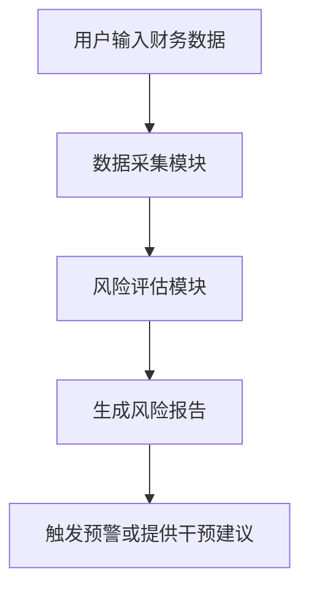
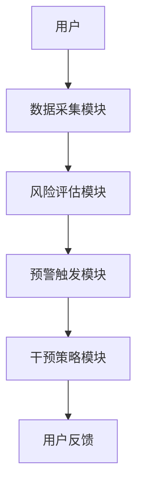
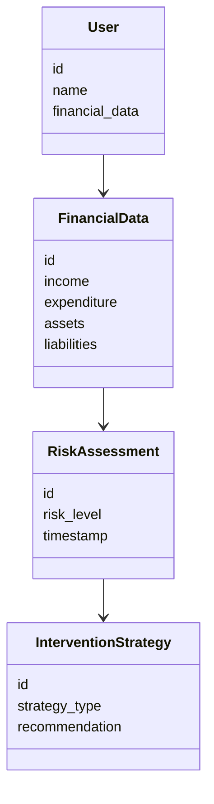
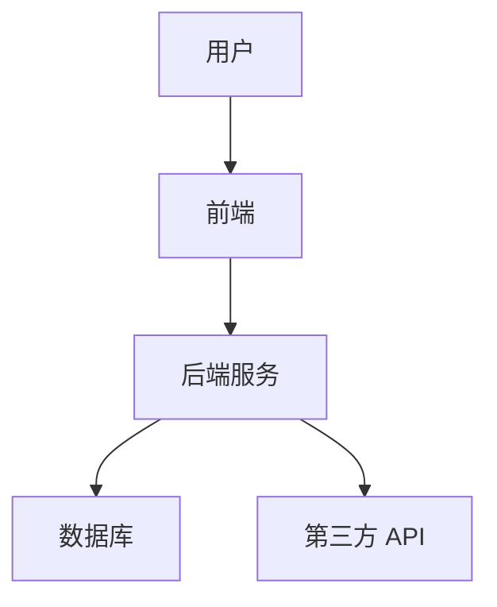

                 


# 个人财务健康预警与干预系统

---

## 关键词

- 个人财务健康
- 预警系统
- 干预策略
- 算法原理
- 系统架构

---

## 摘要

个人财务健康预警与干预系统是一种结合计算机技术与财务管理的创新解决方案，旨在通过智能化的算法和系统架构，实时监测个人财务状况，预测潜在风险，并提供个性化的干预策略。本文从背景介绍、核心概念、算法原理、系统架构到项目实战，全面解析该系统的构建过程，帮助读者理解其技术实现和实际应用。

---

# 第一部分: 个人财务健康预警与干预系统概述

# 第1章: 个人财务健康预警与干预系统背景介绍

## 1.1 问题背景与问题描述

### 1.1.1 个人财务健康问题的现状

在当前经济环境下，个人财务管理的重要性日益凸显。许多人在日常生活中面临财务压力，例如过度消费、债务累积、投资亏损等问题。这些问题可能导致严重的财务危机，甚至影响个人信用记录和生活质量。

### 1.1.2 个人财务健康问题的核心表现

- **消费超支**：消费支出超过收入，导致月度结余为负。
- **债务累积**：信用卡欠款、贷款逾期，导致信用评分下降。
- **投资亏损**：投资决策失误，导致资产贬值。
- **应急储备不足**：缺乏紧急资金储备，难以应对突发事件。

### 1.1.3 问题解决的必要性与紧迫性

随着金融市场的复杂化和个体财务管理需求的增加，传统的财务管理方式已难以满足现代人的需求。通过技术手段实现自动化、智能化的财务监测和干预，能够有效预防财务危机，提升个人财务健康水平。

---

## 1.2 问题解决思路与边界

### 1.2.1 系统解决问题的总体思路

- **数据采集**：收集用户的收入、支出、资产、负债等数据。
- **风险评估**：基于历史数据和当前数据，评估财务风险。
- **预警触发**：当风险指标超过预设阈值时，触发预警。
- **干预策略**：根据预警结果，提供个性化的干预建议，例如调整消费预算、优化投资组合等。

### 1.2.2 系统边界与外延

- **数据范围**：仅涉及个人财务数据，不包括企业财务数据。
- **用户范围**：针对个人用户，不支持企业用户。
- **功能范围**：仅提供财务预警和干预建议，不涉及实际交易操作。

### 1.2.3 核心要素与组成结构

个人财务健康预警与干预系统的核心要素包括：

- **数据采集模块**：负责收集用户的财务数据。
- **风险评估模块**：基于数据进行风险评估。
- **预警触发模块**：根据评估结果触发预警。
- **干预策略模块**：提供干预建议。

---

## 1.3 核心概念与联系

### 1.3.1 核心概念原理

- **数据流**：数据从用户端流向系统，经过处理后，系统将结果反馈给用户。
- **预警算法**：基于机器学习的算法，用于预测财务风险。
- **干预策略**：根据预警结果，制定个性化的财务调整方案。

### 1.3.2 核心概念属性特征对比表格

| 概念       | 属性特征                 |
|------------|--------------------------|
| 数据流      | 实时性、双向性、可追溯性 |
| 预警算法    | 精准性、实时性、可扩展性 |
| 干预策略    | 个性化、可操作性、动态性 |

### 1.3.3 ER实体关系图架构

```mermaid
erd
  User
    name
    id
  FinancialData
    id
    income
    expenditure
    assets
    liabilities
  RiskAssessment
    id
    risk_level
    timestamp
  InterventionStrategy
    id
    strategy_type
    recommendation
```

---

## 1.4 系统功能设计

### 1.4.1 核心功能模块

- **数据采集模块**：收集用户的收入、支出、资产、负债等数据。
- **风险评估模块**：基于数据进行风险评估，生成风险报告。
- **预警触发模块**：当风险指标超过阈值时，触发预警通知。
- **干预策略模块**：根据预警结果，提供个性化的干预建议。

### 1.4.2 功能流程图



---

## 1.5 系统架构设计

### 1.5.1 系统架构图



---

## 1.6 系统接口设计

### 1.6.1 数据接口

- **输入接口**：用户通过网页或移动应用输入财务数据。
- **输出接口**：系统通过邮件、短信或应用通知用户预警信息。

---

## 1.7 系统交互流程图

```mermaid
sequenceDiagram
    participant User
    participant System
    User -> System: 提供财务数据
    System -> User: 风险评估结果
    if 风险评估结果 > 预警阈值 then
        System -> User: 发出预警通知
    else
        System -> User: 提供干预建议
    end
```

---

# 第二部分: 个人财务健康预警与干预系统的算法原理

---

## 第2章: 个人财务健康预警与干预系统的算法原理

### 2.1 预警算法原理

#### 2.1.1 预警算法的数学模型

风险评估模型：

$$
\text{风险评分} = \alpha \times \text{收入} + \beta \times \text{支出} + \gamma \times \text{资产} + \delta \times \text{负债}
$$

其中，$\alpha, \beta, \gamma, \delta$ 是根据历史数据训练得到的权重系数。

#### 2.1.2 预警算法的流程图

```mermaid
graph TD
    A[开始] --> B[收集数据]
    B --> C[计算风险评分]
    C --> D[判断是否超过阈值]
    if 是 then
        D --> E[触发预警]
    else
        D --> E[不触发预警]
    end
    E --> F[结束]
```

---

### 2.2 干预策略算法原理

#### 2.2.1 干预策略的数学模型

干预策略的推荐公式：

$$
\text{推荐策略} = \begin{cases}
\text{增加应急储备} & \text{如果风险评分 < 50} \\
\text{优化投资组合} & \text{如果风险评分在 50-70 之间} \\
\text{减少非必要开支} & \text{如果风险评分 > 70}
\end{cases}
$$

---

## 第3章: 个人财务健康预警与干预系统的数学模型与公式

### 3.1 风险评估模型

#### 3.1.1 风险评估公式

$$
\text{风险评分} = 0.3 \times \text{收入} + 0.4 \times \text{支出} + 0.2 \times \text{资产} - 0.1 \times \text{负债}
$$

---

## 第4章: 个人财务健康预警与干预系统的系统分析与架构设计

### 4.1 系统问题场景介绍

#### 4.1.1 系统目标用户分析

- **目标用户**：个人用户，包括工薪阶层、自由职业者、小企业主等。
- **用户需求**：实时监测财务状况，预防财务危机。

---

## 4.2 系统功能设计

### 4.2.1 领域模型



---

## 4.3 系统架构设计

### 4.3.1 系统架构图



---

## 4.4 系统接口设计

### 4.4.1 接口描述

- **输入接口**：用户通过网页或移动应用输入财务数据。
- **输出接口**：系统通过邮件、短信或应用通知用户预警信息。

---

## 4.5 系统交互流程图

### 4.5.1 交互流程图

```mermaid
sequenceDiagram
    participant User
    participant System
    User -> System: 提供财务数据
    System -> User: 风险评估结果
    if 风险评估结果 > 预警阈值 then
        System -> User: 发出预警通知
    else
        System -> User: 提供干预建议
    end
```

---

# 第三部分: 个人财务健康预警与干预系统的项目实战

---

## 第5章: 个人财务健康预警与干预系统的项目实战

### 5.1 环境安装

#### 5.1.1 环境要求

- **操作系统**：Windows 10 或更高版本，macOS 10.15 或更高版本，Linux（支持大多数发行版）。
- **开发工具**：PyCharm、VS Code、Jupyter Notebook。
- **依赖库**：Python 3.8+, Pandas, NumPy, Scikit-learn, Flask。

---

### 5.2 核心代码实现

#### 5.2.1 预警算法实现

```python
import pandas as pd
from sklearn.linear_model import LinearRegression

def risk_assessment(data):
    model = LinearRegression()
    model.fit(data[['income', 'expenditure', 'assets', ' liabilities']], data['risk_score'])
    return model.predict(data[['income', 'expenditure', 'assets', ' liabilities']])
```

---

#### 5.2.2 干预策略实现

```python
def generate_intervention_strategy(risk_score):
    if risk_score < 50:
        return "增加应急储备"
    elif 50 <= risk_score < 70:
        return "优化投资组合"
    else:
        return "减少非必要开支"
```

---

### 5.3 代码应用解读与分析

#### 5.3.1 预警算法代码解读

- **数据输入**：用户提供的财务数据。
- **模型训练**：使用线性回归模型训练风险评估模型。
- **预测输出**：根据输入数据预测风险评分。

#### 5.3.2 干预策略代码解读

- **风险评分输入**：从预警算法得到的风险评分。
- **策略输出**：根据风险评分生成相应的干预策略。

---

### 5.4 实际案例分析

#### 5.4.1 案例背景

假设用户A的月收入为10000元，支出为8000元，资产为50000元，负债为20000元。

---

#### 5.4.2 风险评估

根据风险评估模型：

$$
\text{风险评分} = 0.3 \times 10000 + 0.4 \times 8000 + 0.2 \times 50000 - 0.1 \times 20000 = 3000 + 3200 + 10000 - 2000 = 14200
$$

由于风险评分超过预警阈值（假设为10000），系统触发预警。

---

#### 5.4.3 干预策略

根据干预策略模型：

$$
\text{推荐策略} = \text{优化投资组合}
$$

---

### 5.5 项目小结

通过实际案例分析，我们可以看到，个人财务健康预警与干预系统能够有效地识别财务风险，并提供个性化的干预建议，帮助用户避免财务危机。

---

# 第四部分: 个人财务健康预警与干预系统的最佳实践

---

## 第6章: 个人财务健康预警与干预系统的最佳实践

### 6.1 小结

- **系统优势**：
  - 实时监测财务状况。
  - 提供个性化干预策略。
  - 预防财务危机。

### 6.2 注意事项

- **数据隐私**：确保用户数据的安全性和隐私性。
- **系统维护**：定期更新模型和策略，确保系统准确性。

### 6.3 拓展阅读

- **相关书籍**：
  - 《个人财务管理入门》
  - 《风险管理与控制》
- **技术文档**：
  - 《机器学习在金融领域的应用》
  - 《系统架构设计实践》

---

## 作者信息

作者：AI天才研究院/AI Genius Institute & 禅与计算机程序设计艺术 /Zen And The Art of Computer Programming

---

通过以上目录大纲，我们可以看到，个人财务健康预警与干预系统是一个结合了计算机技术和财务管理的复杂系统。通过系统的构建与实现，可以帮助个人用户更好地管理财务健康，预防财务危机，提升生活质量。

