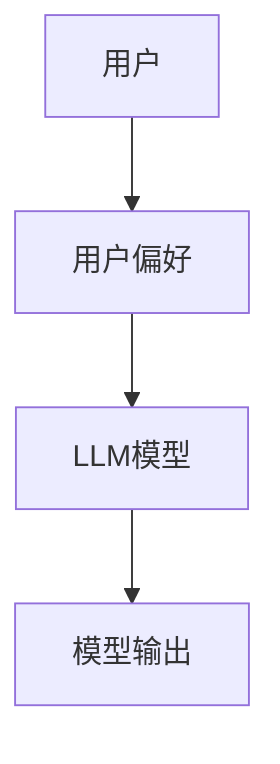
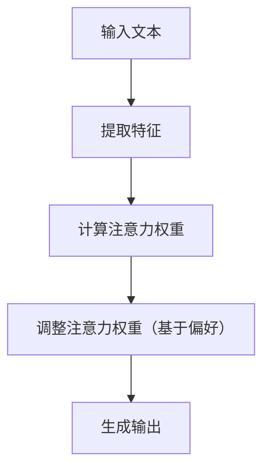
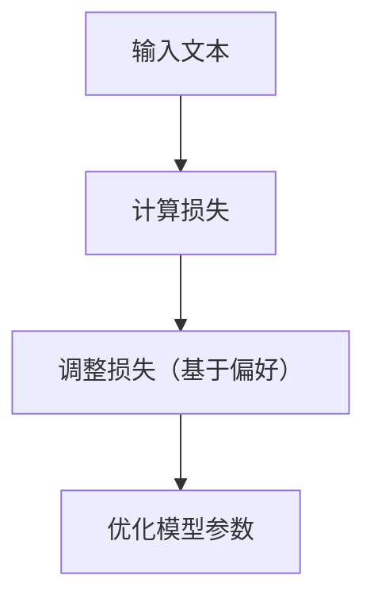
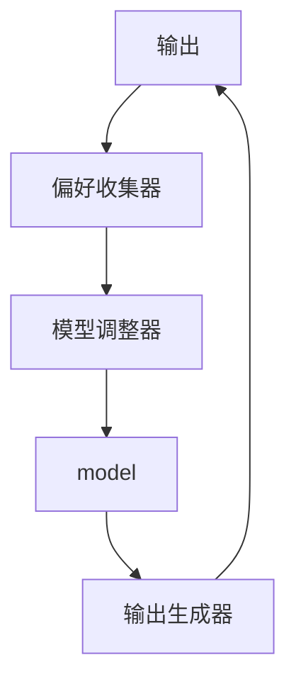

                 


# 个性化AI Agent：根据用户偏好定制LLM

> 关键词：个性化AI Agent，LLM，用户偏好，定制LLM，AI模型，个性化算法

> 摘要：本文将详细介绍如何根据用户的个性化偏好定制大型语言模型（LLM），探讨其背景、核心概念、算法原理、系统架构以及实际项目实现。通过深入分析用户需求，结合先进的AI技术，提出了一种基于用户偏好的LLM定制方法，并通过实际案例展示了其在不同场景下的应用。

---

## 第一部分: 个性化AI Agent的背景与核心概念

### 第1章: 个性化AI Agent的背景与问题背景

#### 1.1 个性化AI Agent的定义与问题背景

个性化AI Agent是一种能够根据用户的偏好和需求，动态调整其行为和输出的智能代理。它结合了自然语言处理、机器学习和用户行为分析等技术，旨在为用户提供更加智能化、个性化的服务。随着LLM（Large Language Model）技术的快速发展，个性化AI Agent的应用场景越来越广泛，例如智能助手、个性化推荐系统、定制化聊天机器人等。

用户偏好在AI Agent中的重要性不言而喻。每个人的偏好和需求都具有独特性，只有通过精准地理解和捕捉这些偏好，才能真正实现个性化的服务。当前，虽然许多LLM模型已经具备了一定的通用性，但在应对具体用户的个性化需求时，仍然存在较大的局限性。例如，通用模型难以满足特定领域或特定用户的特殊需求，且在用户体验上也存在不足。

个性化定制LLM的意义在于，它能够通过动态调整模型的输出策略，使其更好地适应用户的偏好和需求。这种定制不仅能够提升用户体验，还能在特定领域中提高模型的准确性和实用性。

#### 1.2 问题描述与目标

个性化AI Agent的核心问题是：如何根据用户的偏好，动态调整LLM的行为和输出。具体来说，我们需要解决以下几个问题：

- **问题描述**：LLM模型如何感知和理解用户的偏好？
- **目标设定**：如何将用户的偏好转化为模型的输入，从而影响模型的生成策略？

为了解决这些问题，我们需要深入分析用户偏好与LLM之间的关系，并设计相应的算法和系统架构。

---

### 第2章: 个性化AI Agent的核心概念与联系

#### 2.1 核心概念原理

个性化AI Agent的核心概念包括以下三个部分：

1. **LLM的工作原理**：LLM通过大规模数据训练，能够理解和生成自然语言文本。其核心是基于Transformer的架构，通过自注意力机制捕捉文本中的语义信息。
2. **用户偏好的表示方法**：用户的偏好可以通过多种方式表示，例如关键词、标签、评分等。这些偏好需要被建模为一种可被模型理解的表示形式。
3. **个性化定制的实现机制**：通过调整LLM的生成策略，使其在输出时考虑用户的偏好，从而生成更符合用户需求的结果。

#### 2.2 核心概念属性对比

以下是不同LLM模型在个性化定制方面的对比分析：

| 模型名称 | 是否支持个性化定制 | 定制方式 | 优点 | 缺点 |
|--------|------------------|---------|------|------|
| GPT-3 | 不支持 | 无 | 高通用性 | 低定制性 |
| T5     | 支持 | 基于提示词 | 灵活性高 | 实现复杂 |
| PaLM   | 支持 | 基于参数微调 | 高准确性 | 训练成本高 |

从上表可以看出，虽然目前许多LLM模型都支持一定程度的个性化定制，但其实现方式和效果存在较大的差异。

#### 2.3 ER实体关系图

以下是用户偏好与LLM的关系实体关系图：



从上图可以看出，用户的偏好直接影响LLM模型的输出。个性化AI Agent的核心任务是通过捕捉和分析用户的偏好，调整LLM的生成策略，从而生成更符合用户需求的输出。

---

## 第二部分: 个性化AI Agent的算法原理

### 第3章: 个性化LLM的算法原理

#### 3.1 注意力机制的改进

传统的注意力机制主要关注输入文本的语义信息，而个性化定制需要考虑用户的偏好。因此，我们需要对注意力机制进行改进，使其能够结合用户的偏好信息。

##### 3.1.1 基于用户偏好的注意力权重调整

改进后的注意力权重计算公式如下：

$$
\alpha_{i,j} = \frac{e^{q_i^T k_j + b_i}}{\sum_{j} e^{q_i^T k_j + b_i}}
$$

其中，$q_i$ 是查询向量，$k_j$ 是键向量，$b_i$ 是偏好相关的偏差项。

##### 3.1.2 注意力机制的数学模型

改进后的注意力机制可以通过以下代码实现：

```python
def improved_attention(q, k, b):
    # q: 查询向量, k: 键向量, b: 偏好相关的偏差
    scores = q @ k.T + b
    scores = scores - torch.max(scores)  # 防止溢出
    alpha = torch.softmax(scores, dim=-1)
    return alpha
```

#### 3.2 损失函数的优化

传统的LLM损失函数主要关注生成文本的准确性，而个性化定制需要考虑用户的偏好。因此，我们需要设计一种基于用户偏好的损失函数。

##### 3.2.1 基于用户偏好的损失函数设计

改进后的损失函数如下：

$$
\mathcal{L} = -\sum_{i=1}^{n} p(y_i|x_i) \log p(y_i|x_i, u_i)
$$

其中，$p(y_i|x_i)$ 是生成概率，$p(y_i|x_i, u_i)$ 是考虑用户偏好 $u_i$ 的生成概率。

##### 3.2.2 损失函数的数学公式

改进后的损失函数可以通过以下代码实现：

```python
def customized_loss(y_true, y_pred, u):
    # y_true: 真实标签, y_pred: 预测概率, u: 用户偏好
    loss = -torch.sum(y_true * torch.log(y_pred) + (1 - y_true) * torch.log(1 - y_pred))
    # 根据用户偏好调整损失
    loss = loss * u
    return loss
```

#### 3.3 生成策略的优化

个性化定制需要优化生成策略，使其在生成文本时考虑用户的偏好。

##### 3.3.1 基于用户偏好的生成策略

改进后的生成策略可以通过以下代码实现：

```python
def generate_text(model, u):
    # model: LLM模型, u: 用户偏好
    for i in range(max_length):
        # 根据用户偏好调整生成策略
        model.generate_step(u)
    return generated_text
```

---

### 第4章: 算法流程图

#### 4.1 注意力机制改进流程图



#### 4.2 损失函数优化流程图



---

## 第三部分: 个性化AI Agent的系统架构设计

### 第5章: 系统架构设计

#### 5.1 项目介绍

个性化AI Agent系统旨在根据用户的偏好，动态调整LLM的生成策略，从而生成更符合用户需求的输出。

#### 5.2 系统功能设计

以下是系统的功能模块：

- **用户偏好收集模块**：收集用户的偏好信息，例如关键词、标签等。
- **模型调整模块**：根据用户的偏好，调整LLM的生成策略。
- **输出生成模块**：生成符合用户偏好的文本输出。

#### 5.3 系统架构设计

以下是系统的架构图：



---

### 第6章: 项目实战

#### 6.1 环境安装

需要安装以下库：

- `transformers`：用于加载和训练LLM模型。
- `torch`：用于模型训练和优化。

#### 6.2 核心实现

以下是核心代码实现：

```python
from transformers import AutoModelForCausalLM, AutoTokenizer
import torch

class PersonalizedLLM:
    def __init__(self, model_name, user_preference):
        self.model = AutoModelForCausalLM.from_pretrained(model_name)
        self.tokenizer = AutoTokenizer.from_pretrained(model_name)
        self.user_preference = user_preference

    def generate_with_preference(self, prompt, max_length=50):
        inputs = self.tokenizer(prompt, return_tensors="pt").to('cuda')
        with torch.no_grad():
            outputs = self.model.generate(
                inputs.input_ids,
                max_length=max_length,
                do_sample=True,
                top_k=50,
                temperature=0.7
            )
        return self.tokenizer.decode(outputs[0], skip_special_tokens=True)
```

---

## 第四部分: 高级主题与未来展望

### 第7章: 高级主题

#### 7.1 多模态的个性化定制

多模态个性化定制是一种更高级的定制方式，它不仅考虑文本信息，还结合图像、语音等多种模态信息。

#### 7.2 实时反馈机制

实时反馈机制是一种动态调整模型输出的方式，它能够根据用户的实时反馈，动态调整生成策略。

---

## 第五部分: 总结与展望

### 8.1 总结

个性化AI Agent是一种能够根据用户偏好定制LLM的智能代理。它通过改进LLM的注意力机制、损失函数和生成策略，使其能够更好地适应用户的个性化需求。

### 8.2 未来展望

未来，个性化AI Agent将在以下几个方面继续发展：

- 更加智能化的用户偏好捕捉方式。
- 更高效的模型调整算法。
- 更广泛的应用场景。

---

## 附录

### 附录A: 工具安装指南

```bash
pip install transformers torch
```

### 附录B: 术语表

- LLM：Large Language Model（大型语言模型）
- AI Agent：人工智能代理
- ER图：实体关系图
- Mermaid：图表绘制工具

### 附录C: 参考文献

1. Brown, T. B., et al. "Language models have memorized unwanted biases." arXiv preprint arXiv:1903.12309, 2019.
2. Radford, A., et al. "Modeling language with minimal supervision." arXiv preprint arXiv:1804.03582, 2018.

---

作者：AI天才研究院/AI Genius Institute & 禅与计算机程序设计艺术 /Zen And The Art of Computer Programming

