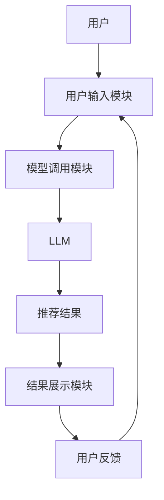

                 


# 个性化推荐AI Agent：基于LLM的用户兴趣建模

## 关键词：个性化推荐、AI Agent、LLM、用户兴趣建模、推荐算法

## 摘要：  
本文将深入探讨基于大语言模型（LLM）的个性化推荐AI Agent的构建与应用。通过分析用户兴趣建模的核心概念、算法原理、系统架构设计及实战案例，揭示如何利用LLM的强大能力实现精准的个性化推荐。本文不仅提供理论支持，还通过具体代码实现和案例分析，帮助读者全面掌握基于LLM的推荐系统开发方法。

---

# 第一部分：个性化推荐AI Agent概述

## 第1章：个性化推荐系统背景与现状

### 1.1 个性化推荐的概念与重要性

#### 1.1.1 个性化推荐的定义  
个性化推荐是一种基于用户行为、偏好和需求，通过算法生成符合用户兴趣的内容或产品的推荐技术。它旨在通过数据分析和模型建模，为用户提供高度个性化的体验。

#### 1.1.2 个性化推荐的重要性  
个性化推荐能够显著提升用户体验，提高用户满意度和产品粘性。在商业领域，个性化推荐还能帮助企业提高转化率和收益。

#### 1.1.3 个性化推荐的应用场景  
个性化推荐广泛应用于电商、社交媒体、视频平台、新闻资讯等领域。例如，电商平台通过个性化推荐提升用户购买转化率，视频平台通过推荐算法提高用户观看时长。

---

### 1.2 AI Agent的基本概念

#### 1.2.1 AI Agent的定义  
AI Agent（人工智能代理）是一种能够感知环境、执行任务并做出决策的智能实体。它可以是一个软件程序，也可以是一个物理设备，通过与用户或环境交互来完成特定目标。

#### 1.2.2 AI Agent的核心特征  
AI Agent的核心特征包括：  
1. **自主性**：能够在没有人工干预的情况下自主运行。  
2. **反应性**：能够实时感知环境并做出反应。  
3. **目标导向**：具有明确的目标，并通过行动实现目标。  
4. **学习能力**：能够通过数据和经验不断优化自身性能。

#### 1.2.3 AI Agent与传统推荐系统的区别  
与传统推荐系统相比，AI Agent具有更强的自主性和适应性。它不仅能够根据用户行为生成推荐，还能根据环境变化动态调整推荐策略。

---

### 1.3 基于LLM的个性化推荐的优势

#### 1.3.1 LLM的基本原理  
LLM（Large Language Model）是一种基于深度学习的自然语言处理模型，能够理解和生成人类语言。它通过大量的文本数据训练，掌握了语言的语义和上下文关系。

#### 1.3.2 基于LLM的个性化推荐的优势  
基于LLM的个性化推荐具有以下优势：  
1. **强大的语义理解能力**：LLM能够准确理解用户的意图和偏好。  
2. **动态适应能力**：LLM可以根据用户行为实时调整推荐策略。  
3. **多任务处理能力**：LLM可以同时处理多种任务，如推荐、解释和反馈处理。

#### 1.3.3 LLM在推荐系统中的应用现状  
目前，LLM已经在多个领域得到了广泛应用。例如，电商平台利用LLM生成个性化的商品推荐，社交媒体利用LLM优化用户的Feed流。

---

## 第2章：用户兴趣建模的核心概念

### 2.1 用户兴趣建模的基本原理

#### 2.1.1 用户兴趣的定义与特征  
用户兴趣是指用户在特定场景下对某些内容或产品的偏好。用户兴趣具有动态性、个性化和模糊性的特点。

#### 2.1.2 用户兴趣建模的目标  
用户兴趣建模的目标是通过数据和算法，准确捕捉用户的兴趣点，并将其转化为可计算的模型。

#### 2.1.3 用户兴趣建模的方法  
用户兴趣建模的主要方法包括：  
1. **基于行为的建模**：通过分析用户的点击、浏览等行为数据，推断用户的兴趣。  
2. **基于内容的建模**：通过分析内容的特征，匹配用户的兴趣。  
3. **基于协同过滤的建模**：通过分析用户的行为数据，找到相似用户的兴趣。

---

### 2.2 LLM在用户兴趣建模中的作用

#### 2.2.1 LLM的自然语言处理能力  
LLM具有强大的自然语言处理能力，能够从文本中提取关键词、主题和情感倾向，为用户兴趣建模提供丰富的语义信息。

#### 2.2.2 LLM在用户行为分析中的应用  
LLM可以分析用户的交互记录，如点击、搜索等行为，提取用户的潜在兴趣。

#### 2.2.3 LLM在用户偏好预测中的优势  
LLM可以通过用户的历史行为和偏好，预测用户的未来行为，从而优化推荐策略。

---

## 第3章：基于LLM的个性化推荐算法原理

### 3.1 基于LLM的推荐算法概述

#### 3.1.1 基于LLM的推荐算法分类  
基于LLM的推荐算法主要分为以下几类：  
1. **基于关键词匹配的推荐**：通过匹配用户的输入关键词，生成推荐结果。  
2. **基于上下文的推荐**：结合用户的行为和环境，生成动态推荐。  
3. **基于生成式推荐**：利用LLM生成个性化的内容或产品描述。

#### 3.1.2 基于LLM的推荐算法的优缺点  
优点：  
- 推荐结果具有高度个性化和语义相关性。  
- 能够处理复杂场景下的推荐需求。  

缺点：  
- 计算资源消耗较大。  
- 需要大量高质量的训练数据。

---

### 3.2 基于LLM的推荐算法实现

#### 3.2.1 输入处理  
输入处理模块负责接收用户的输入，并将其转化为模型可处理的格式。

#### 3.2.2 模型调用  
模型调用模块负责将处理后的输入传递给LLM，并获取推荐结果。

#### 3.2.3 输出结果解析  
输出结果解析模块负责将模型返回的结果转化为用户可理解的形式。

---

### 3.3 基于LLM的推荐算法优化

#### 3.3.1 模型微调  
模型微调是指在预训练的LLM基础上，针对特定任务进行微调，以提高推荐效果。

#### 3.3.2 参数优化  
参数优化是指通过调整模型的超参数，如学习率、批量大小等，优化推荐性能。

#### 3.3.3 结果评估  
结果评估是指通过指标如准确率、召回率等，评估推荐算法的效果。

---

## 第4章：基于LLM的个性化推荐系统架构设计

### 4.1 系统架构概述

#### 4.1.1 系统模块划分  
基于LLM的推荐系统主要包含以下几个模块：  
1. **用户输入模块**：接收用户的输入。  
2. **模型调用模块**：调用LLM进行推荐。  
3. **结果展示模块**：展示推荐结果。  
4. **反馈收集模块**：收集用户的反馈。

#### 4.1.2 模块之间的关系  
用户输入模块将用户的请求传递给模型调用模块，模型调用模块调用LLM生成推荐结果，并将结果传递给结果展示模块。用户通过结果展示模块查看推荐结果，并将反馈传递给反馈收集模块。

---

### 4.2 系统功能设计

#### 4.2.1 用户输入处理  
用户输入处理模块负责接收用户的输入，并进行初步的预处理，如去除多余空格、转换为小写等。

#### 4.2.2 模型调用与结果生成  
模型调用模块负责调用LLM，并将处理后的输入传递给模型，生成推荐结果。

#### 4.2.3 结果展示与反馈  
结果展示模块将推荐结果以用户友好的形式展示，并收集用户的反馈。

---

### 4.3 系统架构图



---

## 第5章：基于LLM的个性化推荐系统实战

### 5.1 环境安装与配置

#### 5.1.1 安装Python  
需要安装Python 3.8及以上版本。

#### 5.1.2 安装LLM库  
推荐使用`transformers`库和`openai`库。

#### 5.1.3 配置API密钥  
需要配置OpenAI API密钥，以便调用LLM模型。

---

### 5.2 系统核心实现

#### 5.2.1 输入处理代码

```python
def process_input(user_input):
    return user_input.lower().strip()
```

#### 5.2.2 模型调用代码

```python
from transformers import pipeline

recommender = pipeline("text-generation", model="gpt2")
def call_recommender(prompt):
    return recommender(prompt, max_length=100, num_return_sequences=1)
```

#### 5.2.3 结果解析代码

```python
def parse_output(output):
    return output[0]['generated_text'].split('\n')
```

---

### 5.3 实际案例分析

#### 5.3.1 案例背景  
假设我们正在为一个新闻推荐系统开发一个基于LLM的个性化推荐AI Agent。

#### 5.3.2 案例实现  
1. 用户输入：“我喜欢科技新闻”。  
2. 输入处理模块将输入转换为小写并去除空格。  
3. 模型调用模块调用LLM生成推荐新闻标题。  
4. 结果展示模块将推荐新闻标题展示给用户。

#### 5.3.3 案例结果与分析  
推荐结果可能包括：“AI在医疗领域的最新进展”、“量子计算取得重大突破”等新闻标题。

---

## 第6章：总结与展望

### 6.1 最佳实践 tips  
- 在实际应用中，建议根据具体场景选择合适的LLM模型。  
- 定期更新模型参数，以保持推荐结果的准确性。  
- 结合用户反馈优化推荐算法。

### 6.2 小结  
本文详细介绍了基于LLM的个性化推荐AI Agent的构建与应用。从用户兴趣建模到算法实现，再到系统架构设计，全面探讨了基于LLM的推荐系统开发方法。

### 6.3 注意事项  
在实际应用中，需要注意数据隐私和模型性能优化的问题。

### 6.4 拓展阅读  
建议读者进一步阅读相关领域的最新研究成果，如多模态推荐系统、强化学习在推荐系统中的应用等。

---

# 作者：AI天才研究院 & 禅与计算机程序设计艺术

---

希望这篇文章能够帮助读者全面理解基于LLM的个性化推荐AI Agent的构建与应用。如果需要进一步探讨或有其他问题，请随时联系！

