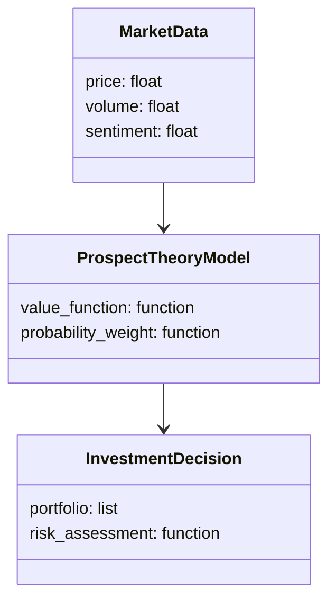
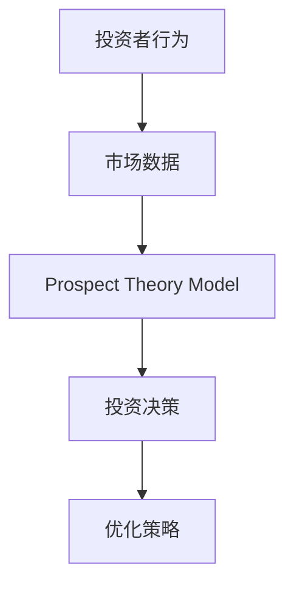

                 


# 丹尼尔·卡尼曼的行为经济学在价值投资中的应用

> 关键词：行为经济学，价值投资，prospect theory，认知偏差，投资决策

> 摘要：本文系统性地探讨了丹尼尔·卡尼曼的行为经济学理论在价值投资中的应用。通过分析投资者心理、情绪与决策偏差，结合prospect theory的核心原理，构建了基于行为经济学的数学模型，优化了投资决策过程。最后，通过系统架构设计与项目实战，展示了如何将行为经济学理论应用于实际投资系统中，实现了投资决策的优化与风险控制。

---

## 第一部分：丹尼尔·卡尼曼的行为经济学概述

### 第1章：行为经济学与价值投资的背景介绍

#### 1.1 行为经济学的核心概念

##### 1.1.1 传统经济学与行为经济学的差异

- 传统经济学假设：理性人假设（完全理性、自利、效用最大化）
- 行为经济学：引入心理学因素，研究非理性决策
- 价值投资：寻找市场低估的价值，长期持有

##### 1.1.2 价值投资的基本原理

- 价值投资的核心：寻找市场低估的股票，长期持有
- 格雷厄姆的定义：股票价格与内在价值的差异是投资机会
- 巴菲特的延伸：安全边际与长期价值

##### 1.1.3 行为经济学在投资中的应用前景

- 解释市场非理性波动
- 优化投资决策过程
- 提供新的投资策略工具

#### 1.2 投资者心理与决策偏差

##### 1.2.1 认知偏差对投资决策的影响

- 过度自信偏差（Overconfidence）
- 可得性偏差（Availability）
- 锚定效应（Anchoring）

##### 1.2.2 情绪对投资行为的驱动作用

- 恐慌与贪婪
- 市场情绪周期
- 情绪与市场定价偏差

##### 1.2.3 社会心理与投资行为的关系

- 从众心理
- 社会认同
- 群体决策与市场波动

---

### 第2章：丹尼尔·卡尼曼的行为经济学理论

#### 2.1 期望效用理论与prospect theory

##### 2.1.1 期望效用理论的局限性

- 无法解释损失厌恶
- 无法解释概率加权函数
- 无法解释非线性效用函数

##### 2.1.2 prospect theory的核心假设

- 价值函数：线性递减的收益函数与非线性的损失函数
- 概率权重函数：凸函数与损失厌恶曲线

##### 2.1.3 概率权重函数与损失厌恶曲线

- 概率权重函数：$w(p) = p^{\alpha}(1-p)^{\beta}$
- 损失厌恶曲线：$V = \begin{cases} 
  k \cdot \sqrt{x} & \text{if } x > 0 \\
  -\sqrt{-x} & \text{if } x < 0 
\end{cases}$

#### 2.2 偏好与决策权重

##### 2.2.1 偏好的递减性

- 价值函数的递减性：$V(x) = \sqrt{x}$

##### 2.2.2 决策权重的非线性特征

- 概率权重函数：$w(p) = p^{\alpha}(1-p)^{\beta}$

##### 2.2.3 价值函数的数学模型

- 综合价值函数：$V(x, p) = \sqrt{p \cdot x + (1-p) \cdot (-y)}$

#### 2.3 个体决策与市场行为

##### 2.3.1 个体决策的非理性特征

- 过度交易
- 情绪化交易
- 从众交易

##### 2.3.2 市场参与者的社会互动

- 信息扩散与市场噪声
- 社交影响与投资决策
- 群体决策与市场趋势

##### 2.3.3 集体决策与市场波动的关系

- 市场波动的非线性特征
- 群体情绪与市场周期
- 社会心理与市场泡沫

---

### 第3章：行为经济学在价值投资中的应用

#### 3.1 投资者心理与市场定价偏差

##### 3.1.1 过度自信与市场泡沫

- 投资者过度自信导致高估
- 市场泡沫的形成与破裂

##### 3.1.2 情绪驱动与市场周期

- 恐慌与贪婪的交替
- 市场情绪的周期性波动

##### 3.1.3 社会认同与投资决策

- 从众心理与投资决策偏差
- 社交圈对投资行为的影响

#### 3.2 基于prospect theory的投资决策模型

##### 3.2.1 价值函数在投资中的应用

- 个股价值评估的非线性特征
- 投资组合的价值函数优化

##### 3.2.2 概率权重与风险偏好

- 风险厌恶的非线性权重
- 概率加权的效用函数

##### 3.2.3 损失厌恶与投资组合优化

- 损失厌恶对风险偏好的影响
- 投资组合的损失厌恶优化

#### 3.3 行为偏差与投资策略

##### 3.3.1 如何识别市场情绪偏差

- 市场情绪指标的构建
- 市场噪声的识别与过滤

##### 3.3.2 利用认知偏差优化投资决策

- 利用锚定效应优化估值
- 利用可得性偏差优化信息筛选

##### 3.3.3 行为矫正策略在投资中的应用

- 投资决策的系统化流程
- 行为偏差的实时监控

---

### 第4章：数学模型与行为经济学

#### 4.1 基于prospect theory的数学模型

##### 4.1.1 价值函数的数学表达

- 价值函数：$V(x) = \sqrt{x}$

##### 4.1.2 概率权重函数的数学模型

- 概率权重函数：$w(p) = p^{\alpha}(1-p)^{\beta}$

##### 4.1.3 综合数学模型的构建

- 综合模型：$U(x, p) = \sum_{i=1}^{n} w(p_i) \cdot V(x_i)$

#### 4.2 算法原理讲解

##### 4.2.1 算法步骤

1. 收集市场数据
2. 构建价值函数
3. 计算概率权重
4. 优化投资组合

##### 4.2.2 mermaid流程图

```mermaid
graph TD
    A[开始] -> B[收集市场数据]
    B -> C[构建价值函数]
    C -> D[计算概率权重]
    D -> E[优化投资组合]
    E -> F[结束]
```

##### 4.2.3 代码实现

```python
import math

def value_function(x):
    return math.sqrt(x)

def probability_weight(p, alpha, beta):
    return (p**alpha) * ((1-p)**beta)

# 示例数据
p = 0.7
x = 100

v = value_function(x)
w = probability_weight(p, 0.5, 0.5)

print(f"Value: {v}, Weight: {w}")
```

---

## 第五部分：系统分析与架构设计方案

### 第5章：系统架构设计

#### 5.1 问题场景介绍

- 投资者情绪影响市场定价
- 行为偏差导致非理性决策
- 市场波动的非线性特征

#### 5.2 系统功能设计

##### 5.2.1 领域模型类图



#### 5.3 系统架构图



---

## 第六部分：项目实战

### 第6章：项目实战

#### 6.1 环境安装

- Python 3.8+
- NumPy, Pandas, Matplotlib

#### 6.2 核心代码实现

```python
import numpy as np
import pandas as pd
import matplotlib.pyplot as plt

def value_function(x):
    return np.sqrt(x)

def probability_weight(p, alpha, beta):
    return (p**alpha) * ((1-p)**beta)

# 示例数据
prices = pd.Series([100, 90, 110, 80], index=['A', 'B', 'C', 'D'])
p = 0.7

# 计算价值函数
values = prices.apply(value_function)

# 计算概率权重
weights = probability_weight(p, 0.5, 0.5)

# 绘制图表
plt.bar(values, weights)
plt.title('Value Function and Probability Weight')
plt.show()
```

---

## 第七部分：最佳实践与总结

### 第7章：最佳实践

#### 7.1 小结

- 行为经济学为价值投资提供了新的视角
- 基于prospect theory的数学模型优化了投资决策
- 系统架构设计提升了投资策略的可操作性

#### 7.2 注意事项

- 需要结合具体市场环境
- 需要实时监控市场情绪
- 需要定期优化投资组合

#### 7.3 拓展阅读

- 《思考，快与慢》——丹尼尔·卡尼曼
- 《价值投资实战》——巴菲特

---

# 作者：AI天才研究院/AI Genius Institute & 禅与计算机程序设计艺术/Zen And The Art of Computer Programming

