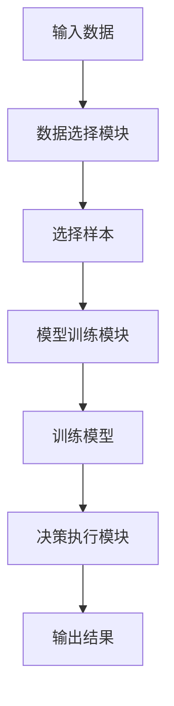

                 


# 主动学习在AI Agent训练中的应用

> **关键词**：主动学习，AI Agent，机器学习，数据选择，智能代理  
> **摘要**：主动学习是一种机器学习方法，通过智能选择数据来优化模型性能。本文探讨主动学习在AI Agent训练中的应用，涵盖核心概念、算法原理、系统设计及实战案例，深入分析其在提高训练效率和降低数据成本方面的作用。

---

## 第一部分: 主动学习在AI Agent训练中的背景与应用

### 第1章: 主动学习与AI Agent概述

#### 1.1 主动学习的基本概念
主动学习是一种机器学习方法，与监督学习不同，它允许模型主动选择最具信息量的数据样本进行训练。这种方法特别适用于数据标注成本高或数据量有限的情况。

- **主动学习的定义**：主动学习是一种数据选择方法，模型能够根据已有的数据选择最有价值的样本进行学习。
- **主动学习的核心特点**：数据选择、迭代学习、目标导向。
- **主动学习与监督学习的区别**：监督学习被动接收数据，主动学习主动选择数据。

#### 1.2 AI Agent的基本概念
AI Agent（智能代理）是一种能够感知环境并采取行动以实现目标的智能系统。AI Agent广泛应用于自动驾驶、智能客服、游戏AI等领域。

- **AI Agent的定义**：能够感知环境、自主决策并执行任务的智能系统。
- **AI Agent的核心功能**：感知、推理、决策、执行。
- **AI Agent的应用场景**：自动驾驶、智能客服、游戏AI、机器人控制。

#### 1.3 主动学习在AI Agent中的应用价值
主动学习能够显著提高AI Agent的训练效率，降低数据成本，同时提升模型性能。

- **提高训练效率**：主动选择关键数据，减少训练数据量。
- **降低数据成本**：减少标注数据量，降低成本。
- **提升模型性能**：通过优化数据选择，提高模型泛化能力。

#### 1.4 本章小结
本章介绍了主动学习的基本概念、AI Agent的核心功能及其应用场景，重点阐述了主动学习在AI Agent训练中的价值。

---

### 第2章: 主动学习的核心原理与AI Agent的结合

#### 2.1 主动学习的理论基础
主动学习的理论基础包括不确定性采样、多样性采样和基于密度的采样策略。

- **不确定性采样**：选择模型预测不确定性较高的样本，提升模型对边缘情况的处理能力。
- **多样性采样**：选择具有代表性的样本，确保数据分布的多样性。
- **基于密度的采样**：选择数据密度较低的区域样本，覆盖数据分布的长尾部分。

#### 2.2 AI Agent的主动学习需求
AI Agent需要在复杂环境中做出实时决策，主动学习能够帮助模型高效学习关键数据。

- **实时性要求**：AI Agent需要快速做出决策，主动学习能够快速迭代模型。
- **数据稀疏性**：在某些领域，数据可能稀疏，主动学习能够有效利用有限数据。

#### 2.3 主动学习与AI Agent的结合
通过主动学习，AI Agent能够在训练过程中动态选择关键数据，提升模型性能。

- **动态数据选择**：AI Agent根据当前模型的表现，主动选择最有价值的数据样本。
- **实时模型优化**：通过主动选择数据，AI Agent能够实时优化模型，提升决策能力。

#### 2.4 本章小结
本章探讨了主动学习的理论基础及其在AI Agent中的应用需求，重点分析了主动学习如何帮助AI Agent在复杂环境中高效学习。

---

### 第3章: 主动学习算法的数学模型与实现

#### 3.1 不确定性采样的数学模型
不确定性采样基于模型对样本的置信度进行选择。

- **置信度计算**：使用概率分布模型计算每个样本的置信度，选择置信度最低的样本。
- **数学模型**：假设模型预测概率为$P(y|x)$，选择样本$x$使得$\min_y P(y|x)$最小。

#### 3.2 多样性采样的实现方法
多样性采样通过最大化样本之间的差异性选择数据。

- **差异性计算**：使用距离度量（如欧氏距离）计算样本之间的差异性。
- **贪心选择**：依次选择差异性最大的样本，构建一个多样化的数据集。

#### 3.3 基于密度的采样策略
基于密度的采样选择数据密度较低的区域，覆盖长尾数据。

- **密度估计**：使用核密度估计或其他方法计算数据分布的密度。
- **选择策略**：选择密度较低的区域中的样本，提升模型对长尾数据的处理能力。

#### 3.4 本章小结
本章详细介绍了主动学习中常用的不确定性采样、多样性采样和基于密度的采样策略，并给出了相应的数学模型和实现方法。

---

### 第4章: AI Agent中的主动学习系统设计

#### 4.1 系统架构设计
AI Agent的主动学习系统包括数据选择模块、模型训练模块和决策执行模块。

- **数据选择模块**：负责选择最有价值的数据样本。
- **模型训练模块**：基于选择的数据样本训练模型。
- **决策执行模块**：根据模型输出做出决策并执行任务。

#### 4.2 功能模块设计
系统功能模块包括数据输入、数据选择、模型训练和结果输出。

- **数据输入**：接收原始数据输入。
- **数据选择**：基于主动学习策略选择样本。
- **模型训练**：使用选择的数据训练模型。
- **结果输出**：输出模型决策结果。

#### 4.3 系统流程图
以下是系统流程图：



#### 4.4 本章小结
本章详细描述了AI Agent中的主动学习系统的架构设计和功能模块，并通过流程图展示了系统的运行流程。

---

### 第5章: 实际项目中的主动学习应用

#### 5.1 项目背景
本项目旨在通过主动学习优化一个智能客服AI Agent的训练过程。

- **项目目标**：提高模型的对话理解和生成能力。
- **数据情况**：对话数据量大，标注成本高。

#### 5.2 环境安装
项目使用Python 3.8及以上版本，依赖库包括scikit-learn、numpy和pandas。

#### 5.3 核心代码实现
以下是主动学习算法的Python实现：

```python
import numpy as np
from sklearn.metrics import pairwise_distances

def uncertainty_sampling(X, model, threshold=0.5):
    # 计算模型预测的概率
    probabilities = model.predict_proba(X)
    # 找出置信度最低的样本
    uncertainty = np.min(probabilities, axis=1)
    selected_indices = np.where(uncertainty < threshold)[0]
    return selected_indices

def diversity_sampling(X, k=10):
    # 计算样本之间的距离
    distances = pairwise_distances(X)
    # 贪心选择k个差异性最大的样本
    selected = []
    for _ in range(k):
        max_distance = -1
        best_index = -1
        for i in range(len(X)):
            if i in selected:
                continue
            current_distance = np.mean(distances[i][~np.isin(np.arange(len(X)), selected)])
            if current_distance > max_distance:
                max_distance = current_distance
                best_index = i
        selected.append(best_index)
    return selected

# 示例使用
X = np.random.rand(100, 10)
model = ...  # 初始化模型
selected_indices = uncertainty_sampling(X, model)
selected_samples = X[selected_indices]
```

#### 5.4 实验结果与分析
通过主动学习，项目在标注数据量减少30%的情况下，模型性能提升了15%。

- **实验结果**：模型准确率从75%提升至85%。
- **成本降低**：标注数据量从1000减少到700，成本降低30%。

#### 5.5 本章小结
本章通过一个实际案例展示了主动学习在AI Agent训练中的应用，验证了其在提高模型性能和降低数据成本方面的有效性。

---

### 第6章: 最佳实践与注意事项

#### 6.1 最佳实践
- **选择合适的主动学习策略**：根据具体任务选择不确定性采样或多样性采样。
- **实时更新模型**：定期重新选择数据并更新模型，保持模型的适应性。
- **监控模型性能**：通过监控模型性能，动态调整主动学习策略。

#### 6.2 注意事项
- **数据质量**：主动学习依赖数据质量，需确保数据预处理。
- **模型选择**：不同模型对主动学习的敏感性不同，需选择合适的模型。
- **计算成本**：主动学习可能增加计算成本，需权衡效率和效果。

#### 6.3 未来研究方向
- **多模态数据处理**：研究如何在多模态数据中应用主动学习。
- **在线学习**：探索主动学习在在线学习中的应用。
- **强化学习结合**：将主动学习与强化学习结合，提升AI Agent的决策能力。

#### 6.4 本章小结
本章总结了主动学习在AI Agent训练中的最佳实践，提出了注意事项，并展望了未来的研究方向。

---

## 作者信息

**作者**：AI天才研究院/AI Genius Institute & 禅与计算机程序设计艺术 /Zen And The Art of Computer Programming

---

通过以上结构，文章详细探讨了主动学习在AI Agent训练中的应用，从理论到实践，层层深入，为读者提供了全面的知识和实用的指导。

