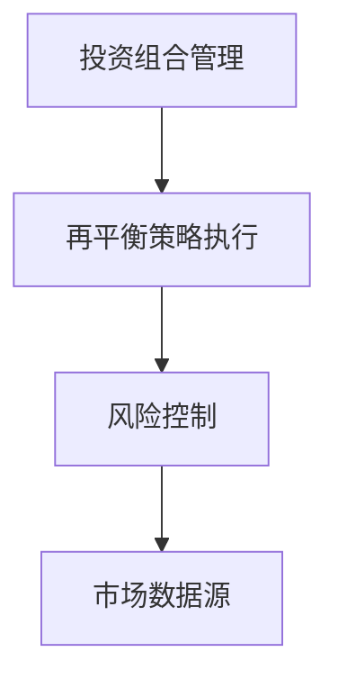

                 


# 乔尔·提尔尼的投资组合再平衡策略

> 关键词：投资组合再平衡，乔尔·提尔尼，投资策略，风险管理，资产配置，数学模型

> 摘要：本文详细介绍了乔尔·提尔尼的投资组合再平衡策略，从背景、原理到系统设计与实战应用，结合数学模型和算法实现，帮助读者全面理解该策略的核心思想和应用场景。

---

## 第一部分: 投资组合再平衡策略的背景与基础

### 第1章: 投资组合再平衡的概述

#### 1.1 投资组合再平衡的定义与背景

投资组合再平衡是投资管理中的一个重要概念，指的是根据市场变化和投资者的财务状况调整投资组合的构成，以维持或优化投资目标的过程。再平衡的核心目标是确保投资组合的风险和收益与投资者的长期目标保持一致。

**1.1.1 投资组合再平衡的定义**

投资组合再平衡是一种主动的投资管理策略，通过定期调整投资组合的资产配置，以应对市场波动、个人财务变化或投资目标的调整。再平衡的目的是为了维持投资组合的最优配置，从而实现长期的收益最大化。

**1.1.2 再平衡的必要性与目的**

再平衡的必要性源于市场环境的动态变化和投资者风险偏好的调整。例如，股票市场的波动可能导致投资组合中某类资产的比例偏离预期，从而增加整体风险。通过再平衡，投资者可以将资金重新分配到表现不佳或潜力更大的资产上，优化整体收益。

**1.1.3 投资组合再平衡的核心要素**

- **时间间隔**：再平衡的频率（如季度、半年或年度）取决于市场波动性和投资者的风险承受能力。
- **资产配置**：根据目标比例调整各类资产的权重。
- **风险控制**：通过调整避免单一资产的过度暴露。

#### 1.2 乔尔·提尔尼的投资策略特点

乔尔·提尔尼以其独特的投资组合再平衡策略闻名，其策略结合了长期投资与动态调整，注重风险管理和资产配置的优化。

**1.2.1 乔尔·提尔尼的背景与投资理念**

提尔尼是一位经验丰富的投资专家，其策略强调长期视角和风险管理。他认为，再平衡不仅是对市场变化的反应，更是对投资目标的持续优化。

**1.2.2 提尔尼策略的核心思想**

提尔尼策略的核心在于通过定期再平衡，维持投资组合的最优配置，同时控制风险。他主张根据市场环境和投资者的目标调整资产比例，以实现稳健的长期收益。

**1.2.3 策略与传统投资策略的对比**

传统投资策略通常采用静态配置，而提尔尼策略强调动态调整。这种动态调整使得投资组合能够更好地应对市场变化，同时保持风险可控。

#### 1.3 投资组合再平衡的数学模型

为了量化再平衡的过程，我们可以通过数学模型来描述。

**1.3.1 投资组合的数学表达**

假设一个投资组合包含n种资产，每种资产的权重为w_i，总和为1。数学表达式如下：

$$\sum_{i=1}^{n} w_i = 1$$

**1.3.2 再平衡的优化目标**

目标是最小化投资组合的风险（如波动率）并最大化收益。优化目标函数可以表示为：

$$\min_w \sigma^2(w)$$

其中，σ²(w)是投资组合的方差。

**1.3.3 线性规划与非线性优化的对比**

线性规划适用于简单的优化问题，而非线性优化能够处理更为复杂的场景，如非线性风险函数。

---

## 第二部分: 提尔尼策略的核心原理

### 第2章: 投资组合再平衡的原理与机制

#### 2.1 投资组合再平衡的原理

再平衡的原理是通过调整资产权重，使投资组合的风险和收益与目标一致。

**2.1.1 投资组合的动态调整**

动态调整是指根据市场变化实时调整资产配置，以捕捉收益或规避风险。

**2.1.2 市场波动与资产配置的关系**

市场波动会导致资产比例偏离目标，再平衡通过调整恢复目标配置。

**2.1.3 再平衡的数学模型与公式**

再平衡的数学模型可以表示为：

$$w_i^{new} = \frac{w_i^{old} \cdot a_i}{\sum_{j=1}^{n} w_j^{old} \cdot a_j}$$

其中，a_i是资产i的调整因子。

#### 2.2 提尔尼策略的核心机制

提尔尼策略通过动态调整和风险控制实现长期收益。

**2.2.1 资产配置的动态调整**

根据市场环境变化，动态调整资产权重。

**2.2.2 风险控制的实现方式**

通过设定止损点和风险调整因子，控制投资组合的整体风险。

**2.2.3 策略的可扩展性与适用性**

提尔尼策略适用于不同类型的投资者和市场环境。

#### 2.3 策略的数学模型与算法

**2.3.1 投资组合优化的线性规划模型**

线性规划模型用于简化投资组合优化问题。

**2.3.2 风险调整后的收益模型**

通过调整风险参数，优化收益。

**2.3.3 算法的实现步骤与代码示例**

以下是Python代码实现：

```python
import numpy as np
from scipy.optimize import minimize

def portfolio_optimization(weights, returns):
    n = len(weights)
    # 定义目标函数
    def objective(x):
        return -x.T @ returns @ x
    # 定义约束条件
    constraints = [{'type': 'eq', 'fun': lambda x: np.sum(x) - 1}]
    # 使用优化算法
    result = minimize(objective, weights, constraints=constraints)
    return result.x

# 示例数据
returns = np.array([[0.1, 0.2], [0.2, 0.1]])
initial_weights = np.array([0.5, 0.5])

optimal_weights = portfolio_optimization(initial_weights, returns)
print("最优权重:", optimal_weights)
```

---

## 第三部分: 提尔尼策略的系统设计与实现

### 第3章: 投资组合再平衡的系统架构

#### 3.1 系统功能设计

**3.1.1 投资组合管理模块**

负责监控和管理投资组合。

**3.1.2 再平衡策略执行模块**

根据市场数据调整资产配置。

**3.1.3 风险控制模块**

实时监控并控制投资组合的风险。

#### 3.2 系统架构设计

使用模块化设计，确保各部分高效协同。

**3.2.1 模块化设计**

模块化设计使得系统易于扩展和维护。

**3.2.2 系统交互流程**

从数据获取到策略执行的流程设计。

**3.2.3 系统架构的Mermaid图**



#### 3.3 系统接口设计

**3.3.1 输入接口**

接收市场数据和投资者参数。

**3.3.2 输出接口**

输出调整后的投资组合配置。

**3.3.3 数据流的交互过程**

从数据输入到处理再到输出的全过程。

#### 3.4 本章小结

系统设计确保了提尔尼策略的有效实施。

---

## 第四部分: 提尔尼策略的实战应用

### 第4章: 投资组合再平衡的实战案例

#### 4.1 实战环境安装与配置

**4.1.1 开发环境的选择**

选择合适的开发环境和工具。

**4.1.2 数据源的获取与处理**

获取市场数据并进行清洗和预处理。

**4.1.3 工具链的安装与配置**

安装必要的软件和库，如Python和Pandas。

#### 4.2 核心代码实现

**4.2.1 投资组合优化的Python代码**

实现投资组合优化的代码示例。

**4.2.2 再平衡策略的实现代码**

实现再平衡策略的代码。

**4.2.3 风险控制的代码实现**

实现风险控制的代码。

#### 4.3 实战案例分析

**4.3.1 案例背景介绍**

介绍案例的背景和目标。

**4.3.2 策略执行过程**

详细描述策略执行的步骤。

**4.3.3 结果分析与优化**

分析结果并进行优化。

#### 4.4 本章小结

总结实战案例的经验和教训。

---

## 第五部分: 提尔尼策略的风险管理与优化

### 第5章: 投资组合再平衡的风险管理

#### 5.1 风险管理的核心原则

**5.1.1 风险与收益的平衡**

寻找风险与收益的最佳平衡点。

**5.1.2 风险控制的实现方式**

通过多种手段控制风险。

**5.1.3 风险管理的数学模型**

使用数学模型量化风险。

#### 5.2 提尔尼策略的优化方向

**5.2.1 策略的可扩展性优化**

提升策略的可扩展性。

**5.2.2 策略的鲁棒性优化**

增强策略的鲁棒性。

**5.2.3 策略的效率优化**

提高策略的执行效率。

#### 5.3 最佳实践与注意事项

**5.3.1 策略实施中的常见问题**

总结常见问题及解决方法。

**5.3.2 小结**

总结全文内容。

**5.3.3 注意事项**

提醒读者注意策略实施中的关键点。

---

## 作者：AI天才研究院/AI Genius Institute & 禅与计算机程序设计艺术 /Zen And The Art of Computer Programming

---

通过以上结构，我们可以全面、系统地理解乔尔·提尔尼的投资组合再平衡策略，并在实际应用中灵活运用。

