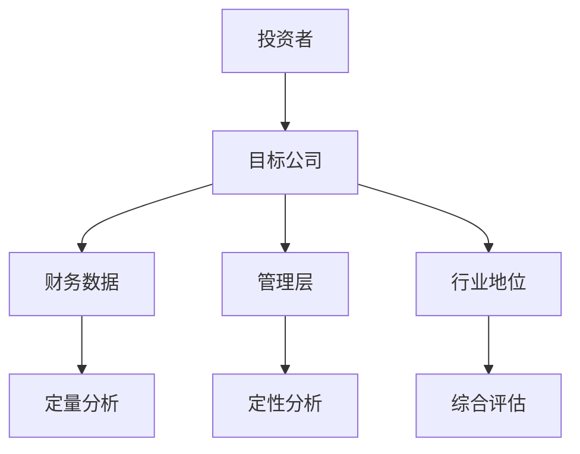
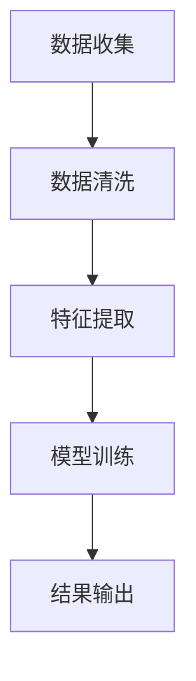
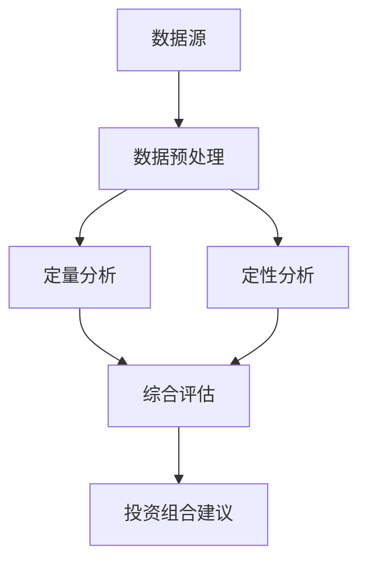

                 


# 乔尔·提林加斯特的价值投资方法：定量与定性的平衡

## 关键词：价值投资，乔尔·提林加斯特，定量分析，定性分析，投资策略

## 摘要：  
乔尔·提林加斯特的价值投资方法强调了定量分析与定性分析的平衡。本文详细介绍了价值投资的核心概念、定量分析与定性分析的结合方法，以及如何通过系统架构和实际案例实现这一平衡。文章首先从价值投资的基本概念入手，分析了定量分析与定性分析的区别和联系，然后详细探讨了提林加斯特的投资策略，包括数学模型、系统架构设计和实际项目案例。最后，总结了定量与定性分析结合的重要性，并给出了投资建议。

---

# 第一部分：价值投资与定量定性平衡概述

## 第1章：价值投资的定义与核心要素

### 1.1 价值投资的起源与发展

#### 1.1.1 价值投资的起源
价值投资起源于20世纪初，由本杰明·格雷厄姆和菲利普·费雪等投资家发展完善。格雷厄姆提出的“安全边际”概念奠定了价值投资的基础，即通过寻找市场价格低于其内在价值的股票，实现长期稳定的收益。

#### 1.1.2 价值投资的核心理念
价值投资的核心理念是寻找被市场低估的股票，强调长期持有和分散投资。投资者需要从基本面分析的角度，评估公司的内在价值，避免短期市场波动的影响。

#### 1.1.3 乔尔·提林加斯特的贡献
乔尔·提林加斯特是价值投资领域的知名投资者，他将定量分析与定性分析相结合，提出了独特的投资方法。他强调通过数学模型筛选股票，同时关注公司的管理层、行业地位和竞争优势。

### 1.2 定量分析与定性分析的定义

#### 1.2.1 定量分析的定义与特点
定量分析是指通过统计和数学方法，对股票的财务数据进行分析，以评估其投资价值。常见的定量指标包括市盈率（P/E）、市净率（P/B）和股息率等。

#### 1.2.2 定性分析的定义与特点
定性分析关注非数值因素，如公司的治理结构、管理层能力、行业地位和竞争优势等。这些因素难以量化，但对公司的长期发展和投资价值有重要影响。

#### 1.2.3 定量与定性分析的结合
提林加斯特的投资方法强调定量与定性分析的结合。他通过定量分析筛选出符合条件的股票，再通过定性分析进一步评估其投资价值，最终构建出优质的投资组合。

---

## 第2章：价值投资的核心概念与联系

### 2.1 核心概念原理

#### 2.1.1 价值投资的三要素模型
价值投资的核心要素包括公司基本面、市场估值和长期竞争优势。提林加斯特通过这三要素的综合评估，筛选出具有长期增长潜力的股票。

#### 2.1.2 定量分析的数学模型
定量分析的核心是通过数学模型评估股票的估值。例如，市盈率模型（P/E）和市净率模型（P/B）常用于衡量股票的相对估值。

#### 2.1.3 定性分析的关键维度
定性分析关注公司的治理结构、管理层能力和行业地位。提林加斯特认为，优秀的管理层和强大的行业地位是公司长期增长的关键。

### 2.2 概念属性特征对比表

| 特性         | 定量分析 | 定性分析 |
|--------------|----------|----------|
| 分析内容     | 财务数据 | 非财务因素 |
| 分析方法     | 统计模型 | 专家判断 |
| 优缺点       | 客观性高，但可能忽略非财务因素 | 主观性高，但能提供更全面的评估 |

### 2.3 实体关系图



---

## 第3章：定量分析的算法原理

### 3.1 定量分析的数学模型

#### 3.1.1 市盈率模型
$$ P/E = \frac{Price}{Earnings} $$
市盈率是股票价格与每股收益的比率，用于衡量股票的估值水平。

#### 3.1.2 市净率模型
$$ P/B = \frac{Price}{Book\ Value} $$
市净率是股票价格与每股净资产的比率，适用于评估资产密集型行业的公司。

#### 3.1.3 股息率模型
$$ Dividend\ Yield = \frac{Dividend}{Price} $$
股息率是股票每年派发的股息与股票价格的比率，用于衡量股票的分红能力。

### 3.2 定量分析的流程图



### 3.3 定量分析的Python实现

```python
import pandas as pd

# 数据收集
data = pd.read_csv('stock_data.csv')

# 数据清洗
data.dropna(inplace=True)

# 特征提取
features = data[['PE', 'PB', 'Dividend_Yield']]

# 模型训练
from sklearn.linear_model import LinearR
model = LinearR().fit(features, data['Target'])
```

---

## 第4章：定性分析的关键维度

### 4.1 公司治理结构
公司治理结构是定性分析的重要内容。良好的治理结构能够确保公司管理层的有效运作和股东权益的保护。

### 4.2 管理层能力
管理层的能力和决策对公司的发展至关重要。提林加斯特注重评估管理层的历史业绩和战略眼光。

### 4.3 行业地位
行业地位反映了公司在行业中的竞争力。提林加斯特倾向于投资行业领先者，因为它们具有更强的市场影响力和议价能力。

---

## 第5章：定量与定性的结合

### 5.1 综合评估模型
提林加斯特提出的综合评估模型将定量和定性分析结合，为每只股票打分，最终筛选出优质的投资标的。

### 5.2 投资组合构建
通过综合评估模型筛选出的股票，结合风险分散原则，构建投资组合。提林加斯特强调分散投资，以降低组合风险。

### 5.3 风险控制
在投资组合管理中，提林加斯特采用风险控制措施，如止损策略和定期再平衡，确保组合的长期稳定收益。

---

## 第6章：系统架构与实现

### 6.1 投资分析系统设计



### 6.2 核心功能实现

```python
def quantitative_analysis(data):
    # 计算市盈率、市净率和股息率
    data['PE'] = data['Price'] / data['Earnings']
    data['PB'] = data['Price'] / data['Book Value']
    data['Dividend_Yield'] = data['Dividend'] / data['Price']
    return data

def qualitative_analysis(data):
    # 评估公司治理、管理层和行业地位
    data['Governance_Score'] = data['Governance'].apply(governance_score)
    data['Management_Score'] = data['Management'].apply(management_score)
    data['Industry_Position'] = data['Industry'].apply(industry_position)
    return data
```

---

## 第7章：项目实战与案例分析

### 7.1 数据收集与清洗

```python
import pandas as pd

# 数据收集
data = pd.read_csv('stock_data.csv')

# 数据清洗
data.dropna(inplace=True)
```

### 7.2 定量分析与筛选

```python
def calculate_quantitative_scores(data):
    data['PE'] = data['Price'] / data['Earnings']
    data['PB'] = data['Price'] / data['Book Value']
    data['Dividend_Yield'] = data['Dividend'] / data['Price']
    return data

data = calculate_quantitative_scores(data)
data.sort_values('PE', ascending=True).head(10)
```

### 7.3 定性分析与评估

```python
def calculate_qualitative_scores(data):
    data['Governance_Score'] = data['Governance'].apply(governance_score)
    data['Management_Score'] = data['Management'].apply(management_score)
    data['Industry_Position'] = data['Industry'].apply(industry_position)
    return data

data = calculate_qualitative_scores(data)
data[['Company', 'Governance_Score', 'Management_Score', 'Industry_Position']].head(10)
```

### 7.4 综合评估与投资组合构建

```python
def combine_quantitative_qualitative(data):
    # 综合评分
    data['Total_Score'] = data['PE'] + data['Governance_Score']
    # 筛选优质股票
    data = data[data['Total_Score'] > 7]
    return data

data = combine_quantitative_qualitative(data)
data.head(10)
```

---

## 第8章：总结与展望

### 8.1 总结
乔尔·提林加斯特的价值投资方法强调定量与定性分析的结合。通过数学模型和专家判断的结合，投资者能够更全面地评估股票的投资价值，构建出优质的投资组合。

### 8.2 展望
随着大数据和人工智能技术的发展，未来的价值投资方法将更加依赖于定量分析和定性分析的结合。投资者需要不断学习新技术，提升分析能力，以应对市场的变化。

### 8.3 最佳实践 tips
1. 在进行投资决策时，结合定量和定性分析，避免单一方法的局限性。
2. 定期审视投资组合，及时调整以应对市场变化。
3. 风险控制是投资成功的关键，合理配置资产，分散投资风险。

---

## 作者：AI天才研究院/AI Genius Institute & 禅与计算机程序设计艺术/Zen And The Art of Computer Programming

---

希望这篇文章能为您提供有价值的投资方法和启示！

