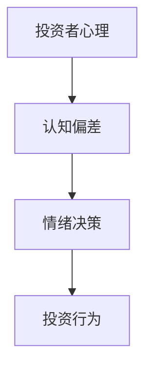

                 

# 乔尔·提林加斯特的行为金融学在价值投资中的应用

---

## 关键词：
行为金融学、价值投资、乔尔·提林加斯特、认知偏差、情绪决策、投资策略、系统性风险

---

## 摘要：
本文探讨了乔尔·提林加斯特的行为金融学理论在价值投资中的应用。通过分析投资者心理、认知偏差和情绪决策，结合具体的数学模型和案例分析，本文展示了如何利用行为金融学优化价值投资策略。文章从行为金融学的背景入手，详细讲解其核心概念，并通过实际案例分析，说明如何在实际投资中应用这些理论。

---

# 正文

## 第一部分：行为金融学与价值投资的背景

### 第1章：行为金融学的起源与发展

#### 1.1 行为金融学的定义与核心概念

行为金融学（Behavioral Finance）是研究投资者心理和行为如何影响金融市场的学科。与传统金融学不同，行为金融学认为，投资者的决策不仅仅基于理性的分析，还受到心理、情感和社会环境的影响。

- **定义**：行为金融学研究投资者心理、认知偏差和情绪对金融市场的影响。
- **核心概念**：
  - **投资者心理**：投资者在决策过程中的心理特征。
  - **认知偏差**：人们在信息处理过程中产生的系统性错误。
  - **情绪决策**：情绪对投资决策的影响。

行为金融学与传统金融学的主要区别在于，传统金融学假设投资者是理性的，而行为金融学承认投资者的非理性行为对市场的影响。

#### 1.2 乔尔·提林加斯特的贡献

乔尔·提林加斯特（Joel Tillingast）是行为金融学领域的代表人物之一。他的研究将心理学与金融学结合，提出了许多重要的理论，包括：

- **投资者心理模型**：分析投资者在不同市场环境下的心理状态。
- **情绪周期理论**：研究市场情绪的变化周期及其对投资的影响。
- **认知偏差与投资决策**：揭示认知偏差如何影响投资者的决策。

#### 1.3 价值投资的基本原理

价值投资是一种以寻找被市场低估的资产为核心的投资策略。其核心理念包括：

- **低市盈率法**：寻找市盈率低于行业平均水平的公司。
- **高质量资产法**：选择财务健康、管理优秀的企业。
- **股息率法**：关注高股息率的股票。

### 第2章：行为金融学的核心概念与联系

#### 2.1 投资者心理与决策行为

投资者心理是行为金融学的核心内容之一。投资者在决策过程中会受到以下心理因素的影响：

- **风险偏好**：投资者对风险的承受能力。
- **损失厌恶**：投资者对损失的厌恶程度。
- **过度自信**：投资者对自己判断的过度信任。

#### 2.2 行为金融学的数学模型

行为金融学中常用的数学模型包括：

- **期望效用理论**：描述投资者如何在不确定环境中做出决策。
- **前景理论**：分析投资者在收益和损失面前的决策偏好。

#### 2.3 实体关系图

## 第二部分：价值投资中的行为金融学应用

### 第3章：价值投资中的行为金融学策略框架

#### 3.1 投资策略的制定

价值投资策略的制定需要结合行为金融学的理论：

- **目标设定**：明确投资目标和风险承受能力。
- **策略选择**：选择适合自己的投资策略。
- **计划制定**：制定详细的投资计划。

#### 3.2 行为金融学框架下的风险管理

风险管理是投资过程中不可忽视的一部分。行为金融学提供了以下风险管理工具：

- **止损策略**：设定止损点以限制损失。
- **分散投资**：通过分散投资降低风险。

### 第4章：价值投资中的系统性风险与情绪周期

#### 4.1 系统性风险的分析

系统性风险是整个市场环境带来的风险，包括经济衰退、政策变化等。行为金融学认为，系统性风险可以通过分析市场情绪来预测和管理。

#### 4.2 情绪周期的分析

市场情绪具有周期性。投资者可以通过分析情绪周期，找到投资机会。

### 第5章：投资者认知偏差与决策错误

#### 5.1 认知偏差的类型

常见的认知偏差包括：

- **锚定效应**：过度依赖某个信息点。
- **过度自信**：高估自己的判断能力。
- **沉没成本谬误**：继续投资已经亏损的项目。

#### 5.2 认知偏差对投资决策的影响

认知偏差可能导致投资者做出错误决策，例如过度交易和盲目跟风。

### 第6章：行为金融学与价值投资的数学模型

#### 6.1 投资组合优化的数学模型

现代投资组合理论（MPT）是行为金融学的重要工具之一。其公式为：

$$
\text{风险} = \sqrt{\text{权重}^T \Sigma \text{权重}}
$$

其中，Σ 是资产之间的协方差矩阵。

#### 6.2 情绪对股价影响的数学模型

情绪指数可以量化市场情绪。其计算公式为：

$$
\text{情绪指数} = \frac{\text{上涨股票数量} - \text{下跌股票数量}}{\text{总股票数量}}
$$

### 第7章：行为金融学与价值投资的案例分析

#### 7.1 案例分析

以2008年金融危机为例，分析市场情绪对投资决策的影响。

#### 7.2 案例分析的步骤

- **确定目标**：分析金融危机中投资者的行为。
- **收集数据**：收集相关数据。
- **分析结果**：总结市场情绪对投资的影响。

---

## 第三部分：结论与展望

### 第8章：总结

行为金融学为价值投资提供了新的视角。通过分析投资者心理和情绪，投资者可以做出更理性的决策。

### 第9章：未来展望

未来，行为金融学将与人工智能结合，进一步优化投资策略。

---

## 作者

**作者：AI天才研究院/AI Genius Institute & 禅与计算机程序设计艺术 /Zen And The Art of Computer Programming**

---

**注**：本文为技术博客文章，内容基于乔尔·提林加斯特的行为金融学理论，结合实际案例分析，深入探讨了行为金融学在价值投资中的应用。

