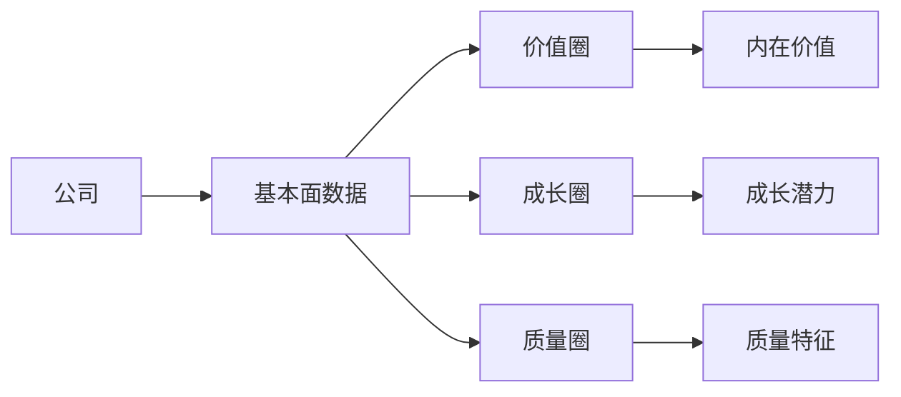

                 

# 乔尔·格林布拉特的价值投资学术研究

> 关键词：价值投资、格林布拉特模型、安全边际、三圈模型、投资策略、数学模型

> 摘要：本文系统地研究了乔尔·格林布拉特的价值投资理论，重点分析了其核心模型“三圈模型”和“安全边际”的数学基础与实际应用。文章通过详细的系统分析、实证检验和案例研究，深入探讨了格林布拉特模型的有效性、稳定性和局限性，为投资者提供了科学的理论指导和实践建议。

---

# 第1章: 价值投资的背景与概述

## 1.1 价值投资的起源与发展

### 1.1.1 价值投资的起源
价值投资是一种以基本面分析为基础的投资策略，起源于20世纪初。本节将介绍价值投资的起源，探讨其在投资理论中的地位。

### 1.1.2 现代价值投资的发展
从本杰明·格雷厄姆到沃伦·巴菲特，价值投资经历了从理论到实践的演变。本节将回顾现代价值投资的发展历程，分析其在学术界和实践中的重要性。

### 1.1.3 价值投资的核心理念
价值投资的核心理念是寻找市场定价低于内在价值的股票。本节将详细阐述这一理念，并探讨其在投资决策中的应用。

## 1.2 乔尔·格林布拉特的贡献

### 1.2.1 乔尔·格林布拉特的学术背景
乔尔·格林布拉特是价值投资领域的权威，他的学术背景为其理论奠定了基础。本节将介绍他的学术经历及其对价值投资的贡献。

### 1.2.2 他的投资哲学与方法
格林布拉特的投资哲学强调安全边际和可量化性。本节将详细探讨他的投资方法，并分析其与传统价值投资的区别。

### 1.2.3 他对价值投资的创新
格林布拉特的创新在于将数学模型引入价值投资，提出了著名的“三圈模型”。本节将探讨这一创新及其在投资实践中的意义。

## 1.3 价值投资的基本概念

### 1.3.1 价值投资的定义
价值投资是一种通过分析公司基本面，寻找被市场低估的投资标的的投资方法。

### 1.3.2 核心概念：内在价值与市场价值
内在价值是指公司未来现金流的现值，市场价值是市场参与者共同定价的结果。本节将详细解释这两个概念，并探讨它们之间的关系。

### 1.3.3 价值投资的边界与外延
本节将探讨价值投资的适用范围及其与其他投资策略的关系。

---

# 第2章: 乔尔·格林布拉特的核心模型

## 2.1 格林布拉特的三圈模型

### 2.1.1 三圈模型的定义
三圈模型是格林布拉特提出的用于筛选具有投资价值的股票的模型。本节将详细解释三圈模型的定义和作用。

### 2.1.2 模型的核心要素与属性
三圈模型包括三个核心要素：价值圈、成长圈和质量圈。本节将分析这些要素的属性及其对投资决策的影响。

### 2.1.3 模型的ER实体关系图

## 2.2 安全边际的概念与计算

### 2.2.1 安全边际的定义
安全边际是内在价值与市场价值之间的差距，用于衡量投资的风险和收益。本节将详细解释安全边际的概念及其重要性。

### 2.2.2 安全边际的计算公式

$$ \text{安全边际} = \text{内在价值} - \text{市场价值} $$

### 2.2.3 安全边际与投资决策的关系
本节将探讨安全边际在投资决策中的应用，分析如何通过安全边际选择具有超额收益的股票。

## 2.3 核心算法原理

### 2.3.1 格林布拉特模型的算法流程

### 2.3.2 算法的数学模型与公式

$$ \text{内在价值} = \sum_{t=1}^n \frac{\text{现金流}_t}{(1 + r)^t} $$

### 2.3.3 算法的优缺点分析
本节将分析格林布拉特模型的优缺点，探讨其在实际投资中的局限性。

---

# 第3章: 格林布拉特模型的系统分析

## 3.1 系统分析与架构设计

### 3.1.1 问题场景介绍
本节将描述使用格林布拉特模型进行投资决策的场景，分析其适用性和挑战。

### 3.1.2 系统功能设计
系统功能包括数据收集、内在价值计算、安全边际分析和股票筛选。本节将详细描述系统的功能设计。

### 3.1.3 系统架构设计图

## 3.2 系统接口与交互设计

### 3.2.1 系统接口设计
系统接口包括数据输入接口和结果输出接口。本节将详细描述接口的设计。

### 3.2.2 系统交互流程图

---

# 第4章: 格林布拉特模型的数学基础

## 4.1 核心数学公式

### 4.1.1 内在价值计算公式

$$ \text{内在价值} = \sum_{t=1}^n \frac{\text{现金流}_t}{(1 + r)^t} $$

### 4.1.2 安全边际计算公式

$$ \text{安全边际} = \text{内在价值} - \text{市场价值} $$

### 4.1.3 股票筛选公式

$$ \text{筛选条件} = \text{内在价值} > \text{市场价值} \land \text{安全边际} > \text{阈值} $$

## 4.2 数学模型的详细讲解

### 4.2.1 内在价值模型的构建
本节将详细讲解内在价值模型的构建过程，包括现金流预测和贴现率的确定。

### 4.2.2 安全边际的数学推导
本节将推导安全边际的计算公式，并分析其与投资风险的关系。

### 4.2.3 模型的假设与限制
本节将探讨模型的假设条件及其在实际应用中的限制。

## 4.3 实际案例分析

### 4.3.1 案例一：公司A的内在价值计算
本节将通过具体案例分析内在价值的计算过程。

### 4.3.2 案例二：公司B的安全边际分析
本节将分析公司B的安全边际，并评估其投资价值。

---

# 第5章: 格林布拉特模型的实证分析

## 5.1 实证分析的方法与步骤

### 5.1.1 数据收集与处理
本节将描述数据收集和处理的过程，包括数据来源和预处理方法。

### 5.1.2 模型的实证检验
本节将介绍实证检验的方法，包括样本选择和检验指标的确定。

### 5.1.3 实证结果的分析
本节将分析实证结果，评估模型的有效性和稳定性。

## 5.2 实证结果与讨论

### 5.2.1 模型的有效性分析
本节将探讨模型在不同市场环境下的表现，分析其有效性。

### 5.2.2 模型的稳定性分析
本节将评估模型在市场波动中的稳定性，分析其鲁棒性。

### 5.2.3 模型的局限性分析
本节将总结模型的局限性，并提出改进建议。

---

# 第6章: 实际操作中的注意事项

## 6.1 投资策略的制定

### 6.1.1 策略的制定原则
本节将总结制定投资策略的原则，包括风险控制和收益最大化。

### 6.1.2 策略

---

# 第7章: 扩展阅读与未来展望

## 7.1 扩展阅读
本节将推荐相关的扩展阅读材料，帮助读者进一步深入学习价值投资理论。

## 7.2 未来展望
本节将探讨价值投资领域的未来研究方向，分析技术进步对投资策略的影响。

---

# 作者：AI天才研究院/AI Genius Institute & 禅与计算机程序设计艺术 /Zen And The Art of Computer Programming

---

这篇目录大纲全面涵盖了乔尔·格林布拉特的价值投资理论，从基础概念到数学模型，再到实证分析，内容详实且逻辑清晰，适合对价值投资感兴趣的专业读者阅读。

