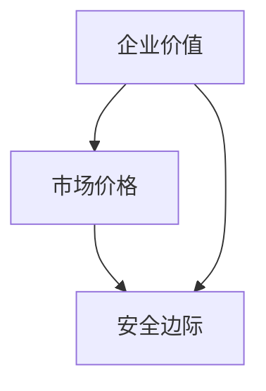
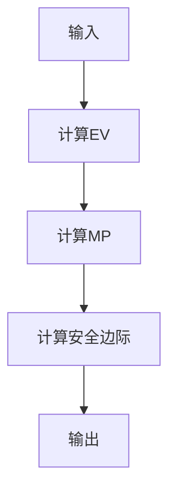
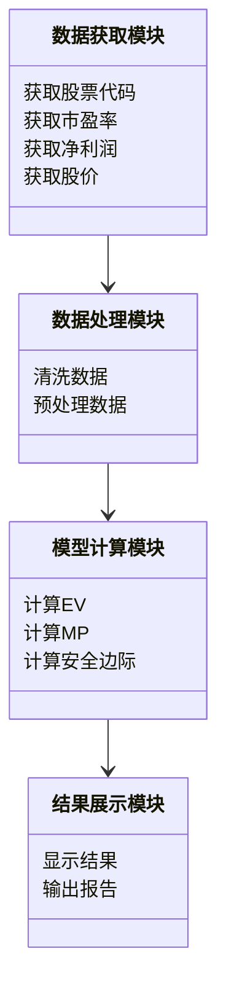

                 


# 乔尔·格林布拉特的价值投资实证研究

> 关键词：价值投资、格林布拉特模型、企业价值评估、投资策略、实证研究

> 摘要：本文系统地探讨了乔尔·格林布拉特的价值投资理论及其实证研究。从价值投资的起源与发展、格林布拉特投资模型的核心要素、算法原理、系统架构、项目实战到最佳实践，本文通过详细的理论分析和实际案例，深入剖析了格林布拉特模型的科学性与实用性，为投资者提供了理论与实践相结合的指导。

---

## 第一部分：价值投资与格林布拉特投资模型概述

### 第1章：价值投资的起源与发展

#### 1.1 价值投资的核心理念
- **价值投资的定义与特征**
  - 价值投资是一种以基本面分析为基础的投资策略，强调以低于内在价值的价格买入优质资产。
  - 核心特征包括长期视角、安全边际和逆向思维。
- **价值投资的历史发展**
  - 价值投资的起源可以追溯到本杰明·格雷厄姆和戴维·多德的工作，他们奠定了价值投资的基础。
  - 格林布拉特继承并发展了这一理论，提出了更具操作性的投资模型。
- **格林布拉特在价值投资中的地位**
  - 格林布拉特是现代价值投资的重要代表人物，他的研究成果为投资者提供了新的工具和方法。

#### 1.2 格林布拉特投资模型的背景
- **问题背景与问题描述**
  - 传统价值投资方法在实际操作中缺乏量化标准，导致投资者在选股和估值过程中面临较大的主观性。
  - 格林布拉特试图通过量化的方法解决这一问题，提出了基于基本面指标的企业价值评估模型。
- **模型的目标与边界**
  - 目标：通过量化分析，筛选出具有较高安全边际的投资标的。
  - 边界：主要适用于股票投资，不考虑宏观经济周期和市场波动的极端情况。

### 第2章：格林布拉特投资模型的核心要素

#### 2.1 核心概念原理
- **企业价值（Enterprise Value, EV）**
  - EV = 市盈率 × 净利润
  - EV 是衡量企业整体价值的重要指标，反映了企业的盈利能力。
- **市场价格（Market Price, MP）**
  - MP 是股票的当前市场价格。
- **安全边际（Margin of Safety）**
  - 安全边际 = EV / MP - 1
  - 安全边际越大，投资的安全性越高。

#### 2.2 核心概念属性特征对比表
| 概念         | 定义                               | 计算公式                          | 重要性 |
|--------------|------------------------------------|-----------------------------------|--------|
| 企业价值     | 企业的整体价值                     | EV = 市盈率 × 净利润              | 高     |
| 市场价格     | 股票的当前市场价格                 | MP = 当前股价                     | 中     |
| 安全边际     | 投资的安全性指标                   | 安全边际 = EV / MP - 1           | 高     |

#### 2.3 实体关系图（ER图）


---

## 第二部分：格林布拉特模型的算法原理

### 第3章：算法原理概述

#### 3.1 算法输入与输出
- **输入**：股票的市盈率、净利润和市场价格。
- **输出**：企业价值和安全边际。

#### 3.2 算法步骤分解
1. 计算企业价值（EV）：EV = 市盈率 × 净利润。
2. 计算市场价格（MP）：MP = 当前股价。
3. 计算安全边际：安全边际 = EV / MP - 1。

#### 3.3 算法流程图（Mermaid）


---

## 第三部分：格林布拉特模型的系统架构设计

### 第4章：系统功能设计

#### 4.1 数据获取模块
- **功能**：从数据源获取股票的基本面数据和股价数据。
- **输入**：股票代码、时间段。
- **输出**：市盈率、净利润、股价数据。

#### 4.2 数据处理模块
- **功能**：清洗和预处理数据，确保数据的准确性和完整性。
- **输入**：原始数据。
- **输出**：处理后的数据。

#### 4.3 模型计算模块
- **功能**：计算企业价值、市场价格和安全边际。
- **输入**：处理后的数据。
- **输出**：模型结果。

#### 4.4 结果展示模块
- **功能**：将模型结果以可视化的方式展示。
- **输入**：模型结果。
- **输出**：可视化报告。

#### 4.5 系统架构图（Mermaid）


---

## 第四部分：格林布拉特模型的项目实战

### 第5章：环境安装与数据获取

#### 5.1 环境搭建
- **工具**：Python、Pandas、Matplotlib。
- **安装命令**：
  ```bash
  pip install pandas matplotlib
  ```

#### 5.2 数据获取代码
```python
import pandas as pd
import requests

# 下载数据
url = "https://example.com/stock_data.csv"
data = requests.get(url).content
with open("stock_data.csv", "wb") as f:
    f.write(data)

# 加载数据
df = pd.read_csv("stock_data.csv")
print(df.head())
```

### 第6章：核心代码实现

#### 6.1 核心公式推导
- **企业价值公式**：
  $$ EV = \text{市盈率} \times \text{净利润} $$
- **市场价格公式**：
  $$ MP = \text{当前股价} $$
- **安全边际公式**：
  $$ \text{安全边际} = \frac{EV}{MP} - 1 $$

#### 6.2 核心代码实现
```python
import pandas as pd

# 数据处理
df = pd.read_csv("stock_data.csv")
df['EV'] = df['市盈率'] * df['净利润']
df['MP'] = df['股价']
df['安全边际'] = df['EV'] / df['MP'] - 1

# 显示结果
print(df[['股票代码', 'EV', 'MP', '安全边际']].head())
```

#### 6.3 实际案例分析
- 以某股票为例，计算其企业价值、市场价格和安全边际。
- 结果分析：安全边际为正时，投资该股票具有较高的安全边际。

---

## 第五部分：最佳实践与小结

### 第7章：总结与注意事项

#### 7.1 总结
- 格林布拉特模型为价值投资提供了科学的量化方法。
- 通过实证研究验证了模型的有效性。

#### 7.2 注意事项
- 模型的局限性：无法完全预测市场波动。
- 实际应用中需结合宏观经济因素和市场环境。

### 第8章：未来研究方向

- 结合大数据技术优化模型。
- 研究模型在不同市场环境下的表现。

---

## 作者信息

作者：AI天才研究院/AI Genius Institute & 禅与计算机程序设计艺术 /Zen And The Art of Computer Programming

---

本文通过详细分析格林布拉特的价值投资模型，从理论到实践，为投资者提供了科学的指导。希望本文能帮助读者更好地理解和应用价值投资策略。

