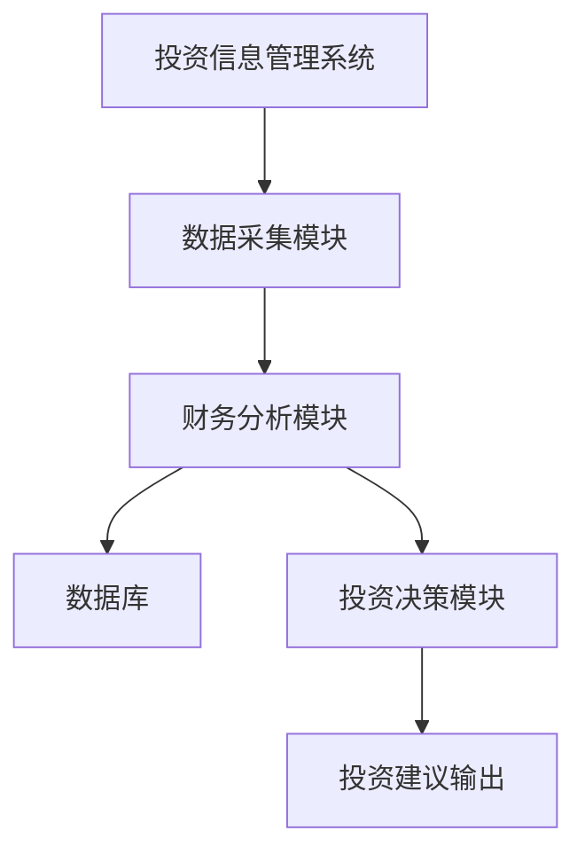

                 


# 乔尔·格林布拉特的价值投资教学方法

> 关键词：价值投资，乔尔·格林布拉特，安全边际，内在价值，投资策略

> 摘要：本文深入探讨了乔尔·格林布拉特的价值投资方法，从其核心理念、数学模型、系统架构到实际案例分析，全面解析了这一投资策略的精髓。通过详细的步骤分析和实际应用，帮助读者掌握如何在实际投资中运用格林布拉特的方法，实现稳健的投资回报。

---

## 第一部分: 价值投资的背景与发展

### 第1章: 价值投资的起源与发展

#### 1.1 价值投资的起源
##### 1.1.1 价值投资的定义与核心理念
价值投资是一种以基本面分析为基础的投资策略，其核心理念是通过分析企业的内在价值，寻找市场价格低于内在价值的投资标的。这种投资方法强调长期持有优质资产，而非短期价格波动。

##### 1.1.2 价值投资与其它投资方法的对比
- **价值投资**：基于企业的基本面分析，寻找被市场低估的投资标的。
- **成长投资**：侧重于选择具有高成长潜力的企业，关注未来收益而非当前估值。
- **指数投资**：通过投资指数基金，获得市场平均收益。

##### 1.1.3 乔尔·格林布拉特在价值投资中的地位
乔尔·格林布拉特是价值投资领域的知名投资者，以其独特的“烟蒂股”策略闻名。他的投资方法强调安全边际和内在价值的计算，为投资者提供了系统化的投资框架。

#### 1.2 价值投资的核心概念
##### 1.2.1 安全边际的定义与作用
安全边际是指市场价格与内在价值之间的差异。通过购买价格低于内在价值的股票，投资者可以在市场价格波动时降低风险。

##### 1.2.2 市场先生的概念与投资决策的关系
市场先生是格林布拉特提出的一个形象化概念，代表市场的波动性和不确定性。投资者应以冷静的理性应对市场先生的情绪波动，避免盲目跟风。

##### 1.2.3 内在价值的计算与市场价值的对比
内在价值是企业未来现金流的现值，与市场价值可能存在差异。通过比较两者，投资者可以找到被低估的投资标的。

#### 1.3 价值投资的适用场景与局限性
##### 1.3.1 价值投资的适用市场环境
适合于市场波动较大、存在估值偏差的情况，尤其在市场恐慌或低估时，价值投资策略更容易产生超额收益。

##### 1.3.2 价值投资在不同经济周期的表现
在经济繁荣期，价值投资可能表现平平；而在经济衰退期，优质企业的估值往往被市场低估，为价值投资者提供了机会。

##### 1.3.3 价值投资的局限性与改进方向
- **局限性**：依赖于对内在价值的准确计算，市场波动可能影响短期收益。
- **改进方向**：结合成长性和行业趋势，动态调整投资策略。

---

## 第二部分: 价值投资的核心方法论

### 第2章: 格林布拉特投资方法的核心步骤

#### 2.1 核心步骤
##### 2.1.1 确定投资目标
- 确定投资目标：选择具有竞争优势、稳定现金流和良好管理的企业。
- 行业分析：关注具有长期增长潜力的行业，如消费、医疗等。

##### 2.1.2 财务分析
- 财务报表分析：重点分析利润表、资产负债表和现金流量表。
- 关键指标：市盈率（P/E）、市净率（P/B）、股息率等。

##### 2.1.3 估值计算
- 内在价值计算：使用格林布拉特公式，结合未来现金流和贴现率，估算企业的内在价值。
- 安全边际分析：比较市场价格与内在价值的差异，确定投资的安全空间。

#### 2.2 格林布拉特公式与内在价值计算
##### 2.2.1 格林布拉特公式的基本结构
$$ \text{内在价值} = \frac{\text{息税前利润} \times (1 + g)}{WACC} $$
其中，g为增长率，WACC为加权平均资本成本。

##### 2.2.2 内在价值计算的关键变量
- 息税前利润（EBIT）
- 稳定增长率（g）
- 加权平均资本成本（WACC）

##### 2.2.3 公式在实际投资中的应用案例
假设某公司EBIT为1000万元，预计稳定增长率为5%，WACC为8%。则其内在价值为：
$$ \text{内在价值} = \frac{1000 \times (1 + 0.05)}{0.08} = 1312.5 \text{万元} $$

---

## 第三部分: 价值投资的系统化分析与架构

### 第3章: 投资流程的系统化架构

#### 3.1 投资流程的系统化架构
##### 3.1.1 信息收集与处理流程
1. 数据收集：获取企业的财务报表、行业数据和市场信息。
2. 数据清洗：剔除无效数据，确保数据的准确性和完整性。

##### 3.1.2 财务分析与估值计算流程
1. 计算关键财务指标：市盈率、市净率等。
2. 应用格林布拉特公式计算内在价值。

##### 3.1.3 投资决策与风险管理流程
1. 确定投资标的：比较市场价格与内在价值，选择具有安全边际的股票。
2. 风险管理：设定止损点，分散投资组合，降低风险。

#### 3.2 系统架构设计
##### 3.2.1 系统功能设计
- 数据采集模块：负责收集企业的财务数据和市场信息。
- 财务分析模块：计算关键财务指标和内在价值。
- 投资决策模块：根据分析结果生成投资建议。

##### 3.2.2 系统架构图


---

## 第四部分: 价值投资的数学模型与算法原理

### 第4章: 内在价值计算的数学模型

#### 4.1 内在价值计算的数学模型
##### 4.1.1 格林布拉特公式的数学表达
$$ V = \frac{FCF \times (1 + g)}{WACC} $$
其中，FCF为自由现金流，g为稳定增长率，WACC为加权平均资本成本。

##### 4.1.2 算法实现
```python
def calculate_intrinsic_value(FCF, g, WACC):
    return FCF * (1 + g) / WACC

FCF = 1000  # 单位：万元
g = 0.05
WACC = 0.08
intrinsic_value = calculate_intrinsic_value(FCF, g, WACC)
print(f"内在价值为：{intrinsic_value} 万元")
```

##### 4.1.3 示例计算与结果分析
假设FCF=1000万元，g=5%，WACC=8%，则内在价值为1312.5万元。如果市场价格低于此值，说明股票被低估，具有投资价值。

---

## 第五部分: 价值投资的项目实战

### 第5章: 项目实战分析

#### 5.1 实战环境安装
##### 5.1.1 数据源获取
- 财务数据：通过财经网站获取企业的财务报表。
- 市场数据：通过股票交易平台获取实时价格。

##### 5.1.2 工具安装
- 数据分析工具：Python、Pandas、NumPy。
- 可视化工具：Matplotlib、Seaborn。

#### 5.2 核心代码实现
##### 5.2.1 数据清洗与预处理
```python
import pandas as pd

# 假设df为包含财务数据的DataFrame
df.dropna(inplace=True)
df[' revenue'].replace(0, np.nan, inplace=True)
df.dropna(subset=['revenue'], inplace=True)
```

##### 5.2.2 内在价值计算
```python
def calculate_intrinsic_value(FCF, g, WACC):
    return FCF * (1 + g) / WACC

# 示例计算
FCF = df['FCF'].values[0]
g = 0.05
WACC = 0.08
intrinsic_value = calculate_intrinsic_value(FCF, g, WACC)
print(f"内在价值为：{intrinsic_value} 万元")
```

#### 5.3 案例分析与解读
##### 5.3.1 实战案例分析
以某公司为例，分析其财务数据，计算内在价值，比较市场价格，得出投资建议。

##### 5.3.2 投资策略调整
根据市场变化和企业基本面的变化，动态调整投资组合。

#### 5.4 项目小结
通过实战分析，读者可以掌握如何将理论应用于实际投资决策，理解格林布拉特方法的实际应用价值。

---

## 第六部分: 总结与展望

### 第6章: 总结与展望

#### 6.1 最佳实践 tips
- 系统化投资：建立完善的投资流程和系统，减少人为情绪干扰。
- 持续学习：关注行业动态和市场变化，不断优化投资策略。

#### 6.2 小结
格林布拉特的价值投资方法以内在价值计算为核心，通过安全边际的分析，帮助投资者在市场中找到低估的投资标的。其系统化的方法论为投资者提供了清晰的投资框架。

#### 6.3 注意事项
- 风险管理：设定止损点，分散投资组合，降低市场波动带来的风险。
- 数据质量：确保财务数据的准确性和完整性，避免错误分析。

#### 6.4 拓展阅读
- 《The Intelligent Investor》
- 《The Essays of Warren Buffett》
- 《Value Investing: A Comprehensive Guide》

---

## 作者：AI天才研究院/AI Genius Institute & 禅与计算机程序设计艺术 /Zen And The Art of Computer Programming

