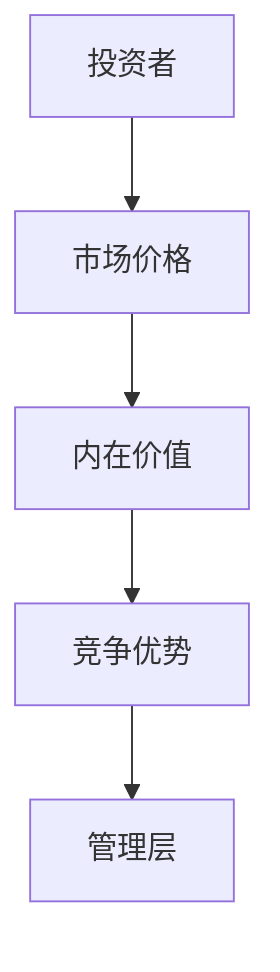
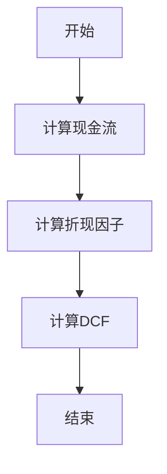
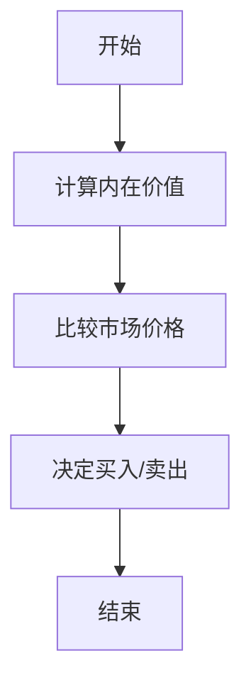
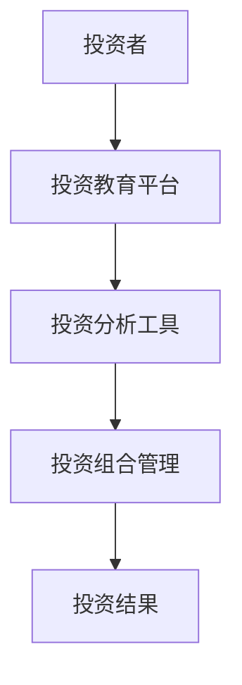

                 


# 《乔尔·格林布拉特的价值投资教育理念》

---

## 关键词：  
价值投资、格林布拉特、投资教育、教育理念、投资策略

---

## 摘要：  
本文深入探讨了乔尔·格林布拉特的价值投资教育理念，从其核心概念、数学模型、系统架构到实际应用进行了全面分析。文章通过详细的背景介绍、数学公式推导、系统设计和项目实战，展现了价值投资的科学性和实用性。读者将通过本文理解格林布拉特的价值投资理念如何指导投资实践，并在教育领域发挥重要作用。

---

## 第一部分: 价值投资的背景与核心理念

### 第1章: 价值投资的定义与历史背景

#### 1.1 价值投资的定义与核心概念  
价值投资是一种以基本面分析为基础的投资策略，其核心在于识别市场中被低估的资产。以下是价值投资的核心概念：

- **定义**: 价值投资强调通过分析企业的财务状况、行业地位和竞争优势，寻找市场价格低于其内在价值的投资标的。
- **核心要素**:  
  - **内在价值**: 资产的真实价值，通常通过现金流折现法（DCF）计算。
  - **市场价格**: 市场参与者情绪和短期波动导致的价格偏离。
  - **安全边际**: 投资价格与内在价值之间的差异，提供风险缓冲。

| 对比项 | 基本面分析 | 技术分析 |
|-------|------------|----------|
| 核心 | 财务数据 | 价格走势 |
| 方法 | 财务模型 | 图表模式 |
| 适用 | 长期投资 | 短期交易 |

#### 1.2 乔尔·格林布拉特的背景与贡献  
乔尔·格林布拉特是价值投资领域的先驱，他的教育理念深刻影响了投资实践。以下是他的核心贡献：

- **背景**: 格林布拉特是哥伦比亚大学商学院的教授，专注于价值投资和投资组合管理。
- **贡献**: 提出了“三圈模型”和“先生存，后致富”的理念，强调长期稳健的投资策略。
- **教育理念**: 格林布拉特注重培养投资者的基本面分析能力和风险管理意识，提倡长期投资和价值发现。

#### 1.3 价值投资教育理念的现实意义  
- **当前投资市场的现状**: 投资者普遍追求短期收益，忽视了长期价值。
- **价值投资教育理念的解决方案**: 通过教育帮助投资者建立正确的投资理念，降低投资风险。
- **理念的边界与外延**: 价值投资不仅适用于股票市场，还可扩展至房地产、债券等资产类别。

---

## 第二部分: 价值投资的核心概念与模型

### 第2章: 格林布拉特的价值投资模型

#### 2.1 格林布拉特的三圈模型  
- **定义**: 三圈模型是格林布拉特提出的一种投资分析框架，用于识别具有竞争优势的企业。
- **核心要素**:  
  - **价格圈**: 市场价格低于内在价值。
  - **竞争优势圈**: 企业具有强大的竞争优势。
  - **管理圈**: 公司管理层稳定且具有诚信。

| 属性 | 价格圈 | 竞争优势圈 | 管理圈 |
|------|--------|------------|--------|
| 核心 | 市场价格 < 内在价值 | 竞争优势明显 | 管理层优秀 |
| 作用 | 识别低估资产 | 发现竞争优势 | 评估长期风险 |

- **ER实体关系图**:  


#### 2.2 格林布拉特的“先生存，后致富”理念  
- **定义**: 该理念强调在投资过程中，首先确保本金安全，其次追求财富增长。
- **核心要素**:  
  - **本金安全**: 通过分散投资和严格的风险控制。
  - **长期增长**: 通过投资具有持续竞争优势的企业。
- **属性特征对比表**:  

| 对比项 | 先生存 | 后致富 |
|-------|--------|--------|
| 核心 | 风险控制 | 收益最大化 |
| 方法 | 严格筛选 | 长期持有 |
| 适用 | 初级投资者 | 机构投资者 |

---

## 第三部分: 价值投资的数学模型与算法原理

### 第3章: 价值投资的数学模型

#### 3.1 价值投资的核心算法  
- **现金流折现法（DCF）**:  
  $$DCF = \sum_{t=1}^{n} \frac{CF_t}{(1+r)^t} + \frac{TV}{(1+r)^n}$$  
  其中，$CF_t$为第t年的现金流，$r$为折现率，$TV$为终值。

- **几何平均收益率**:  
  $$几何平均收益率 = \sqrt[n]{\prod_{i=1}^{n}(1+R_i)} - 1$$  
  其中，$R_i$为第i年的收益率。

- **现金流折现法的流程图**:  


#### 3.2 格林布拉特投资模型的算法流程  
- **流程图**:  


- **Python实现代码**:  
```python
def calculate_intrinsic_value(cash_flows, discount_rate, terminal_value):
    return sum(cash_flow / (1 + discount_rate)**t for t, cash_flow in enumerate(cash_flows)) + terminal_value / (1 + discount_rate)**len(cash_flows)

# 示例
cash_flows = [100, 150, 200]
discount_rate = 0.1
terminal_value = 500
intrinsic_value = calculate_intrinsic_value(cash_flows, discount_rate, terminal_value)
print(f"内在价值: {intrinsic_value:.2f}")
```

---

## 第四部分: 价值投资的系统架构与教育平台设计

### 第4章: 价值投资教育系统的架构设计

#### 4.1 系统功能设计  
- **投资者教育模块**: 提供价值投资理论的学习和模拟操作。
- **投资工具模块**: 提供DCF计算器和三圈模型筛选工具。
- **投资组合管理模块**: 帮助投资者构建和优化投资组合。

#### 4.2 系统架构设计  
- **系统架构图**:  


- **系统功能模块**:  
  - **投资者教育平台**: 提供课程和模拟器。
  - **投资分析工具**: 提供DCF计算和筛选功能。
  - **投资组合管理**: 提供组合优化和风险评估。

#### 4.3 系统接口设计  
- **DCF计算接口**:  
  ```python
  def calculate_dcf(cash_flows, discount_rate, terminal_value):
      return sum(cash_flow / (1 + discount_rate)**t for t, cash_flow in enumerate(cash_flows)) + terminal_value / (1 + discount_rate)**len(cash_flows)
  ```

- **三圈模型筛选接口**:  
  ```python
  def screen_stocks(prices, values, management):
      return [stock for stock in zip(prices, values, management) if stock[0] < stock[1] and stock[2] == '优秀']
  ```

#### 4.4 项目实战  
- **环境安装**: 安装Python和必要的库（如numpy、pandas）。
- **代码实现**: 实现DCF计算器和三圈模型筛选工具。
- **案例分析**: 分析一家企业的内在价值，判断是否低估。

---

## 总结与最佳实践

### 5.1 总结  
- 价值投资的核心在于识别低估资产，格林布拉特的教育理念为投资者提供了科学的分析框架。
- 通过数学模型和系统工具，投资者可以更有效地进行价值分析和风险管理。

### 5.2 最佳实践 Tips  
- **长期持有**: 避免频繁交易，降低交易成本。
- **分散投资**: 通过分散降低风险。
- **持续学习**: 提升对市场的理解能力。

### 5.3 小结  
- 价值投资不仅是一种投资策略，更是一种思维方式。
- 格林布拉特的教育理念为投资者提供了系统的指导，值得深入学习和实践。

### 5.4 注意事项  
- 投资有风险，需谨慎操作。
- 建议在实际投资前，进行充分的市场调研和风险评估。

### 5.5 拓展阅读  
- 《The Intelligent Investor》
- 格林布拉特的其他著作和研究成果。

---

## 作者：  
AI天才研究院/AI Genius Institute & 禅与计算机程序设计艺术 /Zen And The Art of Computer Programming

---

感谢您的阅读！希望本文能为您提供有价值的投资理念和实践指导。

