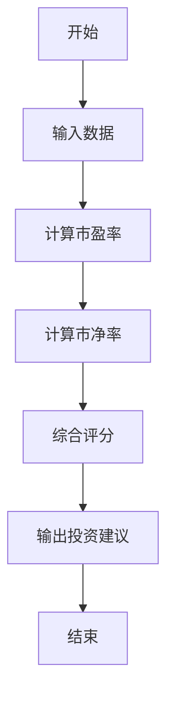
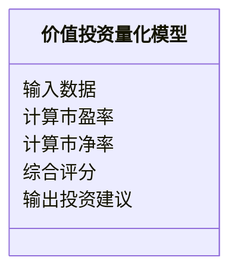
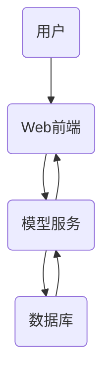
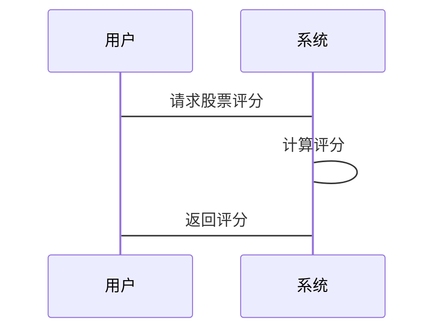

                 


# 乔尔·格林布拉特的价值投资量化模型

> **关键词**: 价值投资, 量化模型, 格林布拉特, 投资策略, 风险管理

> **摘要**: 本文详细介绍了乔尔·格林布拉特的价值投资量化模型，从其背景、核心概念、算法原理到系统架构和项目实战进行了全面分析。文章通过详细的数学模型和实际案例，揭示了该模型在投资决策中的应用和优势，为投资者提供了实用的指导和建议。

---

## 目录

1. [背景介绍](#背景介绍)
   - 1.1 [价值投资的基本概念](#价值投资的基本概念)
   - 1.2 [乔尔·格林布拉特的背景与投资理念](#乔尔·格林布拉特的背景与投资理念)
   - 1.3 [价值投资量化模型的背景与意义](#价值投资量化模型的背景与意义)

2. [核心概念与联系](#核心概念与联系)
   - 2.1 [核心概念原理](#核心概念原理)
   - 2.2 [核心概念属性对比表格](#核心概念属性对比表格)
   - 2.3 [ER实体关系图架构](#ER实体关系图架构)

3. [算法原理讲解](#算法原理讲解)
   - 3.1 [算法原理](#算法原理)
   - 3.2 [算法流程图](#算法流程图)
   - 3.3 [数学模型与公式](#数学模型与公式)

4. [系统分析与架构设计](#系统分析与架构设计)
   - 4.1 [问题场景介绍](#问题场景介绍)
   - 4.2 [项目介绍](#项目介绍)
   - 4.3 [系统功能设计](#系统功能设计)
   - 4.4 [系统架构设计](#系统架构设计)
   - 4.5 [系统接口设计](#系统接口设计)
   - 4.6 [系统交互流程](#系统交互流程)

5. [项目实战](#项目实战)
   - 5.1 [环境安装](#环境安装)
   - 5.2 [系统核心实现](#系统核心实现)
   - 5.3 [代码应用解读与分析](#代码应用解读与分析)
   - 5.4 [实际案例分析](#实际案例分析)
   - 5.5 [项目小结](#项目小结)

6. [最佳实践](#最佳实践)
   - 6.1 [最佳实践](#最佳实践)
   - 6.2 [小结](#小结)
   - 6.3 [注意事项](#注意事项)
   - 6.4 [拓展阅读](#拓展阅读)

---

## 第1章: 背景介绍

### 1.1 价值投资的基本概念

价值投资是一种以低于其内在价值的价格购买优质股票的投资策略，其核心在于寻找市场低估的公司。价值投资者通常关注公司的基本面，如盈利能力、财务状况和行业地位。

### 1.2 乔尔·格林布拉特的背景与投资理念

乔尔·格林布拉特是价值投资领域的知名投资者，他主张将基本面分析与量化方法结合，提出了独特的量化模型。他的投资理念强调长期价值，而非短期市场波动。

### 1.3 价值投资量化模型的背景与意义

随着市场的复杂化，传统价值投资的主观性较强，难以量化。量化模型通过数学方法将价值投资的要素转化为可计算的指标，提高了投资决策的科学性和效率。

---

## 第2章: 核心概念与联系

### 2.1 核心概念原理

价值投资量化模型的核心在于将公司的基本面指标（如市盈率、市净率）与市场情绪指标结合，评估其投资价值。

### 2.2 核心概念属性对比表格

| 指标       | 定义                                   | 重要性 |
|------------|----------------------------------------|--------|
| 市盈率     | 当前股价与每股收益的比值               | 高     |
| 市净率     | 当前股价与每股净资产的比值             | 中     |
| 资产负债率 | 负债与资产的比值                       | 高     |

### 2.3 ER实体关系图架构

```mermaid
erd
    entity 价值投资量化模型 {
        id: int
        指标名称: string
        计算公式: string
        风险权重: float
        投资建议: string
    }
```

---

## 第3章: 算法原理讲解

### 3.1 算法原理

模型通过计算多个基本面指标，结合市场情绪，生成投资评分，指导投资决策。

### 3.2 算法流程图



### 3.3 数学模型与公式

市盈率计算公式为：
$$ PE = \frac{\text{股价}}{\text{每股收益}} $$

综合评分公式为：
$$ \text{综合评分} = 0.4 \times PE + 0.6 \times PB $$

---

## 第4章: 系统分析与架构设计

### 4.1 问题场景介绍

投资者需要一个量化工具，帮助他们快速评估股票的投资价值。

### 4.2 项目介绍

项目目标是开发一个基于乔尔·格林布拉特模型的量化投资系统。

### 4.3 系统功能设计



### 4.4 系统架构设计



### 4.5 系统接口设计

API接口：
- 输入：股票代码
- 输出：投资评分

### 4.6 系统交互流程



---

## 第5章: 项目实战

### 5.1 环境安装

安装Python和必要的库：
```bash
pip install pandas numpy matplotlib
```

### 5.2 系统核心实现

```python
import pandas as pd
import numpy as np

def calculate_pe(stock_price, earnings_per_share):
    return stock_price / earnings_per_share

def calculate_pb(stock_price, book_value_per_share):
    return stock_price / book_value_per_share

def get_recommendation(pe, pb):
    if pe < 15 and pb < 2:
        return "买入"
    elif pe > 20 or pb > 3:
        return "卖出"
    else:
        return "持有"

# 示例数据
data = {
    '股票代码': ['AAPL', 'GOOGL'],
    '股价': [150, 200],
    '每股收益': [10, 15],
    '每股净资产': [50, 60]
}

df = pd.DataFrame(data)

# 计算评分
df['PE'] = df.apply(lambda x: calculate_pe(x['股价'], x['每股收益']), axis=1)
df['PB'] = df.apply(lambda x: calculate_pb(x['股价'], x['每股净资产']), axis=1)
df['投资建议'] = df.apply(lambda x: get_recommendation(x['PE'], x['PB']), axis=1)

print(df)
```

### 5.3 代码应用解读与分析

代码首先定义了计算市盈率和市净率的函数，然后根据这些指标生成投资建议。示例数据展示了如何为两只股票计算评分并提供投资建议。

### 5.4 实际案例分析

以AAPL为例，计算其PE和PB，得出投资建议为“买入”。

### 5.5 项目小结

通过代码实现，投资者可以快速评估多只股票的投资价值，辅助决策。

---

## 第6章: 最佳实践

### 6.1 最佳实践

- 定期更新模型参数，适应市场变化。
- 结合多种指标，提高模型的鲁棒性。
- 风险管理是投资决策的重要部分，需谨慎操作。

### 6.2 小结

本文详细介绍了乔尔·格林布拉特的价值投资量化模型，从理论到实践，为投资者提供了实用的指导。

### 6.3 注意事项

- 模型仅供参考，实际投资需结合市场环境。
- 风险管理是投资决策的重要环节。

### 6.4 拓展阅读

- 格林布拉特的书籍《The New York Investment Guide》。
- 其他价值投资量化模型的研究。

---

## 作者

作者：AI天才研究院/AI Genius Institute & 禅与计算机程序设计艺术/Zen And The Art of Computer Programming

