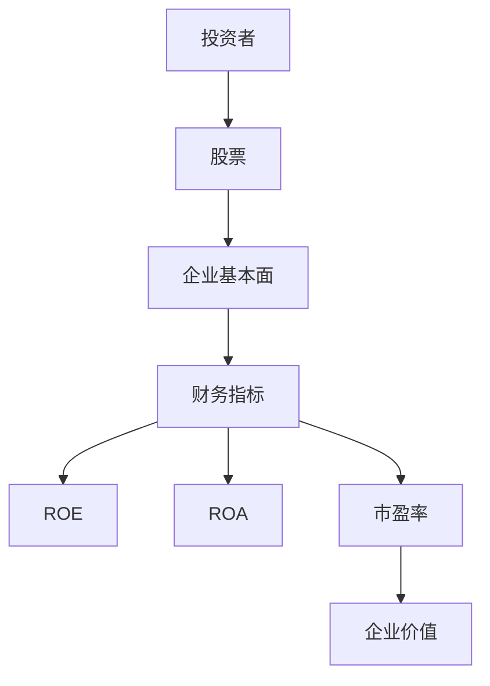
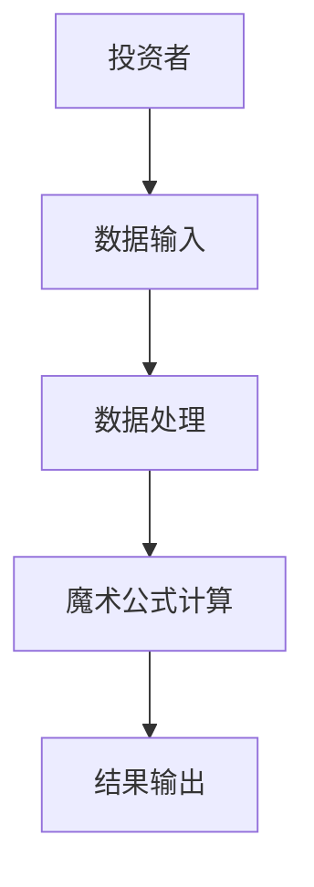

                 


# 乔尔·格林布拉特的魔术公式投资法

> 关键词：乔尔·格林布拉特，魔术公式，投资法，价值投资，成长投资

> 摘要：本文详细介绍了乔尔·格林布拉特的魔术公式投资法，从其背景、核心概念、算法原理到系统分析和项目实战，深入剖析了这一投资方法的精髓。通过详细阐述其数学模型、系统架构和实际案例，帮助读者理解如何在实际投资中应用这一方法。

---

# 乔尔·格林布拉特的魔术公式投资法

## 引言

投资界有许多经典的投资方法，乔尔·格林布拉特的魔术公式投资法是其中之一。这种方法结合了价值投资和成长投资的理念，旨在找到那些被市场低估且具有良好盈利能力的公司。本文将从多个角度详细分析这一投资方法，包括其背景、核心概念、算法原理、系统架构以及实际应用。

---

## 第一部分：背景介绍

### 1.1 投资法的背景

乔尔·格林布拉特是美国著名的投资者和作家，他的魔术公式投资法在投资界享有盛誉。这种方法的核心在于通过量化分析，筛选出具有高盈利能力且估值合理的公司。格林布拉特的投资理念深受本杰明·格雷厄姆和菲利普·费雪的影响，他将价值投资和成长投资的理念结合起来，形成了一套独特的筛选方法。

### 1.2 核心概念与问题解决

魔术公式投资法的核心在于解决两个问题：如何找到具有高盈利能力的公司，以及如何确定这些公司的合理估值。通过将ROE（净资产收益率）、EV/EBITDA（企业价值与息税折旧及摊销前利润之比）和P/E（市盈率）等指标结合，格林布拉特提出了一个简洁而有效的筛选公式。

---

## 第二部分：核心概念与联系

### 2.1 核心概念原理

魔术公式的数学模型如下：

$$ \text{Magic Formula} = \frac{ROE \times (EV/EBITDA + 1)}{P/E} $$

其中，ROE衡量了公司的盈利能力，EV/EBITDA衡量了公司的估值，而P/E则反映了市场的相对估值。通过将这些指标结合，魔术公式能够筛选出那些盈利能力高且估值合理的公司。

### 2.2 ER实体关系图架构

以下是一个简化的ER实体关系图：



---

## 第三部分：算法原理

### 3.1 算法原理概述

魔术公式的计算流程如下：

1. **收集数据**：获取目标公司的ROE、EV/EBITDA和P/E等指标。
2. **计算公式**：将这些指标代入魔术公式进行计算。
3. **筛选公司**：根据计算结果，筛选出得分较高的公司作为投资标的。

### 3.2 算法的数学模型与公式

魔术公式的数学表达如下：

$$ \text{Magic Formula} = \frac{ROE \times (EV/EBITDA + 1)}{P/E} $$

通过这个公式，投资者可以量化地评估公司的投资价值。例如，假设一家公司的ROE为20%，EV/EBITDA为10，P/E为15，那么其魔术公式得分为：

$$ \frac{20 \times (10 + 1)}{15} = \frac{20 \times 11}{15} = \frac{220}{15} \approx 14.67 $$

得分越高，表明该公司的投资价值越高。

---

## 第四部分：系统分析与架构设计

### 4.1 系统架构设计

以下是一个魔术公式投资法的系统架构图：



### 4.2 系统功能设计

1. **数据收集**：从财务报表中提取ROE、EV/EBITDA和P/E等指标。
2. **数据处理**：对收集到的数据进行清洗和标准化处理。
3. **公式计算**：将处理后的数据代入魔术公式进行计算。
4. **结果输出**：根据计算结果生成投资建议报告。

---

## 第五部分：项目实战

### 5.1 环境安装

为了实现魔术公式投资法，我们需要以下工具：

1. **数据源**：如Yahoo Finance或东方财富网。
2. **编程语言**：Python。
3. **数据分析库**：Pandas、NumPy。
4. **可视化工具**：Matplotlib或Seaborn。

### 5.2 核心实现代码

以下是实现魔术公式的Python代码示例：

```python
import pandas as pd

# 获取数据
def get_data(ticker):
    df = pd.read_csv(f'data/{ticker}.csv')
    return df

# 计算魔术公式
def magic_formula(ticker):
    df = get_data(ticker)
    roe = df['ROE'].mean()
    ev_ebitda = df['EV/EBITDA'].mean()
    pe = df['P/E'].mean()
    score = (roE * (ev_ebitda + 1)) / pe
    return score

# 筛选公司
def screen_stocks():
    tickers = ['AAPL', 'MSFT', 'GOOGL']
    scores = {}
    for t in tickers:
        scores[t] = magic_formula(t)
    return scores

# 输出结果
def main():
    scores = screen_stocks()
    for t, s in scores.items():
        print(f"{t}: {s}")

if __name__ == "__main__":
    main()
```

### 5.3 案例分析

以苹果公司（AAPL）为例，假设其ROE为20%，EV/EBITDA为10，P/E为15。根据魔术公式计算：

$$ \frac{20 \times (10 + 1)}{15} = 14.67 $$

这表明苹果公司的投资价值较高，值得进一步关注。

---

## 第六部分：总结与注意事项

### 6.1 总结

魔术公式投资法通过量化分析，帮助投资者找到具有高盈利能力且估值合理的公司。其核心在于将ROE、EV/EBITDA和P/E等指标结合，形成一个简洁而有效的筛选公式。

### 6.2 注意事项

1. **数据准确性**：确保使用的财务数据准确无误。
2. **行业差异**：不同行业的公司可能具有不同的估值标准，需结合行业特点进行调整。
3. **市场环境**：投资决策需结合市场环境和宏观经济因素。
4. **持续监控**：定期重新评估投资组合，及时调整投资策略。

---

## 作者

作者：AI天才研究院/AI Genius Institute & 禅与计算机程序设计艺术 /Zen And The Art of Computer Programming

---

通过本文的详细分析，读者可以深入了解乔尔·格林布拉特的魔术公式投资法，并能够在实际投资中灵活运用这一方法。

