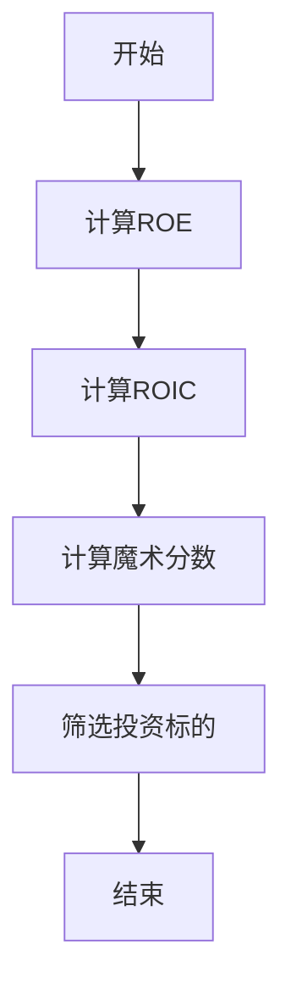
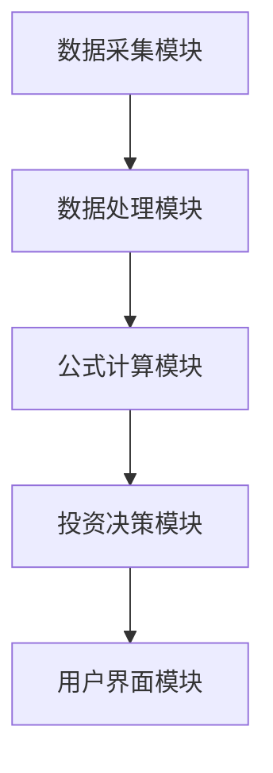
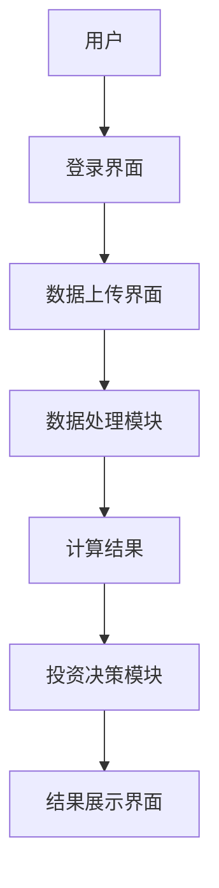

                 

---

# 乔尔·格林布拉特的魔术公式投资法

> 关键词：魔术公式投资法、乔尔·格林布拉特、ROE、ROIC、价值投资、成长投资

> 摘要：本文深入分析了乔尔·格林布拉特的魔术公式投资法，从其理论基础、数学模型到系统实现进行了详细探讨。通过逐步推理和分析，揭示了该投资法的核心要素、计算方法及其在实际投资中的应用。结合技术语言，本文还通过mermaid流程图和Python代码示例，展示了如何将魔术公式转化为可执行的投资策略。

---

# 目录

## 第一部分: 魔术公式投资法的理论基础

### 第1章: 魔术公式投资法概述

#### 1.1 魔术公式投资法的起源与背景
- 1.1.1 乔尔·格林布拉特及其投资理念
- 1.1.2 魔术公式投资法的核心思想
- 1.1.3 魔术公式与传统投资方法的区别

#### 1.2 魔术公式的基本构成
- 1.2.1 魔术公式的基本公式
- 1.2.2 公式中各指标的含义
- 1.2.3 公式的适用范围与限制

#### 1.3 魔术公式的核心要素
- 1.3.1 股东权益收益率（ROE）
- 1.3.2 投资资本回报率（ROIC）
- 1.3.3 每股收益（EPS）
- 1.3.4 其他辅助指标

#### 1.4 魔术公式在投资决策中的作用
- 1.4.1 公式在筛选投资标的中的应用
- 1.4.2 公式在风险控制中的作用
- 1.4.3 公式在长期投资策略中的地位

#### 1.5 本章小结

## 第二部分: 魔术公式投资法的数学模型与算法原理

### 第2章: 魔术公式的核心数学模型

#### 2.1 魔术公式的基本公式
- 2.1.1 魔术公式的数学表达式
  $$
  \text{魔术分数} = \frac{\text{ROE} + \text{ROIC}}{2}
  $$

#### 2.2 公式中各指标的数学定义
- 2.2.1 股东权益收益率（ROE）
  $$
  ROE = \frac{\text{净利润}}{\text{股东权益}}
  $$

- 2.2.2 投资资本回报率（ROIC）
  $$
  ROIC = \frac{\text{净利润}}{\text{投资资本}}
  $$

- 2.2.3 每股收益（EPS）
  $$
  EPS = \frac{\text{净利润}}{\text{流通股数}}
  $$

#### 2.3 公式的数学推导与优化
- 2.3.1 公式的推导过程
- 2.3.2 公式的优化与改进

#### 2.4 公式在实际投资中的应用算法
- 2.4.1 算法流程图（使用mermaid）

## 第三部分: 魔术公式投资法的系统架构与实现

### 第3章: 魔术公式投资法的系统架构设计

#### 3.1 系统功能模块划分
- 3.1.1 数据采集模块
- 3.1.2 数据处理模块
- 3.1.3 公式计算模块
- 3.1.4 投资决策模块

#### 3.2 数据采集模块的设计
- 3.2.1 数据源选择
- 3.2.2 数据采集接口设计
- 3.2.3 数据清洗与预处理

#### 3.3 数据处理模块的实现
- 3.3.1 数据结构设计
- 3.3.2 数据存储方案
- 3.3.3 数据索引与查询优化

#### 3.4 公式计算模块的实现
- 3.4.1 公式的数学实现
- 3.4.2 并行计算与性能优化
- 3.4.3 异常处理与错误恢复

#### 3.5 系统架构设计图（使用mermaid）

### 第4章: 系统接口设计与实现

#### 4.1 系统接口设计
- 4.1.1 数据接口设计
- 4.1.2 计算接口设计
- 4.1.3 决策接口设计

#### 4.2 接口实现
- 4.2.1 数据接口实现
- 4.2.2 计算接口实现
- 4.2.3 决策接口实现

#### 4.3 接口测试与优化
- 4.3.1 接口测试用例设计
- 4.3.2 接口性能优化
- 4.3.3 接口错误处理与恢复

### 第5章: 系统交互设计与实现

#### 5.1 系统交互流程设计
- 5.1.1 用户登录与数据上传
- 5.1.2 数据处理与计算
- 5.1.3 投资决策与结果展示

#### 5.2 系统交互图（使用mermaid）

## 第四部分: 魔术公式投资法的项目实战

### 第6章: 项目实战

#### 6.1 环境安装与配置
- 6.1.1 Python环境安装
- 6.1.2 数据库安装与配置
- 6.1.3 依赖库安装

#### 6.2 核心代码实现
- 6.2.1 数据采集与处理代码
- 6.2.2 公式计算代码
- 6.2.3 投资决策代码

#### 6.3 代码解读与分析
- 6.3.1 数据采集代码解读
- 6.3.2 公式计算代码解读
- 6.3.3 投资决策代码解读

#### 6.4 实际案例分析
- 6.4.1 案例背景介绍
- 6.4.2 数据分析与处理
- 6.4.3 公式计算与结果解读
- 6.4.4 投资决策与策略制定

### 第7章: 项目小结

#### 7.1 项目总结
- 7.1.1 项目目标达成情况
- 7.1.2 项目过程中的问题与解决方案
- 7.1.3 项目成果与意义

#### 7.2 最佳实践 tips
- 7.2.1 投资策略制定的注意事项
- 7.2.2 系统优化与维护建议
- 7.2.3 进一步研究的方向

## 第五部分: 总结与展望

### 第8章: 总结与展望

#### 8.1 核心内容回顾
- 8.1.1 魔术公式投资法的核心要素
- 8.1.2 系统架构与实现的关键点
- 8.1.3 项目实战中的经验和教训

#### 8.2 未来研究方向
- 8.2.1 公式的改进与扩展
- 8.2.2 系统的优化与升级
- 8.2.3 投资策略的创新与应用

## 附录

### 附录A: 参考文献

### 附录B: 术语表

### 附录C: 代码示例

---

作者：AI天才研究院/AI Genius Institute & 禅与计算机程序设计艺术 /Zen And The Art of Computer Programming

