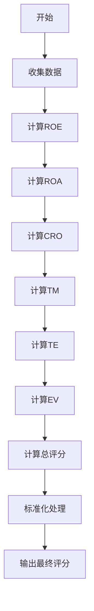
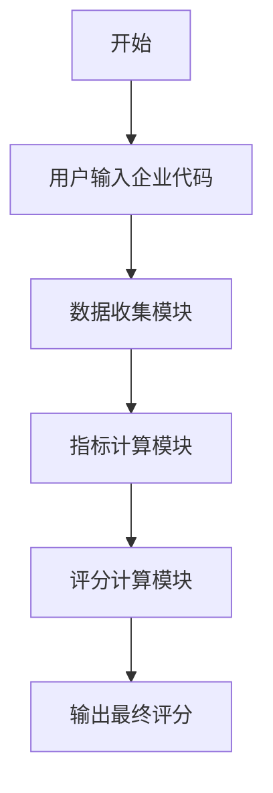
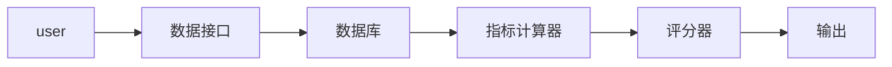

                 


# 《乔尔·格林布拉特的魔术公式：简化版的价值投资策略》

## 关键词：价值投资，魔术公式，投资策略，股票筛选，投资算法

## 摘要：  
乔尔·格林布拉特的魔术公式是一种简化版的价值投资策略，通过结合基本面分析和数学模型，帮助投资者快速筛选出具有高投资价值的股票。本文将详细介绍魔术公式的背景、原理、计算方法及其在实际投资中的应用，帮助读者理解如何利用该公式制定有效的投资策略。

---

# 第一部分: 魔术公式的背景与基础

## 第1章: 价值投资与魔术公式的概述

### 1.1 价值投资的核心理念  
价值投资是一种以基本面分析为基础的投资策略，旨在通过识别市场价格低于其内在价值的资产来实现长期收益。乔尔·格林布拉特是这一领域的杰出代表，他提出的魔术公式结合了多种基本面指标，为投资者提供了一种简单有效的选股方法。

#### 1.1.1 价值投资的定义与特点  
- **定义**：价值投资强调购买价格低于内在价值的股票，通过长期持有实现收益。  
- **特点**：  
  - 侧重于基本面分析，关注企业的盈利能力、成长性和财务状况。  
  - 长期导向，避免短期市场波动的干扰。  
  - 适合稳健型投资者，风险较低。  

#### 1.1.2 乔尔·格林布拉特的背景与投资理念  
乔尔·格林布拉特是美国著名投资家，以其独特的量化投资方法闻名。他提出的魔术公式结合了多种基本面指标，旨在简化选股过程，同时保持高胜算。

#### 1.1.3 魔术公式的提出与目标  
魔术公式通过量化分析，帮助投资者快速筛选出具有较高投资价值的股票。其目标是将复杂的选股过程简化为一个数学模型，便于操作和应用。

---

### 1.2 魔术公式的定义与作用  
魔术公式是一种基于多个基本面指标的加权评分系统，用于评估企业的投资价值。

#### 1.2.1 魔术公式的数学表达式  
$$ \text{魔术评分} = \frac{ROE \times ROA \times CRO \times TM \times TE \times EV}{\text{行业平均值}} $$  
- **ROE**：净资产收益率（Return on Equity）  
- **ROA**：资产净利率（Return on Assets）  
- **CRO**：资本回报率（Return on Capital）  
- **TM**：税后利润（Net Profit Margin）  
- **TE**：每股收益（Earnings Per Share, EPS）  
- **EV**：企业价值（Enterprise Value）  

#### 1.2.2 魔术公式的核心要素  
- **ROE**：衡量企业盈利能力，越高越好。  
- **ROA**：评估资产使用效率，越高越好。  
- **CRO**：反映资本回报率，越高越好。  
- **TM**：衡量利润质量，越高越好。  
- **TE**：反映每股收益，越高越好。  
- **EV**：衡量企业整体价值，越低越好（相对于行业平均水平）。  

#### 1.2.3 魔术公式在投资决策中的作用  
- 简化选股过程，减少主观判断。  
- 通过多指标加权，提高选股的准确性。  
- 适用于不同行业和市场的投资分析。  

---

### 1.3 魔术公式的适用范围与限制  

#### 1.3.1 魔术公式的适用市场与行业  
- **适用市场**：主要适用于成熟市场，如美国股市。  
- **适用行业**：广泛适用于各行业，但需根据行业特点调整权重。  

#### 1.3.2 魔术公式的局限性与不足  
- 无法完全预测市场波动。  
- 未考虑宏观经济因素（如利率、通货膨胀）。  
- 对某些行业的适用性较低（如高杠杆行业）。  

#### 1.3.3 魔术公式与其他投资策略的对比  
- **对比**：与传统价值投资相比，魔术公式更注重量化分析；与技术分析相比，更注重基本面。  
- **优势**：简单易用，适合非专业投资者。  

---

## 第2章: 魔术公式的数学原理与计算方法  

### 2.1 魔术公式的数学模型  

#### 2.1.1 魔术公式的公式推导  
魔术公式通过加权多个基本面指标，综合评估企业的投资价值。公式如下：  
$$ \text{魔术评分} = \frac{\sum (\text{指标权重} \times \text{指标值})}{\text{行业平均值}} $$  

#### 2.1.2 公式中各变量的定义与解释  
- **ROE**：衡量企业盈利能力，公式为：  
$$ ROE = \frac{\text{净利润}}{\text{股东权益}} $$  
- **ROA**：衡量资产使用效率，公式为：  
$$ ROA = \frac{\text{净利润}}{\text{总资产}} $$  
- **CRO**：衡量资本回报率，公式为：  
$$ CRO = \frac{\text{净利润}}{\text{股东权益 + 长期负债}} $$  
- **TM**：衡量利润质量，公式为：  
$$ TM = \frac{\text{净利润}}{\text{营业收入}} $$  
- **TE**：衡量每股收益，公式为：  
$$ TE = \frac{\text{净利润}}{\text{普通股股数}} $$  
- **EV**：衡量企业价值，公式为：  
$$ EV = \text{市场价值} + \text{债务} - \text{现金及等价物} $$  

#### 2.1.3 魔术公式的核心算法  
1. 收集目标企业的各项财务数据。  
2. 计算每个指标的值。  
3. 将指标值乘以对应的权重，求和得到总评分。  
4. 将总评分除以行业平均值，得到最终评分。  

---

### 2.2 魔术公式的计算步骤  

#### 2.2.1 数据收集与处理  
- 收集目标企业的财务数据，包括ROE、ROA、CRO、TM、TE和EV。  
- 收集行业平均值，用于标准化处理。  

#### 2.2.2 关键指标的计算方法  
- 使用上述公式计算每个指标的值。  

#### 2.2.3 魔术评分的最终计算  
- 将指标值乘以权重，求和得到总评分。  
- 将总评分除以行业平均值，得到最终评分。  

---

### 2.3 魔术公式的数学公式与流程图  

#### 2.3.1 魔术公式的数学公式  
$$ \text{魔术评分} = \frac{\sum (\text{指标权重} \times \text{指标值})}{\text{行业平均值}} $$  

#### 2.3.2 魔术公式的计算流程图（Mermaid）  



---

## 第3章: 魔术公式的系统分析与架构设计  

### 3.1 系统功能设计  

#### 3.1.1 功能模块划分  
- 数据收集模块：收集企业财务数据和行业平均值。  
- 指标计算模块：计算ROE、ROA、CRO、TM、TE和EV。  
- 评分计算模块：根据公式计算魔术评分。  

#### 3.1.2 系统功能流程图（Mermaid）  



---

### 3.2 系统架构设计  

#### 3.2.1 系统架构图（Mermaid）  



---

## 第4章: 魔术公式的项目实战  

### 4.1 环境安装与配置  

#### 4.1.1 环境要求  
- Python 3.8+  
- 数据分析库（Pandas、NumPy）  
- 可视化库（Matplotlib、Seaborn）  

---

### 4.2 核心代码实现  

#### 4.2.1 数据收集模块  

```python
import pandas as pd

def collect_data(ticker):
    # 收集目标企业的财务数据
    df = pd.DataFrame({
        'ROE': [计算ROE],
        'ROA': [计算ROA],
        'CRO': [计算CRO],
        'TM': [计算TM],
        'TE': [计算TE],
        'EV': [计算EV]
    })
    return df
```

#### 4.2.2 指标计算模块  

```python
def calculate_metrics(df):
    # 计算每个指标的值
    metrics = {
        'ROE': df['ROE'].mean(),
        'ROA': df['ROA'].mean(),
        'CRO': df['CRO'].mean(),
        'TM': df['TM'].mean(),
        'TE': df['TE'].mean(),
        'EV': df['EV'].mean()
    }
    return metrics
```

#### 4.2.3 评分计算模块  

```python
def calculate_score(metrics, industry_avg):
    # 计算总评分
    total_score = sum(metrics.values())
    # 标准化处理
    normalized_score = total_score / industry_avg
    return normalized_score
```

---

### 4.3 案例分析与结果解读  

#### 4.3.1 案例分析  
假设目标企业为AAPL，行业平均值为100。  

```python
df = collect_data('AAPL')
metrics = calculate_metrics(df)
score = calculate_score(metrics, 100)
print(f"最终评分：{score}")
```

---

## 第5章: 总结与展望  

### 5.1 总结  
魔术公式通过结合多种基本面指标，提供了一种简单有效的选股方法。投资者可以利用该公式快速筛选出具有高投资价值的股票，降低投资风险。

### 5.2 展望  
未来，随着大数据和人工智能技术的发展，魔术公式可以进一步优化和扩展，结合更多因素（如宏观经济指标）进行更精准的选股。

---

## 作者：AI天才研究院/AI Genius Institute & 禅与计算机程序设计艺术 /Zen And The Art of Computer Programming

---

通过以上内容，您可以全面了解乔尔·格林布拉特的魔术公式，并将其应用于实际投资中。

