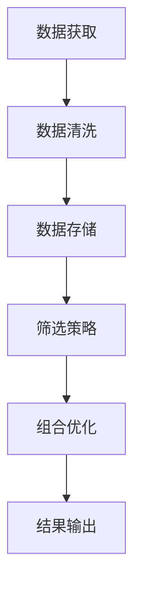

                 


# 乔尔格林布拉特的价值投资筛选

## 关键词：价值投资，格林布拉特，筛选标准，数学模型，投资策略

## 摘要：  
本文深入分析了乔尔·格林布拉特的价值投资筛选方法，从其核心理念、筛选标准到数学模型和系统架构，结合实际案例，全面解析其投资策略。通过详细的技术分析和实际应用，揭示了如何利用格林布拉特的方法在现代投资中实现稳健收益。

---

# 第一部分：价值投资的基本概念与核心理念

## 第1章：价值投资的定义与核心理念

### 1.1 价值投资的定义与背景  
- 价值投资是一种以基本面分析为基础的投资策略，旨在通过识别市场低估的股票，实现长期稳健的收益。  
- 核心理念：股票的内在价值决定其长期表现，市场波动提供买入机会。  

### 1.2 乔尔·格林布拉特的投资理念  
- 格林布拉特是价值投资领域的权威，提出了独特的筛选标准和组合管理方法。  
- 其方法结合了低估值（如低PE、低P/B）和高质量（如高ROE）的选股策略。  

### 1.3 价值投资的核心原则  
- **安全边际**：买入价格低于内在价值，确保安全空间。  
- **市场先生理论**：市场波动为理性投资者提供机会。  
- **长期视角**：关注企业的长期价值，而非短期波动。  

---

# 第二部分：乔尔·格林布拉特的筛选标准

## 第2章：格林布拉特的选股标准

### 2.1 核心筛选指标  
- **低市盈率（P/E）**：通过比较股票价格与 earnings per share (EPS) 的比率，寻找低估股票。  
- **低市净率（P/B）**：比较股票价格与 book value per share (BVPS) 的比率，识别价值被低估的股票。  
- **高股息率**：关注高股息率且股息支付率合理的股票，平衡收益与风险。  

### 2.2 筛选模型  
- **三重过滤法**：结合P/E、P/B和ROE（Return on Equity）指标，筛选出具有低估值和高盈利能力的股票。  
- **合理价计算**：基于公司基本面数据，估算股票的合理价格区间。  
- **安全边际**：买入价格低于合理价，确保投资的安全性。  

### 2.3 组合管理策略  
- **资产配置**：根据市场环境调整股票与现金的比例。  
- **风险管理**：分散投资，避免过度集中。  
- **再平衡**：定期调整组合，维持目标配置。  

---

# 第三部分：数学模型与公式

## 第3章：核心指标的数学表达

### 3.1 核心指标公式  
- **市盈率（P/E）**：  
  $$ P/E = \frac{\text{股价}}{\text{每股净利润}} $$
- **市净率（P/B）**：  
  $$ P/B = \frac{\text{股价}}{\text{每股净资产}} $$
- **股息率**：  
  $$ \text{股息率} = \frac{\text{每股股息}}{\text{股价}} \times 100\% $$
- **合理价计算**：  
  $$ \text{合理价} = \text{每股净利润} \times \text{合理市盈率} $$

### 3.2 筛选模型的数学分析  
- **三重过滤法**：  
  1. 筛选P/E < 市场平均P/E的股票。  
  2. 筛选P/B < 市场平均P/B的股票。  
  3. 筛选ROE > 市场平均ROE的股票。  

### 3.3 组合优化的数学模型  
- 使用均值-方差优化模型，最小化风险（波动率）同时最大化预期收益。  
  $$ \text{Minimize} \, \sigma^2 \quad \text{Subject to} \, \mu \geq \text{目标收益} $$

---

# 第四部分：系统架构与实现

## 第4章：系统架构设计

### 4.1 系统功能模块  
- 数据获取：从数据库或API获取股票数据。  
- 数据处理：清洗、转换和存储。  
- 筛选策略：应用格林布拉特的筛选标准。  
- 组合管理：优化投资组合并监控表现。  

### 4.2 数据获取与处理  
- 数据来源：股票价格、财务报表等。  
- 数据清洗：处理缺失值和异常值。  
- 数据存储：使用数据库或文件存储处理后的数据。  

### 4.3 筛选策略的实现  
- 使用Python编写筛选函数，基于P/E、P/B等指标筛选股票。  
- 示例代码：  
  ```python
  def screen_stocks(data, threshold_pe=15, threshold_pb=2):
      return data[(data['P/E'] < threshold_pe) & (data['P/B'] < threshold_pb)]
  ```

### 4.4 系统架构图（Mermaid）  


---

# 第五部分：项目实战与案例分析

## 第5章：项目实战

### 5.1 环境安装与数据准备  
- 安装Python和相关库（Pandas、NumPy、Matplotlib）。  
- 下载历史股票数据。  

### 5.2 核心实现代码  
- 筛选函数：  
  ```python
  import pandas as pd

  def calculate_pe(data):
      return data['股价'] / data['净利润']

  def calculate_pb(data):
      return data['股价'] / data['净资产']

  def greenblatt_screen(data):
      data['P/E'] = calculate_pe(data)
      data['P/B'] = calculate_pb(data)
      return data[(data['P/E'] < 15) & (data['P/B'] < 2)]
  ```

### 5.3 案例分析  
- 以2023年为例，筛选符合格林布拉特标准的股票。  
- 分析筛选结果的收益与风险比。  

---

## 总结  
本文详细解析了乔尔·格林布拉特的价值投资筛选方法，从理论到实践，结合数学模型和系统架构，为投资者提供了实用的指导。通过实际案例分析，展示了如何在现代投资环境中应用这些策略，实现稳健的收益。

---

## 注意事项  
- 投资有风险，需谨慎决策。  
- 筛选结果需结合市场环境和公司基本面综合判断。  
- 定期监控和调整投资组合，确保风险可控。  

---

## 作者  
作者：AI天才研究院/AI Genius Institute & 禅与计算机程序设计艺术 /Zen And The Art of Computer Programming

