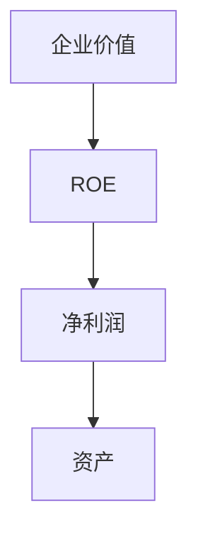

                 


# 乔尔·格林布拉特的魔术公式

> 关键词：乔尔·格林布拉特，魔术公式，投资决策，数学模型，算法实现，系统架构设计

> 摘要：乔尔·格林布拉特的魔术公式是一个用于评估企业投资价值的数学模型，结合了基本面分析和量化指标。本文将从背景介绍、数学模型、算法实现、系统架构设计、项目实战、最佳实践等方面，详细剖析魔术公式的原理、实现和应用，帮助读者全面理解其技术本质。

---

# 第一部分: 乔尔·格林布拉特的魔术公式概述

## 第1章: 魔术公式的背景与核心概念

### 1.1 魔术公式的背景介绍

#### 1.1.1 乔尔·格林布拉特的简介
乔尔·格林布拉特（Joel Greenblatt）是一位著名的投资专家，以其独特的投资策略和量化模型闻名。他通过多年的投资实践，总结出了一套简单而有效的投资公式，即“魔术公式”。该公式旨在通过量化企业基本面数据，帮助投资者快速评估企业的投资价值。

#### 1.1.2 魔术公式的提出背景
在传统投资分析中，投资者通常依赖于复杂的财务模型和市场分析，但这些方法往往难以量化企业的核心竞争力。乔尔·格林布拉特通过研究发现，企业的投资价值可以通过几个关键的财务指标来衡量，从而简化了投资决策过程。

#### 1.1.3 魔术公式的核心思想
魔术公式的核心思想是：企业的投资价值等于其盈利能力（ROE）与其估值指标（如市盈率）的结合。通过量化这些指标，投资者可以快速识别出具有高投资价值的企业。

---

### 1.2 魔术公式的定义与核心要素

#### 1.2.1 魔术公式的数学表达式
魔术公式的数学表达式如下：
$$
\text{投资价值} = \frac{\text{ROE} \times \text{EVA}}{\text{PE Ratio}}
$$
其中，ROE表示净资产收益率，EVA表示经济增加值，PE Ratio表示市盈率。

#### 1.2.2 核心要素的构成与权重
魔术公式的三个核心要素分别是：
1. **ROE（净资产收益率）**：衡量企业的盈利能力，权重为50%。
2. **EVA（经济增加值）**：衡量企业的经济价值，权重为30%。
3. **PE Ratio（市盈率）**：衡量企业的估值水平，权重为20%。

#### 1.2.3 公式的边界与外延
魔术公式适用于大多数企业，但不适用于金融、房地产等特殊行业。此外，该公式主要适用于中长期投资决策，短期市场波动不在其考虑范围内。

---

## 第2章: 魔术公式的核心数学模型

### 2.1 魔术公式的数学推导

#### 2.1.1 数据流图的构建
通过mermaid图展示数据流：


#### 2.1.2 核心公式的数学模型
魔术公式的数学模型可以进一步细化为以下几个步骤：
1. 计算ROE：$$\text{ROE} = \frac{\text{净利润}}{\text{净资产}}$$
2. 计算EVA：$$\text{EVA} = \text{净利润} - \text{资本成本}$$
3. 计算PE Ratio：$$\text{PE Ratio} = \frac{\text{股价}}{\text{每股收益}}$$
4. 最终投资价值计算：$$\text{投资价值} = \frac{\text{ROE} \times \text{EVA}}{\text{PE Ratio}}$$

---

### 2.2 魔术公式属性对比表

| 属性       | 描述                       |
|------------|---------------------------|
| 输入数据   | ROE, EVA, PE Ratio       |
| 输出结果   | 投资价值评分               |
| 计算方式   | 加权平均与比值计算         |
| 应用场景   | 企业估值与投资决策         |

---

## 第3章: 魔术公式的算法实现

### 3.1 算法实现的步骤

#### 3.1.1 数据收集与预处理
1. 数据来源：从股票数据库中获取企业的财务数据。
2. 数据清洗：处理缺失值和异常值。
3. 数据转换：将数据转换为统一的格式。

#### 3.1.2 公式计算
编写Python代码实现魔术公式的计算：
```python
def calculate_magic_formula(roe, eva, pe_ratio):
    investment_value = (roe * eva) / pe_ratio
    return investment_value
```

#### 3.1.3 结果可视化
使用matplotlib绘制投资价值评分的分布图：
```python
import matplotlib.pyplot as plt

investment_values = [calculate_magic_formula(roe, eva, pe_ratio) for roe, eva, pe_ratio in zip(roes, evas, pe_ratios)]
plt.hist(investment_values, bins=10, alpha=0.5)
plt.title('Investment Value Distribution')
plt.xlabel('Investment Value')
plt.ylabel('Frequency')
plt.show()
```

---

## 第4章: 魔术公式的系统架构设计

### 4.1 系统架构设计概述

#### 4.1.1 系统功能模块
1. 数据采集模块：从数据库中获取企业财务数据。
2. 数据处理模块：清洗和转换数据。
3. 公式计算模块：实现魔术公式的计算。
4. 结果展示模块：可视化投资价值评分。

#### 4.1.2 系统架构图
使用mermaid绘制系统架构图：


---

## 第5章: 魔术公式的项目实战

### 5.1 项目环境搭建

#### 5.1.1 安装依赖库
安装必要的Python库：
```bash
pip install pandas matplotlib
```

#### 5.1.2 数据准备
从数据库中获取企业财务数据，保存为CSV文件。

---

### 5.2 核心代码实现

#### 5.2.1 数据处理代码
```python
import pandas as pd

# 读取数据
data = pd.read_csv('stock_data.csv')

# 数据清洗
data.dropna(inplace=True)
data = data[~data['pe_ratio'].isin([0])]

# 数据转换
data['investment_value'] = (data['roe'] * data['eva']) / data['pe_ratio']
```

#### 5.2.2 结果可视化代码
```python
import matplotlib.pyplot as plt

# 绘制投资价值评分分布图
plt.hist(data['investment_value'], bins=10, alpha=0.5)
plt.title('Investment Value Distribution')
plt.xlabel('Investment Value')
plt.ylabel('Frequency')
plt.show()
```

---

## 第6章: 最佳实践与注意事项

### 6.1 最佳实践

#### 6.1.1 数据质量控制
确保输入数据的准确性和完整性。

#### 6.1.2 公式适用范围
仅适用于非金融类企业和中长期投资决策。

#### 6.1.3 模型优化
根据实际需求，对公式进行参数调优。

### 6.2 小结与总结

魔术公式通过量化企业的基本面数据，为投资者提供了一种简单而有效的投资决策工具。尽管其原理相对简单，但在实际应用中仍需注意数据质量和模型适用性。

---

## 第7章: 未来展望与拓展阅读

### 7.1 未来展望

随着人工智能和大数据技术的发展，魔术公式可以进一步优化和扩展，例如引入机器学习算法进行预测和优化。

### 7.2 拓展阅读

推荐阅读乔尔·格林布拉特的《沃伦·巴菲特的投资组合》和《股票作手回忆录》。

---

# 作者：AI天才研究院 & 禅与计算机程序设计艺术

