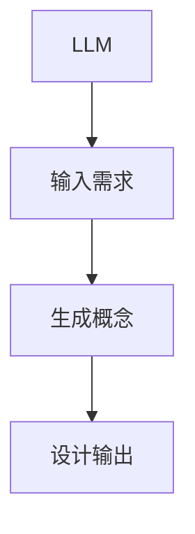
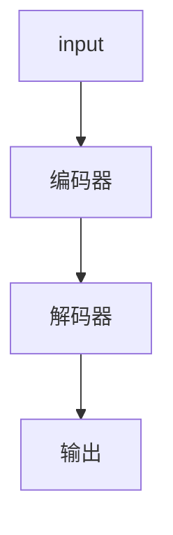
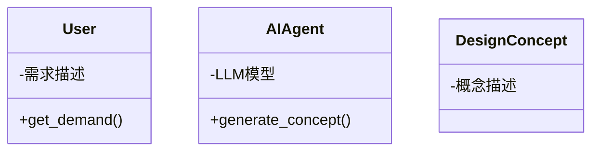
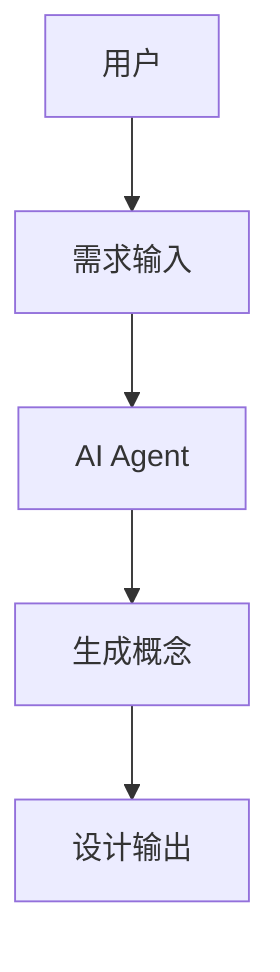
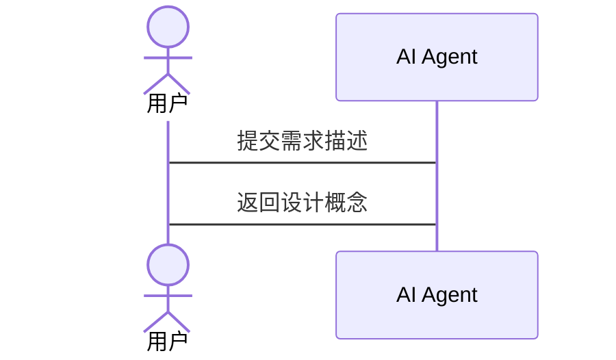

                 


# 产品设计 AI Agent：LLM 辅助创新与概念生成

---

## 关键词：  
产品设计、AI Agent、LLM、自然语言处理、大语言模型、创新设计

---

## 摘要：  
本文深入探讨了AI Agent在产品设计中的应用，特别是基于大语言模型（LLM）的创新与概念生成能力。通过分析AI Agent的核心原理、算法机制、系统架构以及实际案例，本文为技术人员和产品经理提供了从理论到实践的全面指导，展示了如何利用AI技术提升产品设计的效率与创新性。

---

# 第一部分: 产品设计 AI Agent 背景与概述

---

# 第1章: 产品设计 AI Agent 的背景与概念

## 1.1 问题背景与问题描述  
### 1.1.1 传统产品设计的挑战  
传统产品设计过程中，设计人员需要面对复杂的市场分析、用户需求挖掘、创意构思等多个环节。这些过程不仅耗时耗力，还容易受到主观因素的限制，导致设计效率低下，创新性不足。  

### 1.1.2 AI 在产品设计中的潜在价值  
AI技术，尤其是大语言模型（LLM），能够通过自然语言处理能力，快速分析大量文本数据，提取用户需求、市场趋势等信息，为产品设计提供灵感和方向。  

### 1.1.3 LLM 在产品设计中的独特优势  
LLM能够生成高质量的设计概念、撰写产品描述、分析竞争对手，并提供创新的解决方案。通过LLM辅助设计，可以显著提高设计效率，降低设计成本，同时激发更多的创意。  

## 1.2 问题解决与边界外延  
### 1.2.1 AI Agent 在产品设计中的应用范围  
AI Agent可以用于需求分析、概念生成、原型设计、用户体验优化等多个环节，覆盖产品设计的全生命周期。  

### 1.2.2 边界与限制  
尽管LLM在产品设计中有诸多优势，但其能力仍然受限于数据质量和模型训练的通用性。例如，LLM可能无法完全理解特定领域的专业术语，也无法直接生成可执行的设计原型。  

### 1.2.3 与传统设计工具的对比分析  
| **对比维度** | **传统设计工具** | **AI Agent** |  
|---------------|-------------------|--------------|  
| 功能 | 支持设计绘图、原型制作等 | 支持需求分析、概念生成等 |  
| 创新性 | 依赖设计师的创意 | 可生成创新性概念 |  
| 效率 | 受限于设计师经验 | 可显著提高效率 |  

## 1.3 核心概念与组成要素  
### 1.3.1 AI Agent 的核心要素  
- **LLM**：基于Transformer架构的大语言模型，负责理解和生成自然语言。  
- **用户输入**：设计需求、市场分析等输入数据。  
- **生成输出**：设计概念、原型建议等输出结果。  

### 1.3.2 LLM 在产品设计中的角色定位  
LLM作为AI Agent的核心模块，负责处理自然语言输入，生成设计相关的文本输出，为设计师提供灵感和建议。  

### 1.3.3 产品设计 AI Agent 的概念结构  


---

# 第二部分: 核心概念与原理

---

# 第2章: AI Agent 的核心概念与原理  

## 2.1 AI Agent 的核心原理  
### 2.1.1 基于LLM 的自然语言处理机制  
LLM通过编码器-解码器结构，将输入文本转化为向量表示，并生成相应的输出文本。  

### 2.1.2 大模型的生成式思维  
LLM通过概率预测，生成与输入最相关的文本序列，模拟人类的创造性思维。  

### 2.1.3 AI Agent 的自主决策能力  
AI Agent可以根据输入的需求，自主选择最优的设计概念生成策略。  

## 2.2 核心概念对比分析  
### 2.2.1 AI Agent 与传统设计工具的对比表格  
| **对比维度** | **AI Agent** | **传统设计工具** |  
|---------------|---------------|-------------------|  
| 功能 | 需求分析、概念生成 | 设计绘图、原型制作 |  
| 创新性 | 高 | 依赖设计师 |  
| 效率 | 高 | 中等 |  

### 2.2.2 实体关系图（ER 图）分析  


---

# 第三部分: 算法原理与数学模型

---

# 第3章: LLM 的算法原理与数学模型  

## 3.1 大模型的训练与推理流程  
### 3.1.1 Transformer 模型的工作流程  


### 3.1.2 LLM 的生成式推理过程  
$$ P(x_{n}|x_{1},...,x_{n-1}) $$  
模型通过条件概率生成每个词，最大化序列的概率。  

### 3.1.3 基于LLM 的生成式思维机制  
$$ L(x) = -\sum_{i=1}^{n} \text{log}P(x_i|x_{<i}) $$  
交叉熵损失函数用于衡量生成文本的质量。  

---

## 3.2 算法优化与实现细节  
### 3.2.1 模型训练优化策略  
- 使用Adam优化器。  
- 设置合适的学习率。  

### 3.2.2 推理过程中的采样策略  
- 温度采样：通过调整温度参数控制生成的多样性。  

---

## 3.3 系统实现与代码示例  

### 3.3.1 环境安装  
```bash
pip install transformers
```

### 3.3.2 核心代码实现  
```python
from transformers import AutoTokenizer, AutoModelForCausalLM

model_name = "gpt2"
tokenizer = AutoTokenizer.from_pretrained(model_name)
model = AutoModelForCausalLM.from_pretrained(model_name)

input_text = "设计一款智能手表的功能需求："
inputs = tokenizer.encode(input_text, return_tensors="pt")

outputs = model.generate(
    inputs,
    max_length=50,
    temperature=0.7,
    num_beams=5,
)
```

### 3.3.3 代码解读与分析  
代码使用了GPT-2模型，通过设置温度和beam search参数，生成高质量的设计概念文本。  

---

# 第四部分: 系统分析与架构设计方案

---

# 第4章: 系统分析与架构设计方案  

## 4.1 问题场景介绍  
AI Agent需要在产品设计过程中，辅助设计师生成设计概念、分析用户需求、优化用户体验。  

## 4.2 系统功能设计  
### 4.2.1 功能模块划分  
- **需求分析模块**：提取用户需求。  
- **概念生成模块**：生成设计概念。  
- **优化模块**：优化用户体验。  

### 4.2.2 领域模型设计  


## 4.3 系统架构设计  
### 4.3.1 系统架构图  


### 4.3.2 系统交互设计  


---

# 第五部分: 项目实战

---

# 第5章: 项目实战与案例分析  

## 5.1 项目介绍  
本项目旨在开发一个基于LLM的产品设计AI Agent，辅助设计师生成创新概念。  

## 5.2 核心代码实现  
```python
from transformers import AutoTokenizer, AutoModelForCausalLM

model_name = "gpt2"
tokenizer = AutoTokenizer.from_pretrained(model_name)
model = AutoModelForCausalLM.from_pretrained(model_name)

def generate_design_concept(input_text):
    inputs = tokenizer.encode(input_text, return_tensors="pt")
    outputs = model.generate(
        inputs,
        max_length=50,
        temperature=0.7,
        num_beams=5,
    )
    return tokenizer.decode(outputs[0], skip_special_tokens=True)

input_text = "设计一款智能手表的功能需求："
print(generate_design_concept(input_text))
```

### 5.2.1 代码解读  
代码使用了GPT-2模型，通过设置温度和beam search参数，生成高质量的设计概念文本。  

## 5.3 项目小结  
通过本项目，我们展示了如何利用LLM技术，快速生成创新的产品设计概念，显著提高了设计效率。  

---

# 第六部分: 最佳实践与总结

---

# 第6章: 最佳实践与总结  

## 6.1 小结  
AI Agent在产品设计中的应用，显著提高了设计效率和创新性。  

## 6.2 注意事项  
- 确保模型输入的准确性。  
- 定期更新模型以适应新的设计需求。  

## 6.3 拓展阅读  
- 《生成式AI：大语言模型的原理与应用》  
- 《产品设计的创新方法与实践》  

---

# 结语  
通过本文的详细讲解，我们深入探讨了AI Agent在产品设计中的应用，展示了如何利用LLM技术提升设计效率和创新性。未来，随着AI技术的不断发展，AI Agent将在产品设计中发挥越来越重要的作用。

---

**作者：AI天才研究院/AI Genius Institute & 禅与计算机程序设计艺术 /Zen And The Art of Computer Programming**

