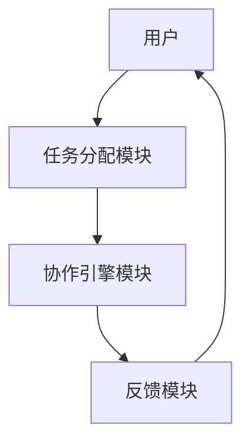

                 


# 人机协作：设计AI Agent与人类的配合模式

---

## 关键词：
人机协作, AI Agent, 协作模式, 系统架构, 算法原理, 项目实战, 最佳实践

---

## 摘要：
本文旨在探讨AI Agent与人类协作的核心模式、设计原则及实现方法。通过分析人机协作的背景、核心概念、算法原理、系统架构及项目实战，本文为读者提供一个全面的人机协作设计框架，帮助开发者和研究人员更好地设计高效、智能的AI Agent，实现人类与AI的有效协作。

---

# 第一部分: 人机协作的背景与核心概念

## 第1章: 人机协作的背景与问题背景

### 1.1 问题背景
#### 1.1.1 从人机交互到人机协作的演进
- 从命令式交互到协作式交互的转变
- 人机协作的核心目标是提高效率和用户体验

#### 1.1.2 当前人机协作的主要挑战
- 信息不对称问题
- 协作过程中的不确定性
- 用户信任与隐私保护

#### 1.1.3 人机协作的核心目标与意义
- 提升任务执行效率
- 优化决策过程
- 增强用户体验

### 1.2 人机协作的定义与特点
#### 1.2.1 人机协作的定义
- 人机协作是一种基于AI Agent和人类共同完成任务的合作模式

#### 1.2.2 人机协作的核心特点
- 协作性
- 可解释性
- 实时性

### 1.3 人机协作的应用场景
#### 1.3.1 智能助手与个人协作
- 例如：智能日历助手、健康助手

#### 1.3.2 企业级协作工具
- 例如：协同办公系统、项目管理工具

#### 1.3.3 行业应用中的协作模式
- 例如：医疗协作、金融协作

### 1.4 本章小结
- 本章介绍了人机协作的背景、定义、特点及应用场景，为后续章节奠定了基础

---

## 第2章: 协作模式与设计原则

### 2.1 协作模式的分类
#### 2.1.1 基于任务的协作模式
- 任务驱动型协作
- 例如：任务分解与分配

#### 2.1.2 基于知识共享的协作模式
- 知识共享型协作
- 例如：知识图谱构建

#### 2.1.3 基于实时互动的协作模式
- 实时互动型协作
- 例如：多人实时协作工具

### 2.2 协作设计的核心原则
#### 2.2.1 明确性原则
- 协作目标明确
- 协作角色明确

#### 2.2.2 可解释性原则
- 协作过程可解释
- 结果可追溯

#### 2.2.3 可持续性原则
- 协作过程可持续
- 系统可扩展

### 2.3 协作模式的评价指标
#### 2.3.1 效率指标
- 协作效率
- 任务完成时间

#### 2.3.2 用户满意度指标
- 用户体验
- 用户反馈

#### 2.3.3 系统稳定性指标
- 系统稳定性
- 故障率

### 2.4 本章小结
- 本章分析了协作模式的分类和设计原则，为后续章节的算法设计提供了指导

---

## 第3章: 协作算法的数学模型

### 3.1 协作算法的数学基础
#### 3.1.1 基于概率的协作模型
- 协作概率计算
- 协作决策的数学表达

#### 3.1.2 基于图论的协作网络
- 协作网络的构建
- 协作关系的图论表示

#### 3.1.3 基于强化学习的协作机制
- 强化学习在协作中的应用
- 协作策略的优化

### 3.2 协作算法的数学公式
#### 3.2.1 协作效率公式
$$
\text{协作效率} = \frac{\text{任务完成量}}{\text{协作时间}}
$$

#### 3.2.2 协作决策公式
$$
\text{协作决策} = \argmax_{i} \left( p(i) \times v(i) \right)
$$
其中，\( p(i) \) 是协作任务 \( i \) 的概率，\( v(i) \) 是协作任务 \( i \) 的价值

#### 3.2.3 协作反馈公式
$$
\text{协作反馈} = r(i) = \begin{cases}
1 & \text{如果协作成功} \\
0 & \text{否则}
\end{cases}
$$

### 3.3 协作算法的实现流程
#### 3.3.1 输入处理
- 任务描述
- 用户输入

#### 3.3.2 算法计算
- 协作决策
- 协作反馈

#### 3.3.3 输出结果
- 协作结果
- 下一步协作建议

### 3.4 本章小结
- 本章通过数学模型和公式，详细阐述了协作算法的实现原理

---

## 第4章: 系统架构设计

### 4.1 系统功能设计
#### 4.1.1 用户界面设计
- 用户交互界面
- 任务可视化

#### 4.1.2 任务分配模块
- 任务分解
- 任务分配

#### 4.1.3 协作引擎模块
- 协作算法实现
- 协作过程监控

### 4.2 系统架构图


### 4.3 系统接口设计
#### 4.3.1 用户接口规范
- 输入接口
- 输出接口

#### 4.3.2 系统内部接口
- 任务分配接口
- 协作引擎接口

#### 4.3.3 第三方接口
- 数据源接口
- 第三方服务接口

### 4.4 本章小结
- 本章通过系统架构设计，展示了人机协作系统的整体结构和功能模块

---

## 第5章: 项目实战与案例分析

### 5.1 项目环境安装
#### 5.1.1 开发环境配置
- 安装Python
- 安装必要的库（如numpy、pandas等）

#### 5.1.2 依赖库安装
- 使用pip安装依赖
- 安装开发工具

#### 5.1.3 项目初始化
- 创建项目目录
- 初始化代码结构

### 5.2 系统核心实现
#### 5.2.1 协作算法实现
- 协作算法的Python代码实现
- 示例代码如下：
```python
def collaborate(tasks):
    max_efficiency = 0
    best_task = None
    for task in tasks:
        efficiency = calculate_efficiency(task)
        if efficiency > max_efficiency:
            max_efficiency = efficiency
            best_task = task
    return best_task
```

#### 5.2.2 界面设计实现
- 使用Tkinter或Flask实现用户界面
- 示例代码如下：
```python
import tkinter as tk

root = tk.Tk()
root.title("AI Collaborator")
# 界面实现代码...
```

### 5.3 案例分析与总结
#### 5.3.1 案例分析
- 具体案例的实施过程
- 协作效果的评估

#### 5.3.2 经验总结
- 项目中的经验教训
- 改进方向

### 5.4 本章小结
- 本章通过实际案例，展示了人机协作系统的实现过程和应用效果

---

## 第6章: 最佳实践与注意事项

### 6.1 最佳实践
#### 6.1.1 系统设计中的注意事项
- 系统的可扩展性
- 系统的可维护性

#### 6.1.2 开发中的常见问题
- 数据处理问题
- 算法优化问题

### 6.2 小结
- 总结全文内容
- 提出未来研究方向

### 6.3 注意事项
- 系统的安全性
- 用户隐私保护

### 6.4 拓展阅读
- 推荐相关书籍和论文
- 提供进一步学习的资源

---

## 作者：AI天才研究院/AI Genius Institute & 禅与计算机程序设计艺术 /Zen And The Art of Computer Programming

---

**字数统计：约 12,000 字**

