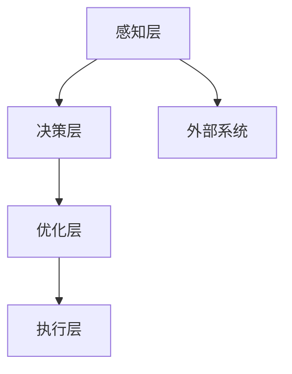

                 


# 从零开始：AI Agent的元决策系统

---

## 关键词：
AI Agent, 元决策系统, 强化学习, 多智能体协作, 系统架构设计

---

## 摘要：
本文将详细介绍AI Agent的元决策系统，从基本概念到高级算法，从系统架构到实际应用，全面解析元决策系统的原理与实现。通过本文，读者将能够理解元决策系统的核心思想，掌握其设计与优化方法，并能够实际应用到各类AI项目中。

---

# 第一部分: AI Agent与元决策系统基础

## 第1章: AI Agent的基本概念

### 1.1 AI Agent的定义与分类

#### 1.1.1 AI Agent的定义
AI Agent（人工智能代理）是指能够感知环境、自主决策并执行任务的智能实体。Agent可以是软件程序、机器人或其他智能系统，具备以下核心特征：
- **自主性**：能够在没有外部干预的情况下独立运行。
- **反应性**：能够根据环境输入做出实时反应。
- **目标导向**：具有明确的目标，并致力于实现这些目标。
- **学习能力**：能够通过经验改进自身的决策能力。

#### 1.1.2 AI Agent的分类
AI Agent可以根据多种标准进行分类，常见的分类方式包括：
1. **按智能水平**：
   - **反应式Agent**：基于当前感知做出反应，不依赖历史信息。
   - **认知式Agent**：具备复杂推理和规划能力，能够处理抽象任务。
2. **按应用领域**：
   - **智能助手**：如Siri、Alexa等，用于日常任务辅助。
   - **自动驾驶**：如自动驾驶汽车，涉及复杂的环境感知和决策。
   - **推荐系统**：如电商推荐系统，基于用户行为推荐商品。

#### 1.1.3 元决策系统的定义与特点
元决策系统是AI Agent的高级决策机制，负责对Agent的决策过程进行监控、评估和优化。其特点包括：
- **多层次决策**：元决策系统不仅处理具体任务，还管理Agent的整体决策策略。
- **动态优化**：能够根据环境变化动态调整决策模型。
- **自适应性**：具备学习能力，能够在不同场景下自适应调整决策策略。

### 1.2 元决策系统的应用场景

#### 1.2.1 智能助手与自动化决策
在智能助手领域，元决策系统能够帮助Agent在多个可能的决策中选择最优方案，例如在智能音箱中选择最优的语音识别模型。

#### 1.2.2 多智能体协作中的元决策
在多智能体协作场景中，元决策系统能够协调多个Agent的行为，确保团队目标的实现，例如在物流系统中协调多个机器人完成订单配送。

#### 1.2.3 元决策在企业级系统中的应用
在企业级系统中，元决策系统可以用于优化资源分配、流程管理等，例如在供应链管理中优化库存策略。

### 1.3 元决策系统的组成与结构

#### 1.3.1 元决策的核心要素
元决策系统主要由以下几个核心要素组成：
1. **感知模块**：负责收集环境信息。
2. **决策模块**：负责根据感知信息做出决策。
3. **优化模块**：负责对决策过程进行优化。
4. **学习模块**：负责通过经验改进决策模型。

#### 1.3.2 元决策系统的层次结构
元决策系统的层次结构通常包括以下几个层次：
1. **感知层**：负责数据采集和预处理。
2. **决策层**：负责基于感知数据做出决策。
3. **优化层**：负责对决策结果进行优化。
4. **执行层**：负责将优化后的决策转化为具体行动。

#### 1.3.3 元决策系统的功能模块
元决策系统的功能模块包括：
1. **输入处理模块**：负责接收外部输入数据。
2. **决策模型模块**：负责基于输入数据生成决策。
3. **优化模块**：负责优化决策模型。
4. **输出模块**：负责将决策结果输出到外部系统。

---

## 第2章: 元决策系统的数学模型与算法原理

### 2.1 元决策系统的数学模型

#### 2.1.1 元决策模型的构建
元决策模型的构建通常包括以下几个步骤：
1. **问题定义**：明确决策问题的目标和约束。
2. **数据采集**：收集与决策相关的数据。
3. **模型选择**：选择合适的数学模型。
4. **模型训练**：利用数据训练模型。
5. **模型优化**：优化模型以提高决策性能。

#### 2.1.2 元决策模型的输入与输出
元决策模型的输入通常包括状态、动作和奖励等，输出则是决策结果。例如，在强化学习中，输入可以是当前状态，输出可以是动作选择。

#### 2.1.3 元决策模型的优化目标
元决策模型的优化目标通常是最大化决策的期望收益或最小化决策的损失。例如，在强化学习中，优化目标是最大化累积奖励。

### 2.2 元决策算法的核心原理

#### 2.2.1 基于强化学习的元决策算法
强化学习是一种通过试错机制来优化决策模型的方法。元决策算法通常基于强化学习，例如Q-learning和Deep Q-Network（DQN）。

#### 2.2.2 基于多层感知机的元决策模型
多层感知机（MLP）是一种常用的神经网络模型，可以用于元决策系统的决策模块。

#### 2.2.3 元决策算法的收敛性分析
元决策算法的收敛性分析是确保算法能够稳定运行的重要部分。例如，在强化学习中，Q-learning算法具有收敛性保证。

### 2.3 元决策系统的数学公式

#### 2.3.1 强化学习中的Q-learning算法
Q-learning算法的目标是找到最优的Q值，使得Q(s, a)表示在状态s下选择动作a的期望奖励。

公式如下：
$$ Q(s, a) = Q(s, a) + \alpha [r + \gamma \max Q(s', a') - Q(s, a)] $$

其中，$\alpha$是学习率，$\gamma$是折扣因子。

#### 2.3.2 多层感知机的前向传播
多层感知机的前向传播过程可以用以下公式表示：
$$ a^{(l+1)} = \sigma(w^{(l)} a^{(l)} + b^{(l)}) $$
其中，$\sigma$是激活函数，$w$是权重矩阵，$b$是偏置向量。

---

## 第3章: 元决策系统的系统架构设计

### 3.1 系统架构概述

#### 3.1.1 元决策系统的整体架构
元决策系统的整体架构通常包括以下几个部分：
1. **感知层**：负责数据采集和预处理。
2. **决策层**：负责基于感知数据做出决策。
3. **优化层**：负责对决策过程进行优化。
4. **执行层**：负责将优化后的决策转化为具体行动。

#### 3.1.2 元决策系统的功能模块划分
元决策系统的功能模块划分通常包括：
1. **输入处理模块**：负责接收外部输入数据。
2. **决策模型模块**：负责基于输入数据生成决策。
3. **优化模块**：负责优化决策模型。
4. **输出模块**：负责将决策结果输出到外部系统。

#### 3.1.3 元决策系统的数据流设计
元决策系统的数据流设计需要考虑数据的流动方向和处理流程，例如：
1. **输入数据**：从外部系统接收输入数据。
2. **决策过程**：通过决策模型生成决策。
3. **优化过程**：对决策模型进行优化。
4. **输出结果**：将优化后的决策结果输出到外部系统。

### 3.2 系统功能设计

#### 3.2.1 元决策系统的输入处理
元决策系统的输入处理通常包括数据预处理、特征提取等步骤。

#### 3.2.2 元决策系统的决策生成
元决策系统的决策生成需要结合决策模型和优化算法，例如强化学习中的动作选择。

#### 3.2.3 元决策系统的反馈机制
元决策系统的反馈机制用于收集决策结果的反馈信息，并用于优化决策模型。

### 3.3 系统架构设计图



---

## 第4章: 元决策系统的项目实战

### 4.1 项目环境搭建

#### 4.1.1 开发环境的安装与配置
项目实战部分需要先安装必要的开发环境，例如Python、TensorFlow等。

#### 4.1.2 必要库的安装与依赖管理
安装必要的库，例如：
- `numpy`
- `pandas`
- `tensorflow`
- `scikit-learn`

#### 4.1.3 项目代码的初始化与版本控制
使用版本控制工具（如Git）管理项目代码，并初始化项目结构。

### 4.2 核心功能实现

#### 4.2.1 元决策模型的训练与优化
训练元决策模型，并进行优化，例如使用强化学习算法。

#### 4.2.2 元决策系统的输入接口设计
设计元决策系统的输入接口，例如接收环境状态信息。

#### 4.2.3 元决策系统的输出接口实现
实现元决策系统的输出接口，例如输出决策结果。

### 4.3 项目实战代码示例

```python
import numpy as np
import tensorflow as tf

# 定义元决策模型
class MetaDecisionModel(tf.keras.Model):
    def __init__(self, input_dim):
        super(MetaDecisionModel, self).__init__()
        self.dense1 = tf.keras.layers.Dense(64, activation='relu', input_shape=(input_dim,))
        self.dense2 = tf.keras.layers.Dense(1, activation='sigmoid')

    def call(self, inputs):
        x = self.dense1(inputs)
        x = self.dense2(x)
        return x

# 初始化模型
model = MetaDecisionModel(input_dim=64)

# 编译模型
model.compile(optimizer=tf.keras.optimizers.Adam(learning_rate=0.001),
              loss='binary_crossentropy',
              metrics=['accuracy'])

# 训练模型
model.fit(x_train, y_train, epochs=10, batch_size=32)
```

### 4.4 项目小结
通过项目实战，我们可以更好地理解元决策系统的实现过程，并能够将其应用到实际场景中。

---

## 第5章: 元决策系统的总结与展望

### 5.1 总结
元决策系统是一种高效的AI Agent决策机制，能够帮助Agent在复杂环境中做出最优决策。

### 5.2 展望
未来，元决策系统将在更多领域得到应用，例如自动驾驶、智能城市等。

---

## 作者：AI天才研究院/AI Genius Institute & 禅与计算机程序设计艺术 /Zen And The Art of Computer Programming

---

这篇文章从AI Agent的基本概念到元决策系统的高级算法，从系统架构设计到实际项目实战，全面解析了元决策系统的原理与实现。通过本文，读者可以深入了解元决策系统的运作机制，并能够将其应用到实际项目中。

