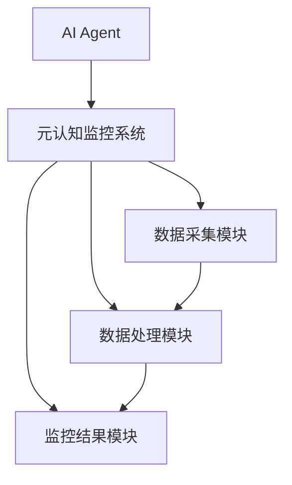
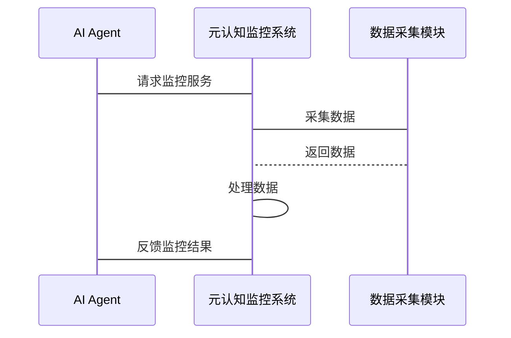

                 


# 从零开始：AI Agent的元认知监控系统

## 关键词：AI Agent，元认知监控，系统架构，算法实现，项目实战

## 摘要：  
AI Agent（人工智能代理）的元认知监控系统是一种能够实时监控和优化AI Agent认知过程的智能系统。本文从基础概念到实际应用，系统地介绍了元认知监控的核心原理、算法实现、系统架构以及项目开发的全过程。通过深入分析元认知监控的理论基础、实现机制和应用场景，本文为读者提供了一套从零开始构建AI Agent元认知监控系统的完整指南。

---

# 第一部分: AI Agent的元认知监控系统概述

## 第1章: AI Agent与元认知监控系统概述

### 1.1 AI Agent的基本概念

#### 1.1.1 AI Agent的定义与特点

AI Agent（人工智能代理）是指能够感知环境、自主决策并执行任务的智能实体。与传统程序不同，AI Agent具备以下特点：

- **自主性**：能够在没有外部干预的情况下独立运行。
- **反应性**：能够实时感知环境并做出反应。
- **目标导向性**：具备明确的目标，并为实现目标而行动。
- **学习能力**：能够通过经验改进自身的性能。

#### 1.1.2 元认知的基本概念

元认知（Metacognition）是指“关于思维和认知过程的认知”，简单来说，就是“思考如何思考”。元认知监控则是指对自身认知过程的监控和调节。

- **监控**：识别和评估当前的认知状态。
- **调节**：根据监控结果调整认知策略。

#### 1.1.3 元认知监控的定义与作用

元认知监控系统是一种能够实时监控AI Agent的认知过程，并根据监控结果优化其行为的系统。其作用包括：

- **提升决策质量**：通过监控和调整认知过程，提高AI Agent的决策准确性。
- **增强适应性**：帮助AI Agent更好地适应动态变化的环境。
- **减少错误发生**：通过及时发现和纠正认知偏差，降低错误率。

### 1.2 元认知监控系统的核心要素

#### 1.2.1 元认知监控的目标

元认知监控的目标是通过监控AI Agent的认知过程，识别潜在的问题并进行优化。具体目标包括：

- 监控认知过程：实时跟踪AI Agent的感知、推理和决策过程。
- 评估认知状态：分析当前认知状态的合理性。
- 调整认知策略：根据监控结果动态调整认知策略。

#### 1.2.2 元认知监控的核心功能

元认知监控系统的核心功能包括：

- **数据采集**：收集与认知过程相关的数据，如感知数据、推理结果等。
- **数据处理**：对采集的数据进行分析和处理，识别潜在问题。
- **结果反馈**：将监控结果反馈给AI Agent，指导其调整行为。

#### 1.2.3 元认知监控的实现方式

元认知监控的实现方式多种多样，主要包括：

- **基于规则的方法**：通过预定义的规则进行监控和调整。
- **基于统计的方法**：利用统计学方法分析认知过程。
- **基于模型的方法**：构建认知模型并进行实时监控。

---

## 第2章: 元认知监控系统的核心原理

### 2.1 元认知监控的理论基础

#### 2.1.1 元认知理论的起源与发展

元认知理论起源于20世纪70年代，主要由美国认知心理学家John Flavell提出。Flavell认为，元认知包括两个方面：元认知知识和元认知调控。

- **元认知知识**：关于认知过程的知识，包括对自身的认知、任务的认知以及策略的认知。
- **元认知调控**：对认知过程的监控和调节。

#### 2.1.2 元认知监控在AI Agent中的应用

在AI Agent中，元认知监控主要用于以下几个方面：

- **任务规划**：监控任务执行过程，确保任务按计划进行。
- **决策优化**：通过监控决策过程，优化决策质量。
- **错误修正**：及时发现并纠正错误。

### 2.2 元认知监控系统的实现机制

#### 2.2.1 监控模块的功能划分

元认知监控系统通常由以下几个功能模块组成：

- **数据采集模块**：负责采集与认知过程相关的数据。
- **数据处理模块**：对采集的数据进行分析和处理。
- **监控结果模块**：生成监控结果并反馈给AI Agent。

#### 2.2.2 监控数据的采集与处理

监控数据的采集与处理是元认知监控系统的核心环节。以下是具体的实现步骤：

1. **数据采集**：通过传感器、数据库或其他接口获取与认知过程相关的数据。
2. **数据预处理**：对采集的数据进行清洗、转换和标准化处理。
3. **数据分析**：利用统计学方法或机器学习算法对数据进行分析，识别潜在问题。

#### 2.2.3 监控结果的反馈与优化

监控结果的反馈与优化是元认知监控系统的最终目标。以下是实现步骤：

1. **结果生成**：根据分析结果生成监控报告。
2. **结果反馈**：将监控报告反馈给AI Agent，指导其调整行为。
3. **优化策略**：根据反馈结果优化认知策略。

---

## 第3章: 元认知监控系统的数学模型

### 3.1 元认知监控的基本模型

#### 3.1.1 基于规则的监控模型

基于规则的监控模型是一种简单但有效的元认知监控方法。其基本思路是通过预定义的规则对认知过程进行监控和调整。例如：

$$
\text{如果} \quad p > q \quad \text{则} \quad r
$$

其中，\( p \) 和 \( q \) 是监控指标，\( r \) 是调整策略。

#### 3.1.2 统计模型的构建与优化

统计模型是基于统计学方法构建的监控模型。常用的统计方法包括回归分析、聚类分析和异常检测。以下是一个简单的回归分析公式：

$$
y = \beta_0 + \beta_1 x + \epsilon
$$

其中，\( y \) 是目标变量，\( x \) 是自变量，\( \beta_0 \) 和 \( \beta_1 \) 是回归系数，\( \epsilon \) 是误差项。

### 3.2 监控数据的特征分析

#### 3.2.1 数据分布的分析

通过分析数据分布，可以识别数据中的异常值和潜在问题。例如，使用直方图或箱线图进行可视化分析。

#### 3.2.2 数据关联性分析

通过分析数据之间的关联性，可以识别数据中的潜在关系。常用的关联性分析方法包括相关系数和因果关系分析。

#### 3.2.3 数据趋势分析

通过分析数据的趋势，可以预测未来的变化。常用的趋势分析方法包括时间序列分析和移动平均法。

---

## 第4章: 元认知监控系统的算法实现

### 4.1 基于规则的监控算法

#### 4.1.1 算法原理

基于规则的监控算法是一种简单但有效的算法。其基本原理是通过预定义的规则对认知过程进行监控和调整。以下是具体的实现步骤：

1. **规则定义**：定义监控规则，例如：
   - 如果错误率大于5%，则调整决策策略。
2. **规则执行**：根据当前监控数据执行规则。
3. **结果反馈**：将监控结果反馈给AI Agent。

#### 4.1.2 算法实现

以下是基于规则的监控算法的Python实现示例：

```python
def metacognition_monitoring(data):
    # 定义监控规则
    rules = {
        'high_error_rate': {'threshold': 5, 'action': 'adjust_strategy'},
        'low_accuracy': {'threshold': 80, 'action': 'improve_learning'}
    }
    
    # 计算错误率
    error_rate = calculate_error_rate(data)
    
    # 执行监控规则
    for rule in rules:
        if error_rate > rules[rule]['threshold']:
            execute_action(rules[rule]['action'])
```

---

## 第5章: 元认知监控系统的系统架构

### 5.1 系统架构设计

#### 5.1.1 系统功能设计

元认知监控系统的功能设计包括以下几个方面：

- **数据采集**：采集与认知过程相关的数据。
- **数据处理**：对采集的数据进行分析和处理。
- **监控结果**：生成监控结果并反馈给AI Agent。

#### 5.1.2 系统架构图

以下是元认知监控系统的系统架构图：



---

## 第6章: 项目实战

### 6.1 环境安装与配置

#### 6.1.1 环境要求

- **操作系统**：Linux/Windows/MacOS
- **编程语言**：Python 3.8+
- **依赖库**：numpy, pandas, scikit-learn

#### 6.1.2 环境配置

```bash
pip install numpy pandas scikit-learn
```

### 6.2 核心代码实现

#### 6.2.1 元认知监控算法实现

```python
import numpy as np
from sklearn.linear_model import LinearRegression

def metacognition_monitoring_algorithm(data):
    # 数据预处理
    X = np.array(data).reshape(-1, 1)
    y = np.array([1, 2, 3, 4, 5])  # 示例目标变量
    
    # 构建回归模型
    model = LinearRegression()
    model.fit(X, y)
    
    # 预测结果
    predictions = model.predict(X)
    
    return predictions
```

#### 6.2.2 系统交互设计

以下是系统交互的序列图：



---

## 第7章: 总结与展望

### 7.1 本章小结

本文从基础概念到实际应用，系统地介绍了AI Agent元认知监控系统的原理、算法实现和系统架构。通过深入分析元认知监控的核心原理和实现机制，本文为读者提供了一套从零开始构建元认知监控系统的完整指南。

### 7.2 未来展望

随着人工智能技术的不断发展，元认知监控系统将在更多领域得到应用。未来的研究方向包括：

- 更智能的监控算法：开发更高效、更准确的监控算法。
- 更高效的系统架构：优化系统架构，提高系统的实时性和响应速度。
- 更广泛的应用场景：探索元认知监控系统在更多领域的应用。

---

## 作者：AI天才研究院 & 禅与计算机程序设计艺术

---

通过本文，读者可以全面了解AI Agent元认知监控系统的原理和实现方法，并能够将其应用到实际项目中。

