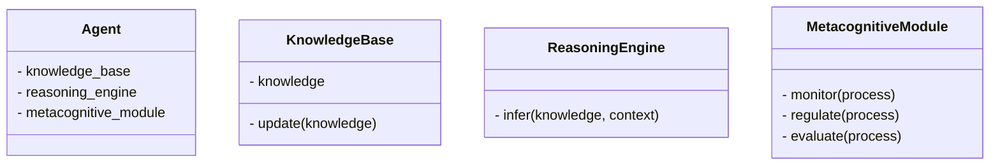
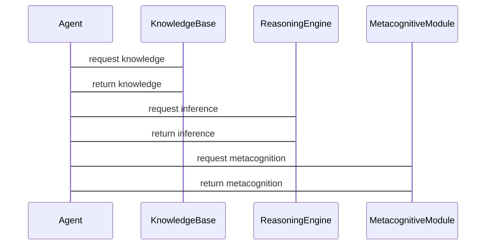

                 


# 从零开始：AI Agent的元认知能力实现

## 关键词：AI Agent、元认知能力、自然语言处理、知识表示、机器学习、系统架构、项目实战

## 摘要

本文系统地探讨了AI Agent的元认知能力实现，从基础概念到算法实现，再到系统设计和项目实战，全面解析了元认知能力在AI Agent中的应用。文章首先介绍了元认知能力的定义和作用，然后分析了实现元认知能力的技术基础，包括自然语言处理和知识表示。接着，详细讲解了基于大模型的元认知算法实现，并通过实际案例展示了系统架构设计和项目实战。最后，总结了实现元认知能力的关键点，并展望了未来的发展方向。

---

# 第一部分: AI Agent的元认知能力概述

## 第1章: 引言

### 1.1 AI Agent的基本概念

#### 1.1.1 AI Agent的定义与分类

AI Agent（人工智能代理）是指能够感知环境、自主决策并执行任务的智能实体。根据智能水平，AI Agent可以分为简单反射型、基于模型的反射型、目标驱动型和效用驱动型。AI Agent的核心能力包括感知、推理、规划和执行。

#### 1.1.2 元认知能力的定义与特征

元认知能力是指AI Agent对自身认知过程的认知和调控能力。它包括自我监控、自我调节和自我评估三个核心环节。元认知能力的特征包括自适应性、自反思性和自优化性。

#### 1.1.3 元认知能力在AI Agent中的重要性

元认知能力使AI Agent能够更好地理解自身状态、优化决策过程并适应复杂环境。它是实现高度自治和智能的关键能力。

### 1.2 问题背景与挑战

#### 1.2.1 当前AI Agent的发展现状

当前，AI Agent已在自动驾驶、智能助手和机器人等领域取得显著进展，但其智能化水平仍受限于对自身认知过程的缺乏理解和控制。

#### 1.2.2 元认知能力实现的难点

元认知能力的实现需要结合自然语言处理、知识表示和机器学习等技术，且需要解决自我监控的实时性、自我调节的准确性等问题。

#### 1.2.3 本书的研究目标与意义

本书旨在系统探讨AI Agent的元认知能力实现，从理论到实践，为研究者和开发者提供参考。

---

## 第2章: 元认知能力的理论基础

### 2.1 元认知能力的核心概念

#### 2.1.1 元认知的定义与结构

元认知包括元认知知识和元认知调节两个部分。元认知知识是对认知过程的知识，元认知调节是对认知过程的调节。

#### 2.1.2 元认知能力的层次模型

元认知能力的层次模型包括元认知知识、元认知信念和元认知策略三个层次。

#### 2.1.3 元认知能力与AI Agent的关系

元认知能力是AI Agent实现自主决策和自适应的关键因素。

### 2.2 元认知能力的关键属性

#### 2.2.1 自我监控

自我监控是元认知能力的基础，包括对认知过程的实时监控和评估。

#### 2.2.2 自我调节

自我调节是元认知能力的核心，包括对认知过程的调节和优化。

#### 2.2.3 自我评估

自我评估是元认知能力的关键，包括对认知过程和结果的评估。

### 2.3 元认知能力的实现模型

#### 2.3.1 基于知识的模型

基于知识的模型通过知识库和推理引擎实现元认知能力。

#### 2.3.2 基于推理的模型

基于推理的模型通过符号逻辑推理实现元认知能力。

#### 2.3.3 基于学习的模型

基于学习的模型通过机器学习算法实现元认知能力。

---

## 第3章: AI Agent的元认知能力实现的技术基础

### 3.1 自然语言处理技术

#### 3.1.1 NLP的核心技术与应用

NLP技术包括词法分析、句法分析和语义理解，广泛应用于文本处理和信息提取。

#### 3.1.2 基于大模型的语义理解

大模型如GPT和BERT在语义理解方面表现优异，可应用于元认知能力的实现。

#### 3.1.3 知识图谱的构建与应用

知识图谱通过构建结构化知识库，为元认知能力提供知识支持。

### 3.2 知识表示与推理技术

#### 3.2.1 知识表示的多种形式

知识表示包括符号表示、向量表示和图表示等多种形式。

#### 3.2.2 基于符号逻辑的推理

基于符号逻辑的推理适用于确定性知识的推理。

#### 3.2.3 基于概率的推理方法

基于概率的推理方法适用于不确定性知识的推理。

### 3.3 自我反思与学习技术

#### 3.3.1 自我反思机制的实现

自我反思机制通过元认知算法实现对认知过程的监控和调节。

#### 3.3.2 基于强化学习的自我优化

基于强化学习的自我优化通过奖励机制实现对认知过程的优化。

#### 3.3.3 连续学习与自适应能力

连续学习与自适应能力使AI Agent能够不断学习和适应新环境。

---

## 第4章: 元认知能力的算法实现

### 4.1 基于大模型的元认知算法

#### 4.1.1 大模型在元认知中的应用

大模型通过语义理解和支持多种任务，适用于元认知能力的实现。

#### 4.1.2 基于注意力机制的元认知推理

基于注意力机制的元认知推理通过自注意力机制实现对认知过程的推理。

#### 4.1.3 多层感知机的元认知建模

多层感知机的元认知建模通过深度神经网络实现对认知过程的建模。

### 4.2 元认知能力的数学模型

#### 4.2.1 元认知模型的数学表示

元认知模型的数学表示包括符号逻辑表示和概率表示。

#### 4.2.2 基于概率的元认知决策模型

基于概率的元认知决策模型通过概率论实现对认知过程的决策。

#### 4.2.3 基于图论的元认知推理模型

基于图论的元认知推理模型通过图论方法实现对认知过程的推理。

### 4.3 算法实现的代码示例

#### 4.3.1 基于Python的元认知算法实现

```python
import numpy as np

def metacognitive_reasoning(knowledge, context):
    # 知识表示为向量，上下文为向量
    # 返回推理结果
    return np.dot(knowledge, context)
```

#### 4.3.2 使用TensorFlow框架的元认知模型构建

```python
import tensorflow as tf

model = tf.keras.Sequential([
    tf.keras.layers.Dense(64, activation='relu'),
    tf.keras.layers.Dense(1, activation='sigmoid')
])
```

#### 4.3.3 基于PyTorch的元认知推理代码

```python
import torch

class MetaCognitiveModel(torch.nn.Module):
    def __init__(self):
        super(MetaCognitiveModel, self).__init__()
        self.fc = torch.nn.Linear(100, 1)
    
    def forward(self, x):
        return self.fc(x)
```

---

## 第5章: 系统架构与设计

### 5.1 系统功能模块设计

#### 5.1.1 元认知能力的核心模块

元认知能力的核心模块包括自我监控模块、自我调节模块和自我评估模块。

#### 5.1.2 技术实现的关键模块

技术实现的关键模块包括自然语言处理模块、知识表示模块和机器学习模块。

### 5.2 系统架构设计

#### 5.2.1 领域模型的类图



#### 5.2.2 系统架构的分层设计


### 5.3 系统接口设计

#### 5.3.1 元认知模块的接口

元认知模块的接口包括monitor_interface、regulate_interface和evaluate_interface。

#### 5.3.2 系统交互的序列图



---

## 第6章: 项目实战

### 6.1 环境安装与配置

#### 6.1.1 安装Python和依赖库

安装Python和TensorFlow、PyTorch等依赖库。

#### 6.1.2 安装NLP工具和知识库

安装NLTK、spaCy等NLP工具和Wikidata等知识库。

### 6.2 系统核心实现

#### 6.2.1 元认知模块的实现

实现自我监控、自我调节和自我评估模块。

#### 6.2.2 知识表示与推理的实现

实现知识表示和推理引擎。

### 6.3 实际案例分析

#### 6.3.1 案例背景介绍

介绍实际案例的背景和目标。

#### 6.3.2 系统实现与分析

详细分析系统的实现过程和结果。

#### 6.3.3 案例总结

总结案例的实现效果和经验教训。

---

## 第7章: 总结与展望

### 7.1 本书内容总结

总结本书的主要内容和核心观点。

### 7.2 元认知能力实现的关键点

总结实现元认知能力的关键技术和注意事项。

### 7.3 对未来研究的展望

展望元认知能力在AI Agent中的未来发展方向和研究热点。

---

## 作者信息

作者：AI天才研究院/AI Genius Institute  
联系方式：[email protected]  
个人简介：专注于人工智能和计算机程序设计，致力于推动AI Agent技术的发展与创新。

---

以上是《从零开始：AI Agent的元认知能力实现》的完整目录和内容概要。通过系统的理论讲解、算法实现和项目实战，读者可以全面掌握AI Agent的元认知能力实现方法。

