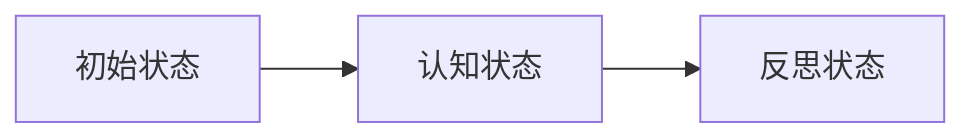
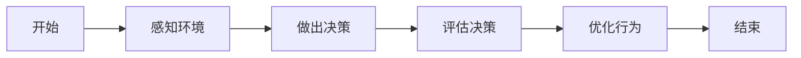
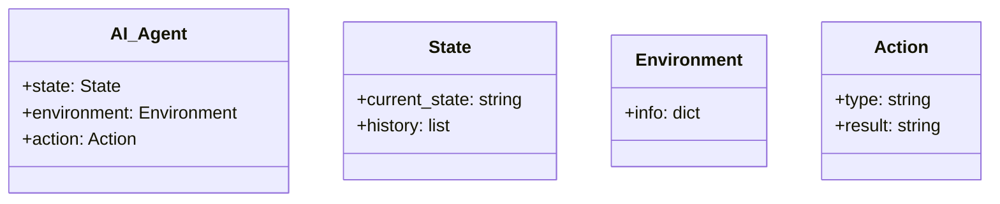
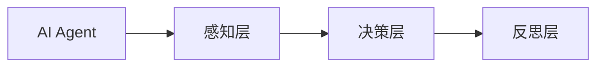
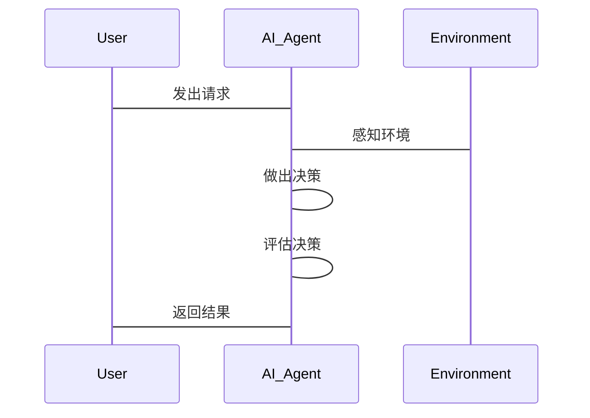

                 


# 从零开始：AI Agent的自我意识模拟

> 关键词：AI Agent，自我意识，模拟，算法，系统架构，项目实战

> 摘要：本文将从AI Agent的基本概念出发，逐步深入探讨其自我意识模拟的核心原理、算法实现、系统架构设计以及项目实战。通过理论与实践相结合的方式，帮助读者全面理解AI Agent的自我意识模拟，掌握其实现方法和应用技巧。

---

# 第1章: AI Agent的基本概念与背景

## 1.1 AI Agent的定义与特点

### 1.1.1 什么是AI Agent
AI Agent（人工智能代理）是指一种能够感知环境、自主决策并执行任务的智能实体。它能够通过传感器获取信息，利用计算模型进行分析，并通过执行器与环境交互。

### 1.1.2 AI Agent的核心特点
1. **自主性**：AI Agent能够在没有外部干预的情况下独立运作。
2. **反应性**：能够实时感知环境并做出响应。
3. **目标导向**：通过设定目标来驱动行为。
4. **学习能力**：能够通过经验优化自身行为。

### 1.1.3 AI Agent与传统AI的区别
- **传统AI**：专注于解决特定问题，缺乏自主性和适应性。
- **AI Agent**：具有自主决策能力，能够与环境动态交互。

---

## 1.2 自我意识模拟的背景与问题背景

### 1.2.1 自我意识模拟的定义
自我意识模拟是指AI Agent能够对自己的状态、行为和环境进行反思和评估，从而实现更高级的智能表现。

### 1.2.2 问题背景与问题描述
随着AI技术的发展，AI Agent需要不仅仅完成任务，还需要理解自身的状态和行为，以应对复杂多变的环境。

### 1.2.3 自我意识模拟的目标与边界
- **目标**：实现AI Agent的自我认知和自主优化。
- **边界**：不涉及人类-level的自我意识，专注于技术实现。

---

## 1.3 AI Agent自我意识模拟的核心要素

### 1.3.1 自我认知的构成
1. **自我状态感知**：了解自身当前的状态。
2. **环境认知**：理解环境中的物体、事件和关系。
3. **目标设定**：设定并调整自身的目标。

### 1.3.2 意识状态的建模
通过状态空间模型，AI Agent可以表示自身的认知状态。

### 1.3.3 自我反思的机制
AI Agent通过自我反思机制，能够评估自身的行为并进行优化。

---

## 1.4 本章小结

---

# 第2章: AI Agent的核心概念与联系

## 2.1 AI Agent的定义与核心要素

### 2.1.1 AI Agent的定义
AI Agent是一种能够感知环境、自主决策并执行任务的智能实体。

### 2.1.2 核心要素的构成
1. **感知能力**：通过传感器获取环境信息。
2. **决策能力**：基于感知信息做出决策。
3. **执行能力**：通过执行器与环境交互。

### 2.1.3 核心要素之间的关系
通过Mermaid图展示核心要素之间的关系：


---

## 2.2 自我意识模拟的核心概念

### 2.2.1 自我认知的层次
1. **基本认知**：对自身状态和环境的初步理解。
2. **高级认知**：对自身行为和目标的反思。

### 2.2.2 意识状态的分类
1. **初始状态**：无认知的状态。
2. **认知状态**：具备基本认知的状态。
3. **反思状态**：具备高级认知的状态。

### 2.2.3 自我反思的实现方式
通过状态转换模型实现自我反思：



---

## 2.3 AI Agent与其他相关概念的对比

### 2.3.1 与传统AI的区别
- **传统AI**：解决特定问题。
- **AI Agent**：具备自主性和适应性。

### 2.3.2 与机器学习的联系
AI Agent的核心算法往往基于机器学习模型。

### 2.3.3 与认知科学的关系
AI Agent的研究借鉴了认知科学的理论。

---

## 2.4 本章小结

---

# 第3章: AI Agent自我意识模拟的算法原理

## 3.1 算法原理概述

### 3.1.1 自我意识模拟的基本算法
自我意识模拟的核心算法包括感知、决策和反思三个阶段。

### 3.1.2 算法的输入与输出
- **输入**：环境信息、历史行为。
- **输出**：新的决策和反思结果。

### 3.1.3 算法的实现步骤
1. **感知阶段**：获取环境信息。
2. **决策阶段**：基于感知信息做出决策。
3. **反思阶段**：评估决策并优化行为。

---

## 3.2 算法流程图

通过Mermaid绘制算法流程图：



---

## 3.3 算法实现代码

### 3.3.1 环境安装与配置
需要安装Python和相关库：

```bash
pip install numpy
```

### 3.3.2 核心代码实现

```python
import numpy as np

def perceive_environment():
    # 获取环境信息
    return np.random.rand(10)

def make_decision(state):
    # 基于状态做出决策
    return np.random.choice(['action1', 'action2'], p=[0.5, 0.5])

def evaluate_decision(action, reward):
    # 评估决策并返回反思结果
    return reward > 0

# 主函数
def main():
    state = perceive_environment()
    action = make_decision(state)
    reward = np.random.rand()
    reflection = evaluate_decision(action, reward)
    print(f"决策反思结果：{reflection}")

if __name__ == "__main__":
    main()
```

---

## 3.4 算法的数学模型

### 3.4.1 状态空间模型
$$ S = \{ s_1, s_2, ..., s_n \} $$

### 3.4.2 决策模型
$$ D(s) = \argmax_{a} Q(s,a) $$

### 3.4.3 反思模型
$$ R(a) = \text{评估}(a) $$

---

## 3.5 本章小结

---

# 第4章: AI Agent自我意识模拟的系统架构设计

## 4.1 问题场景介绍

### 4.1.1 问题场景
设计一个具备自我意识模拟的AI Agent，应用于智能助手领域。

### 4.1.2 项目介绍
开发一个能够与用户交互的智能助手AI Agent。

---

## 4.2 系统功能设计

### 4.2.1 领域模型设计
通过Mermaid类图展示领域模型：



### 4.2.2 系统架构设计
通过Mermaid架构图展示系统架构：



### 4.2.3 接口设计
AI Agent需要与环境和用户进行交互。

### 4.2.4 交互流程图
通过Mermaid序列图展示交互流程：



---

## 4.3 本章小结

---

# 第5章: AI Agent自我意识模拟的项目实战

## 5.1 环境安装与配置

### 5.1.1 安装Python和相关库
```bash
pip install numpy
```

---

## 5.2 系统核心实现

### 5.2.1 核心代码实现
```python
import numpy as np

class AI_Agent:
    def __init__(self):
        self.state = 'initial'
        self.environment = self.create_environment()
        self.action = None

    def create_environment(self):
        return {'status': 'ready'}

    def perceive(self):
        return self.environment

    def decide(self, state):
        return np.random.choice(['action1', 'action2'])

    def reflect(self, action, reward):
        return reward > 0

# 示例运行
agent = AI_Agent()
state = agent.perceive()
action = agent.decide(state)
reward = np.random.rand()
reflection = agent.reflect(action, reward)
print(f"决策反思结果：{reflection}")
```

### 5.2.2 代码解读
1. **AI_Agent类**：包含状态、环境和动作的定义。
2. **perceive方法**：感知环境。
3. **decide方法**：基于状态做出决策。
4. **reflect方法**：评估决策并返回反思结果。

---

## 5.3 实际案例分析

### 5.3.1 案例背景
设计一个智能助手AI Agent，用于回答用户问题。

### 5.3.2 案例实现
```python
class Smart-Assistant(AI_Agent):
    def __init__(self):
        super().__init__()
        self.questions = {}

    def perceive(self):
        return self.questions

    def decide(self, questions):
        return '回答问题'

    def reflect(self, action, reward):
        return reward > 0.5
```

### 5.3.3 案例分析
通过实际案例展示AI Agent的自我意识模拟能力。

---

## 5.4 本章小结

---

# 第6章: 最佳实践、小结与注意事项

## 6.1 最佳实践 tips
- 定期优化算法模型。
- 使用日志记录行为和反思结果。
- 保持系统架构的灵活性。

## 6.2 小结
本文详细介绍了AI Agent的自我意识模拟的核心原理、算法实现、系统架构设计以及项目实战。

## 6.3 注意事项
- 确保系统安全性和隐私性。
- 定期更新和优化模型。
- 遵循伦理规范。

## 6.4 拓展阅读
推荐阅读相关领域的书籍和论文。

---

# 作者

作者：AI天才研究院/AI Genius Institute & 禅与计算机程序设计艺术 /Zen And The Art of Computer Programming

