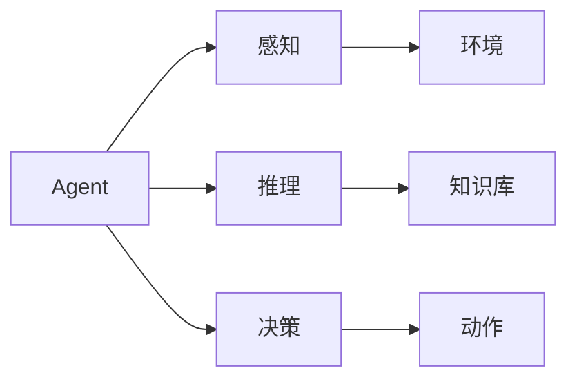
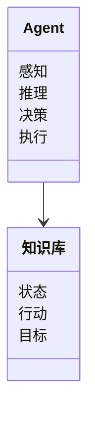
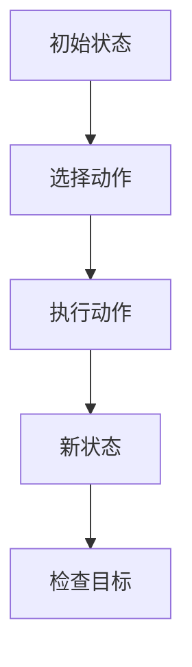
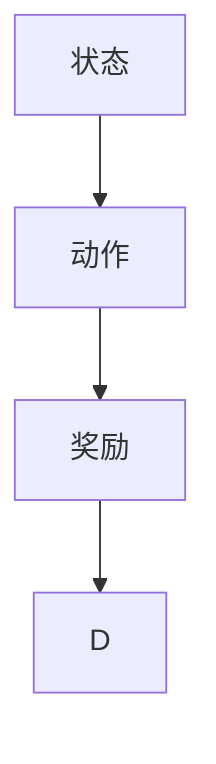
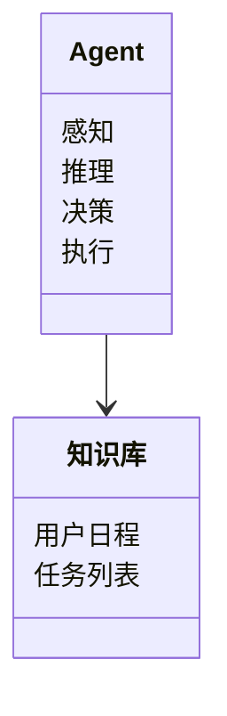
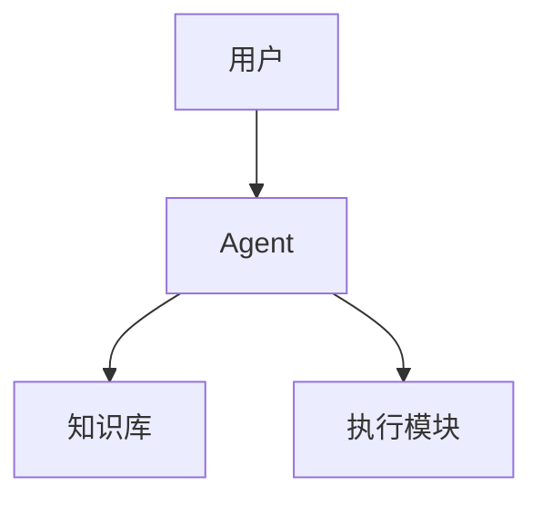

                 


# 从零开始：AI Agent的认知架构设计

## 关键词
AI Agent, 认知架构, 感知, 推理, 决策, 算法原理, 系统架构

## 摘要
本文将详细探讨AI Agent的认知架构设计，从基本概念到核心算法，再到系统架构，逐步引导读者理解并构建一个完整的AI Agent系统。文章通过丰富的图表和代码示例，结合理论与实践，帮助读者掌握AI Agent的设计方法。

---

# 第一部分: AI Agent的认知架构设计基础

## 第1章: AI Agent的基本概念与背景

### 1.1 AI Agent的定义与特点
#### 1.1.1 什么是AI Agent
AI Agent是一种智能实体，能够感知环境、自主决策并执行动作以实现目标。

#### 1.1.2 AI Agent的核心特点
| 特性 | 描述 |
|------|------|
| 自主性 | 能够自主决策和行动 |
| 反应性 | 能够实时感知并响应环境变化 |
| 目标导向 | 以目标为导向进行决策和行动 |
| 学习能力 | 能够通过经验改进性能 |

#### 1.1.3 AI Agent与传统AI的区别
| 方面 | 传统AI | AI Agent |
|------|-------|----------|
| 智能性 | 非自主，依赖外部指令 | 自主决策，主动行动 |
| 环境交互 | 主要处理静态数据 | 能够实时与动态环境交互 |

### 1.2 AI Agent的应用场景
#### 1.2.1 智能助手
AI Agent可以作为虚拟助手，帮助用户处理日常任务，如日历管理、信息查询等。

#### 1.2.2 自动驾驶
在自动驾驶中，AI Agent负责感知环境、做出决策并控制车辆。

#### 1.2.3 智能推荐系统
AI Agent可以根据用户行为推荐个性化内容，如电影、音乐等。

### 1.3 AI Agent的类型
| 类型 | 描述 | 示例 |
|------|------|------|
| 简单反射型Agent | 基于当前感知直接反应 | 自动门传感器 |
| 基于模型的反应式Agent | 使用内部模型预测结果 | 智能空调 |
| 计划式Agent | 基于规划进行决策 | 自动导航系统 |
| 学习型Agent | 通过经验改进性能 | 个性化推荐系统 |

---

## 第2章: 认知架构的核心概念

### 2.1 感知模块
#### 2.1.1 传感器输入
AI Agent通过传感器获取环境信息，如视觉、听觉、触觉等。

#### 2.1.2 数据处理与特征提取
对传感器输入的数据进行处理，提取有用特征，如边缘检测、声音识别等。

### 2.2 推理与知识表示
#### 2.2.1 知识图谱构建
使用知识图谱表示知识，如实体和关系。

#### 2.2.2 逻辑推理与概率推理
逻辑推理：基于逻辑规则进行推理，如命题逻辑、谓词逻辑。
概率推理：基于概率论进行推理，如贝叶斯网络。

### 2.3 决策与规划
#### 2.3.1 状态空间与动作空间
状态：环境的描述，如位置、速度。
动作：可能的行动，如移动、停止。

#### 2.3.2 策略生成与优化
策略：从状态到动作的映射。
优化：通过强化学习优化策略，如Q-learning。

### 2.4 行为执行
#### 2.4.1 动作选择
基于当前状态和策略选择最优动作。

#### 2.4.2 执行监控
监控执行过程，调整动作以应对突发情况。

---

## 第3章: AI Agent的认知架构模型

### 3.1 实体关系图


### 3.2 领域模型


---

## 第4章: AI Agent的算法原理

### 4.1 状态空间搜索算法


### 4.2 强化学习算法


### 4.3 算法实现
```python
import numpy as np

# 状态空间
states = ['状态1', '状态2']

# 动作空间
actions = ['动作1', '动作2']

# Q-learning算法
Q = np.zeros(len(states), len(actions))
learning_rate = 0.1
gamma = 0.9

# 更新Q值
def update_Q(s, a, r, s_next):
    Q[s][a] = Q[s][a] + learning_rate * (r + gamma * np.max(Q[s_next])) - Q[s][a]

# 训练过程
for episode in range(100):
    state = np.random.choice(len(states))
    action = np.random.choice(len(actions))
    reward = np.random.random()
    next_state = np.random.choice(len(states))
    update_Q(state, action, reward, next_state)
```

### 4.4 数学模型
策略评估：
$$ V_{\pi}(s) = E_{\pi}[R | s] $$
策略改进：
$$ \pi(a|s) = \arg \max_a Q(s,a) $$

---

## 第5章: 系统分析与架构设计方案

### 5.1 问题场景介绍
设计一个AI Agent，用于智能助手，帮助用户管理日程安排。

### 5.2 系统功能设计


### 5.3 系统架构设计


### 5.4 系统接口设计
API接口：
- 获取当前状态：`GET /state`
- 执行动作：`POST /action`

---

## 第6章: 项目实战

### 6.1 环境安装
安装必要的库：
```bash
pip install numpy
pip install gym
```

### 6.2 核心代码实现
```python
import gym
from gym import spaces
from gym.utils import seeding

class AI_Agent(gym.Env):
    def __init__(self):
        self.observation_space = spaces.Discrete(2)
        self.action_space = spaces.Discrete(2)
        self._seed = 0
        self._reset()

    def _reset(self):
        self.state = 0
        return self.state

    def _step(self, action):
        if action == 0:
            reward = 1
            next_state = 0
        else:
            reward = 0
            next_state = 1
        return next_state, reward, False, {}

    def _render(self, mode='human'):
        pass
```

### 6.3 案例分析
训练AI Agent进行决策：
```python
env = AI_Agent()
env.seed(42)
episodes = 100
for episode in range(episodes):
    state = env.reset()
    done = False
    total_reward = 0
    while not done:
        action = env.action_space.sample()
        next_state, reward, done, _ = env.step(action)
        total_reward += reward
    print(f'Episode {episode}, Total Reward: {total_reward}')
```

---

## 第7章: 最佳实践与总结

### 7.1 最佳实践
- **模块化设计**：将AI Agent划分为感知、推理、决策和执行模块。
- **持续优化**：定期更新知识库和优化算法，以提高性能。
- **安全性**：确保AI Agent的安全性，防止恶意攻击。

### 7.2 小结
本文从基础到实践，详细讲解了AI Agent的认知架构设计，涵盖了核心概念、算法原理和系统架构等内容。

### 7.3 注意事项
- 确保数据质量和多样性，避免偏见。
- 定期监控和维护系统，确保稳定运行。

### 7.4 拓展阅读
- 《强化学习入门》
- 《认知架构与AI》

---

# 作者：AI天才研究院 & 禅与计算机程序设计艺术

---

希望这个大纲能满足你的需求，确保文章内容丰富且结构清晰。如果需要进一步补充或调整，请随时告诉我。

