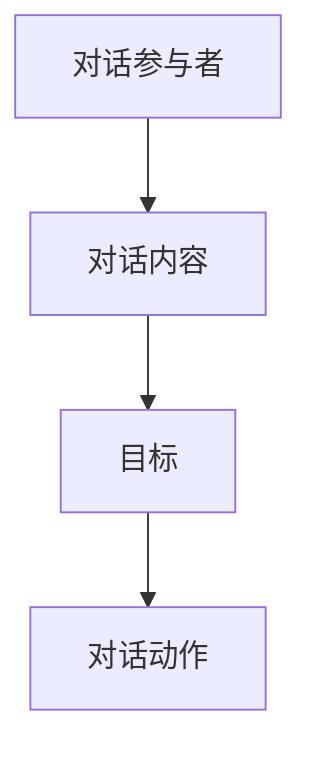
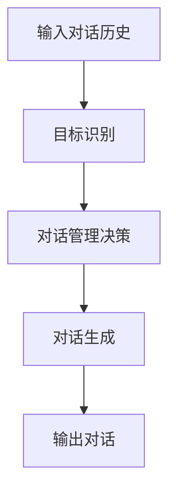
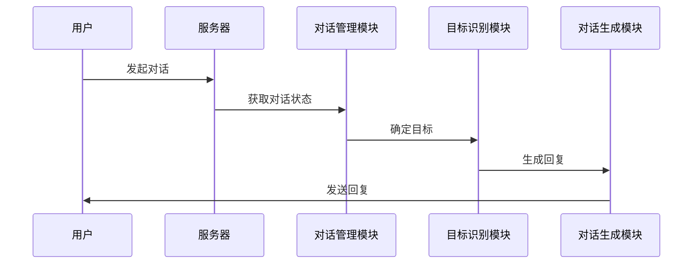

                 


```markdown
# 从零构建AI Agent的目标导向对话系统

> 关键词：AI Agent, 目标导向对话系统, 自然语言处理, 对话管理, 机器学习

> 摘要：本文将从零开始构建一个AI Agent的目标导向对话系统，详细介绍系统的核心概念、算法原理、系统架构设计以及项目实战。通过逐步分析和实现，读者将掌握如何设计和实现一个高效、智能的目标导向对话系统。

---

## 第1章: 引言

### 1.1 问题背景
- AI Agent的定义与特点
- 目标导向对话系统的概念
- 现实中的应用场景

### 1.2 问题描述
- 对话系统的核心挑战
- 目标导向对话的独特需求
- 系统边界与外延

### 1.3 问题解决
- 对话系统的整体架构
- 核心模块的功能概述
- 系统的核心要素组成

---

## 第2章: 目标导向对话系统的概念解析

### 2.1 对话管理的核心原理
- 对话管理的目标与作用
- 常见的对话管理策略
- 对话管理的实现方式

### 2.2 自然语言处理在对话系统中的应用
- NLP技术的基本概念
- 对话系统中的关键NLP任务
- NLP技术对目标导向对话的支持

### 2.3 目标识别的原理与方法
- 目标识别的定义与作用
- 基于规则和基于学习的目标识别方法
- 目标识别的实现步骤

### 2.4 核心概念对比表
- 对话管理与目标识别的对比
- NLP技术在对话系统中的应用对比
- 不同目标识别方法的优劣势分析

### 2.5 实体关系图


---

## 第3章: 目标导向对话系统的算法原理

### 3.1 对话管理算法
- 基于规则的对话管理
  - 规则的制定与执行
  - 规则的优缺点
- 基于深度学习的对话管理
  - 神经网络的应用
  - 基于序列的对话管理模型
- 对话管理的数学模型
  - 马尔可夫决策过程的数学公式
  - 对话状态的表示方法

### 3.2 目标识别算法
- 基于关键词的目标识别
  - 关键词提取方法
  - 基于关键词的分类
- 基于意图的目标识别
  - 意图识别的机器学习方法
  - 基于深度学习的意图识别模型
- 目标识别的数学模型
  - 概率模型的应用
  - 基于向量的相似度计算

### 3.3 对话生成算法
- 基于模板的对话生成
  - 模板的定义与设计
  - 基于模板的生成流程
- 基于生成模型的对话生成
  - 基于RNN的对话生成
  - 基于Transformer的对话生成
- 对话生成的数学模型
  - 编解码模型的数学公式
  - 基于注意力机制的生成过程

### 3.4 算法流程图


---

## 第4章: 目标导向对话系统的系统分析与架构设计

### 4.1 问题场景介绍
- 系统的目标与功能
- 系统的使用场景
- 系统的用户角色

### 4.2 项目介绍
- 项目目标
- 项目范围
- 项目功能模块

### 4.3 系统功能设计
- 领域模型
  ```mermaid
  classDiagram
      class 用户
      class 对话历史
      class 目标
      class 对话动作
      用户 --> 对话历史
      对话历史 --> 目标
      目标 --> 对话动作
  ```

### 4.4 系统架构设计
- 系统架构图
  ```mermaid
  architecture
      Client
      Server
      Database
  ```

### 4.5 系统接口设计
- 对外接口
  - API定义
  - 接口调用流程
- 对内接口
  - 模块间的通信
  - 接口实现方式

### 4.6 系统交互流程图


---

## 第5章: 目标导向对话系统的项目实战

### 5.1 环境安装
- 开发工具安装
- 依赖库安装
- 环境配置

### 5.2 系统核心实现
- 对话管理模块实现
  ```python
  def manage_dialogue(state):
      # 实现对话管理逻辑
      pass
  ```
- 目标识别模块实现
  ```python
  def identify_goal(text):
      # 实现目标识别逻辑
      pass
  ```
- 对话生成模块实现
  ```python
  def generate_response(state, goal):
      # 实现对话生成逻辑
      pass
  ```

### 5.3 代码应用解读与分析
- 核心模块的代码解读
- 模块之间的调用关系
- 代码实现的关键点

### 5.4 实际案例分析
- 案例场景描述
- 系统处理过程
- 输出结果分析

### 5.5 项目小结
- 项目实现的关键点
- 项目中的问题与解决方案
- 项目的经验总结

---

## 第6章: 目标导向对话系统的最佳实践与拓展

### 6.1 最佳实践 tips
- 系统设计的注意事项
- 开发过程中的常见问题与解决方法
- 系统优化的建议

### 6.2 小结
- 全文总结
- 系统的核心内容回顾
- 未来的研究方向

### 6.3 注意事项
- 系统维护的要点
- 系统部署的注意事项
- 系统安全与隐私保护

### 6.4 拓展阅读
- 相关领域的推荐书籍
- 最新研究论文推荐
- 其他参考资料推荐

---

## 作者：AI天才研究院/AI Genius Institute & 禅与计算机程序设计艺术 /Zen And The Art of Computer Programming
```

