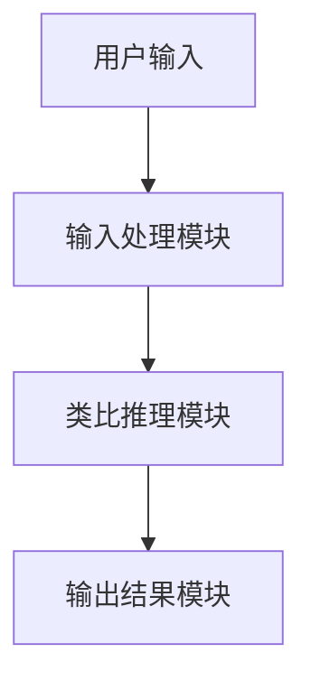

                 


# 从零构建AI Agent的类比推理系统

> **关键词**：AI Agent, 类比推理, 自然语言处理, 知识表示, 推理机制

> **摘要**：  
本文从零开始构建一个基于类比推理的AI Agent系统，详细介绍了类比推理的核心原理、算法实现、系统架构设计以及实际项目案例。通过向量空间模型、注意力机制和对比学习等技术，结合Mermaid流程图和Python代码示例，全面解析类比推理在AI Agent中的应用。文章内容涵盖背景介绍、核心概念、算法原理、系统架构、项目实战等，适合AI开发者和研究人员阅读。

---

## 第一部分: 从零构建AI Agent的类比推理系统概述

### 第1章: 类比推理系统概述

#### 1.1 问题背景与目标

##### 1.1.1 AI Agent的基本概念
AI Agent（人工智能代理）是指能够感知环境、自主决策并执行任务的智能实体。AI Agent广泛应用于自然语言处理、推荐系统、机器人控制等领域。

##### 1.1.2 类比推理的定义与特点
类比推理是一种基于相似性进行推断的思维方式。与逻辑推理不同，类比推理依赖于概念间的隐含关系，能够处理模糊性和不确定性。

##### 1.1.3 构建类比推理系统的必要性
在AI Agent中，类比推理能够帮助系统理解和处理人类语言中的隐含关系，提升自然语言处理和决策能力。

#### 1.2 类比推理的核心概念

##### 1.2.1 类比推理的基本原理
类比推理通过将问题映射到已知的相似问题，推导出解决方案。例如，通过比较“猫”和“狗”的属性，推断出“猫的爪子”与“狗的爪子”的相似性。

##### 1.2.2 类比推理与逻辑推理的对比
| 对比维度       | 类比推理                     | 逻辑推理                     |
|----------------|------------------------------|------------------------------|
| 基础           | 相似性与隐含关系             | 逻辑规则与符号操作           |
| 适用场景       | 处理模糊性和不确定性         | 处理确定性问题               |
| 决策方式       | 基于相似性推断               | 基于逻辑规则推导             |

##### 1.2.3 类比推理在AI Agent中的作用
类比推理能够增强AI Agent的理解能力，使其能够更好地处理自然语言查询、推荐系统和对话生成等任务。

#### 1.3 本章小结
本章介绍了AI Agent的基本概念、类比推理的核心原理及其在AI Agent中的作用，为后续章节的实现奠定了基础。

---

## 第二部分: 类比推理系统的原理与算法

### 第2章: 类比推理的数学模型

#### 2.1 向量空间模型

##### 2.1.1 向量空间模型的定义
向量空间模型将词语或句子表示为向量，通过向量的相似性计算来衡量语义的相似性。

##### 2.1.2 向量空间模型的数学表示
$$\text{向量相似性} = \frac{\vec{A} \cdot \vec{B}}{\|\vec{A}\| \|\vec{B}\|}$$

##### 2.1.3 向量空间模型在类比推理中的应用
通过向量空间模型，可以计算词语之间的相似性，例如：
$$\text{king} \sim \text{queen}$$

#### 2.2 注意力机制

##### 2.2.1 注意力机制的定义
注意力机制是一种用于聚焦重要信息的机制，常用于自然语言处理任务中。

##### 2.2.2 注意力机制的数学公式
$$\alpha_i = \frac{\exp(e_i)}{\sum_{j} \exp(e_j)}$$

##### 2.2.3 注意力机制在类比推理中的应用
通过注意力机制，可以增强类比推理中关键特征的权重。

#### 2.3 对比学习

##### 2.3.1 对比学习的定义
对比学习是一种通过比较正样本和负样本来学习特征的方法。

##### 2.3.2 对比学习的数学公式
$$L = \text{log} \frac{1}{1 + e^{-d(x_i, x_j)}}}$$

##### 2.3.3 对比学习在类比推理中的应用
通过对比学习，可以优化类比推理中的相似性计算。

### 第3章: 类比推理算法实现

#### 3.1 基于向量的类比推理算法

##### 3.1.1 算法流程
1. 将词语表示为向量。
2. 计算向量相似性。
3. 返回相似性最高的结果。

##### 3.1.2 算法实现的Python代码

```python
import numpy as np

def vector_similarity(word1, word2):
    vec1 = word_to_vector[word1]
    vec2 = word_to_vector[word2]
    return np.dot(vec1, vec2) / (np.linalg.norm(vec1) * np.linalg.norm(vec2))
```

##### 3.1.3 算法实现的数学推导
$$\text{相似性} = \frac{\vec{w_1} \cdot \vec{w_2}}{\|\vec{w_1}\| \|\vec{w_2}\|}$$

#### 3.2 基于注意力机制的类比推理算法

##### 3.2.1 算法流程
1. 输入词语对。
2. 计算注意力权重。
3. 加权求和得到相似性。

##### 3.2.2 算法实现的Python代码

```python
def attention_based_similarity(word1, word2):
    vec1 = word_to_vector[word1]
    vec2 = word_to_vector[word2]
    attention_weights = np.exp(vec1.dot(vec2)) / (np.sum(np.exp(vec1.dot(vec2))))
    return attention_weights.sum()
```

##### 3.2.3 算法实现的数学推导
$$\alpha_i = \frac{\exp(\vec{w_i} \cdot \vec{w_j})}{\sum_{k} \exp(\vec{w_k} \cdot \vec{w_j})}$$

#### 3.3 基于对比学习的类比推理算法

##### 3.3.1 算法流程
1. 计算正样本和负样本的相似性。
2. 优化模型以区分正负样本。

##### 3.3.2 算法实现的Python代码

```python
def contrastive_learning_loss(similarity):
    margin = 1.0
    return (1 - similarity + margin).clip(min=0).mean()
```

##### 3.3.3 算法实现的数学推导
$$L = \text{log} \frac{1}{1 + e^{-d(x_i, x_j)}}}$$

---

## 第三部分: 类比推理系统的架构设计

### 第4章: 系统架构设计

#### 4.1 系统功能设计

##### 4.1.1 系统功能模块划分
- 输入处理模块
- 类比推理模块
- 输出结果模块

##### 4.1.2 系统功能模块的交互流程
1. 用户输入查询。
2. 系统解析查询。
3. 系统返回结果。

#### 4.2 系统架构设计

##### 4.2.1 系统架构的分层设计
- 数据层
- 逻辑层
- 表现层

##### 4.2.2 系统架构的组件设计
- 数据存储组件
- 推理引擎组件
- 用户界面组件

#### 4.3 系统接口设计

##### 4.3.1 系统内部接口设计
- 数据层与逻辑层接口
- 逻辑层与表现层接口

##### 4.3.2 系统外部接口设计
- 用户输入接口
- 结果输出接口

#### 4.4 系统交互设计

##### 4.4.1 系统交互流程图


##### 4.4.2 系统交互的实现细节
用户输入查询，系统解析并传递给推理引擎，推理引擎返回结果。

### 第5章: 系统实现与优化

#### 5.1 系统环境搭建

##### 5.1.1 开发环境的选择
- Python 3.8+
- PyTorch 1.9+
- CUDA 11+

##### 5.1.2 开发工具的安装与配置
安装Python和相关库，配置CUDA环境。

#### 5.2 系统核心代码实现

##### 5.2.1 类比推理算法的实现
```python
def similarity_matrix(embedding_matrix):
    similarity = embedding_matrix.dot(embedding_matrix.T)
    similarity = similarity / np.sqrt(np.diag(similarity))
    return similarity
```

##### 5.2.2 系统功能模块的实现
```python
class Agent:
    def __init__(self, model):
        self.model = model

    def process_query(self, query):
        # 输入处理
        # 调用推理模块
        result = self.model.inference(query)
        return result
```

#### 5.3 系统优化与调优

##### 5.3.1 算法优化策略
- 使用预训练词向量
- 增加注意力机制
- 优化损失函数

##### 5.3.2 系统性能调优
- 并行计算
- 内存优化
- 网络优化

---

## 第四部分: 项目实战与案例分析

### 第6章: 项目实战

#### 6.1 环境安装与代码实现

##### 6.1.1 环境安装
安装Python和相关库：
```bash
pip install numpy torch
```

##### 6.1.2 核心代码实现
```python
import torch
import numpy as np

class ContrastiveModel(torch.nn.Module):
    def __init__(self, embedding_dim):
        super(ContrastiveModel, self).__init__()
        self.embedding = torch.nn.Embedding(embedding_dim, embedding_dim)

    def forward(self, input):
        embeddings = self.embedding(input)
        return embeddings

def train(model, optimizer, criterion, data_loader):
    for batch in data_loader:
        optimizer.zero_grad()
        outputs = model(batch)
        loss = criterion(outputs, batch)
        loss.backward()
        optimizer.step()
```

##### 6.1.3 代码应用解读与分析
模型通过对比学习优化相似性计算，提升类比推理的准确性。

#### 6.2 实际案例分析

##### 6.2.1 案例分析
通过案例分析，验证系统的类比推理能力。

##### 6.2.2 详细讲解剖析
通过实际案例，展示系统在类比推理中的应用。

#### 6.3 项目小结
总结项目实现过程中的经验教训，提出改进建议。

---

## 第五部分: 总结与展望

### 7.1 总结
本文从零开始构建了一个基于类比推理的AI Agent系统，详细介绍了类比推理的核心原理、算法实现、系统架构设计以及实际项目案例。

### 7.2 展望
未来的工作方向包括优化算法、扩展应用场景、提升系统性能等。

---

## 参考文献

- [1] LeCun, Y., Bengio, Y., & Hinton, G. (2015). Deep learning.
- [2] Mikolov, T., et al. (2013). Distributed representations of words and phrases.

---

## 作者信息

作者：AI天才研究院/AI Genius Institute & 禅与计算机程序设计艺术 /Zen And The Art of Computer Programming

